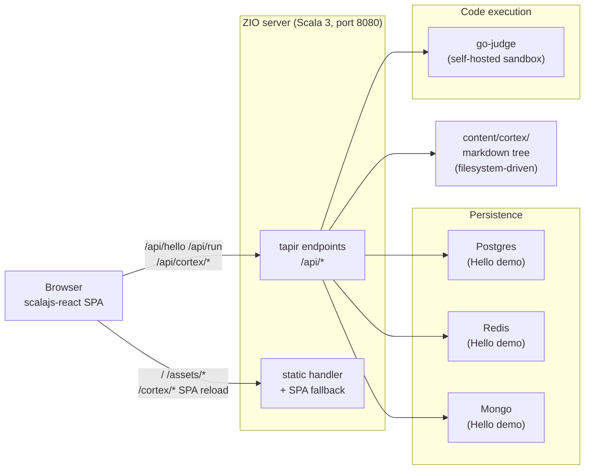

> 🌱 **New to Scala, Scala.js, React, or ZIO?** Start with **[New to the stack? Read this first](/cortex/codefolio-onboarding/start-here-new-to-the-stack)** — a plain-English primer on every technology here — then **[Hello World, End to End](/cortex/codefolio-onboarding/how-it-works-hello-world-end-to-end)**, which makes the abstract pieces concrete.

## What is this?

**Codefolio** is the engine behind `kakde.eu`. It's a single-binary Scala 3 application that serves:

1. A **portfolio site** — Hero, About, Experience, Projects, Certifications.
2. A **Cortex** — where the longer notes I work through live (this chapter is one of them).
3. A **runnable code playground** — e.g. `python run` and friends in chapters actually execute against a sandboxed runner.
4. A **demo page** at `/demo` that exercises Postgres, Redis, and MongoDB in a single round-trip — kept around as a smoke test of the persistence layer.

The whole thing is one process listening on `:8080`. In production it ships as a single Docker image. In development it's two processes (Vite on `:5173` for the SPA, ZIO server on `:8080` for the API), with Vite proxying `/api/*` to the server.

## The 30-second tour

Every box is something you can grep for in the repo:

- The **SPA** is `client/src/main/scala/codefolio/client/`. Entry point: `Main.scala`, then `Router.scala`.
- The **server** is `server/src/main/scala/codefolio/server/`. Entry point: `Main.scala`, then `HttpApp.scala`.
- The **shared** OpenAPI types live in `shared/` — generated from `api/openapi.yaml`.
- The **Cortex content** is in `content/cortex/`.
- The **go-judge sandbox** is built from `runner/go-judge/` — a Dockerfile layering the language toolchains onto [`criyle/go-judge`](https://github.com/criyle/go-judge).

## Tech stack at a glance

| Layer | Tech | Why this and not X? |
| --- | --- | --- |
| Server runtime | **ZIO 2** | Effect-typed concurrency; layers handle DI without a separate framework. |
| HTTP | **zio-http + tapir** | tapir gives us OpenAPI generation, type-safe endpoints, and Swagger UI for free. |
| Codegen | **sbt-openapi-codegen** | One YAML defines requests, responses, and schemas; both server and client compile against the same types. No drift, no hand-written DTOs. |
| Frontend | **Scala.js + scalajs-react 3.0** | One language across stack; the same `Endpoints.RunRequest` case class is used in the browser and in the JVM. |
| Markdown | **unified / remark / rehype** in TS | The remark/rehype ecosystem is JS-native; we wrap it in **one** TypeScript module instead of facading 30+ plugins from Scala. |
| Styling | **Tailwind v4 + BEM** (Block Element Modifier — class names like `block__element--modifier`) | CSS-first config in [`client/tailwind.css`](https://github.com/ani2fun/codefolio/blob/main/client/tailwind.css); per-section/component BEM stylesheets under `client/src/styles/{sections,components}/` so DevTools shows `.experience__role-card` instead of a 200-char utility soup. |
| Persistence | **HikariCP** (JDBC connection pool) + **Lettuce** (async Redis client) + **Mongo sync driver** | The Hello demo exercises all three. The portfolio itself is content-from-files (no DB writes from prod traffic). Each library is justified in the [Server Stack](/cortex/codefolio-onboarding/deep-dive-server-stack) deep-dive — short version: Hikari is the de-facto JVM pool, Lettuce is Netty-based and the only mature async Redis client on the JVM, and the Mongo sync driver wrapped in `ZIO.attemptBlocking` matches the pattern used for Postgres. |

## Mental model

Three things to keep in your head as you navigate the code:

1. **The OpenAPI spec is the source of truth.** Whenever a request shape, response shape, or endpoint changes, edit `api/openapi.yaml` first; codegen will recompile both sides and break the world until you update them. That's a feature.
2. **Markdown is rendered in the browser, not on the server.** The server hands the SPA a raw `string` of markdown plus tiny frontmatter. The SPA runs the unified pipeline, gets back HTML with **placeholder divs** for runnable blocks, mermaid, and D2, then walks the article and React-mounts Scala.js components into each placeholder. (See [The Markdown Pipeline](/cortex/codefolio-onboarding/how-it-works-markdown-pipeline).)
3. **The frontend is one bundle.** Heavy chunks (`shiki`, `mermaid`, `d2`, `katex`) are split via Vite's `manualChunks` and `import()`-ed only on chapter pages, so the home page bundle stays small.

## What this guide covers

The book is in two halves. The first half is a tour: what's where, how a request flows, how to run and extend it. Read it once, top to bottom, and you'll know enough to ship a change.

| Chapter | What you'll learn |
| --- | --- |
| [Repository Tour](/cortex/codefolio-onboarding/start-here-repository-tour) | Module layout; the OpenAPI codegen flow; what each top-level directory is for. |
| [Request Lifecycle](/cortex/codefolio-onboarding/how-it-works-request-lifecycle) | A click → response trace for `/api/run` and a chapter fetch. Where errors get translated. |
| [The Markdown Pipeline](/cortex/codefolio-onboarding/how-it-works-markdown-pipeline) | The unified pipeline, the placeholder pattern, and why we use exactly **one** TS module. |
| [Local Development](/cortex/codefolio-onboarding/working-on-it-local-development) | `bin/dev`, sbt quirks, env vars, and the foot-guns we've already stepped on. |
| [Extending the Project](/cortex/codefolio-onboarding/working-on-it-extending) | Add a Cortex chapter; add an API endpoint; add a runnable language. |

The second half is a **deep dive** — a per-library tour of the stack. For each library we picked, it tells you what it buys us, what we considered instead, and what breaks if you change it. Useful as a learning resource if you're new to the Scala mono-repo stack, and as a reference when you're choosing between competing alternatives in your own project.

| Chapter | What you'll learn |
| --- | --- |
| [Server Stack](/cortex/codefolio-onboarding/deep-dive-server-stack) | ZIO 2, tapir, circe, HikariCP, Lettuce, Mongo sync, Liquibase — and why each. |
| [Client Stack](/cortex/codefolio-onboarding/deep-dive-client-stack) | Scala.js, the scalajs-react hook builder, sttp + FetchBackend, the JS interop boundary. |
| [Shared & Codegen](/cortex/codefolio-onboarding/deep-dive-shared-and-codegen) | The cross-project, the OpenAPI codegen plugin, what gets generated and how. |
| [Build Toolchain](/cortex/codefolio-onboarding/deep-dive-build-toolchain) | sbt plugins, Vite, Tailwind v4, scalafmt, the Dockerfile, and `bin/dev`. |

If you read all the chapters end-to-end you should be able to make almost any change confidently — and explain *why* the project is the way it is. If something here is wrong or unclear, fix it — this book lives in the same repo as the code it describes.
