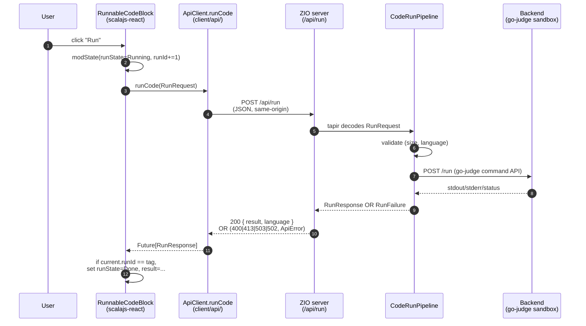
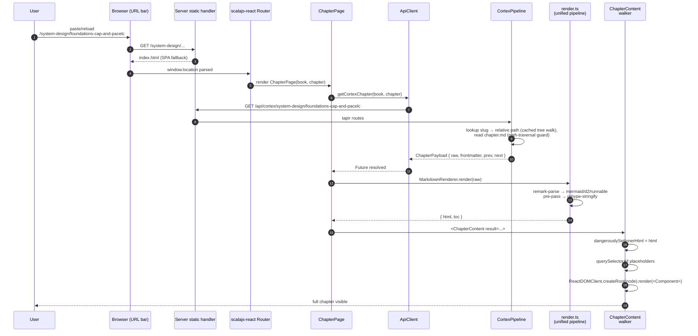

## The two stories worth knowing

Most of what happens in this app is a variation of one of these two flows. If you understand them, you'll understand 90% of the request paths in the codebase.

1. **Run a code block** — POST `/api/run`. State machine in the browser, single backend call, structured errors.
2. **Open a chapter** — GET `/api/cortex/{book}/{chapter}` then run the markdown pipeline locally. Two-stage loading.

## Story 1: running code



### Step-by-step

1. **The click.** `RunnableCodeBlock.scala` has a single `runCb: Callback`. Clicking Run bumps a per-block `runId` counter and flips state to `Running`.
2. **Why the runId.** sttp's `FetchBackend` returns a plain `Future[Response]` with no signal hook — we can't actually cancel an in-flight HTTP request. So we tag each run with the new `runId`, and the success/failure handler rejects the result if the `runId` has moved on (Cancel was clicked, or another run was started). The HTTP request is wasted but the UI stays consistent.
3. **The send.** `ApiClient.runCode(req)` is a thin wrapper around a tapir `Request[Either[Unit, RunResponse], Any]` value generated from `Endpoints.runCode`. It encodes the body using the codegen'd circe codecs.
4. **Same origin.** The base URI is `None` — sttp emits a relative path `/api/run`, and the browser resolves it against `window.location.origin`. In dev, Vite's proxy rewrites it to `http://localhost:8080`; in prod it goes to the same JVM that served `index.html`.
5. **Tapir decode.** `HttpApp.runEndpoint` is the `Endpoints.runCode` value with `.errorOut(statusCode and jsonBody[ApiError])` bolted on. Tapir validates the JSON and gives the handler a typed `RunRequest`.
6. **Handler logic.** `CodeRunPipeline` resolves the language alias via `Languages.resolve`, then dispatches to the single `LiveGoJudgeBackend`. If `EXECUTOR_URL` is unset it returns `RunFailure.NotConfigured` → 503. There is **no fallback** — one backend, no runtime failover (ADR-0029).
7. **One protocol, one return type.** `GoJudgeWire.scala` builds the go-judge `/run` request (an `sh -c` compile-then-run command with per-language limits) and maps the response into a common `RunResult` (`stdout`, `stderr`, `compileOutput`, `statusId`, `statusDescription`, `time`, `memory`).
8. **Error mapping.** `RunFailure.{BadInput, PayloadTooLarge, NotConfigured, BackendFailure}` ↔ HTTP `{400, 413, 503, 502}`. The mapping lives in `HttpApp.runEndpoint`.
9. **Back in the browser.** The handler in `RunnableCodeBlock` checks `current.runId == tag` before committing. If it doesn't match, the result is dropped — that's the "ignore late results" path.

### Where to grep when this breaks

| Symptom | Likely file |
| --- | --- |
| 503 even with `EXECUTOR_URL` set | go-judge unreachable, or alias missing in `server/.../codeRunPipeline/Languages.scala` |
| Output mangled | `GoJudgeWire.scala` (the `/run` response → `RunResult` mapping) |
| Run button stuck on "Cancel" | `RunnableCodeBlock.scala` (the `runId` ↔ `tag` consistency) |
| 400 on a valid-looking request | `Languages.scala` size limits (64KB source, 16KB stdin) |

## Story 2: opening a chapter



Note the two different URL shapes: the **browser** path is root-based (`/system-design/foundations-cap-and-pacelc`), while the **API** path the SPA fetches keeps its `/api/cortex/{book}/{chapter}` form. The `/cortex/...` browser prefix that this app used to carry is gone — the book index is at `/` now — but old `/cortex/<book>/<chapter>` links still resolve: the client router has a legacy rewrite rule that strips the prefix and replaces history.

### What's worth pausing on

**The SPA fallback (steps 2–3).** A direct reload of any in-app URL would 404 if the server didn't have a fallback. `StaticRoutes.scala` derives its fallback list from `AppRoutes.SpaRoutes` (plus the book slugs it finds on disk) and serves `index.html` for each, so a hard reload of `/system-design/...` re-enters the SPA. We don't use a single catch-all wildcard because zio-http's route table doesn't reliably resolve specific tapir routes ahead of a sibling wildcard, and the wildcard would shadow `/api/*`.

**Two-stage loading (steps 5–11).** `ChapterPage` keeps `Option[Either[String, Loaded]]` state. `None` = loading, `Some(Left(_))` = error, `Some(Right(_))` = loaded. The `Loaded` case carries **both** the API payload and the post-render result — they're fetched in one chained `Future`:

```scala
val fut =
  for
    payload  <- ApiClient.getCortexChapter(book, chapter)
    rendered <- MarkdownRenderer.render(payload.raw)
  yield Loaded(payload, rendered)
println("Two awaits, single state transition.")
```

That keeps the spinner up until the markdown pipeline finishes, not just until the API responds. A chapter with mermaid + d2 + shiki can take ~300–800ms to render the first time.

**The placeholder walker (steps 12–14).** `render.ts` emits HTML with placeholder divs:

```html
<div class="runnable-code" data-lang="python" data-source="..."></div>
<div class="mermaid-block" data-mermaid-source="..."></div>
<div class="d2-diagram"><svg viewBox="...">...</svg></div>
<div class="runnable-group" data-tabs="..."></div>
```

`ChapterContent.scala` runs an effect after the article's `dangerouslySetInnerHTML` settles. It `querySelectorAll`s each placeholder class and uses `ReactDOMClient.createRoot(node).render(...)` to mount a Scala.js component into each one. Each root is tracked in a `Ref[js.Array[RootHandle]]` so the next chapter change can `unmount()` them — otherwise we'd leak React trees on every navigation.

This pattern (server emits placeholders, client mounts components) is the only reasonable bridge between **bulk-rendered HTML** and **React-managed interactive widgets** in markdown content.

### Failure modes

| Symptom | What's likely wrong |
| --- | --- |
| 404 on a known chapter | URL slug doesn't match the path-derived slug; or `CORTEX_AUTO_RELOAD=false` and the index is stale (restart, or flip auto-reload on) |
| Reload gives a blank page | Server static fallback list missing the route |
| Placeholders render as empty divs | The walker's `articleRef.foreach { ... }` body got wrapped in `Callback { ... }` and silently discarded — see `ChapterContent.scala`'s comment on this exact bug |
| Mermaid renders but D2 doesn't | `@terrastruct/d2`'s WASM blob failed to fetch — check the network tab; bundle splitting might be misconfigured |

## A note on what *isn't* in these flows

- **No SSR.** The server doesn't render React. It only serves `index.html` plus assets and JSON. This is on purpose — the markdown pipeline is JS-native, server-side rendering would either duplicate the pipeline on the JVM (impractical: D2 is WASM, mermaid is JS) or run a headless browser (overkill).
- **No DB writes from production traffic.** The book and the blog read from disk. Postgres / Redis / Mongo are exercised by the **Hello demo** at `/demo` only — kept around because they're useful smoke tests of the persistence layer. (Redis does double duty as the `/api/run` rate-limiter store, but that's a counter, not durable state.)
