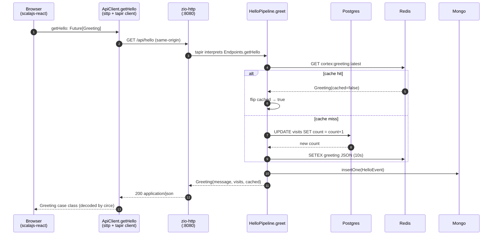

## Why `/api/hello`

`/api/hello` is the smallest endpoint in the codebase, but it exercises the entire spine of the project:

- A line in `api/openapi.yaml` declares the contract.
- The `sbt-openapi-codegen` plugin emits Scala — a `case class Greeting`, a circe codec, a tapir `Endpoint` value.
- The `shared` module cross-compiles that Scala for both the JVM and Scala.js, so the **server** and the **client** share *the same* `Greeting` type.
- The server reads Postgres, caches in Redis, appends to MongoDB — the three-store demo.
- The client calls the endpoint through a tapir-derived sttp request, gets back a `Greeting`, and renders it.

If you understand this one request, you understand how every other endpoint in the project is wired up. The rest of the work — `/api/run`, `/api/cortex/*`, `/api/blogs/*` — is the same pattern with a heavier payload.

## Step 1 — The contract in `api/openapi.yaml`

There is one source of truth for the request and response shapes, and it's the OpenAPI YAML. The relevant fragment:

```yaml
paths:
  /api/hello:
    get:
      operationId: getHello
      summary: |
        Return the running visit counter, also caching the result in Redis and
        appending the call to a MongoDB event log.
      responses:
        '200':
          description: Greeting payload
          content:
            application/json:
              schema:
                $ref: '#/components/schemas/Greeting'

components:
  schemas:
    Greeting:
      type: object
      required: [message, visits, cached]
      properties:
        message:
          type: string
          description: Greeting text rendered by the frontend.
        visits:
          type: integer
          format: int64
          description: Total times /api/hello has been hit (read from Postgres).
        cached:
          type: boolean
          description: True if the response came from the Redis cache.
```

Three things to notice:

- **`operationId: getHello`** — this becomes the Scala identifier `Endpoints.getHello`. Method name on both sides comes from here, not from the path.
- **`required: [message, visits, cached]`** — required fields become non-`Option` in Scala; missing-from-required becomes `Option[T]`. There is no nullable on this schema, so all three fields are plain non-`Option` types.
- **`format: int64`** — `visits` becomes `Long`, not `Int`. The format directive is the only way to widen integer fields past 32 bits.

Nothing else describes the wire shape. Not a manually maintained Scala case class, not a hand-written swagger annotation. Edit the YAML and the build is the migration script.

## Step 2 — Codegen emits Scala

On the next `sbt sharedJVM/compile` (or any compile of a downstream project), the `sbt-openapi-codegen` plugin reads `api/openapi.yaml` and writes three Scala files into the cross-project's `src_managed/` directory:

```d2
direction: right

yaml: api/openapi.yaml {
  shape: page
}

plugin: sbt-openapi-codegen

endpoints: "Endpoints.scala\n(getHello, Greeting case class, ...)" {
  shape: rectangle
}

serdes: "EndpointsJsonSerdes.scala\n(circe Encoder/Decoder)" {
  shape: rectangle
}

schemas: "EndpointsSchemas.scala\n(tapir Schema)" {
  shape: rectangle
}

yaml -> plugin
plugin -> endpoints
plugin -> serdes
plugin -> schemas
```

The interesting file is `Endpoints.scala`. Inside it, two things are emitted for `/api/hello`:

```scala
// (simplified shape of the generated code)
object Endpoints:

  case class Greeting(
    message: String,
    visits:  Long,
    cached:  Boolean
  )

  val getHello: PublicEndpoint[Unit, Unit, Greeting, Any] =
    endpoint
      .get
      .in("api" / "hello")
      .out(jsonBody[Greeting])
```

`getHello` is a **tapir `Endpoint` value**. It carries the path, the method, the input shape (none here), and the output shape (`Greeting` as a JSON body). It's pure data — no runtime behaviour yet. Both the server and the client interpret this same value: the server bolts request handling onto it; the client bolts an HTTP send onto it.

## Step 3 — `shared/` cross-compiles for both sides

The `shared` sbt project is a Scala.js *cross-project* (`crossProject(JSPlatform, JVMPlatform)`). One source tree, two compilation targets:

```d2
direction: right

src: shared/src + src_managed {
  shape: rectangle
}

jvm: "shared.jvm\n(JVM bytecode)" {
  shape: rectangle
}

js: "shared.js\n(Scala.js IR)" {
  shape: rectangle
}

server: server (JVM) {
  shape: rectangle
}

client: client (Scala.js) {
  shape: rectangle
}

src -> jvm: "scalac"
src -> js: "scalac + Scala.js linker"
jvm -> server: depends on
js -> client: depends on
```

The same `case class Greeting(message, visits, cached)` is now available at `cortex.shared.api.Endpoints.Greeting` in **both** modules. The JSON codec is the same one too — circe instances under `EndpointsJsonSerdes` — so the wire format on the server's encode side is guaranteed to match the wire format on the client's decode side.

This is the spot in the stack where a more conventional setup would have a hand-written DTO on the server, a hand-written DTO on the client, and a runtime bug when they drift. Here the *compiler* refuses to ship two definitions in the first place.

## Step 4 — Server: `HelloPipeline.greet`

The server interprets `Endpoints.getHello` by attaching a ZIO effect to it. Inside `server/src/main/scala/cortex/server/helloPipeline/HelloPipeline.scala`:

> 🧭 **Reading ZIO types — your decoder ring for the rest of the book.** `ZIO[R, E, A]` is an *effect*: a value that *describes* work needing environment `R`, that may fail with error `E`, or succeed with value `A`. Shorthands: **`IO[E, A]`** = no environment needed; **`UIO[A]`** = can't fail; **`Task[A]`** = may fail with any `Throwable`. So `greet: IO[HelloFailure, Greeting]` reads as "work that either fails with a `HelloFailure` or yields a `Greeting`". And the `for { … } yield …` below does **not** loop — it *sequences* effects one after another, like chaining `await` in JavaScript.

```scala
trait HelloPipeline:
  def greet:  IO[HelloFailure, Greeting]
  def recent(limit: Int): IO[HelloFailure, RecentCalls]
  def health: UIO[HealthStatus]
```

The implementation (simplified) for `greet`:

```scala
override def greet: IO[HelloFailure, Greeting] =
  for
    cached <- cache.get.catchAll(_ => ZIO.none)        // Redis read; failures are non-fatal
    result <- cached match
                case Some(g) =>
                  ZIO.succeed(g.copy(cached = true))   // cache hit
                case None    =>
                  for
                    n    <- visits.incrementAndGet     // Postgres: INC counter
                    g     = Greeting(message = "…", visits = n, cached = false)
                    _    <- cache.put(g).ignore        // Redis: store (non-fatal on failure)
                  yield g
    _      <- eventLog
                .append(HelloEvent(System.currentTimeMillis(), result.visits))
                .ignore                                // Mongo: append (non-fatal on failure)
  yield result
```

A few things worth pausing on:

1. **One method, three stores.** Postgres is the source of truth for `visits`. Redis is a 10-second cache in front of it. Mongo is an append-only audit log. The three are stitched together inside one `for`-comprehension.
2. **Fail-soft on non-essential stores.** Redis or Mongo errors get logged but don't fail the request — the canonical greeting still flows out as long as Postgres responds. The cache misses are recoverable; the audit log is best-effort.
3. **Internal seams.** `visits`, `cache`, `eventLog` are three small package-private traits (Visits / GreetingCache / EventLog). Each has exactly one production implementation (HikariCP, Lettuce, Mongo sync driver), but the pipeline itself doesn't see the drivers — only the seams. That's how the same `HelloPipeline.from(...)` constructor is used by unit tests with in-memory fakes (see ADR-0003).

The tapir binding is two lines, in `server/http/ApiRoutes.scala`:

```scala
val helloRoute: ZServerEndpoint[Any, Any] =
  Endpoints.getHello
    .errorOut(statusCode and jsonBody[ApiError])      // map failures → HTTP
    .zServerLogic(_ => pipeline.greet.mapError(toApiError))
```

`Endpoints.getHello` is the same value the codegen emitted. `zServerLogic` lifts the `ZIO` effect into a `ZServerEndpoint`, which `tapir-zio-http-server` turns into a `zio-http` route.

## Step 5 — Client: `ApiClient.getHello`

On the JS side, the *same* `Endpoints.getHello` value is interpreted by `tapir-sttp-client` to build an HTTP request descriptor. From `client/src/main/scala/cortex/client/api/ApiClient.scala`:

```scala
private val helloRequest: Unit => Request[Either[Unit, Greeting], Any] =
  SttpClientInterpreter().toRequestThrowDecodeFailures(Endpoints.getHello, baseUri)

def getHello: Future[Greeting] =
  send(helloRequest, (), statusOnly("Failed to fetch greeting"))
```

The `Request[…]` value knows the method (`GET`), the path (`/api/hello`), how to decode the response (the codegen'd `Greeting` decoder), and how to surface non-200 responses. `send` runs it through an sttp `FetchBackend`, which is a thin wrapper over the browser's `fetch()` API.

A component renders it:

```scala
ScalaFnComponent
  .withHooks[Unit]
  .useState(Option.empty[Greeting])
  .useEffectOnMountBy { (_, state) =>
    Callback.future(ApiClient.getHello.map(g => state.setState(Some(g))))
  }
  .render { (_, state) =>
    state.value match
      case Some(Greeting(message, visits, cached)) =>
        <.div(s"$message — visit #$visits (cached: $cached)")
      case None =>
        <.div("Loading…")
  }
```

That `case Some(Greeting(message, visits, cached))` is the punchline. The pattern match destructures the **same case class** the server constructed on the JVM. There is no `JSON.parse`, no manual `obj.message`, no hand-written DTO. The compiler verifies that all three fields are pulled out by name, and circe handles the wire decode automatically.

## Step 6 — The round trip



The mermaid diagram tracks one fact you can't see in any single file: the `Greeting` case class flows out of `HelloPipeline.greet` on the JVM, is encoded by circe, crosses the wire as JSON, is decoded by circe on the Scala.js side, and arrives in the React component **as the same case class**. The cross-compile is what makes that sentence true rather than approximate.

## Why this architecture pays off

The five-second pitch for API-first + cross-compiled shared types:

- **One source of truth.** The YAML is the contract. Drift between server and client becomes a compile error, not a runtime bug.
- **Zero DTO duplication.** No copy-pasted `interface Greeting { … }` on the client, no risk of `message` becoming `messageText` on one side.
- **Trivial to add an endpoint.** A new endpoint is *one* YAML block + *one* pipeline method + *one* line in `ApiRoutes` + *one* line in `ApiClient`. The case classes show up for free.
- **Trivial to refactor.** Rename `Greeting.message` → `Greeting.greeting` in the YAML, run `sbt compile`, and the compiler walks every callsite on both sides for you.
- **Cheap to swap a store.** The pipeline's internal `Visits` / `GreetingCache` / `EventLog` seams mean you can replace Postgres with anything that satisfies `incrementAndGet`, or yank Redis entirely, without touching the public `Greeting` shape.
- **Cheap to scale.** Same source layout adds a new pipeline package per feature; nothing about the build slows down as the API grows.

The trade-off is build complexity — the cross-project, the codegen, the `sbt-revolver` plumbing — but you pay that once at setup and then the dividend compounds for every endpoint you add after.

## Where to look next

- **Code:** `server/src/main/scala/cortex/server/helloPipeline/HelloPipeline.scala`, `client/src/main/scala/cortex/client/api/ApiClient.scala`, `api/openapi.yaml`.
- **ADRs:** `docs/adr/0003-hello-pipeline-internal-seams.md` (the seam pattern) and `docs/adr/0004-wire-adapters-and-unified-backends.md` (the pipeline-as-deep-module rule).
- **Deep dives:** [Server Stack](/cortex/cortex-onboarding/deep-dive/server-stack) (ZIO, tapir, HikariCP, Lettuce, Mongo) and [Shared & Codegen](/cortex/cortex-onboarding/deep-dive/shared-and-codegen) (the codegen plugin's settings and what it emits in detail).
- **The other end of the spectrum:** [Request Lifecycle](/cortex/cortex-onboarding/how-it-works/request-lifecycle), which traces the much heavier `/api/run` path and a chapter fetch.
