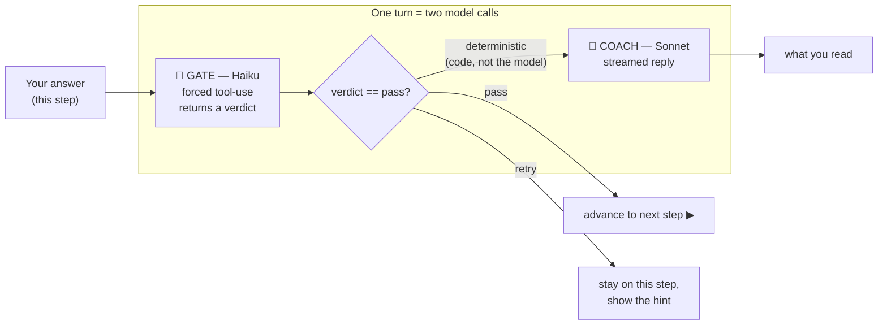

> 🤖 **This is the second half of the Cortex story.** The first four sections of this book are about the **Scala app** that serves the books. This section is about **Cortex Tutor** — a *separate* Python service that turns a passive "Your Turn" problem into an interview where an AI coaches you, one gate at a time. If you haven't read the [Overview](/cortex/cortex-onboarding/start-here/overview) yet, start there.

## What problem does it solve?

A quiz can tell you *that* you're wrong. It can't tell you *why*, and it certainly can't stop you from skipping the thinking. You read a chapter on two-pointers, you hit a problem, and the temptation is to scroll straight to the editorial. The learning that actually sticks — *"what are the inputs? what's the brute force? why is it O(n²)? what invariant makes the two-pointer version correct?"* — gets skipped, because nothing forces you through it.

**Cortex Tutor forces you through it.** It runs a fixed six-step interview and **evaluates your answer at each gate before advancing**:

```
clarify → examples → approach → plan → implement → test
```

You don't get to "implement" until you've convinced the coach you understand the **approach**. You don't get to "approach" until you've worked a concrete **example**. It is the difference between a worksheet and a patient senior engineer sitting next to you asking *"okay, but what happens when the array is empty?"*

This is the **Socratic method**, automated: the coach rarely hands you the answer; it asks the question that makes you find it.

## The one design decision that matters: gate ≠ coach

Here is the thing that makes the Tutor trustworthy rather than a chatbot that drifts. **Every turn is two separate model calls with two different jobs:**

| Half | Model | Job | Streamed? | Shape of output |
|---|---|---|---|---|
| **Gate** | Claude **Haiku** | *Judge* the answer against a rubric. Pass or retry? | No — one shot | A strict, structured **verdict** (forced tool-use) |
| **Coach** | Claude **Sonnet** (or your pick) | *Respond* — a Socratic nudge, a hint, or congratulations | Yes — token by token | Friendly prose |

The gate's verdict is a small, rigid JSON object — a `verdict` (`pass` / `retry` / `off_topic` / `question`), a `score`, a list of `rubricHits` and what's still `missing`, and a `hint`. That verdict — **and only that verdict** — drives the state machine. The coach writes the words you read, but it has **no vote on whether you advance**.

Why split them? Because if you let one chatty model both *write encouraging prose* and *decide whether to advance*, it will eventually be talked into advancing you when you don't deserve it — a confident-sounding wrong answer, a "close enough," a polite-but-empty paragraph. Separating the **judgment** (deterministic, rubric-bound, cheap Haiku) from the **conversation** (warm, generative, Sonnet) means **the model can never fabricate an advance**. The FSM transition is computed in code from the gate verdict; the coach just narrates it.



Keep that diagram in your head. Almost every other fact about the Tutor — the cost model, the two tiers, why there's a separate gate eval suite — falls out of *gate is the judge, coach is the voice.*

## A stateful agent, not a stateless prompt

A chatbot is stateless: each message is independent, the "memory" is just the transcript you resend. The Tutor is the opposite — it is a **finite state machine whose state lives in Postgres**:

- Your **current step** (one of the six) is a row in the database, not a guess the model makes from context.
- Your **transcript** and **per-step scores** are persisted, so you can close the tab mid-problem and resume exactly where you left off.
- The **(you, problem)** pair is unique — open the same problem twice and you *resume* the same session, you don't fork a new one.

Because the FSM is in code+DB, the loop is **deterministic and auditable**: given the same gate verdict, the same transition happens every time, and you can replay exactly how a learner moved through a problem. The model is a component *inside* the machine, not the machine itself.

## The six steps, and what each gate is really checking

| Step | The question it forces | A `pass` looks like |
|---|---|---|
| **clarify** | What exactly are we solving? Inputs, outputs, constraints, edge cases. | You restate the problem precisely and name the tricky inputs (empty, duplicates, overflow). |
| **examples** | Can you work one by hand? | You trace a concrete input to its output — the thing that reveals you actually understand the task. |
| **approach** | What's the idea, and the brute force? | You name a strategy *and* the naive baseline, with a rough complexity. |
| **plan** | What are the steps, before code? | An ordered, language-agnostic plan a peer could implement. |
| **implement** | Does the code match the plan? | Working code (run in the [workbench](/cortex/cortex-onboarding/how-it-works/markdown-pipeline)) that follows your own plan. |
| **test** | Did you check the edges? | You exercise the cases you named in *clarify* — and reason about complexity. |

Notice the arc: it's the exact discipline the [System Design](/cortex/system-design) and [DSA](/cortex/data-structures-and-algorithms) books preach — *requirements before estimation before design before code before verification* — turned into an interactive loop with a gatekeeper.

On the **implement** and **test** steps the answer *is* code: you write and run it in the workbench editor on the right, then **paste it into the coach** to submit. The coach deliberately doesn't auto-pull the editor — so advancing the interview never depends on the editor's state, and a learner who can't durably submit their code (saving is allow-listed) can still finish the six steps. In the UI the transcript is **grouped by step**, with the header's step dots doubling as jump-to-step tabs so a long interview stays easy to scan.

## Where it lives (and where it doesn't)

The Tutor is **not** part of the Scala binary. It is a standalone **Python / FastAPI** service in a *separate repo* (`cortex-tutor`), deployed next to Cortex on the homelab. The Cortex SPA calls it **directly** (it's a different origin), sending the *same* Keycloak JWT you're already signed in with. Why a whole separate service in a different language? That's the [next chapter](/cortex/cortex-onboarding/cortex-tutor/architecture) — short version: LLM orchestration is I/O-bound, streaming, and Python-first, and keeping it stateless-with-Postgres lets it scale independently of the book server.

## What this section covers

| Chapter | What you'll learn |
|---|---|
| [Architecture](/cortex/cortex-onboarding/cortex-tutor/architecture) | The two halves — FastAPI service + SPA coach client — and how they find each other (`tutorBaseUrl`). A LikeC4 tour. |
| [Tiers & BYOK](/cortex/cortex-onboarding/cortex-tutor/tiers-and-byok) | Homelab vs BYOK, the model catalog, and how your API key reaches Anthropic *without ever touching our server*. |
| [The turn lifecycle](/cortex/cortex-onboarding/cortex-tutor/the-turn-lifecycle) | A single turn traced end-to-end, both transports (server-streamed SSE vs client-direct). |
| [Grounding & the skill](/cortex/cortex-onboarding/cortex-tutor/grounding-and-the-skill) | The MCP server that feeds the coach lesson context, and the Agent Skill that *is* the rubric. |

> **Next:** [Architecture](/cortex/cortex-onboarding/cortex-tutor/architecture) — meet the two halves of the Tutor and trace how the browser learns where to find the coach.
