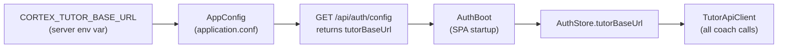

The Tutor is two cooperating pieces that live in **two different repositories**:

1. **`cortex-tutor`** — a standalone **Python / FastAPI** service. Owns the six-step FSM, calls the models, persists sessions. Source of truth for the HTTP contract.
2. **The coach client** — Scala.js components *inside* the Cortex SPA (this repo). Renders the coach tab, drives the conversation, and — for BYOK — calls the model provider directly from your browser.

They are deliberately decoupled: the browser talks to the FastAPI service over HTTP, the FastAPI service never imports Scala, and the only thing they share is a **hand-ported contract** ([`TutorContract.scala`](shared/src/main/scala/cortex/shared/tutor/TutorContract.scala)) that mirrors the tutor's [`api/tutor-openapi.yaml`](https://github.com/ani2fun/cortex-tutor).

## The whole system at a glance

Here is Cortex *and* the Tutor as one picture — who calls whom, and which dependencies are external. This is the live LikeC4 model (zoom with ⌘/Ctrl-scroll, or hit **Zoom** for fullscreen):

<iframe
  src="/c4/view/onboarding_cortex_context"
  width="100%"
  height="460"
  style="border: 1px solid var(--border, #2b2b2b); border-radius: 8px;"
  loading="lazy"
  title="Cortex + Tutor — context view"
></iframe>

Two things to read off it. First, **the SPA talks to three different origins**: the Cortex server (`/api/*`), the Tutor (`/v1/*`, a different host), and — on the BYOK path — Anthropic or OpenRouter *directly from the browser*. Second, **the Tutor shares Cortex's Postgres** (the `tutor` schema) and **validates the same Keycloak JWT** — so signing into Cortex signs you into the coach, with no second login.

## Why a separate Python service?

It's a fair question in a repo that is otherwise militantly one-language. The answer is that LLM orchestration is a *different kind of workload*:

- **It's I/O-bound and low-RPS.** A turn spends almost all its wall-clock waiting on the model API and streaming tokens back. That's the sweet spot for FastAPI + `asyncio`, not a JVM thread pool.
- **It's streaming-first.** Server-Sent Events all the way down.
- **The ecosystem is Python.** The Anthropic SDK, the MCP tooling, the eval harnesses, and the CCA study material are Python-native.
- **It scales independently.** Because the service is **stateless** (Postgres is the source of truth), you can run N replicas of the coach without touching the book server — and you *want* to, because its load profile (bursty, long-lived streams) is nothing like the book server's (cheap, cached reads).

The full rationale lives in the tutor repo's `docs/adr/0001-fastapi-python-tutor-service.md`.

## Inside the Tutor service

Zoom into the FastAPI service and you find a small, sharp-edged layering — the FSM is pure, the IO is at the edges:

<iframe
  src="/c4/view/onboarding_tutor_components"
  width="100%"
  height="440"
  style="border: 1px solid var(--border, #2b2b2b); border-radius: 8px;"
  loading="lazy"
  title="Cortex Tutor — component view"
></iframe>

The repo layout maps one-to-one onto that diagram:

```
tutor/
  app.py  config.py  auth.py        # FastAPI app, settings, Keycloak JWT verify
  domain/{steps,verdict,fsm}.py      # the PURE six-step state machine (no IO)
  orchestration/                     # per-turn: assemble → gate → transition → coach → persist
  models/                            # provider router: Anthropic / Ollama / client-direct (BYOK)
  grounding/                         # MCP client + context assembly
  persistence/{models,repo}.py       # SQLAlchemy 2.0 async over the `tutor` Postgres schema
  skills/loader.py                   # loads the coaching rubric
grounding_mcp/                       # the standalone read-only MCP grounding server
api/tutor-openapi.yaml               # the contract — single source of truth
.claude/skills/socratic-tutor/       # the six-step rubric + per-gate criteria (the core IP)
```

The shape to notice: `domain/` is a **pure** FSM — no database, no network, unit-testable in isolation — and everything stateful (`orchestration/`, `persistence/`) wraps around it. It's the same "pure core, effectful shell" pattern Cortex's own [server pipelines](/cortex/cortex-onboarding/deep-dive/server-stack) use, just in Python.

## Inside the coach client (the Scala.js half)

The browser half is a handful of components under `client/src/main/scala/cortex/client/`:

| Piece | File | Job |
|---|---|---|
| **CoachController** | `components/book/workbench/CoachController.scala` | Headless render-prop FSM — the client mirror of the six steps. Decides which transport to use. |
| **CoachTab** | `components/book/workbench/CoachTab.scala` | The Coach tab UI; lazily calls `whoami` only when you open it. |
| **ModelSelect** | `components/book/workbench/…` | The model dropdown (mirrors the language picker). |
| **TutorApiClient** | `api/TutorApiClient.scala` | Hand-rolled `fetch` client — different origin, and SSE needs a custom reader. |
| **ByokProvider** | `api/ByokProvider.scala` | Calls OpenRouter / Anthropic *directly* on your key. |
| **ByokKeyStore** | `auth/ByokKeyStore.scala` | Holds your key in `sessionStorage` — this tab only, never sent to us. |

Why hand-rolled HTTP instead of the generated `ApiClient`? Two reasons, both worth internalizing: the tutor is a **different origin** (so the tapir-generated, same-origin client doesn't apply), and the streaming turn uses **`fetch` + a `ReadableStream` reader** rather than the browser's native `EventSource` — because `EventSource` *cannot attach an `Authorization` header*, and every tutor call needs your JWT.

## How the browser finds the Tutor: `tutorBaseUrl`

The coach client doesn't hard-code the tutor's address. It *learns* it at startup, through one config value that flows from a server env var to the browser:



So the chain is: `CORTEX_TUTOR_BASE_URL` → `AppConfig` → the public `/api/auth/config` endpoint → `AuthBoot` captures it on load → `AuthStore` holds it → `TutorApiClient` reads it for every request. **If the env var is unset, `tutorBaseUrl` is empty, and the coach gracefully degrades** to a static, manual-prompts fallback (`StaticCoach`) — the book still works, you just don't get the live coach. That's the same fail-soft philosophy as Cortex's [degraded-mode stores](/cortex/cortex-onboarding/how-it-works/hello-world-end-to-end): a missing optional dependency degrades the feature, it never crashes the page.

> **The join key.** Every coach session is keyed by a `problemId` of the form `<book>/<chapter-slug>` — e.g. `data-structures-and-algorithms/linear-structures/arrays/dynamic-arrays`. The SPA computes it from the current chapter and passes it down through the workbench, so the *same* problem always resumes the *same* session.

> **Next:** [Tiers & BYOK](/cortex/cortex-onboarding/cortex-tutor/tiers-and-byok) — who pays for the tokens, the model catalog, and the surprisingly careful dance that keeps your API key out of our logs.
