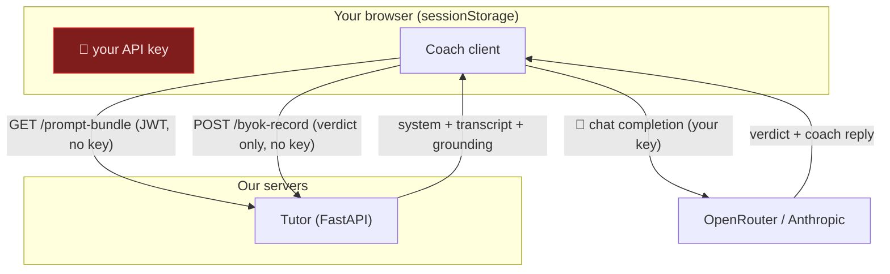

The single biggest constraint on a homelab AI feature is **money**. Claude tokens cost real dollars, and a coaching session is many turns. If every visitor's coaching ran on the operator's API key, a popular day would be a painful invoice (we put real numbers on this in the [System Design deep-dive](/cortex/system-design/capstones/cortex-storage-and-cost)). So the Tutor's economics are baked into its architecture as **two tiers**.

## The two tiers

| Tier | Who | Who pays | How the coach runs |
|---|---|---|---|
| **Homelab** | The operator — an allowlist (`COACH_HOMELAB_USERS`, default `ani2fun`) | The operator (server key) | Server-side, streamed over SSE. Default model is a **local** model on the wk-1 node — zero API spend. |
| **BYOK** | Every other signed-in user | **You** — your own provider key | **Client-direct**: your browser calls the model provider itself. Our server never sees the key. |

There's an implicit third state — **Locked** — for visitors who aren't signed in or haven't supplied a key: the editor works, but the live coach is unavailable.

The tier is decided by *who you are* (your Keycloak identity against the allowlist) and is **pinned onto the session when it's created**. It's not something you toggle mid-problem.

## The catalog: stable keys, not raw model ids

The Tutor never exposes raw model ids (`claude-sonnet-4-6`) to clients. It exposes **stable catalog keys** (`claude-sonnet`, `or-claude-sonnet`, `qwen-coach`). The indirection matters: bumping a model id — when Anthropic ships a new Sonnet — never breaks a stored session or a client. The catalog lives in [`tutor/models/catalog.py`](https://github.com/ani2fun/cortex-tutor):

| Key | Provider | Backs onto | Who can pick it |
|---|---|---|---|
| `or-claude-sonnet` | OpenRouter | Claude Sonnet 4.6 | Everyone (BYOK default) |
| `or-gpt-4.1` | OpenRouter | GPT-4.1 | Everyone |
| `or-gemini-flash` | OpenRouter | Gemini 2.5 Flash | Everyone |
| `or-deepseek` | OpenRouter | DeepSeek V3.1 | Everyone |
| `or-llama-70b` | OpenRouter | Llama 3.3 70B | Everyone |
| `claude-sonnet` | Anthropic (direct) | Claude Sonnet 4.6 | Everyone (purist path) |
| `claude-haiku` | Anthropic (direct) | Claude Haiku 4.5 | Everyone |
| `qwen-coach` | Ollama (local wk-1) | a tuned `qwen2.5-coder` | **Homelab only** |

Read the "who can pick it" column carefully, because it encodes a subtle and important rule.

## The rule that surprises everyone: provider, not tier, decides the transport

Cloud models are selectable by **everyone**, including the operator. But here's the catch — **a cloud pick is always funded by the picker's own key, client-direct, regardless of tier.** If the homelab operator picks `claude-sonnet` instead of their local `qwen-coach`, that turn runs *exactly like an external BYOK user's*: client-direct on the operator's own Anthropic key, never the server key.

So the funding decision follows the **chosen model's provider**, not the tier:

- **Local model (`qwen-coach`, Ollama on wk-1)** → server streams it, keyless. Homelab only.
- **Any cloud model (OpenRouter or Anthropic)** → client-direct on the picker's key.

This is captured in one pure predicate, [`ModelPicker.requiresKey`](shared/src/main/scala/cortex/shared/tutor/ModelPicker.scala) (and its server twin, `resolve_coach` in the catalog): a cloud model needs the user's key; the local model doesn't. The client uses it to decide whether to prompt you for a key before your first turn.

The Python side names the four funding outcomes explicitly as a `CredentialMode`:

| `CredentialMode` | When |
|---|---|
| `SERVER_KEY` | Homelab tier, Anthropic coach, on the server's key |
| `CLIENT_DIRECT` | Any cloud model on the *user's* key (BYOK, or the operator picking cloud) |
| `LOCAL` | Homelab, the wk-1 Ollama model |
| `LOCKED` | Fail closed — a Claude model chosen with no resolvable key |

`LOCKED` is the safety net: the resolver **fails closed**. If something asks for a paid model with no key behind it, the turn is refused, not silently billed to the operator.

## Where your key actually goes (and where it never goes)

This is the part to get right, because it's a security property, not a convenience. **On the BYOK path, your API key never reaches any Cortex- or Tutor-owned server.** It is sent from your browser *directly* to OpenRouter or Anthropic.

Trace the arrows: the Tutor hands the browser a **prompt bundle** (the system prompt, the bounded transcript, the grounded context — but *not* the answer key for steps before `implement`). The browser makes **one combined gate+coach call** to the provider on your key. Then it sends the Tutor only the **result** — the verdict and the coach's reply text — to record. The key is on exactly one hop, browser→provider, and it lives only in [`ByokKeyStore`](client/src/main/scala/cortex/client/auth/ByokKeyStore.scala):

- **`sessionStorage` only** — this browser tab, this session. Not `localStorage`, not a cookie.
- **Keyed per provider** (`cortex.tutor.byokKey.openrouter`).
- **Wiped on sign-out.**
- **Never serialized into any request to our origins.**

The tutor repo's own README states the invariant bluntly: *"BYOK keys never reach this server."* The architecture is what makes that claim true rather than aspirational — there is no code path that *could* send it to us, because the provider call is made from the browser.

## The model is pinned (mostly)

When a session is created, the chosen model is **pinned** onto it. Submit a model the tutor doesn't allow for your tier and you get an **HTTP 422** — the server validates against the tier allow-list and refuses unknown or disallowed keys (`validate_choice`, again *failing closed*). Pinning is why the picker locks after your first turn: switching models mid-interview would muddy what graded you. To genuinely change models you `reset` the session (or use the explicit dual-mode `model` change, which re-derives the transport). The client mirrors all of this in [`ModelPicker.scala`](shared/src/main/scala/cortex/shared/tutor/ModelPicker.scala), which is small and pure precisely so it can be unit-tested without a browser.

> **Next:** [The turn lifecycle](/cortex/cortex-onboarding/cortex-tutor/the-turn-lifecycle) — now follow a single answer all the way through both transports, gate then coach, and see exactly where the FSM advances.
