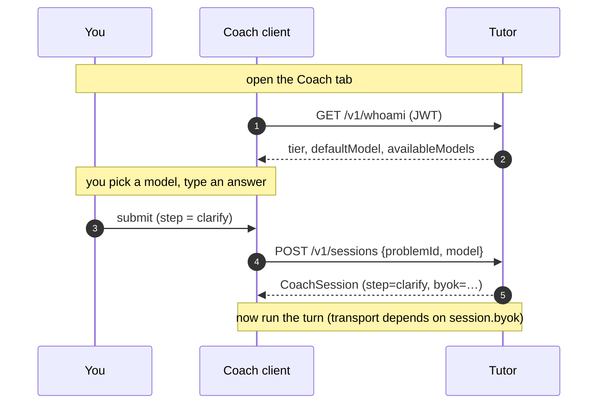
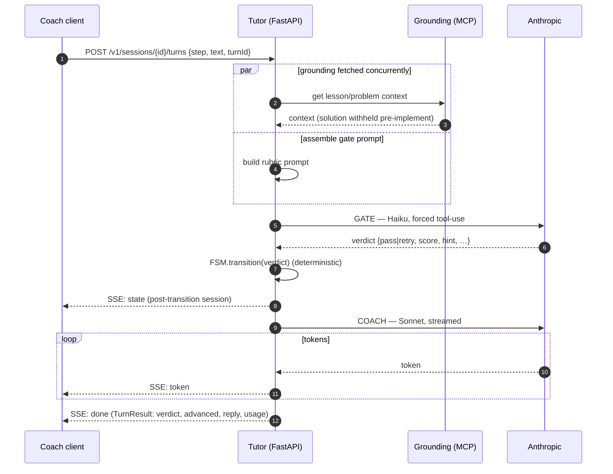
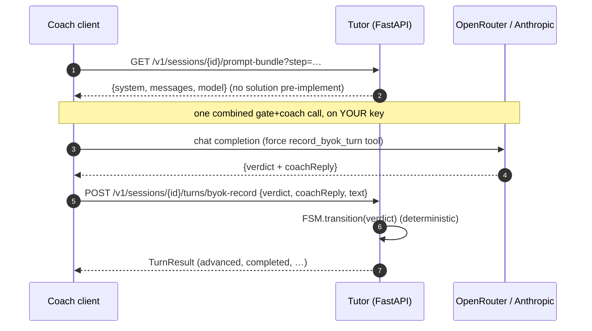
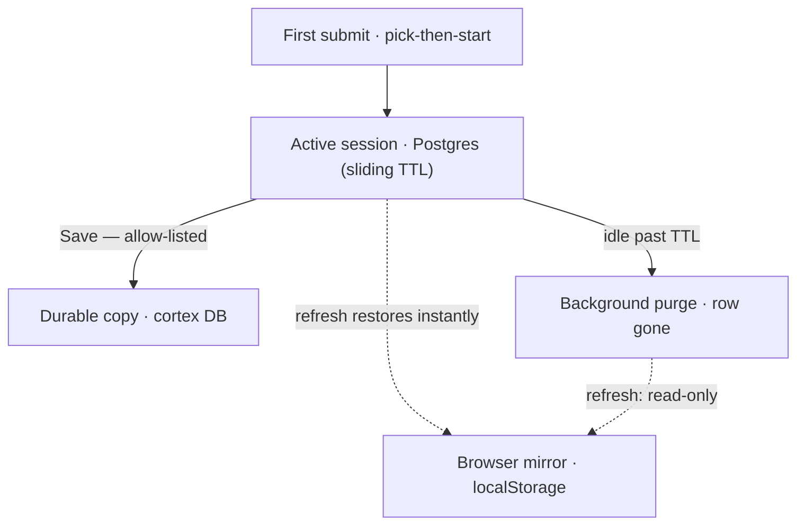
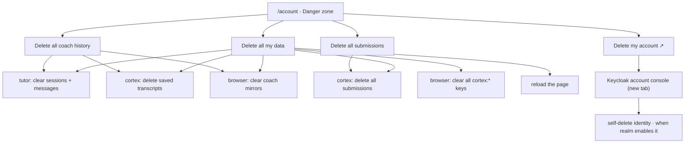

This chapter follows a single answer from keypress to coach reply. Everything from the previous chapters — gate-vs-coach, the two tiers, the pinned model — shows up here in motion.

## Three calls, lazily

The coach does as little as possible until you actually use it:

1. **`GET /v1/whoami`** — fired only when you *open* the Coach tab. Returns your `sub`, `preferredUsername`, your **tier**, the **default model**, and the **tier-filtered list of models** you may pick. No model is called; no session exists yet.
2. **`POST /v1/sessions`** — fired on your **first submit**, not on tab open. This is the *lazy pick-then-start*: you can open the tab, browse the model dropdown, and change your mind, all before a single row is written. Creation pins your chosen model and your tier onto the session. (Re-opening a problem you've already started **resumes** instead — creation is idempotent on `(you, problemId)`.)
3. **The turn** — `POST …/turns` (homelab) or the BYOK pair. This is where the gate grades you and the coach replies.

The `byok` boolean on the returned session is the switch: `false` → the server-streamed path, `true` → the client-direct path. Same FSM, two transports.

## Transport A — homelab (server-streamed SSE)

When the server funds the turn, the browser makes **one** request and the server does everything — gate, transition, coach — streaming the result back as Server-Sent Events.

The **order of the SSE frames is a contract** you can rely on (it's encoded in [`TurnContract`'s `TurnEvent`](shared/src/main/scala/cortex/shared/tutor/TutorContract.scala)):

1. **exactly one `state`** — the post-transition session, sent *before the first token* so the UI can move the step tracker the instant the gate decides;
2. **zero or more `token`** — the coach reply, streamed;
3. **exactly one `done`** — the `TurnResult` (final verdict, whether it `advanced`, the full reply message, and a `usage` block with token counts and `costUsd`).

A `failed` frame is reserved for an explicit error; note that a *coach* failure degrades gracefully — the server falls back to emitting the gate's hint as a token and still sends `done` — because the gate already made the real decision. The coach is the voice; if the voice cracks, the verdict still stands.

## Transport B — BYOK (client-direct)

When *you* fund the turn, the work splits across two server calls with your browser doing the model call in between — so your key stays on your machine.

Two things make this safe and consistent with the homelab path:

- **The server still owns the FSM.** The browser does the model call, but the **transition is computed server-side from the verdict** the browser reports — the same `FSM.transition` as transport A. A malicious client could lie about a verdict, but it can only ever cheat *its own* learning; nothing it sends advances anyone else or spends the operator's money.
- **The solution is withheld pre-implement** in the prompt bundle exactly as it is server-side, so the BYOK provider physically cannot leak the answer during `clarify`/`approach`/`plan`.

If you `POST …/turns` on a session that's pinned to BYOK, the server answers **403 `byok_required`** — a guardrail that the client uses to pick the right transport, never something you should hit in normal use.

## Idempotency and concurrency: the boring parts that matter

Real users open two tabs, double-click submit, and lose network at the worst moment. The contract handles all three:

- **`turnId`** — every turn carries a client-generated id. Re-POST the same `turnId` and the server **replays the committed result** instead of grading you twice. Safe retries.
- **Pinned model** — covered last chapter: the model is fixed at creation, so a turn can't quietly change what's grading you.
- **409 `Stale`** — if another tab advanced the session first, your in-flight turn gets a **409 carrying the current session**, so the UI can resync rather than apply a transition to a stale step.

These aren't exotic; they're the same idempotency-key and optimistic-concurrency patterns the [System Design book](/cortex/system-design/distributed-patterns/idempotency-retries-backoff) teaches — here applied to a coaching session so it survives the messiness of real browsers.

## Ephemeral by default — resume, save, clear

A coaching session is **working state, not an archive**. It lives behind a **sliding TTL** (idle-for-N-hours, refreshed on every turn and model switch) and a background job **purges** it once that window lapses. Durability comes in two layers:

- **The browser mirror (everyone).** The SPA mirrors the whole transcript to `localStorage` on every change, so a refresh restores it instantly — and it survives the server-side purge. No account, no allow-list; this is the refresh-safety net.
- **Durable Save (allow-listed).** Pressing **Save** in the coach posts the transcript to cortex's own `coach_saved_session` table — the only server copy that outlives the TTL. Saving is **allow-listed**, gated by the same `submission_allowlist` as "Submit code" (see [Access & allowlists](/cortex/cortex-onboarding/runbooks/access-and-allowlists)); off-list visitors keep the browser mirror.

The session operations:

- **Resume** — `GET /v1/sessions/{id}` returns the transcript + current step *while the session is still within its TTL*. Past that the row is gone, and the browser mirror brings the conversation back (read-only — you start fresh to continue).
- **Reset** — `POST …/reset` abandons the active session and starts over at `clarify`, carrying the model forward (or the tier default if it's no longer allowed).
- **Clear** — `POST /v1/sessions/clear-all` deletes every session + message you own; durable saved copies and submissions delete separately. All three are wired into the account page below.

In the UI the transcript is **grouped by step** — each of the six steps is a labelled section, and the header's step dots double as jump-to-step tabs, so a long interview stays navigable.

## Managing your data

The coach's data spans three stores; the account page (header avatar → **Manage account & data**) deletes across all of them in one place — all coach history, all submissions, or everything at once:

Deleting the **account itself** — the Keycloak identity — happens one origin away, in Keycloak's own account console; the **Delete my account** card links straight there (opens in a new tab). The cortex server holds no Keycloak-admin rights, so it never deletes identities itself — the console does, when the realm enables self-service deletion (local dev and the homelab realm both do). Delete your data first: removing the identity doesn't erase the data keyed to it.

> **Next:** [Grounding & the skill](/cortex/cortex-onboarding/cortex-tutor/grounding-and-the-skill) — where the lesson context comes from (an MCP server), and the Agent Skill that encodes the rubric the gate grades against.
