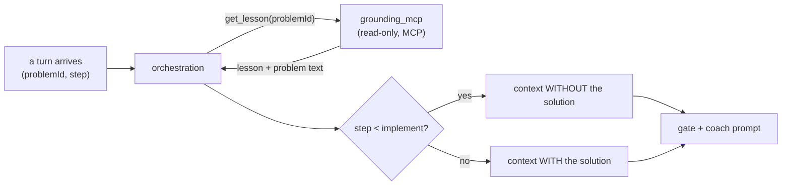

A coach that doesn't know *which* problem you're on, or *what* a good answer looks like, is just a chatbot. Two components fix that — and both happen to be textbook examples of pieces of the Claude stack, which is why this chapter doubles as a pointer into [The Claude Stack](/cortex/the-claude-stack) book.

## Grounding: the read-only MCP server

When the gate grades your `approach`, it needs to know what the problem actually is, what the lesson taught, and (eventually) what a correct solution looks like. That context comes from **`grounding_mcp`** — a standalone, **read-only [MCP](/cortex/the-claude-stack/model-context-protocol) server** over the Cortex content corpus.

[MCP](https://modelcontextprotocol.io) (the Model Context Protocol) is the open standard for handing an LLM tools and context through a uniform interface. Here it's used for exactly one thing: **fetching lesson and problem context by `problemId`**, over Streamable HTTP, authenticated with a service token (`MCP_SERVICE_TOKEN`).

Three properties are worth calling out, because they're deliberate:

- **Read-only by construction.** The grounding server can *read* the corpus and nothing else. A coaching agent has no business writing to your content, so the capability simply isn't there — the cleanest kind of security boundary.
- **Solution withholding.** The context assembly **withholds the solution until the `implement` step**. During `clarify`, `examples`, `approach`, and `plan`, the model literally does not have the answer in its context, so it cannot leak it — not on the homelab path, and not on the BYOK path (the prompt bundle is assembled the same way). The protection is in *what context exists*, not in asking the model nicely.
- **Graceful degradation.** If the MCP server is down, the turn degrades to ID-only context rather than failing. You still get coached; the coach is just less specific. Same fail-soft instinct as the rest of the platform.

This is the **MCP server Cortex ships** — and it's the concrete answer to a question The Claude Stack book poses as a design exercise. (For most of that book's life, the honest gap was *"Cortex consumes MCP servers but ships none of its own."* The Tutor closes it.)

## The skill: a rubric the gate grades against

The other half of grounding is knowing what *good* looks like at each gate. That lives in an **[Agent Skill](/cortex/the-claude-stack/agent-skills)** at `.claude/skills/socratic-tutor/` in the tutor repo — and the tutor's README calls it *"the core IP."*

An Agent Skill is a folder of instructions (a `SKILL.md` plus supporting files) that teaches a model *how to do a specific job well*. The `socratic-tutor` skill encodes:

- the **six-step framework** and the order it runs in;
- **per-gate criteria** — what `clarify` must contain to pass, what makes an `approach` answer complete, and so on;
- the **verdict contract** — the exact shape the gate must emit (`verdict`, `score`, `rubricHits`, `missing`, `hint`, `nextHintLevel`).

That verdict contract is the same structure you met in [chapter 1](/cortex/cortex-onboarding/cortex-tutor/what-the-tutor-is) as `GateVerdict`. The skill is *where the rubric is written*; the gate call *forces the model to fill it in* (Anthropic's forced tool-use guarantees structured output); and the FSM *acts on it*. Skill → tool schema → state machine — a clean separation between the **policy** (what counts as a good answer) and the **mechanism** (how the loop runs).

## Why this is graded by a cheap model, and tested like code

The gate is **Haiku**, not Sonnet, and that's a deliberate, money-aware choice you'll see quantified in the [cost analysis](/cortex/system-design/capstones/cortex-storage-and-cost): the *judgment* is a small, structured classification — cheap and fast on Haiku — while the *conversation* is the part that benefits from a stronger model. Splitting them lets each run on the right tier.

But a cheap judge is only useful if it judges *correctly*. So the gate is **tested like code**: the tutor repo ships **eval suites** (`evals/`) — a gate-judge suite and a coach suite — that are **CI-gated**. They pin known-good and known-bad answers and assert the verdict, so a prompt change that makes the gate too lenient (or too harsh) fails the build. This is the discipline The Claude Stack book calls *diligence*: the model's output is treated as a thing to be **verified**, not trusted.

## The three Claude-stack pieces, in one place

Pull back and the Tutor is a working tour of three things the Cortex app proper never used:

| Stack piece | In the Tutor | Read more |
|---|---|---|
| **The Claude API** | Gate (Haiku, forced tool-use) + coach (Sonnet, streamed) | [Claude API → in Cortex](/cortex/the-claude-stack/building-with-the-claude-api/claude-api-in-cortex) |
| **MCP** | `grounding_mcp` — a read-only context server | [Model Context Protocol](/cortex/the-claude-stack/model-context-protocol) |
| **Agent Skills** | `socratic-tutor` — the rubric as a skill | [Agent Skills](/cortex/the-claude-stack/agent-skills) |

If you've read this far, you understand not just *what the Tutor does* but *why each piece is shaped the way it is* — and you've seen, in production, the same stack the Claude Certified Architect path is built around.

> **Next:** ready to run all of this yourself? The [Runbooks](/cortex/cortex-onboarding/runbooks) section walks you from an empty machine to a working coach, locally and in production.
