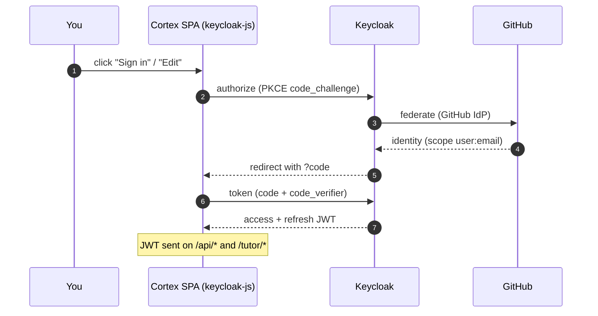

Some features only work when you're **signed in**: an allow-listed user can **Save** a coach transcript to
the homelab DB, and submitting passed test-case code records it against your account. (Coaching itself
doesn't need the allowlist — sessions are ephemeral and browser-mirrored.) To exercise the durable
features locally you need a working sign-in — and it must go through the **local** Keycloak, never
production.

> **The golden rule:** local dev authenticates against **`http://localhost:8081/realms/cortex`**, *not*
> `https://keycloak.kakde.eu/realms/apps-prod`. `./bin/dev` (and `./scripts/devcombined`) set this for you.
> If you ever get redirected to `keycloak.kakde.eu` on localhost, see [Troubleshooting](#troubleshooting) —
> it's a stale server or a `KEYCLOAK_ISSUER_URL` left in your shell.

## What `AUTH_ENABLED=true` gives you

```bash
AUTH_ENABLED=true ./bin/dev            # cortex + a local Keycloak container
# or both stacks (so the coach saves data under your identity):
AUTH_ENABLED=true ./scripts/devcombined
```

That starts a **local Keycloak** (container `cortex-keycloak`, dev mode) on **http://localhost:8081**:

- **Realm:** `cortex` (imported from `docker/keycloak/import/cortex-realm.json` on first boot).
- **Admin console:** http://localhost:8081 — admin user **`admin` / `admin`**.
- **SPA client:** `cortex-web` (public PKCE), redirect URIs for `:5173` and `:8080`.
- **A test user:** **`tester` / `tester`**.

The cortex server is handed these coordinates via `/api/auth/config`, and the SPA's `keycloak-js`
runs the PKCE flow against them. With `./scripts/devcombined`, the **tutor** is pointed at the *same*
local realm too (its `bin/dev` defaults `KEYCLOAK_ISSUER_URL` to `localhost:8081/realms/cortex` when auth
is on) — so the JWT the SPA gets is accepted by both cortex and the coach.

## The sign-in flow

Clicking **Sign in** (the header avatar's button, or any editor's **Edit**) opens the condensed GitHub
sign-in modal — one CTA and one "what GitHub is asked for" scope strip. `keycloak-js` then runs the
standard OIDC **PKCE** round-trip and hands the SPA a JWT it sends on every `/api/*` and `/tutor/*` call:



Once signed in, the avatar opens a calm dropdown — your identity, a note on where data lives, and **Sign
out**. Bulk data deletion lives on the **/account** page (avatar → *Manage account & data*); see
[The turn lifecycle → Managing your data](/cortex/cortex-onboarding/cortex-tutor/the-turn-lifecycle).

## Deleting your account

The **/account** page also has a **Delete my account** card. It deliberately does *not* call the cortex
server — that server only **verifies** JWTs and holds no Keycloak-admin rights, so it can't (and shouldn't)
delete identities. The card instead links out to **Keycloak's own account console** (built by `keycloak-js`'s
`createAccountUrl()`, opened in a new tab), where the user self-deletes. Keycloak renders that **Delete
account** option only when two realm preconditions are met:

1. the **`delete_account` required action** is enabled on the realm, and
2. the user holds the **`delete-account`** client role of the built-in `account` client.

The committed local realm (`docker/keycloak/import/cortex-realm.json`) sets both, so the flow works
end-to-end in dev: sign in as `tester`/`tester`, open the avatar → **Manage account & data** → **Delete my
account** → the console offers the deletion. Three import gotchas are baked into how that realm is written —
all learned the hard way against `keycloak:26.0`:

- **A partial `requiredActions` array *replaces* Keycloak's defaults — it doesn't merge.** Listing only
  `delete_account` silently strips `VERIFY_EMAIL`, `UPDATE_PASSWORD`, and the rest. The realm therefore
  carries the **full** Keycloak-26 default list verbatim, with `delete_account` flipped to `enabled: true`
  (the lone change from stock).
- **The realm JSON can't carry comment keys.** Keycloak 26 parses the realm with
  `FAIL_ON_UNKNOWN_PROPERTIES` *on*, so a stray `_comment` field aborts the entire import ("Unrecognized
  field … not marked as ignorable") and the server won't start. Quirks get documented here, not inline.
- **Giving a user *any* explicit role in the import suppresses the automatic default-roles grant.** Add a
  `clientRoles`/`realmRoles` block to a user and Keycloak stops auto-assigning `default-roles-cortex` to
  them — so granting only `account/delete-account` silently cost `tester`/`test1` their `manage-account` +
  `view-profile` (and `offline_access`). The fallout is non-obvious: the **account console** resolves its
  `account` token audience from exactly those roles, so without them the token carries **no `aud`** and the
  account REST API answers **HTTP 401 "Something went wrong"** — the console renders an error instead of the
  profile. Fix: list `default-roles-cortex` back explicitly in each user's `realmRoles`, *next to* the
  `clientRoles`.

The two roles are therefore granted **together**, per user:

```json
"realmRoles": ["default-roles-cortex"],
"clientRoles": { "account": ["delete-account"] }
```

(Keycloak creates the built-in `account` client and its roles before it imports users, so the `clientRoles`
reference resolves cleanly.)

> **Production.** The homelab `apps-prod` realm needs the same two switches: enable the **Delete Account**
> required action (Realm settings → *Required actions*), and grant the `delete-account` role to users — most
> simply by adding it to the realm's **default roles** (`default-roles-apps-prod`) so every federated GitHub
> user picks it up automatically. Until both are set, the card's link still opens the console, but it won't
> show the delete option.

## Two ways to sign in locally

The SPA's sign-in is **GitHub-only** (it always sends `idpHint=github`). What happens next depends on
whether your local realm has a GitHub identity provider:

| Mode | Setup | What you click |
|---|---|---|
| **A — tester/tester** (zero config) | none | "Continue with GitHub" → Keycloak *ignores* the unknown hint and shows its own login form → enter **`tester` / `tester`**. |
| **B — real GitHub OAuth** | register a GitHub OAuth App (below) | "Continue with GitHub" → GitHub authorize → back to localhost, signed in as your GitHub identity. |

Mode A is enough for most feature testing (you get a real signed-in session). Use Mode B when you
specifically want the **GitHub identity** (e.g. to verify the real OAuth round-trip, or that data is keyed
to your GitHub `sub`).

## Mode B — register a GitHub OAuth App for localhost

GitHub OAuth credentials are **yours** and can't be committed, so you register your own throwaway app and
hand its credentials to the local Keycloak. One-time setup:

**1. Create the OAuth App.** Go to **GitHub → Settings → Developer settings → OAuth Apps → New OAuth App**
(<https://github.com/settings/developers>), and fill in:

| Field | Value |
|---|---|
| **Application name** | anything, e.g. `Cortex (local dev)` |
| **Homepage URL** | `http://localhost:5173` |
| **Authorization callback URL** | `http://localhost:8081/realms/cortex/broker/github/endpoint` |

> ⚠️ The **callback URL must be exact** — it's Keycloak's broker endpoint for the `github` IdP in the
> `cortex` realm. A trailing slash or wrong port breaks the round-trip with a GitHub "redirect_uri
> mismatch" error.

**2. Get the credentials.** Click **Register application**, copy the **Client ID**, then **Generate a new
client secret** and copy that too.

**3. Hand them to `bin/dev`.** Export them (or keep them in a gitignored file you `source`):

```bash
export GITHUB_CLIENT_ID=Iv1.xxxxxxxxxxxx
export GITHUB_CLIENT_SECRET=xxxxxxxxxxxxxxxxxxxxxxxxxxxxxxxxxxxxxxxx
AUTH_ENABLED=true ./bin/dev          # or ./scripts/devcombined
```

When those two vars are set, `bin/dev` **injects a `github` identity provider** (with your credentials,
scope `user:email`) into a *generated* copy of the realm at `docker/keycloak/import-generated/` and imports
that instead (via `KC_IMPORT_DIR`). Unset them and you're back to Mode A — nothing committed changes.

**4. Sign in.** Open <http://localhost:5173>, click the editor's sign-in, **Continue with GitHub** →
GitHub's authorize screen → back to localhost, signed in as you. The tutor coach and submission features
now persist under your GitHub identity.

## Adding a local dev user

Local sign-in accounts are seeded in the realm import `docker/keycloak/import/cortex-realm.json` — that's
where `tester` and `test1` live. To add another, copy an existing `users[]` block and change the
username / password / email. **Copy the whole block, including `realmRoles`:**

```json
{
  "username": "alice",
  "enabled": true,
  "emailVerified": true,
  "email": "alice@cortex.local",
  "firstName": "Alice",
  "lastName": "Example",
  "credentials": [{ "type": "password", "value": "alice", "temporary": false }],
  "realmRoles": ["default-roles-cortex"],
  "clientRoles": { "account": ["delete-account"] }
}
```

- **`realmRoles: ["default-roles-cortex"]` is load-bearing.** Omit it and Keycloak skips the automatic
  default-roles grant (the third gotcha above), stripping `manage-account`/`view-profile` from the user — and
  the account console then 401s for them.
- **`clientRoles: { account: ["delete-account"] }`** is only needed if that user should be able to
  self-delete from the account console; drop it otherwise and everything else still works.

The realm re-imports only into a **fresh** container, so after editing recreate Keycloak:
`docker compose up -d --force-recreate keycloak` (or `docker compose down keycloak && AUTH_ENABLED=true
./bin/dev`). The new user can sign in right away, but is **not** on the
[allowlist](/cortex/cortex-onboarding/runbooks/access-and-allowlists) — Submit and Save return a 403 until
you add their username.

## Troubleshooting

- **Redirected to `keycloak.kakde.eu/realms/apps-prod` on localhost.** Your server is using the *prod*
  defaults. Causes: (a) a **stale cortex server** from an earlier launch is still answering — stop it
  (`sbt server/reStop` / `kill $(lsof -ti:8080)`) and relaunch via `./bin/dev`; (b) you have
  `KEYCLOAK_ISSUER_URL` exported in your shell pointing at prod — `unset KEYCLOAK_ISSUER_URL` and relaunch.
  `bin/dev` defaults it to the local realm, so a clean launch always points local.
- **`docker compose up` fails: "port is already allocated".** A leftover stack squats a store port.
  `bin/dev` now names the offending compose project and the fix — see
  [Troubleshooting](/cortex/cortex-onboarding/runbooks/local-dev/end-to-end-and-troubleshooting).
- **"Continue with GitHub" shows a GitHub error / redirect_uri mismatch.** The callback URL in your OAuth
  App doesn't exactly match `http://localhost:8081/realms/cortex/broker/github/endpoint`.
- **Changed your client secret and it's not taking.** Keycloak only re-imports a realm it doesn't already
  have. Recreate the container: `docker compose up -d --force-recreate keycloak` (or
  `docker compose down keycloak && AUTH_ENABLED=true ./bin/dev`).
- **Signed in but the coach says unavailable.** The tutor must validate the *same* local realm — use
  `./scripts/devcombined` (it points the tutor at `localhost:8081`), or set the tutor's
  `KEYCLOAK_ISSUER_URL` to `http://localhost:8081/realms/cortex` yourself.

> **Heads-up:** the local Keycloak runs in dev mode with no persistent volume, so a full
> `docker compose down` wipes the realm (and any admin-console tweaks); it's re-imported — with your
> injected GitHub IdP, if the env vars are still set — on the next `up`.

## Production note

In production this is all already wired: the homelab Keycloak (`apps-prod` realm at `keycloak.kakde.eu`)
federates GitHub via a real OAuth App, and the `cortex-web` client is sealed in. See
[Production → Secrets & auth](/cortex/cortex-onboarding/runbooks/production/secrets-and-auth).

> **Next:** back to [End-to-end & troubleshooting](/cortex/cortex-onboarding/runbooks/local-dev/end-to-end-and-troubleshooting), or on to the [Production runbooks](/cortex/cortex-onboarding/runbooks/production/topology).
