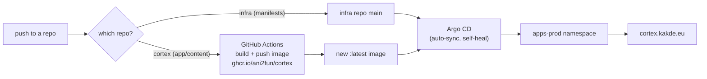

Production is a personal Kubernetes homelab. Unlike local dev (where you start everything by hand), here **nothing is started by hand** — ArgoCD reconciles the cluster to match the `infra` git repo, continuously.

## The four nodes

| Node | Role | Notes |
|---|---|---|
| **ms-1** | K3s **server** (control plane) + admin host | Where `kubectl` and platform installs run. |
| **wk-1** | **Database** worker | Runs the shared PostgreSQL; the wk-1 Ollama model (the tutor's local coach) lives here too. |
| **wk-2** | **GitOps** worker | General workloads. |
| **vm-1** (`ctb-edge-1`) | Public **edge** | A Contabo VPS. Terminates public 80/443 via Traefik; an nftables allowlist blocks everything else. |

They're four Ubuntu 24.04 machines (three at home, one VPS) joined by a **WireGuard mesh**, running **K3s** with **Calico** (CNI), **Traefik** (ingress), **cert-manager** (TLS), **Sealed Secrets**, **PostgreSQL**, **Keycloak**, and **Argo CD**. Here's the substrate as a LikeC4 view:

<iframe
  src="/c4/view/index"
  width="100%"
  height="420"
  style="border: 1px solid var(--border, #2b2b2b); border-radius: 8px;"
  loading="lazy"
  title="Homelab platform — node overview"
></iframe>

## Where Cortex and the Tutor sit

Everything app-side runs in the **`apps-prod`** namespace. The pieces:

| Workload | What | Exposure |
|---|---|---|
| **cortex** | The Scala app (1 replica, `ghcr.io/ani2fun/cortex:latest`) | Public at **cortex.kakde.eu** (Traefik Ingress → edge). |
| **cortex-redis** / **cortex-mongo** | Redis + Mongo for the Hello demo / rate limiter / event log | In-cluster only. |
| **PostgreSQL** | Shared DB in `databases-prod` — Cortex's `visits` + the tutor `tutor` schema | In-cluster only. |
| **go-judge** | Shared sandbox for `/api/run` + the Visualise tracer | In-cluster only; cortex reaches it via a NetworkPolicy. |
| **likec4** | The compiled C4 SPA (these diagrams) | In-cluster only; cortex reverse-proxies `/c4/*` to it. |
| **cortex-tutor** | The Socratic coach (FastAPI) | **Internal ClusterIP** (WIP) — reached by the SPA through cortex's same-origin `/tutor` proxy. |
| **Keycloak** | OIDC at the `apps-prod` realm | Public at **keycloak.kakde.eu**. |

The container view from the [onboarding overview](/cortex/cortex-onboarding/runbooks/overview) is the same boxes; this is *where they live*.

> **One replica, on purpose.** Cortex runs a single replica. The book/blog hot path is served from an in-memory index (no DB), so a single 1-vCPU/1Gi pod is plenty for the real traffic — but it means a pod restart is a brief full outage. The [System Design deep-dive](/cortex/system-design/capstones/cortex-failure-thresholds) quantifies exactly when that matters and what scaling it would take.

## The deployment, in numbers

The production cortex Deployment ([`infra/deploy/apps/cortex/base/deployment.yaml`](https://github.com/ani2fun/infra)) pins the constraints the rest of these runbooks reason about:

- **replicas:** `1`
- **resources:** requests `100m` CPU / `256Mi`; limits `1000m` CPU / `1Gi`
- **probes:** startup + readiness on `/api/health`, liveness as a TCP check on `:8080`
- **env:** `AUTH_ENABLED=true`, `CORTEX_AUTO_RELOAD=false` (content is baked into the image, not re-walked), stores by in-cluster DNS, secrets by `secretKeyRef`
- **securityContext:** all capabilities dropped, `RuntimeDefault` seccomp, no privilege escalation

## How a change reaches the site

Two repos feed production: **cortex** (the app + the books — its CI builds the Docker image and the LikeC4 image) and **infra** (the Kubernetes manifests). ArgoCD watches `infra` and reconciles. The [next runbook](/cortex/cortex-onboarding/runbooks/production/deploy-and-rollback) walks the deploy and the rollback.

> **Next:** [Deploy & rollback](/cortex/cortex-onboarding/runbooks/production/deploy-and-rollback).
