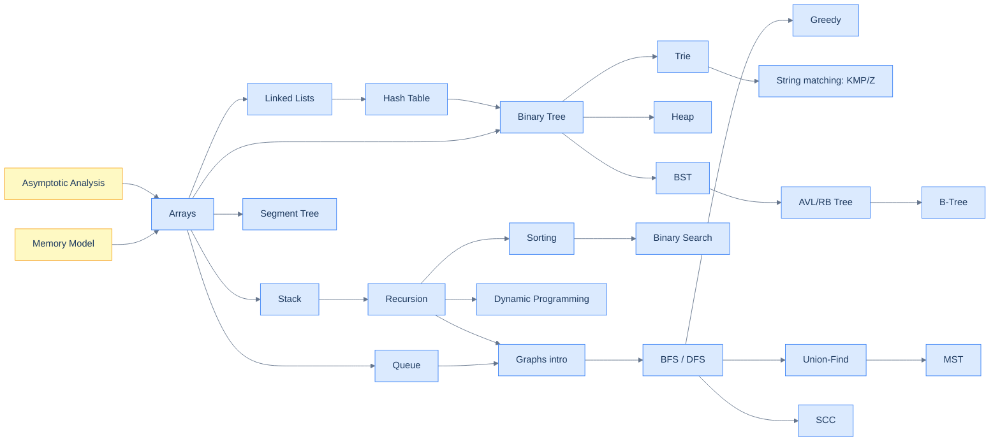

# Data Structures and Algorithms

A curriculum for engineers who want to *understand* how computers store and manipulate information — not just memorise enough to pass an interview. The book starts with the foundations every later chapter assumes (asymptotic analysis, recurrence relations, the memory model), walks through every classical structure and algorithm with worked examples in Python and Java, and ends with a synthesis module showing where each idea lives inside Postgres, Linux, Redis, Git, and other production systems.

The goal is not breadth-as-a-checklist. The goal is for you to be able to **reach for the right structure under pressure**, **derive its complexity from first principles**, and **debug the production version when it goes wrong** — the three things that separate engineers who *use* DSA from engineers who *understand* it.

---

## Reading conventions

- Every chapter opens with a hook, a real-world analogy, and a visual before the formalism.
- Code appears in two runnable tabs: **🐍 Python** (the canonical spec) and **☕ Java** (the port for muscle memory). Click between them; both run inline and their output is what the prose describes.
- Every chapter closes with the takeaways, real-world connections, and a recall set.

---

## Curriculum map

The curriculum is organised as **Modules → Topics → Tutorials**. Each module is a self-contained area you can read top-to-bottom; each tutorial states its prerequisites so you can navigate sideways too.

1. [**Foundations**](/cortex/data-structures-and-algorithms/foundations/index) — asymptotic analysis, recurrence relations, amortised analysis, proof techniques, the memory model.
2. [**Linear Structures**](/cortex/data-structures-and-algorithms/linear-structures/index) — arrays, strings, linked lists, stacks, queues, hash tables.
3. [**Trees**](/cortex/data-structures-and-algorithms/trees/index) — binary trees, BSTs, heaps, tries, balanced BSTs (AVL, RB), B-trees, segment and Fenwick trees, union-find.
4. [**Graphs**](/cortex/data-structures-and-algorithms/graphs/index) — representations, BFS/DFS, shortest paths, MSTs, SCCs, bridges, network flow, 2-SAT.
5. [**Algorithms by Strategy**](/cortex/data-structures-and-algorithms/algorithms-by-strategy/index) — recursion, divide-and-conquer, greedy, backtracking, dynamic programming, randomised algorithms.
6. [**Sorting and Searching**](/cortex/data-structures-and-algorithms/sorting-and-searching/index) — every classical sort and search, plus the patterns that wrap them.
7. [**Strings**](/cortex/data-structures-and-algorithms/strings/index) — KMP, Z-algorithm, Rabin-Karp, suffix arrays and automata, Aho-Corasick.
8. [**Bit Tricks**](/cortex/data-structures-and-algorithms/bit-tricks/index) — the operations that turn linear-time loops into single instructions.
9. [**Probabilistic and Advanced**](/cortex/data-structures-and-algorithms/probabilistic-and-advanced/index) — skip lists, Bloom filters, Count-Min sketch, HyperLogLog, treaps, persistent structures.
10. [**Concurrency and Systems**](/cortex/data-structures-and-algorithms/concurrency-and-systems/index) — CAS, lock-free queues, concurrent hash maps, hazard pointers.
11. [**DSA in Real Systems**](/cortex/data-structures-and-algorithms/dsa-in-real-systems/index) — Postgres B-trees, Linux RB-trees, Redis encodings, Git's DAG, LSM trees, routing tables.

**Appendix:** [**Widget Catalog**](/cortex/data-structures-and-algorithms/appendix-widget-catalog/index) — the authoring reference for the D3.js interactive widgets used throughout this book: one chapter per widget with representative payloads and payload-schema cards.

**Revision:** [**Quick Reference**](/cortex/data-structures-and-algorithms/quick-reference) — a dense, collapsible cheat-sheet of every pattern's intuition, triggers, complexity, and Python skeleton. Built for fast recall, not first reads.

---

## Three reading paths

Pick the one that matches your goal.

### Path A — From scratch (the "younger sibling" path)

You can program in *some* language and want to learn DSA properly for the first time. Walk this in order; don't skip Foundations.

1. Foundations: Asymptotic Analysis → Memory Model.
2. Linear Structures: Arrays → Strings → Linked Lists → Stacks → Queues → Hash Tables.
3. Trees: Binary Tree → BST → Heap.
4. Algorithms by Strategy: Recursion → Backtracking → Sorting (in module 6) → Searching (in module 6) → Dynamic Programming.
5. Bit Tricks.

### Path B — Interview prep (the "junior teammate at FAANG" path)

You can already program competently and need to fill DSA gaps for technical interviews.

1. Foundations: Asymptotic Analysis (only — skip the rest).
2. All of Linear Structures.
3. Trees: Binary Tree → BST → Heap → Trie → Segment Tree.
4. Graphs: Representations → BFS/DFS → Cycle Detection → Topological Sort → Shortest Paths → MSTs → SCCs → Union-Find.
5. Algorithms by Strategy: full DP focus (linear, 2D, interval, bitmask, tree).
6. Sorting and Searching: full module.
7. Strings: KMP → Z → Suffix Array.

### Path C — Self-taught engineer filling gaps

You've been programming for years and know most of this. Use the prerequisite graph below to find the boundary of "stuff I already know" and walk forward from there. Each chapter states its prerequisites in a frontmatter block.

---

## Prerequisite graph

<strong>Yellow nodes are prerequisites every later chapter assumes. Follow an arrow forward to see what builds on what.</strong>

---

## A note on the rebuild

The book is being elevated to senior-engineer quality on the `dsa-qa-improvement` branch. Some chapters listed under each module are still **stubs** — you'll see them flagged in the module index pages. The existing chapters from the prior layout have been preserved and reorganised; their slug paths changed when modules were renamed, so any external bookmarks should be re-derived from the curriculum map above.

Start with [Foundations: Asymptotic Analysis](/cortex/data-structures-and-algorithms/foundations/asymptotic-analysis) if you don't have a strong instinct for what `O(n)` actually means.
