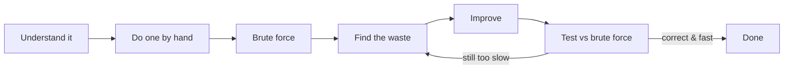

# How to Approach a Problem

## Why It Exists

Soon you'll open a problem and feel nothing — no idea where to start. That blank-page moment happens to everyone, and staring harder never fixes it.

Here's the secret the experts won't say out loud: they don't start with the clever answer either. What they have is a **routine** — a fixed set of moves they run on every problem, that *reliably* turns "no idea" into a working solution. The clever part falls out at the end; it isn't where they begin.

This lesson is that routine. Learn it now and you'll use it on every single problem in this book.

## See It Work

The routine is a loop, not a leap. You don't jump to the answer — you grind toward it in small, safe steps:



<p align="center"><strong>The problem-solving routine: each step feeds the next, and "improve" loops back through "test" until it's fast enough.</strong></p>

## How It Works

Run these moves in order. Each one is safe, and each sets up the next.

- **Understand it** — restate the problem in your own words. What exactly is the input? The output? What are the weird edge cases (empty input, one item, duplicates)?
- **Do one by hand** — work a tiny example on paper. You cannot code a process you can't perform yourself with a pencil.
- **Brute force** — write the dumbest *correct* solution, however slow. This is your baseline and your safety net; never skip it.
- **Find the waste** — look at the brute force and ask: what work does it *repeat* or *throw away*? The speed-up often hides in that wasted work.
- **Improve, then test** — replace the wasteful part, and check your faster version against the brute force on small inputs.

To make this concrete: to sum the numbers `1` to `n`, the brute force adds them one at a time — `n` additions. The waste? It re-derives a total that math already gives in one step: `n × (n + 1) / 2`. Same answer, far less work.

So the core insight is: **you don't *find* the fast solution, you *evolve* it from a correct slow one.**

### Key Takeaway

Always start from a correct brute force, then attack the work it wastes.

## Trace It

Apply the routine to "sum `1` to `n`":

1. **Understand:** input is a number `n`; output is `1 + 2 + … + n`.
2. **By hand:** for `n = 4`, that's `1 + 2 + 3 + 4 = 10`.
3. **Brute force:** loop and add — `n` steps, so `O(n)` time.
4. **Find the waste:** the loop laboriously rebuilds a sum the formula knows directly.
5. **Improve:** use `n × (n + 1) / 2` — `O(1)` time.

Before the next section — how would you *know* the formula is right, and not just right for `n = 4`? Don't trust it; **test it.**

## Your Turn

Apply the routine: implement `smart(n)` — return the sum `1 + 2 + … + n` in `O(1)` time using the closed-form formula instead of a loop. The brute-force loop is already in the editorial for comparison.

```python run viz=array
def smart(n):
    # Your code goes here
    return 0

n = int(input())
print(smart(n))
```

```java run viz=array
import java.util.*;
public class Main {
    static long smart(long n) {
        // Your code goes here
        return 0;
    }
    public static void main(String[] args) {
        Scanner sc = new Scanner(System.in);
        long n = sc.nextLong();
        System.out.println(smart(n));
    }
}
```

```testcases
{
  "args": [
    { "id": "n", "label": "n", "type": "int", "placeholder": "4" }
  ],
  "cases": [
    { "args": { "n": "1" },    "expected": "1" },
    { "args": { "n": "4" },    "expected": "10" },
    { "args": { "n": "10" },   "expected": "55" },
    { "args": { "n": "100" },  "expected": "5050" }
  ]
}
```

`n = 4` gives `1 + 2 + 3 + 4 = 10`; `n = 100` gives `5050` (Gauss's classroom trick). This is the classic "brute force → improve" move: a loop that adds `n` numbers one at a time becomes a single formula.

<details>
<summary><strong>Editorial</strong></summary>

The formula `n × (n + 1) / 2` is Gauss's closed form for the sum of the first `n` natural numbers — `O(1)` time and `O(1)` space. You can stress-test it against the brute-force loop on any `n` you like; they will always agree.

```python solution time=O(1) space=O(1)
def smart(n):
    return n * (n + 1) // 2

n = int(input())
print(smart(n))
```

```java solution
import java.util.*;
public class Main {
    static long smart(long n) {
        return n * (n + 1) / 2;
    }
    public static void main(String[] args) {
        Scanner sc = new Scanner(System.in);
        long n = sc.nextLong();
        System.out.println(smart(n));
    }
}
```

</details>

To see the safety-net habit in action, try changing `smart` to `n * (n + 1)` (drop the `/ 2`) and run a few cases by hand — the bug shows up immediately.

## Reflect & Connect

This routine is the backbone of every problem ahead. Patterns like two pointers and sliding window are all just *named ways of removing waste* from a brute force — which is exactly Step 4. Keep the loop in your head and no problem is truly blank anymore.

**Prerequisites:** [Measuring Cost](/cortex/data-structures-and-algorithms/foundations/measuring-cost) — you judge "improve" in Big-O.
**What's next:** the data structures themselves, starting with the one built directly on the memory model — [arrays](/cortex/data-structures-and-algorithms/linear-structures/arrays/what-is-an-array).

## Recall

> **Mnemonic:** *Understand, by hand, brute force, find the waste, improve, test.*

| Step | The move |
|---|---|
| Understand | restate input / output / edge cases |
| By hand | work a tiny example with a pencil |
| Brute force | dumbest correct solution = your baseline |
| Find the waste | what work is repeated or thrown away? |
| Improve + test | fix the waste; check vs brute force on small inputs |

<details>
<summary><strong>Q:</strong> What's the first code you write for any problem?</summary>

**A:** The brute force — correct, even if slow.

</details>
<details>
<summary><strong>Q:</strong> Where does the speed-up always hide?</summary>

**A:** In the work the brute force repeats or wastes.

</details>
<details>
<summary><strong>Q:</strong> How do you trust a faster solution?</summary>

**A:** Stress-test it against the brute force on many random inputs.

</details>
<details>
<summary><strong>Q:</strong> Why work an example by hand first?</summary>

**A:** You can't code a process you can't perform yourself.

</details>

## Sources & Verify

This lesson is *method*, not fact — but the method is well-worn:

- **Pólya**, *How to Solve It* — the understand → plan → execute → look-back loop this mirrors.
- **cp-algorithms.com**, "Stress testing" — checking a fast solution against a brute-force oracle on random inputs (the habit in *Your Turn*).
- The `n(n+1)/2` claim is Gauss's formula — and the runnable stress test proves it on 1,000 random cases.
