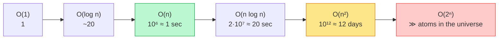

## Why It Exists

Two engineers write `has_duplicate`. The first uses a nested loop — compare every pair. The second uses a hash set — remember what you've seen. Both are eight idiomatic lines; both pass review; both ship. For ten items, both finish in microseconds. For ten million, the first runs for the better part of a day while the second finishes in about a second. The gap isn't 10× or 1000× — it's **the gap between work that finishes and work that doesn't**, and *nothing in the code's length or style reveals it*.

You can't predict that gap by counting microseconds — wall-clock time depends on the language, CPU, cache, and JIT. What you *can* reason about is how the work **grows** as the input `n` grows, independent of all that noise. That's **asymptotic analysis**: count the primitive steps an algorithm takes as a function of `n`, find the term that dominates for large `n`, and put a name on its growth shape (`O(n)`, `O(n²)`, `O(log n)`). It's the most consequential vocabulary in this book — every later claim that some operation is "`O(log n)` average" or "amortized `O(1)`" is built on it. The skill is *seeing the inner loop and predicting the cost without running a benchmark.*

## See It Work

You can't time Big-O reliably (the clock is noisy), but you *can* count steps exactly. Here are three shapes — a single scan, all-pairs, and repeated halving — instrumented to count their primitive operations at growing `n`:

```python run viz=array
def count_linear(n):                 # scan: one step per element     -> O(n)
    steps = 0
    for _ in range(n): steps += 1
    return steps
def count_quadratic(n):              # every pair: nested loop         -> O(n^2)
    steps = 0
    for i in range(n):
        for j in range(i + 1, n): steps += 1
    return steps
def count_logarithmic(n):            # keep halving until 1            -> O(log n)
    steps = 0
    while n > 1: n //= 2; steps += 1
    return steps

print(f"{'n':>6} {'O(n)':>8} {'O(n^2)':>10} {'O(log n)':>10}")
for n in [10, 100, 1000]:
    print(f"{n:>6} {count_linear(n):>8} {count_quadratic(n):>10} {count_logarithmic(n):>10}")
```

```java run viz=array
public class Main {
    static long countLinear(int n) { long s = 0; for (int i = 0; i < n; i++) s++; return s; }            // O(n)
    static long countQuadratic(int n) { long s = 0; for (int i = 0; i < n; i++) for (int j = i + 1; j < n; j++) s++; return s; }  // O(n^2)
    static long countLogarithmic(int n) { long s = 0; while (n > 1) { n /= 2; s++; } return s; }          // O(log n)
    public static void main(String[] a) {
        System.out.printf("%6s %8s %10s %10s%n", "n", "O(n)", "O(n^2)", "O(log n)");
        for (int n : new int[]{10, 100, 1000})
            System.out.printf("%6d %8d %10d %10d%n", n, countLinear(n), countQuadratic(n), countLogarithmic(n));
    }
}
```

Both print the same table: at `n = 10/100/1000` the linear column is `10/100/1000`, the quadratic is `45/4950/499500`, the logarithmic is `3/6/9`. Watch the *growth*, not the numbers: each ×10 in `n` multiplies the linear column by 10, the quadratic column by ~100, and *adds 3* to the logarithmic column. Those three rhythms — scales-with-`n`, scales-with-`n²`, barely-grows — are what "linear," "quadratic," and "logarithmic" mean, read straight off the step counts.

## How It Works

The same handful of growth rates recur everywhere. The goal isn't to memorize the table — it's to *re-derive* any row from the code in front of you — but the ladder is worth feeling:



<p align="center"><strong>The growth-rate hierarchy, evaluated at <code>n = 10⁶</code>. The bottom rungs are the line between "feasible" and "not in this lifetime" — an <code>O(n²)</code> pass over a million items is ~12 days of work.</strong></p>

Three ideas make the analysis rigorous and fast:

- **Big-O is the dominant term, formally.** `f(n) = O(g(n))` means there are constants `c` and `n₀` with `f(n) ≤ c·g(n)` for all `n ≥ n₀` — past some threshold, `f` is no bigger than a constant multiple of `g`. Two consequences trip people up: Big-O **hides constants** (`100n` and `n` are both `O(n)`, though one is 100× slower in wall-clock), and it's an **upper bound, not a tight one** (`n` is also `O(n²)`). When you want "*exactly* this rate," that's `Θ`; `Ω` is the lower bound used in proofs like "comparison sort needs `Ω(n log n)`." The working mantra: **drop constants, drop lower-order terms, keep the dominant term** ([Your Turn](#your-turn)).
- **You derive complexity with three rules, not a cheat sheet.** (1) *Sequential code adds, nested code multiplies* — two loops in a row are `O(n)+O(n)=O(n)`; one inside another is `O(n)·O(n)=O(n²)`. (2) *Drop lower-order terms* — `n + n²` is `O(n²)`. (3) *Recursion becomes a recurrence* — `T(n)=2T(n/2)+n` (split in half, linear work to combine) solves to `O(n log n)`, the subject of the [next chapter](/cortex/data-structures-and-algorithms/foundations-recurrence-relations-and-master-theorem).
- **Every claim must answer "in which case?"** The same algorithm carries different labels for *worst-case* (max over all inputs — the safe default for adversarial input), *average-case* (expected over a distribution — "BST search is `O(log n)`" only *if* keys arrive randomly; sorted keys degrade it to `O(n)`), and *amortized* (long-run average per operation — a dynamic-array push is `O(1)` amortized even though one push in `n` triggers an `O(n)` resize, the subject of the [amortized analysis chapter](/cortex/data-structures-and-algorithms/foundations-amortized-analysis)). Mixing them up is how engineers ship surprises.

> **Key takeaway.** Asymptotic analysis predicts how runtime *scales*: count primitive steps as a function of `n`, keep the **dominant term**, and drop constants and lower-order terms to name the growth class. `O` is an upper bound (hides constants, may be loose); `Θ` is tight; `Ω` is a lower bound. Derive it with three rules — sequential adds, nested multiplies, recursion → recurrence — and always state *which case* (worst / average / amortized). It's a machine-independent prediction of scaling; it deliberately gives up wall-clock precision, so benchmark when constants matter.

## Trace It

Big-O is an *asymptotic* claim — about large `n`. It's easy to forget that the constants it hides can completely flip the ranking for the `n` you actually have.

**Predict before you run:** algorithm A is `O(n)` but does `100·n` steps (a big constant); algorithm B is `O(n²)` but does just `n²` steps. Asymptotically A wins. But for small `n`, which is actually faster — and where does the ranking flip?

```python run viz=array
def cost_100n(n): return 100 * n      # an O(n) algorithm with a BIG constant
def cost_n2(n):   return n * n        # an O(n^2) algorithm with a small constant
print(f"{'n':>6} {'100n':>10} {'n^2':>10} {'faster':>8}")
for n in [10, 50, 100, 200]:
    a, b = cost_100n(n), cost_n2(n)
    print(f"{n:>6} {a:>10} {b:>10} {('n^2' if b < a else '100n' if a < b else 'tie'):>8}")
```

<details>
<summary><strong>Reveal</strong></summary>

For `n = 10` and `n = 50` the **quadratic** algorithm is faster (`100` and `2500` steps vs `1000` and `5000`); they **tie at `n = 100`** (both `10000`); and only from `n = 200` on does the linear algorithm pull ahead (`20000` vs `40000`). The `O(n²)` algorithm is genuinely the better choice below the crossover at `n = 100`, because its smaller constant outweighs the worse growth rate while `n` is small. This is why "asymptotically better" is *not* the same as "faster for my input," and why real libraries hedge: C++'s `std::sort` is *introsort* — quicksort that switches to insertion sort for partitions below ~16 elements, because the simpler algorithm's tiny constants win at small `n`. Big-O tells you who wins *eventually*; only the constants (and a benchmark) tell you who wins at the size you actually run. The discipline is to do the asymptotic analysis first to rule out the disasters, *then* measure constants where they matter.

</details>

## Your Turn

The "drop lower-order terms and constants" rule can feel like cheating — you're throwing away most of the formula. Watch *why* it's justified: track what fraction of the total work the dominant term accounts for as `n` grows.

**Predict:** an algorithm does exactly `3n² + 5n + 7` steps. As `n` grows, what share of the total comes from the `3n²` term alone — does it stay around a fifth, or climb toward all of it?

```python run viz=array
def total_ops(n): return 3*n*n + 5*n + 7    # exact step count of some algorithm
def dominant(n):  return 3*n*n              # just the n^2 term
print(f"{'n':>7} {'3n^2+5n+7':>12} {'3n^2':>12} {'n^2 share':>11}")
for n in [1, 10, 100, 10000]:
    t, d = total_ops(n), dominant(n)
    print(f"{n:>7} {t:>12} {d:>12} {d/t:>11.4f}")
```

```java run viz=array
public class Main {
    static long totalOps(long n) { return 3*n*n + 5*n + 7; }   // exact step count of some algorithm
    static long dominant(long n) { return 3*n*n; }             // just the n^2 term
    public static void main(String[] a) {
        System.out.printf("%7s %12s %12s %11s%n", "n", "3n^2+5n+7", "3n^2", "n^2 share");
        for (long n : new long[]{1, 10, 100, 10000}) {
            long t = totalOps(n), d = dominant(n);
            System.out.printf("%7d %12d %12d %11.4f%n", n, t, d, (double) d / t);
        }
    }
}
```

Both print the `n²` term's share climbing `0.2000 → 0.8403 → 0.9834 → 0.9998` as `n` goes `1 → 10 → 100 → 10000`. At `n = 1` the `5n + 7` terms are most of the work; by `n = 10000` they're 0.02% of it. That's the whole justification for the drop rule: the lower-order terms become a vanishing fraction, so for predicting *scale* they're noise — and even the constant `3` only rescales the curve without changing its shape, which is why `3n² + 5n + 7` is simply `O(n²)`. The rule isn't hand-waving; it's the limit you just watched converge.

## Reflect & Connect

- **Big-O is about shape, not speed.** It hides constants on purpose, to give a portable, machine-independent prediction of how runtime *scales*. When constants matter (tight loops, cache lines, JIT warm-up), do the asymptotic analysis first, then benchmark — not instead.
- **"In which case?" is the question that catches bugs.** "Hash lookup is `O(1)`" is *average*; with every key colliding it's `O(n)`, and an attacker who picks the keys (HashDoS) can force it. State worst / average / amortized explicitly.
- **The drop rule is a real limit.** Lower-order terms become a vanishing share of the total as `n` grows, so keeping only the dominant term loses nothing for predicting scale.
- **This is where the famous incidents live.** The N+1 query loop (one batched `O(n)` query beats `n` round-trips), catastrophic regex backtracking (`(a+)+b` going `O(2ⁿ)` — the Cloudflare and Stack Overflow outages), `x in list` (`O(n)`) vs `x in set` (`O(1)`), `+=` on immutable strings (`O(n²)` — use `StringBuilder`/`"".join()`), and React's Fiber rewrite (`O(n³)` tree-diff → heuristic `O(n)`) are all asymptotic bugs an engineer who *understood* the growth profile saw before it shipped.
- **Everything downstream stands on this.** [Recurrence relations](/cortex/data-structures-and-algorithms/foundations-recurrence-relations-and-master-theorem) solve the recursion case; [amortized analysis](/cortex/data-structures-and-algorithms/foundations-amortized-analysis) formalizes the long-run-average case; and from [arrays](/cortex/data-structures-and-algorithms/linear-structures-arrays-what-is-an-array) on, you'll *derive* every `O(1)` and `O(n)` rather than accept it.

## Recall

<details>
<summary><strong>Q:</strong> What is the formal definition of <code>f(n) = O(g(n))</code>?</summary>

**A:** There exist positive constants `c` and `n₀` such that `f(n) ≤ c·g(n)` for all `n ≥ n₀`. Past the threshold `n₀`, `f` is bounded above by a constant multiple of `g` — an asymptotic *upper* bound.

</details>
<details>
<summary><strong>Q:</strong> Why does <code>3n² + 5n + 7</code> simplify to <code>O(n²)</code>?</summary>

**A:** As `n` grows, the `n²` term's share of the total approaches 1 — the `5n + 7` becomes a vanishing fraction — and the constant `3` only rescales the curve without changing its shape. Drop constants and lower-order terms; keep the dominant term.

</details>
<details>
<summary><strong>Q:</strong> Order slowest- to fastest-growing: <code>O(n!)</code>, <code>O(2ⁿ)</code>, <code>O(n log n)</code>, <code>O(log n)</code>, <code>O(n²)</code>.</summary>

**A:** `O(log n) < O(n log n) < O(n²) < O(2ⁿ) < O(n!)`. At `n = 10⁶`, that's roughly: 20 ops, ~20 sec, ~12 days, and the last two are infeasible.

</details>
<details>
<summary><strong>Q:</strong> An algorithm is <code>O(n²)</code>, a sibling is <code>O(n log n)</code>, and your expected <code>n</code> is 30. Which might you pick?</summary>

**A:** Possibly the `O(n²)` one — asymptotic dominance is a *large-n* claim, and for small `n` the constants can flip the ranking (quicksort beats insertion sort only above `n ≈ 16–50`). Do the asymptotic analysis, then benchmark at the real workload size.

</details>
<details>
<summary><strong>Q:</strong> Why is hash-table lookup not truly <code>O(1)</code> in the worst case?</summary>

**A:** The `O(1)` is *average*, assuming a good hash spreads keys across buckets. If every key collides into one bucket, lookup walks a chain of length `n` → `O(n)`. An adversary who controls the keys can force this (HashDoS); languages mitigate with randomized hash seeds.

</details>

## Sources & Verify

- **CLRS**, *Introduction to Algorithms*, Ch. 3 "Growth of Functions" — the canonical formal treatment of `O`, `Θ`, `Ω`, and the little-letter siblings.
- **Sedgewick & Wayne**, *Algorithms* (4th ed.), §1.4 — the empirical-curve-fitting view: measure a real algorithm's growth and check it matches the predicted class. **Roughgarden**, *Algorithms Illuminated* Part 1, Ch. 2 — a gentler derivation than CLRS.
- The step-count table (`O(n)` ×10, `O(n²)` ×~100, `O(log n)` +3 per decade), the `100n`-vs-`n²` crossover at `n = 100`, and the dominant-term share climbing to `0.9998` all come from the runnable blocks above (exact operation counts, not wall-clock timing, so they're deterministic) — re-run to verify.
