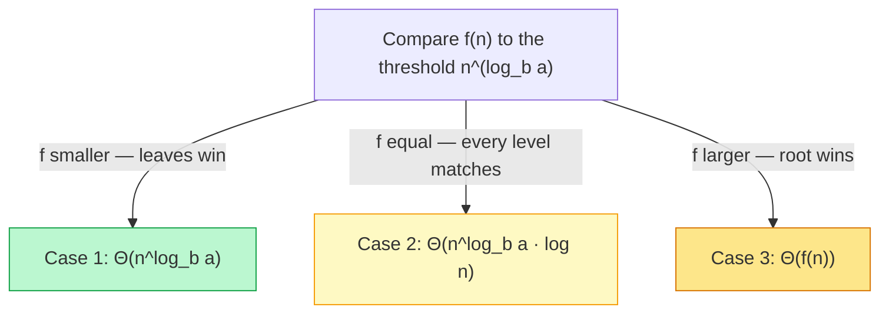

## Why It Exists

How do you *know* merge sort is `O(n log n)`? Read the code and there's no loop running `n log n` times to point at — it splits the array in half, recurses on each half, and merges with one linear pass. The `n log n` is hidden in the *call structure*. The claim isn't a measurement; it's a **theorem**, proved by solving an equation about how the function calls itself:

```
T(n) = 2·T(n/2) + n
```

That's a **recurrence relation**: "sorting `n` elements costs sorting two halves of `n/2`, plus a linear merge." Every divide-and-conquer algorithm has one — quicksort, binary search, Karatsuba multiplication, the FFT, Strassen — and every "this is `O(...)`" you've read about a recursive algorithm is that recurrence solved. This lesson is the solver. The fast path is the **Master theorem**: write the recurrence in the standard form `T(n) = a·T(n/b) + f(n)` (`a` recursive calls, each on size `n/b`, plus `f(n)` work to split and combine), then compare `f(n)` to a single threshold to read off the answer. By the end you'll classify any standard divide-and-conquer recurrence and explain *why* without reaching for a textbook.

## See It Work

The cleanest way to believe `T(n)=2T(n/2)+n` solves to `n log n` is to *count*. This instruments merge sort to tally its total merge work (one unit per element placed) and its recursion depth — deterministically, no clock:

```python run viz=array
import math
work = 0; max_depth = 0
def merge_sort(a, depth=0):
    global work, max_depth
    max_depth = max(max_depth, depth)
    if len(a) <= 1: return a
    mid = len(a) // 2
    left = merge_sort(a[:mid], depth + 1)
    right = merge_sort(a[mid:], depth + 1)
    out, i, j = [], 0, 0
    while i < len(left) and j < len(right):       # each element placed = 1 unit of merge work
        work += 1
        if left[i] <= right[j]: out.append(left[i]); i += 1
        else: out.append(right[j]); j += 1
    while i < len(left): out.append(left[i]); i += 1; work += 1
    while j < len(right): out.append(right[j]); j += 1; work += 1
    return out

print(f"{'n':>6} {'merge work':>11} {'depth':>6} {'n*log2(n)':>10}")
for n in [8, 16, 32]:
    work = 0; max_depth = 0
    merge_sort(list(range(n, 0, -1)))             # reverse-sorted: deterministic
    print(f"{n:>6} {work:>11} {max_depth:>6} {int(n * math.log2(n)):>10}")
```

```java run viz=array
import java.util.*;
public class Main {
    static long work = 0;
    static int maxDepth = 0;
    static int[] mergeSort(int[] a, int depth) {
        if (depth > maxDepth) maxDepth = depth;
        if (a.length <= 1) return a;
        int mid = a.length / 2;
        int[] left = mergeSort(Arrays.copyOfRange(a, 0, mid), depth + 1);
        int[] right = mergeSort(Arrays.copyOfRange(a, mid, a.length), depth + 1);
        int[] out = new int[a.length]; int i = 0, j = 0, k = 0;
        while (i < left.length && j < right.length) { work++; if (left[i] <= right[j]) out[k++] = left[i++]; else out[k++] = right[j++]; }
        while (i < left.length) { out[k++] = left[i++]; work++; }
        while (j < right.length) { out[k++] = right[j++]; work++; }
        return out;
    }
    public static void main(String[] x) {
        System.out.printf("%6s %11s %6s %10s%n", "n", "merge work", "depth", "n*log2(n)");
        for (int n : new int[]{8, 16, 32}) {
            work = 0; maxDepth = 0;
            int[] a = new int[n]; for (int i = 0; i < n; i++) a[i] = n - i;   // reverse-sorted
            mergeSort(a, 0);
            int lg = 0; for (int t = n; t > 1; t >>= 1) lg++;                  // exact log2 for powers of 2
            System.out.printf("%6d %11d %6d %10d%n", n, work, maxDepth, (long) n * lg);
        }
    }
}
```

Both print merge work of `24 / 64 / 160` at `n = 8 / 16 / 32` — *exactly* `n·log₂n` — and a recursion depth of `3 / 4 / 5` = `log₂n`. That's the recurrence made visible: there are `log n` levels of recursion, and each level's merges touch all `n` elements once, so the total is `n × log n`. The `n log n` was never in a single loop — it's the product of the tree's *height* and its *per-level work*.

## How It Works

The recursion tree explains everything, and the Master theorem packages it into one comparison:



<p align="center"><strong>The Master theorem in one picture: the threshold <code>n^(log_b a)</code> is the work the leaves do; compare <code>f(n)</code> (the root's work) against it, and whoever dominates names the answer.</strong></p>

- **The standard form and its threshold.** `T(n) = a·T(n/b) + f(n)`: `a ≥ 1` recursive calls, each on size `n/b` (`b > 1`), plus `f(n)` non-recursive work. The recursion tree has `log_b n` levels; level `k` holds `a^k` nodes of size `n/b^k`. The **threshold** `n^(log_b a)` is the total work at the leaf level — it's the count of leaves. The whole question is whether the root's work `f(n)` or the leaves' work `n^(log_b a)` dominates the sum.
- **The three cases.** Compare `f(n)` to `n^(log_b a)`: **Case 1** — `f` is polynomially *smaller*, the leaves dominate, `T(n) = Θ(n^(log_b a))`. **Case 2** — they *match*, every level does equal work, `T(n) = Θ(n^(log_b a) · log n)` (this is merge sort: `a=b=2`, threshold `n¹=n`, `f(n)=n` → `Θ(n log n)`). **Case 3** — `f` is polynomially *larger*, the root dominates (a geometric series summing to `Θ(f(n))`). Binary search `T(n)=T(n/2)+1` is Case 2 with threshold `n⁰=1` → `Θ(log n)`; Karatsuba `T(n)=3T(n/2)+n` is Case 1 (threshold `n^1.585 > n`) → `Θ(n^1.585)`, beating schoolbook `n²`.
- **Where it stops, and the fallbacks.** The Master theorem needs the standard form. *Subtractive* recurrences like worst-case quicksort `T(n)=T(n-1)+n` don't fit — the recursion tree gives `n + (n-1) + … + 1 = Θ(n²)` directly. A *polylog gap* like `T(n)=2T(n/2)+n log n` falls between cases 2 and 3 (`Θ(n log² n)`). *Unbalanced* splits like `T(n)=T(n/3)+T(2n/3)+n` need the recursion tree (still `Θ(n log n)`, since every level totals `n` and paths are `O(log n)` long) or the **Akra-Bazzi** theorem. Rule of thumb: recursion-tree to build intuition, Master theorem when it fits, Akra-Bazzi when you need to publish.

> **Key takeaway.** A recurrence `T(n) = a·T(n/b) + f(n)` encodes a divide-and-conquer algorithm's cost; the **Master theorem** solves it by comparing `f(n)` (the root's work) to the threshold `n^(log_b a)` (the leaves' work). Leaves win → **Case 1** `Θ(n^(log_b a))`; tie → **Case 2** `Θ(n^(log_b a) log n)`; root wins → **Case 3** `Θ(f(n))`. It's fast and mechanical but only for balanced, polynomial-`f` recurrences — subtractive, unbalanced, or polylog-gapped ones fall back to the recursion tree or Akra-Bazzi. The case is decided by *where the work lives in the tree*.

## Trace It

The Master theorem's whole trick is that one comparison decides the answer. Let's run that comparison on three recurrences that look almost identical.

**Predict before you run:** all three have `a = 2, b = 2`, so the threshold is `n^(log₂2) = n¹`. They differ only in `f(n)`: `2T(n/2)+1` (constant combine), `2T(n/2)+n` (linear), `2T(n/2)+n²` (quadratic). Which Master case does each fall into?

```python run viz=array
import math
recs = [(2, 2, 0, "2T(n/2)+1"), (2, 2, 1, "2T(n/2)+n"), (2, 2, 2, "2T(n/2)+n^2")]
print(f"{'recurrence':>13} {'thr=n^?':>8} {'f=n^?':>6} {'case':>5}")
for a, b, fk, name in recs:
    thr = math.log(a, b)                          # threshold exponent log_b(a)
    case = 1 if fk < thr - 1e-9 else (2 if abs(fk - thr) < 1e-9 else 3)
    print(f"{name:>13} {thr:>8.0f} {fk:>6} {case:>5}")
```

<details>
<summary><strong>Reveal</strong></summary>

The threshold exponent is `1` for all three (`log₂2 = 1`), and the cases come out **1, 2, 3** in order. `2T(n/2)+1`: `f = n⁰` is below the threshold `n¹`, so the leaves dominate → **Case 1**, `Θ(n)`. `2T(n/2)+n`: `f = n¹` *matches* the threshold, every level does equal work → **Case 2**, `Θ(n log n)` (merge sort). `2T(n/2)+n²`: `f = n²` is above the threshold, the root dominates → **Case 3**, `Θ(n²)`. Three recurrences with the *same* branching structure (`a=2, b=2`) land in three different complexity classes purely because of how much combine-work `f(n)` each does. That's the lesson the Master theorem compresses into one comparison: the branching sets the threshold, and `f(n)`'s position relative to it picks the winner. Notice the leverage — doubling the recursive calls (changing `a`) moves the threshold and can flip a Case-3 recurrence into Case 1, which is exactly the Karatsuba/Strassen story: they *add* a sub-multiplication to lower `f`'s relative weight and beat the naive algorithm.

</details>

## Your Turn

The case names ("leaves win," "root wins") are claims about the *shape* of the work across recursion-tree levels. Let's compute that shape directly: total work at each level, for a balanced recurrence vs a top-heavy one.

**Predict:** for `2T(n/2)+n` (combine work = node size) the per-level totals are... and for `2T(n/2)+n²` (combine = size²) they are...? One profile is flat across levels, the other decreases from root to leaves — which is which?

```python run viz=array
def work_per_level(n, f_exp):        # f(n)=n^f_exp; total work at each recursion-tree level
    out = []; k = 0; size = n
    while size >= 1:
        out.append((2 ** k) * (size ** f_exp))    # 2^k nodes, each of size n/2^k
        size //= 2; k += 1
    return out

n = 16
print("balanced  2T(n/2)+n    (f=n)  :", work_per_level(n, 1), "-> flat: every level = n")
print("top-heavy 2T(n/2)+n^2  (f=n^2):", work_per_level(n, 2), "-> geometric: root dominates")
```

```java run viz=array
import java.util.*;
public class Main {
    static List<Long> workPerLevel(int n, int fExp) {     // f(n)=n^fExp; total work at each level
        List<Long> out = new ArrayList<>(); int k = 0, size = n;
        while (size >= 1) {
            long nodes = 1L << k;
            long perNode = (fExp == 2) ? (long) size * size : size;
            out.add(nodes * perNode);                      // 2^k nodes, each of size n/2^k
            size /= 2; k++;
        }
        return out;
    }
    public static void main(String[] x) {
        System.out.println("balanced  2T(n/2)+n    (f=n)  : " + workPerLevel(16, 1) + " -> flat: every level = n");
        System.out.println("top-heavy 2T(n/2)+n^2  (f=n^2): " + workPerLevel(16, 2) + " -> geometric: root dominates");
    }
}
```

Both print `[16, 16, 16, 16, 16]` for the balanced recurrence and `[256, 128, 64, 32, 16]` for the top-heavy one. The balanced profile is **flat** — every level totals `n = 16`, because the `2^k` nodes each shrink exactly as fast as they multiply (`2^k · n/2^k = n`); summed over `log n + 1` levels that's `Θ(n log n)`, Case 2. The top-heavy profile **halves each level** — a geometric series `256 + 128 + … ` dominated by its first term, the root's `256 = n²`; summed it's `Θ(n²)`, Case 3, where the recursive work is asymptotically free. The Master case is just a name for which way this profile tilts: flat (Case 2), bottom-heavy toward the leaves (Case 1), or top-heavy toward the root (Case 3).

## Reflect & Connect

- **The recurrence is the proof.** "Merge sort is `O(n log n)`" is a theorem about its call structure, not a measurement. The recurrence `T(n)=2T(n/2)+n` solved is the proof — and it's what lets you stand by the claim under load six months later.
- **One comparison decides the case.** Match `f(n)` against the threshold `n^(log_b a)`: smaller → leaves win (Case 1), equal → balanced (Case 2), larger → root wins (Case 3). The branching `(a, b)` sets the threshold; `f`'s position picks the winner.
- **Adding recursive calls can lower complexity.** Karatsuba (`3T(n/2)+n`) and Strassen (`7T(n/2)+n²`) *add* sub-problems to push `f` below the threshold and land in Case 1 — beating schoolbook `n²` and cubic matrix multiply. CPython's big-int multiply and BLAS libraries switch to them above a size cutoff.
- **Know the boundaries.** Subtractive (`T(n-1)+n` → `Θ(n²)`), polylog-gap (`2T(n/2)+n log n` → `Θ(n log² n)`), and unbalanced (`T(n/3)+T(2n/3)+n`) recurrences need the recursion tree or Akra-Bazzi, not the Master theorem.
- **It underpins the strategy chapters.** Every [divide-and-conquer](/cortex/data-structures-and-algorithms/algorithms-by-strategy/divide-and-conquer/introduction-to-divide-and-conquer) algorithm, the `Θ(n log n)` [sorting](/cortex/data-structures-and-algorithms/sorting-and-searching/sorting/merge-sort) lower bound, and the FFT all cite this theorem. Next: [amortized analysis](/cortex/data-structures-and-algorithms/foundations/amortized-analysis) extends cost reasoning to operations whose per-call cost varies.

## Recall

<details>
<summary><strong>Q:</strong> What is the standard form of a divide-and-conquer recurrence, and what does each symbol mean?</summary>

**A:** `T(n) = a·T(n/b) + f(n)`, where `a ≥ 1` is the number of recursive calls, `b > 1` is the factor each call shrinks the input by, and `f(n)` is the non-recursive work to split the problem and combine the results.

</details>
<details>
<summary><strong>Q:</strong> How does the Master theorem pick a case?</summary>

**A:** Compare `f(n)` to the threshold `n^(log_b a)` (the leaf-level work). `f` polynomially smaller → Case 1, `Θ(n^(log_b a))` (leaves win). `f` equal → Case 2, `Θ(n^(log_b a)·log n)` (every level matches). `f` polynomially larger → Case 3, `Θ(f(n))` (root wins).

</details>
<details>
<summary><strong>Q:</strong> Which case is merge sort, and which is binary search?</summary>

**A:** Merge sort `T(n)=2T(n/2)+n`: `a=b=2`, threshold `n¹`, `f(n)=n` matches → Case 2 → `Θ(n log n)`. Binary search `T(n)=T(n/2)+1`: `a=1, b=2`, threshold `n⁰=1`, `f(n)=1` matches → Case 2 → `Θ(log n)`.

</details>
<details>
<summary><strong>Q:</strong> Why does `T(n)=T(n-1)+n` give `Θ(n²)` while `T(n)=2T(n/2)+n` gives `Θ(n log n)`, though both do `n` work per call?</summary>

**A:** The subtractive recurrence has `n` levels, each doing roughly linear work → `n + (n-1) + … + 1 = Θ(n²)`. The halving recurrence has only `log n` levels, each totalling `n` → `Θ(n log n)`. The number of levels (`n` vs `log n`) is the difference.

</details>
<details>
<summary><strong>Q:</strong> When should you use the recursion-tree method instead of the Master theorem?</summary>

**A:** When the recurrence isn't standard form (subtractive, unbalanced, or polylog-gapped), or when you want intuition about *where* the work lives (top-heavy / balanced / leaf-heavy) — or as a spot-check, since the Master theorem hides the tree geometry behind a one-line answer.

</details>

## Sources & Verify

- **CLRS**, *Introduction to Algorithms*, Ch. 4 "Divide-and-Conquer" — the canonical proof of the Master theorem plus the recursion-tree and substitution methods with full algebra.
- **Akra & Bazzi** (1998) — the generalization handling uneven splits and polylog factors (the [Wikipedia summary](https://en.wikipedia.org/wiki/Akra%E2%80%93Bazzi_method) is enough for working use). **Strassen** (1969) — four pages that shaved a third off matrix multiplication, a Master-theorem Case-1 result in the wild.
- The merge-work count (exactly `n·log₂n`) with depth `log₂n`, the three-case classification (Case 1/2/3 for `2T(n/2)+1`/`+n`/`+n²`), and the per-level work profiles (flat `[16,16,…]` vs geometric `[256,128,…]`) all come from the runnable blocks above (exact operation counts, deterministic) — re-run to verify.
