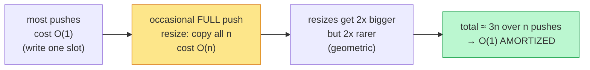

## Why It Exists

Push a million items into a Python `list` and time each push: almost all take ~20 nanoseconds, but roughly one in `n` is *catastrophically* slow — it allocates a bigger buffer, copies every existing element across, and frees the old one. From the inside it looks like the world's most unreliable structure; from the outside — the average over a million pushes — it's effortlessly fast. How do you make that *rigorous*?

Neither standard tool fits. **Worst case** describes the most expensive single operation, which is the `O(n)` resize — too pessimistic. **Average case** describes the expected cost over a random *input distribution*, but there's no distribution here; the same structure is hit by the same caller. The tool that fits is **amortized cost**: the total cost of a sequence of `n` operations divided by `n`, taken in the *worst case over all sequences*. It's not a probabilistic claim and not a per-operation guarantee — it's a worst-*sequence* average, and an adversary can't indict the structure with one expensive op; they'd have to make the whole sequence expensive, which for these designs is impossible. This is the proof behind `list.append`, `ArrayList.add`, `vector::push_back`, and every `append` in Go advertising `O(1)`.

## See It Work

The claim "amortized `O(1)`" for a doubling array rests on one fact: the *total* copying work over `n` pushes is linear, not quadratic. Count the copies directly:

```python run viz=array
def total_copies(n):                 # doubling dynamic array: count element-copies over n pushes
    cap, size, copies = 1, 0, 0
    for _ in range(n):
        if size == cap:              # full -> allocate 2x and copy everything across
            copies += size
            cap *= 2
        size += 1
    return copies

print(f"{'n':>6} {'copies':>8} {'copies/n':>9} {'2n (bound)':>11}")
for n in [16, 17, 1024, 1025]:
    c = total_copies(n)
    print(f"{n:>6} {c:>8} {c/n:>9.3f} {2 * n:>11}")
```

```java run viz=array
public class Main {
    static long totalCopies(int n) {                 // doubling array: count element-copies over n pushes
        long cap = 1, size = 0, copies = 0;
        for (int i = 0; i < n; i++) {
            if (size == cap) { copies += size; cap *= 2; }   // full -> allocate 2x, copy across
            size++;
        }
        return copies;
    }
    public static void main(String[] x) {
        System.out.printf("%6s %8s %9s %11s%n", "n", "copies", "copies/n", "2n (bound)");
        for (int n : new int[]{16, 17, 1024, 1025}) {
            long c = totalCopies(n);
            System.out.printf("%6d %8d %9.3f %11d%n", n, c, (double) c / n, 2 * n);
        }
    }
}
```

Both print the same table: total copies of `15 / 31 / 1023 / 2047` at `n = 16 / 17 / 1024 / 1025`, and crucially the `copies/n` column never exceeds **2** (`0.938`, `1.824`, `0.999`, `1.997`). The ratio oscillates — it's near 1 just before a resize and near 2 just after — but it's *bounded by a constant* no matter how large `n` gets. That's amortized `O(1)`: the per-push copying cost averages to at most 2, because the resize costs form the geometric series `1 + 2 + 4 + … ≤ 2n`, not the `n²` you'd fear from "every push might copy everything."

## How It Works

Three proof methods all deliver that bound; they give the same number but differ in which proof writes itself:



<p align="center"><strong>The push-cost pattern: cheap writes punctuated by ever-rarer resize spikes. Because each spike is twice as big but twice as rare, the total stays linear and the per-push average stays constant.</strong></p>

- **Aggregate** — sum it, divide by `n`. The `n` pushes cost `n` for the writes; the resizes cost `1 + 2 + 4 + … + 2^⌊log n⌋ ≤ 2n`. Total `≤ 3n`, so `3n / n = 3 = O(1)` ([See It](#see-it-work)). The most concrete method, but it gives one blended average.
- **Accounting (banker's)** — overcharge cheap ops and bank the surplus to pay for expensive ones. Charge each push `3`: `1` to place the element now, `2` banked. When a resize copies `cap` elements, the `cap/2` elements pushed since the last resize have each banked `2` = `cap` credits, exactly covering the copy. The bank never goes negative — which is the whole proof, and which you can *watch* break if you undercharge ([Your Turn](#your-turn)).
- **Potential** — define a function `Φ(D)` of the structure's state; amortized cost = actual cost + `ΔΦ`. With `Φ = 2·(size − capacity/2)`, a cheap push has `ΔΦ = 2` (amortized `1+2 = 3`) and a resize push has `ΔΦ = 2 − capacity` (amortized `(capacity+1) + (2−capacity) = 3`). Same answer, most powerful, most opaque — the "right" `Φ` is what cleverness looks like in algorithm analysis (splay trees and Fibonacci heaps need it). The binary counter is the other textbook case: incrementing flips bit `i` every `2^i` steps, so `n` increments flip `≤ 2n` bits total — `O(1)` amortized, same geometric decay.

> **Key takeaway.** Amortized cost is the **total cost of a sequence of `n` operations, divided by `n`, worst-case over all sequences** — the right tool when most ops are cheap but a few are `O(n)`. Prove it three ways: **aggregate** (sum and divide), **accounting** (overcharge cheap ops, bank credit for the expensive ones, keep the bank ≥ 0), or **potential** (actual cost + `ΔΦ`). The line is **geometric growth**: a dynamic array that *doubles* (or grows by any factor > 1) is `O(1)` amortized because resize costs sum to `≤ 2n`; growing by a fixed `+k` makes it `O(n)`.

## Trace It

The "geometric growth is the line" claim is worth seeing fail. The *only* difference between an `O(1)`-amortized array and an `O(n)`-amortized one is how much capacity each resize adds.

**Predict before you run:** a doubling array (`cap × 2` on resize) vs a grow-by-one array (`cap + 1` on resize), both over `n` pushes. The doubling array's total copies grow linearly. The grow-by-one array's total copies grow... also linearly, or quadratically?

```python run viz=array
def copies(n, double):
    cap, size, c = 1, 0, 0
    for _ in range(n):
        if size == cap:
            c += size
            cap = cap * 2 if double else cap + 1     # DOUBLE vs grow by ONE slot
        size += 1
    return c

print(f"{'n':>6} {'doubling':>9} {'grow+1':>9} {'n(n-1)/2':>9}")
for n in [16, 64, 256]:
    print(f"{n:>6} {copies(n, True):>9} {copies(n, False):>9} {n * (n - 1) // 2:>9}")
```

<details>
<summary><strong>Reveal</strong></summary>

The doubling column is `15 / 63 / 255` — linear in `n` (always `< 2n`), so amortized `O(1)` per push. The grow-by-one column is `120 / 2016 / 32640`, which *exactly* matches `n(n−1)/2` — **quadratic**, so amortized `O(n)` per push. The reason: when you grow by a fixed amount, the array fills up again after a *constant* number of pushes, so it resizes almost every push, and each resize copies a steadily-growing array → `0 + 1 + 2 + … + (n−1) = n(n−1)/2`. Doubling instead buys an *exponentially* growing runway between resizes, so the resize count is only `log n` and their geometric cost sums to `≤ 2n`. This is the single most important design decision in a dynamic array, and it's why every production implementation grows by a *factor* (Python ~1.125×, Java 1.5×, C++/Go 2×), never by a constant. The amortized bound isn't a property of "dynamic arrays" — it's a property of *geometric* growth specifically.

</details>

## Your Turn

The accounting method's whole argument is one invariant: **the credit bank never goes negative.** If it does, the analysis is a lie. Let's test the canonical charge of 3 credits per push — and an undercharge of 2 — and watch the bank.

**Predict:** charging 3 per push (1 to place + 2 banked) is supposed to cover every resize. Does charging only 2 also work, or does the bank go negative somewhere?

```python run viz=array
def accounting(n, charge):           # accounting method: charge fixed credits/push, bank the surplus
    cap, size, bank, min_bank = 1, 0, 0, 0
    for _ in range(n):
        bank += charge               # 1. charge this push
        if size == cap:              # 2. resize copies `size` elements -> spend `size` credits
            bank -= size
            cap *= 2
        bank -= 1                    # 3. pay 1 to place the new element
        size += 1
        min_bank = min(min_bank, bank)
    return min_bank

for charge in [3, 2]:
    lo = accounting(1000, charge)
    print(f"charge={charge}/push -> lowest bank balance ever = {lo:>5}  (stays >= 0? {lo >= 0})")
```

```java run viz=array
public class Main {
    static long accounting(int n, int charge) {       // charge fixed credits/push, bank the surplus
        long cap = 1, size = 0, bank = 0, minBank = 0;
        for (int i = 0; i < n; i++) {
            bank += charge;                            // 1. charge this push
            if (size == cap) { bank -= size; cap *= 2; } // 2. resize spends `size` credits
            bank -= 1; size++;                         // 3. pay 1 to place the new element
            minBank = Math.min(minBank, bank);
        }
        return minBank;
    }
    public static void main(String[] x) {
        for (int charge : new int[]{3, 2}) {
            long lo = accounting(1000, charge);
            System.out.println("charge=" + charge + "/push -> lowest bank balance ever = " + lo + "  (stays >= 0? " + (lo >= 0) + ")");
        }
    }
}
```

Both print: `charge=3` → lowest balance **0** (stays ≥ 0 ✓), and `charge=2` → lowest balance **−510** (goes negative ✗). Charging 3 is exactly enough — the bank skims down to 0 right after the biggest resize and never dips below, which is the accounting method's proof that amortized cost ≤ 3 = `O(1)`. Charging only 2 leaves the bank `510` credits short by the time the array has grown to ~1000: the cheap pushes didn't save enough to cover the copies, so the "amortized O(1)" claim would be false at charge 2. The magic number 3 isn't arbitrary — it's `1` (place the new element) + `2` (each new element banks enough to move *itself and one older element* at the next resize). Watch the bank, and the proof stops being abstract.

## Reflect & Connect

- **Amortized = worst-sequence average.** Not "average over inputs," not "every op is fast." The total cost over `n` ops, divided by `n`, in the worst case — an adversary can't indict you with one slow op.
- **Three methods, same number.** Aggregate (sum ÷ n), accounting (bank credits, stay ≥ 0), potential (actual + `ΔΦ`). Pick whichever proof writes itself; the binary counter and dynamic array fit aggregate/accounting, splay trees and Fibonacci heaps need potential.
- **Geometric growth is the dividing line.** Doubling → `≤ 2n` total copies → `O(1)`; `+k` → `n(n−1)/2` copies → `O(n)`. Every production dynamic array grows by a factor for exactly this reason; shrink only at *quarter*-full to avoid resize oscillation.
- **Amortized ≠ tail latency.** It bounds *throughput*, not the worst single op. A splay tree is `O(log n)` amortized but `O(n)` worst-case per access — fine for batch work, a trap for real-time. That's why the [CFS scheduler](/cortex/data-structures-and-algorithms/dsa-in-real-systems/linux-red-black-tree-in-the-cfs-scheduler) uses a red-black tree (worst-case `O(log n)`), not a splay tree.
- **It's everywhere.** [Dynamic arrays](/cortex/data-structures-and-algorithms/linear-structures/arrays/dynamic-arrays) (`append`), [hash tables](/cortex/data-structures-and-algorithms/linear-structures/hash-table/what-is-a-hash-table) (rehash at a load-factor threshold), and Fibonacci heaps (`decrease-key`) all advertise `O(1)`/`O(log n)` on the strength of an amortized argument. The constant factor on the resize comes from the [memory hierarchy](/cortex/data-structures-and-algorithms/foundations/memory-model-and-cache) — the next lesson.

## Recall

<details>
<summary><strong>Q:</strong> Define amortized cost in one sentence.</summary>

**A:** The total cost of any sequence of `n` operations divided by `n`, taken in the worst case over all sequences of length `n`. It's a worst-*sequence* average — neither a probabilistic (average-case) claim nor a per-operation (worst-case) guarantee.

</details>
<details>
<summary><strong>Q:</strong> Why is a doubling dynamic array's push `O(1)` amortized when one push in `log n` is `O(n)`?</summary>

**A:** The resize costs form a geometric series `1 + 2 + 4 + … + n ≤ 2n`, so total work over `n` pushes is `O(n)` and the per-push average is constant. The expensive resizes get twice as big but twice as rare.

</details>
<details>
<summary><strong>Q:</strong> What are the three methods of amortized analysis?</summary>

**A:** Aggregate (compute total cost of `n` ops, divide by `n`), accounting/banker's (overcharge cheap ops, bank credits, spend them on expensive ops, keep the bank ≥ 0), and potential (amortized cost = actual cost + change in a potential function `Φ`). All three give the same bound.

</details>
<details>
<summary><strong>Q:</strong> Why does growing a dynamic array by a fixed `+k` ruin the amortized bound?</summary>

**A:** It refills after a constant number of pushes, so it resizes nearly every push, and the copies sum to `1 + 2 + … + n = Θ(n²)` → `O(n)` amortized per push. Only *geometric* growth (factor > 1) gives `O(1)`. (Also: shrink only at quarter-full, or pop/push at the half boundary oscillates.)

</details>
<details>
<summary><strong>Q:</strong> When is amortized analysis the wrong tool?</summary>

**A:** When tail latency matters. Amortized bounds throughput (total work over a sequence) but lets one operation be `O(n)`. Real-time systems (schedulers, audio, flight control) need worst-case bounds — which is why they pick red-black trees over splay trees despite the same amortized cost.

</details>

## Sources & Verify

- **CLRS**, *Introduction to Algorithms*, Ch. 17 "Amortized Analysis" — the canonical treatment of all three methods, with the dynamic-array and binary-counter examples this lesson mirrors.
- **Tarjan** (1985), "Amortized Computational Complexity" — introduced the potential method as a general tool; **Sleator & Tarjan** (1985), "Self-Adjusting Binary Search Trees" — the splay-tree potential argument. Production growth factors live in CPython's `listobject.c` (`list_resize`) and Go's `runtime/slice.go` (`growslice`).
- The copy counts (`≤ 2n`, ratio always `< 2`), the doubling-vs-grow-by-one contrast (linear `255` vs quadratic `32640 = n(n−1)/2`), and the accounting bank (charge 3 → min 0; charge 2 → min −510) all come from the runnable blocks above (exact operation counts, deterministic) — re-run to verify.
