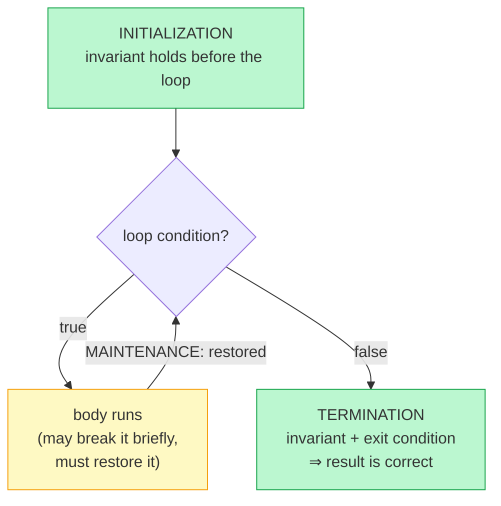

## Why It Exists

You write a binary search. It works on `[1,2,3,4,5]`, on `[5]`, on `[]`. You ship it. Three weeks later it silently returns the wrong index for some query on a million-element array — a corner case you never tested. A handful of unit tests cover *finitely* many inputs; production sees the *infinitely* many you didn't try. That gap — between "works on the cases I ran" and "works on all cases" — is what proof techniques close.

This is the engineer's-eye view of proof, not the lemma-axiom-theorem version: you stare at a piece of code, write down what's true at the top of every loop iteration, and argue from it that the code is correct on *every* input. Three tools do the work. **Induction** proves a claim with repeating structure (a loop, a counter, a recursive call) by chaining a base case to a step. **Contradiction** proves impossibility or uniqueness by assuming the opposite and breaking the world. And **loop invariants** — the one you'll actually use in code review — prove "this code returns the right answer" with a condition you can write as a comment. The pay-off is concrete: the binary-search midpoint `(lo + hi) / 2` overflowed for large arrays and shipped broken in Java's standard library for *nine years*; the idiom `lo + (hi - lo) / 2` is the version a loop-invariant argument forces. Every hard bug you fix is a place the code drifted from the invariant its author *thought* held.

## See It Work

A loop invariant is just a condition true at the top of every iteration. Make it executable — check it on each pass — and "the loop is correct" stops being a hope. Here's a running-max loop with its invariant verified at every step:

```python run viz=array
import ast

def find_max(arr):
    best = arr[0]; held = True
    for i in range(1, len(arr)):
        # Loop invariant: best == max(arr[0..i-1]) at the top of each iteration
        if best != max(arr[:i]): held = False
        if arr[i] > best: best = arr[i]
    return best, held

arr = ast.literal_eval(input())
best, held = find_max(arr)
print(f"max: {best} | invariant held at every step: {'true' if held else 'false'}")
```

```java run viz=array
import java.util.*;
public class Main {
    static int findMax(int[] arr) {
        int best = arr[0]; boolean held = true;
        for (int i = 1; i < arr.length; i++) {
            int m = arr[0]; for (int k = 1; k < i; k++) m = Math.max(m, arr[k]);  // max(arr[0..i-1])
            if (best != m) held = false;        // loop invariant: best == max(arr[0..i-1])
            if (arr[i] > best) best = arr[i];
        }
        System.out.println("max: " + best + " | invariant held at every step: " + held);
        return best;
    }
    static int[] parseArr(String s) {
        s = s.trim().replaceAll("[\\[\\]]", "");
        String[] parts = s.split(",");
        int[] a = new int[parts.length];
        for (int i = 0; i < parts.length; i++) a[i] = Integer.parseInt(parts[i].trim());
        return a;
    }
    public static void main(String[] args) {
        Scanner sc = new Scanner(System.in);
        findMax(parseArr(sc.nextLine()));
    }
}
```

```testcases
{
  "args": [
    { "id": "arr", "label": "array", "type": "array", "placeholder": "[3, 1, 4, 1, 5, 9, 2, 6]" }
  ],
  "cases": [
    { "args": { "arr": "[3, 1, 4, 1, 5, 9, 2, 6]" }, "expected": "max: 9 | invariant held at every step: true" },
    { "args": { "arr": "[5, 3, 7, 2]" },              "expected": "max: 7 | invariant held at every step: true" },
    { "args": { "arr": "[1]" },                        "expected": "max: 1 | invariant held at every step: true" },
    { "args": { "arr": "[10, 9, 8, 7]" },              "expected": "max: 10 | invariant held at every step: true" }
  ]
}
```

Both print `max: 9 | invariant held at every step: true`. The invariant "`best == max(arr[0..i-1])`" is true before the loop (it's `arr[0]`, the max of a one-element prefix), and the body preserves it: after considering `arr[i]`, `best` is the max of `arr[0..i]`, which is the invariant for the next iteration. When the loop exits at `i = len`, the invariant says `best == max(arr[0..len-1])` — exactly the answer. That's the whole proof, and the `held` flag confirms it never broke. (Note: this uses an explicit check, *not* `assert` — Java assertions are disabled unless you pass `-ea`.)

## How It Works

The three tools, and how a loop invariant becomes a correctness proof:



<p align="center"><strong>A loop invariant is proved in three parts: it holds before the loop (initialization), each iteration restores it (maintenance — proved by induction), and at exit the invariant plus the loop condition imply the answer (termination).</strong></p>

- **Induction — base case + step, like dominoes.** To prove `P(n)` for all `n ≥ n₀`: prove `P(n₀)` directly (knock the first domino), then assume `P(k)` and prove `P(k+1)` (each domino knocks the next). Then every `P(n)` holds. It's the workhorse for recursive correctness and the summations behind complexity — `0+1+…+n = n(n+1)/2` is the canonical worked example, and it's exactly why worst-case quicksort's `n + (n-1) + … + 1` sums to `Θ(n²)`. **Strong induction** (assume `P(j)` for *all* `j ≤ k`) handles cases that reach back more than one step, like `fib(n) ≥ φ^(n-2)` (which needs both `fib(k)` and `fib(k-1)`) and any [divide-and-conquer recurrence](/cortex/data-structures-and-algorithms/foundations/recurrence-relations-and-master-theorem).
- **Contradiction — assume the opposite, break the world.** To prove `P`, assume `not P` and derive an absurdity (Euclid's infinitely-many-primes is the classic). In algorithms it proves *lower bounds* ("no comparison sort beats `n log n`" — assume one does, count decision-tree leaves, hit the pigeonhole) and *uniqueness* ("exactly one shortest path with these properties").
- **Loop invariants — the daily tool.** Three obligations: **initialization** (holds before iteration 1), **maintenance** (if it held entering an iteration, it holds entering the next — proved by induction), **termination** (invariant + exit condition ⇒ postcondition). For binary search the invariant is *"if `target` is in `arr`, it's in `arr[lo..hi]`"*; at exit `lo > hi` makes that range empty, so `target` isn't present and `-1` is correct. Separately you must prove the loop *ends*: `hi - lo` strictly decreases, so it terminates in `O(log n)` steps. Correctness and termination are independent obligations — a loop that maintains its invariant *forever* is still wrong ([Trace It](#trace-it)).

> **Key takeaway.** A few tests check finitely many inputs; a proof covers all of them. Match the tool to the claim's shape: **induction** (base case + inductive step) for repeating/recursive structure, **contradiction** (assume the negation, derive absurdity) for impossibility and uniqueness, and **loop invariants** for "this code is correct." A loop invariant is proved in three parts — initialization, maintenance (by induction), termination (invariant + exit condition ⇒ the answer) — and you must prove **termination separately**, because maintaining an invariant forever still never returns. Best of all, the invariant is writable as a comment, so every reviewer can check it.

## Trace It

The reason to prove *termination* separately from correctness is easy to dismiss — until a one-character change that looks harmless turns a `log n` search into a hang.

**Predict before you run:** binary search computes `mid = lo + (hi - lo) // 2`. Someone "tidies" it to `mid + 1`. Searching for `10` — the *first* element of `[10, 20, 30, 40, 50]` — does the buggy version return the wrong index, or something worse?

```python run viz=array
def search(arr, target, buggy=False):
    lo, hi, steps = 0, len(arr) - 1, 0
    while lo <= hi:
        steps += 1
        if steps > 100: return "INFINITE LOOP"     # termination guard
        mid = lo + (hi - lo) // 2
        if buggy: mid = mid + 1                     # subtle off-by-one
        if mid >= len(arr): return "OUT OF BOUNDS"
        if arr[mid] == target: return mid
        if arr[mid] < target: lo = mid + 1
        else: hi = mid - 1
    return -1

arr = [10, 20, 30, 40, 50]
print("correct, find 10 (index 0):", search(arr, 10))
print("buggy,   find 10 (index 0):", search(arr, 10, buggy=True))
```

<details>
<summary><strong>Reveal</strong></summary>

The correct version returns `0`; the buggy one returns `INFINITE LOOP` (caught by the step guard). Worse than a wrong answer — it never terminates. Trace the last steps: once `lo == hi == 0`, the real `mid` is `0`, but `+1` makes it `1`; `arr[1] = 20 > 10`, so the code does `hi = mid - 1 = 0` — and `lo == hi == 0` *again*, unchanged, forever. The off-by-one broke the termination argument: `hi - lo` no longer strictly decreases, so the "decreasing non-negative quantity" that guaranteed the loop ends is gone. The loop invariant catches it too — after that update, `target = 10` sits at index `0`, *outside* the searched range `arr[lo..hi]`, violating "if `target` is in `arr`, it's in `arr[lo..hi]`." This is precisely why correctness and termination are *separate* obligations: the code can be "heading toward the right answer" and still never get there. A test on `[10]` or one that finds the middle element would pass; only searching for the boundary element, or checking the invariant, exposes it — the same class of bug as the nine-year Java overflow.

</details>

## Your Turn

Induction can feel like a formal ritual. It isn't — the base case and inductive step are concrete claims you can *check*. A closed-form formula proved by induction must match the loop it summarizes for *every* `n`; if it ever diverges, the "proof" had a hole.

**Predict:** the formula `0 + 1 + … + n = n(n+1)/2` and `2⁰ + 2¹ + … + 2^(n-1) = 2ⁿ − 1` are both standard induction results. Run each against the actual loop for `n = 0…20` — do they match at every `n`, including the base case `n = 0`?

```python run viz=array
def sum_formula(n):  # Your code goes here — closed form for 0+1+...+n
    return 0

def pow_formula(n):  # Your code goes here — closed form for 2^0+...+2^(n-1)
    return 0

def sum_loop(n):     return sum(range(n + 1))          # 0+1+...+n
def pow_loop(n):     return sum(2 ** i for i in range(n))  # 2^0+...+2^(n-1)

n = int(input())
ok_sum = all(sum_loop(k) == sum_formula(k) for k in range(n + 1))
ok_pow = all(pow_loop(k) == pow_formula(k) for k in range(n + 1))
print(f"sum 0..n == n(n+1)/2  for n=0..{n} ? {'true' if ok_sum else 'false'}")
print(f"2^0+..+2^(n-1) == 2^n-1 for n=0..{n} ? {'true' if ok_pow else 'false'}")
print(f"base case n=0: {sum_loop(0)} == {sum_formula(0)}")
```

```java run viz=array
import java.util.*;
public class Main {
    static long sumLoop(int n) { long s = 0; for (int i = 0; i <= n; i++) s += i; return s; }      // 0+..+n
    static long sumFormula(int n) { return 0; }   // Your code goes here
    static long powLoop(int n) { long s = 0; for (int i = 0; i < n; i++) s += (1L << i); return s; } // 2^0+..+2^(n-1)
    static long powFormula(int n) { return 0; }   // Your code goes here
    public static void main(String[] args) {
        Scanner sc = new Scanner(System.in);
        int n = Integer.parseInt(sc.nextLine().trim());
        boolean okSum = true, okPow = true;
        for (int k = 0; k <= n; k++) {
            if (sumLoop(k) != sumFormula(k)) okSum = false;
            if (powLoop(k) != powFormula(k)) okPow = false;
        }
        System.out.println("sum 0..n == n(n+1)/2  for n=0.." + n + " ? " + okSum);
        System.out.println("2^0+..+2^(n-1) == 2^n-1 for n=0.." + n + " ? " + okPow);
        System.out.println("base case n=0: " + sumLoop(0) + " == " + sumFormula(0));
    }
}
```

```testcases
{
  "args": [
    { "id": "n", "label": "n (check range 0..n)", "type": "number", "placeholder": "20" }
  ],
  "cases": [
    { "args": { "n": "20" }, "expected": "sum 0..n == n(n+1)/2  for n=0..20 ? true\n2^0+..+2^(n-1) == 2^n-1 for n=0..20 ? true\nbase case n=0: 0 == 0" },
    { "args": { "n": "5" },  "expected": "sum 0..n == n(n+1)/2  for n=0..5 ? true\n2^0+..+2^(n-1) == 2^n-1 for n=0..5 ? true\nbase case n=0: 0 == 0" }
  ]
}
```

Both print `true`, `true`, and `base case n=0: 0 == 0`. The exhaustive check over `n = 0…20` isn't the proof — it's *evidence* that the proof's two pieces hold: the **base case** (`n = 0`: both sides are `0`) and the **inductive step** (adding `(k+1)` to `k(k+1)/2` gives `(k+1)(k+2)/2`; doubling `2ᵏ − 1` and adding `1` gives `2^(k+1) − 1`). When a formula passes for the first 21 values *and* you can show the step, you've got a proof for all `n`. Concrete checking and abstract proof reinforce each other: the loop is the witness, induction is the guarantee.

<details>
<summary><strong>Editorial</strong></summary>

The arithmetic sum `0+1+…+n = n(n+1)/2` (pair first and last: `n` pairs each summing to `n+1`, divided by 2). The geometric series `2^0+…+2^(n-1) = 2^n − 1` (a power-of-two minus one is all 1-bits in binary). Both can be proved by induction: base case `n=0` checks out, and the step follows algebraically.

```python solution time=O(n) space=O(1)
def sum_formula(n):  return n * (n + 1) // 2       # closed form for 0+1+...+n
def pow_formula(n):  return 2 ** n - 1              # closed form for 2^0+...+2^(n-1)

def sum_loop(n):     return sum(range(n + 1))
def pow_loop(n):     return sum(2 ** i for i in range(n))

n = int(input())
ok_sum = all(sum_loop(k) == sum_formula(k) for k in range(n + 1))
ok_pow = all(pow_loop(k) == pow_formula(k) for k in range(n + 1))
print(f"sum 0..n == n(n+1)/2  for n=0..{n} ? {'true' if ok_sum else 'false'}")
print(f"2^0+..+2^(n-1) == 2^n-1 for n=0..{n} ? {'true' if ok_pow else 'false'}")
print(f"base case n=0: {sum_loop(0)} == {sum_formula(0)}")
```

```java solution
import java.util.*;
public class Main {
    static long sumLoop(int n) { long s = 0; for (int i = 0; i <= n; i++) s += i; return s; }
    static long sumFormula(int n) { return (long) n * (n + 1) / 2; }
    static long powLoop(int n) { long s = 0; for (int i = 0; i < n; i++) s += (1L << i); return s; }
    static long powFormula(int n) { return (1L << n) - 1; }
    public static void main(String[] args) {
        Scanner sc = new Scanner(System.in);
        int n = Integer.parseInt(sc.nextLine().trim());
        boolean okSum = true, okPow = true;
        for (int k = 0; k <= n; k++) {
            if (sumLoop(k) != sumFormula(k)) okSum = false;
            if (powLoop(k) != powFormula(k)) okPow = false;
        }
        System.out.println("sum 0..n == n(n+1)/2  for n=0.." + n + " ? " + okSum);
        System.out.println("2^0+..+2^(n-1) == 2^n-1 for n=0.." + n + " ? " + okPow);
        System.out.println("base case n=0: " + sumLoop(0) + " == " + sumFormula(0));
    }
}
```

</details>

## Reflect & Connect

- **Tests sample; proofs cover.** Finitely many tests can't certify infinitely many inputs. A proof argues from *structure* — so it holds for the case you'll see in production but never thought to test.
- **Match the tool to the claim.** Repeating/recursive structure → induction; impossibility or uniqueness → contradiction; "this code returns the right answer" → a loop invariant. The invariant is the one you write daily, as a comment.
- **Correctness and termination are independent.** Maintaining an invariant proves *if it returns, the answer is right*; you must *separately* show the loop ends (a strictly decreasing non-negative quantity). The off-by-one above kept "heading toward" the answer yet never arrived.
- **The invariant is the bug-finder.** Every off-by-one is a place the invariant breaks. Stating it — even informally — turns code review into checking the code against the claim, which is how the [Linux red-black tree](/cortex/data-structures-and-algorithms/dsa-in-real-systems/linux-red-black-tree-in-the-cfs-scheduler) ships its hot path correct: five invariants documented as comments, every patch checked against them.
- **Proof scales to whole systems.** seL4 (a machine-checked kernel in Isabelle), CompCert (a Coq-verified C compiler), AWS's TLA+ specs for S3/DynamoDB, and Rust's borrow checker all replace fleets of regression tests with a one-time structural proof. The substitution method for [recurrences](/cortex/data-structures-and-algorithms/foundations/recurrence-relations-and-master-theorem) is just induction applied to complexity — same tool, next lesson.

## Recall

<details>
<summary><strong>Q:</strong> Why isn't "I tested it on a few inputs" a proof?</summary>

**A:** Tests cover a finite set of inputs; production sees infinitely many. No finite set of tests certifies behavior on the cases you didn't run. A proof argues from the code's structure, so it covers all inputs in a class at once.

</details>
<details>
<summary><strong>Q:</strong> What are the two parts of an induction proof?</summary>

**A:** The base case (prove `P(n₀)` directly) and the inductive step (assume `P(k)`, prove `P(k+1)`). Together they give `P(n)` for all `n ≥ n₀` — the chain of dominoes. Strong induction assumes `P(j)` for all `j ≤ k` when the step needs more than the immediate predecessor.

</details>
<details>
<summary><strong>Q:</strong> What three properties must a loop invariant satisfy?</summary>

**A:** Initialization (holds before the first iteration), maintenance (if it holds entering an iteration it holds entering the next — proved by induction), and termination (combined with the loop's exit condition, it implies the postcondition).

</details>
<details>
<summary><strong>Q:</strong> Why must termination be proved separately from correctness?</summary>

**A:** A loop invariant only guarantees "*if* the loop returns, the answer is right." A loop that maintains its invariant forever never returns and is still wrong. You prove termination separately, usually via a non-negative quantity that strictly decreases each iteration (e.g. `hi - lo` in binary search).

</details>
<details>
<summary><strong>Q:</strong> When do you reach for proof by contradiction?</summary>

**A:** For impossibility ("no algorithm can do X") or uniqueness ("at most one Y exists"). Assume the negation and derive an absurdity from independent facts — often shorter than building the positive argument directly (e.g. the `Ω(n log n)` comparison-sort lower bound).

</details>

## Sources & Verify

- **CLRS**, *Introduction to Algorithms*, Ch. 2 — the canonical engineering treatment of loop invariants (insertion sort line by line). **Velleman**, *How to Prove It* — a friendly first pass over induction and contradiction.
- **Joshua Bloch** (2006), "Nearly All Binary Searches and Mergesorts are Broken" — the nine-year midpoint-overflow bug that motivates `lo + (hi - lo) / 2`. **Lamport**, *Specifying Systems* (TLA+) — the production verification angle.
- The invariant check (running max, `held: true`), the off-by-one breaking termination (`INFINITE LOOP` vs `0`), and the induction formulas matching their loops for `n = 0…20` (sum and powers) all come from the runnable blocks above (deterministic; explicit checks, not `assert`) — re-run to verify.
