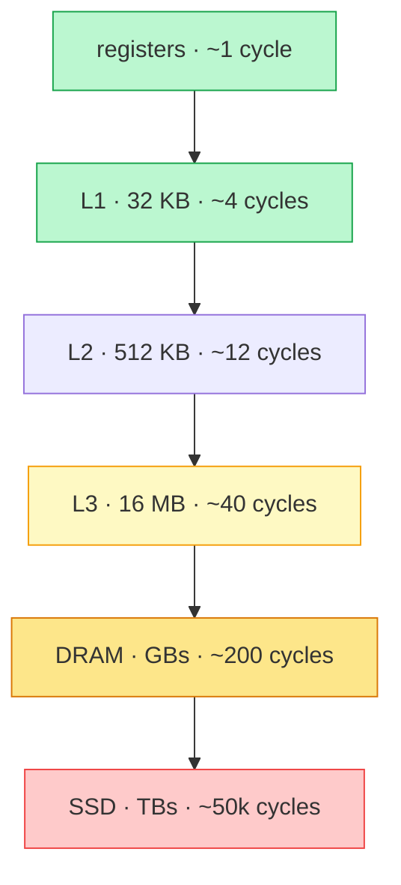

## Why It Exists

Two functions sum every element of an `n × n` matrix. Both visit every element once; both are `Θ(n²)` with identical read counts. The only difference is which loop is outer — so one steps through *consecutive* addresses and the other through addresses `n` apart. On a 4096×4096 matrix the row-major version runs in ~60 ms and the column-major version in ~600 ms. Same Big-O, same operation count, **10× slower**.

The gap isn't in the algorithm — it's in the **memory hierarchy**, the layered cache sitting between the CPU and RAM that [asymptotic analysis](/cortex/data-structures-and-algorithms/foundations-asymptotic-analysis) deliberately ignores. Big-O throws away the constant; in practice that constant is often a 10–100× factor, and it's almost always dominated by *memory access patterns*, not operation counts. The cache moves data in fixed **cache lines** (64 bytes), so an access pattern that consumes each line fully runs near peak and one that touches a single element per line runs at a fraction of it. This lesson is the picture every later chapter assumes you have: once you understand cache lines, spatial locality, and temporal locality, you stop being surprised when two `O(n)` loops differ by 10×, and you stop writing the slow one. (It closes the Foundations module — the wall-clock truth behind every "in practice this is fast" claim to come.)

## See It Work

You can't measure cache effects with a wall clock reliably, but you can *count misses* with a tiny LRU cache simulator. Here it sums the same 8×8 matrix two ways — walking rows (contiguous) vs walking columns (stride 8) — through a cache that holds 4 lines of 8 elements:

```python run viz=array
from collections import OrderedDict
def count_misses(access_order, line_size, capacity_lines):   # fully-associative LRU cache; count misses
    cache = OrderedDict(); misses = 0
    for addr in access_order:
        line = addr // line_size
        if line in cache:
            cache.move_to_end(line)                          # hit -> refresh LRU
        else:
            misses += 1; cache[line] = True                  # miss -> load the line
            if len(cache) > capacity_lines: cache.popitem(last=False)  # evict LRU
    return misses

N, LINE, CAP = 8, 8, 4                                        # 8x8 matrix, 8 elems/line, cache holds 4 lines
row_major = [i * N + j for i in range(N) for j in range(N)]  # walk each row fully (contiguous)
col_major = [i * N + j for j in range(N) for i in range(N)]  # walk each column (stride N)
r = count_misses(row_major, LINE, CAP)
c = count_misses(col_major, LINE, CAP)
print(f"row-major misses:    {r}")
print(f"column-major misses: {c}")
print(f"ratio: {c // r}x  (= elements per cache line)")
```

```java run viz=array
import java.util.*;
public class Main {
    static int countMisses(int[] order, int lineSize, int cap) {   // fully-associative LRU; count misses
        LinkedList<Integer> cache = new LinkedList<>();
        int misses = 0;
        for (int addr : order) {
            int line = addr / lineSize;
            if (cache.remove((Integer) line)) {        // hit -> refresh LRU
                cache.addLast(line);
            } else {
                misses++; cache.addLast(line);          // miss -> load the line
                if (cache.size() > cap) cache.removeFirst();  // evict LRU
            }
        }
        return misses;
    }
    public static void main(String[] x) {
        int N = 8, LINE = 8, CAP = 4;
        int[] rowMajor = new int[N * N], colMajor = new int[N * N];
        int r = 0; for (int i = 0; i < N; i++) for (int j = 0; j < N; j++) rowMajor[r++] = i * N + j;
        int c = 0; for (int j = 0; j < N; j++) for (int i = 0; i < N; i++) colMajor[c++] = i * N + j;
        int rm = countMisses(rowMajor, LINE, CAP), cm = countMisses(colMajor, LINE, CAP);
        System.out.println("row-major misses:    " + rm);
        System.out.println("column-major misses: " + cm);
        System.out.println("ratio: " + (cm / rm) + "x  (= elements per cache line)");
    }
}
```

Both print `row-major misses: 8`, `column-major misses: 64`, `ratio: 8x`. Row-major touches all 8 elements of a line before moving on, so it pays one miss per line — 8 lines, 8 misses, and the other 56 reads are free hits. Column-major touches one element per line and strides to the next line every step; since a full column spans all 8 lines and the cache holds only 4, every access is a miss — 64 of them. The 8× ratio is exactly the number of elements per cache line: that's how much work each fetch does for you when you use the whole line, and how much you throw away when you don't.

## How It Works

The cache is a ladder of stores, each bigger but slower than the one above:



<p align="center"><strong>Each step down is ~3–10× slower and ~10–100× larger. The same <code>arr[i]</code> can take ~4 cycles (L1 hit) or ~200 cycles (DRAM miss) — a 50× swing the CPU never reports. A program lives or dies on whether its working set fits in cache.</strong></p>

- **Cache lines: you pay for 64 bytes, not for what you read.** The cache never loads one byte — it loads the whole 64-byte line containing your address. Read one 8-byte `double` and the next 7 come along *for free*. Two consequences: same-line access is ~4 cycles (already in L1), and different-line access pays a fresh load (12 to 200+ cycles). Dense code that consumes each line runs near peak; sparse code that discards 56 of every 64 bytes runs at a fraction of it — exactly the 8× you just watched.
- **Spatial and temporal locality are the two assumptions the cache is built on.** *Spatial:* if you touched `X`, you'll soon touch neighbors of `X` — which is why lines are loaded whole and why the hardware *prefetcher* streams the next line ahead when it detects a linear stride. *Temporal:* if you touched `X`, you'll touch it again — which is why caches retain recent data. Code that iterates in index order over contiguous structures has both; code that chases pointers (linked lists, trees of boxed nodes) or strides past the line size has neither, and the prefetcher can't help.
- **This is why arrays beat linked structures by ~10× at identical Big-O.** A `vector<int>` and a `list<int>` both traverse in `O(n)`, but the vector packs 16 ints per line and prefetches, while every list node is a scattered heap allocation — a fresh cache-line miss, up to ~200 cycles, per node ([Your Turn](#your-turn)). Every "array layout vs linked layout" comparison in this book has the array winning in practice for exactly this reason.

> **Key takeaway.** Memory moves in 64-byte **cache lines** through a hierarchy where each level is ~3–10× slower (L1 ~4 cycles → DRAM ~200). So wall-clock cost is dominated by the *access pattern*, not the operation count: code that reuses each line (sequential, contiguous — **spatial locality**) and recently-touched data (**temporal locality**) runs near peak; code that strides past the line size or chases scattered pointers stalls on misses. Two algorithms with the same Big-O can differ 10× in practice — **Big-O is the shape of cost, the cache is the scale.** Arrays beat linked structures, and row-major beats column-major, by exactly this.

## Trace It

The 8× column-major penalty came from a cache too small to hold the matrix. That raises a sharp question about *when* the penalty appears at all.

**Predict before you run:** the same row-major vs column-major traversal, but run it twice — once with a cache big enough to hold the whole matrix (8 lines), once with a cache that holds only half (4 lines). Does column-major lose in *both* cases, or only one?

```python run viz=array
from collections import OrderedDict
def count_misses(order, line_size, cap):
    cache = OrderedDict(); misses = 0
    for addr in order:
        line = addr // line_size
        if line in cache: cache.move_to_end(line)
        else:
            misses += 1; cache[line] = True
            if len(cache) > cap: cache.popitem(last=False)
    return misses

N, LINE = 8, 8
row_major = [i * N + j for i in range(N) for j in range(N)]
col_major = [i * N + j for j in range(N) for i in range(N)]
for cap, label in [(8, "cache fits whole matrix"), (4, "matrix exceeds cache")]:
    r = count_misses(row_major, LINE, cap); c = count_misses(col_major, LINE, cap)
    print(f"{label:24} cap={cap}: row={r:3} col={c:3} gap={c // r}x")
```

<details>
<summary><strong>Reveal</strong></summary>

When the cache holds the whole matrix (`cap=8`), both are `8` misses — **gap 1×, no penalty**. When it holds only half (`cap=4`), row-major is still `8` but column-major jumps to `64` — **gap 8×**. The column-major penalty is a *capacity-miss* effect: with a big-enough cache, the first column's accesses load all 8 lines, and every later column finds them still resident → all hits. But once the working set exceeds the cache, column-major evicts each line before it's reused, so it re-loads the entire matrix for *every* column. Row-major never reuses a line across iterations, so its miss count is the same either way. This is the real-world lesson behind "the gap *widens* once the matrix exceeds L3": for a small matrix that fits in cache, row vs column barely differ; for a big one, the difference is the full line-size factor. It's also why the same code can benchmark fine on a small test input and fall off a cliff in production — the test fit in cache and the real workload didn't.

</details>

## Your Turn

The "arrays beat linked lists by 10×" claim is a cache claim, not an algorithm claim — both are `O(n)` to traverse. Quantify it: an array's `n` elements are contiguous; a linked list's `n` nodes are scattered, each on its own cache line.

**Predict:** summing 64 values, with 8 elements per cache line. The array packs them contiguously; the linked list spreads each node onto a fresh line. How many cache misses does each pay?

```python run viz=array
from collections import OrderedDict
def count_misses(order, line_size, cap):
    cache = OrderedDict(); misses = 0
    for addr in order:
        line = addr // line_size
        if line in cache: cache.move_to_end(line)
        else:
            misses += 1; cache[line] = True
            if len(cache) > cap: cache.popitem(last=False)
    return misses

n, LINE, CAP = 64, 8, 8
contiguous = list(range(n))                  # array: addresses 0..63 -> 8 lines
scattered  = [i * LINE for i in range(n)]    # linked-list-style: each node its own line -> 64 lines
print("contiguous (array) misses:     ", count_misses(contiguous, LINE, CAP))
print("scattered (linked-list) misses:", count_misses(scattered, LINE, CAP))
```

```java run viz=array
import java.util.*;
public class Main {
    static int countMisses(int[] order, int lineSize, int cap) {
        LinkedList<Integer> cache = new LinkedList<>(); int misses = 0;
        for (int addr : order) {
            int line = addr / lineSize;
            if (cache.remove((Integer) line)) cache.addLast(line);
            else { misses++; cache.addLast(line); if (cache.size() > cap) cache.removeFirst(); }
        }
        return misses;
    }
    public static void main(String[] x) {
        int n = 64, LINE = 8, CAP = 8;
        int[] contiguous = new int[n], scattered = new int[n];
        for (int i = 0; i < n; i++) { contiguous[i] = i; scattered[i] = i * LINE; }
        System.out.println("contiguous (array) misses:     " + countMisses(contiguous, LINE, CAP));
        System.out.println("scattered (linked-list) misses: " + countMisses(scattered, LINE, CAP));
    }
}
```

Both print `contiguous (array) misses: 8` and `scattered (linked-list) misses: 64`. The array sum pays `n / line_size = 8` misses — one per line, then 7 free hits each. The linked-list sum pays `n = 64` — every node is a fresh line, and the prefetcher can't help because the next address isn't a predictable stride, it's wherever the allocator happened to put the node. That 8× (here equal to the line size) is the standing tax on pointer-chasing, and on a real machine the gap is often larger still, because each list miss is a full ~200-cycle DRAM round-trip while the array's misses are hidden by prefetch. Same `O(n)` time, same `O(n)` space — an order of magnitude apart in wall-clock, decided entirely by layout.

## Reflect & Connect

- **Big-O is the shape; the cache is the scale.** Two algorithms with the same Big-O can differ 10× in wall-clock. When a benchmark surprises you, look at the *access pattern* before the algorithm.
- **You pay for the whole line.** 64 bytes per access whether you read 8 or 1. Consume the line (sequential, contiguous) and you run near peak; discard it (strided, scattered) and you stall on misses. Locality, not cleverness, is usually the win.
- **Layout is a lever with a cost.** The cache-friendly choices — struct-of-arrays when you touch few fields, bit-packing over `bool[]`, pre-allocating to avoid resize, loop blocking/tiling for matrix work, arrays over trees — each trade a structural convenience (ordered iteration, per-element field locality, cheap growth, pointer indirection) for locality. Pick the concession that hurts your workload least.
- **The threshold is the working set vs cache size.** Code that fits in cache shows no penalty; the same code on a larger input falls off a cliff once the working set spills to DRAM. Watch for false sharing too — two threads writing different variables on the *same* line ping-pong it between cores.
- **This is why production layouts look the way they do.** NumPy's strided arrays + BLAS tiling, [Postgres's 8 KB B-tree pages](/cortex/data-structures-and-algorithms/dsa-in-real-systems-postgres-b-tree-and-the-write-path), [Redis's contiguous small-collection encodings](/cortex/data-structures-and-algorithms/dsa-in-real-systems-redis-internal-encodings), game-engine ECS struct-of-arrays, and the Linux kernel's `____cacheline_aligned` per-CPU variables are all this chapter, deployed. From here, every "array vs linked layout" comparison in [arrays](/cortex/data-structures-and-algorithms/linear-structures-arrays-what-is-an-array), [hash tables](/cortex/data-structures-and-algorithms/linear-structures-hash-table-what-is-a-hash-table), and trees leans on this vocabulary.

## Recall

<details>
<summary><strong>Q:</strong> What is a cache line, and why does its size dominate performance?</summary>

**A:** The fixed block (64 bytes on x86/ARM) the cache loads on any access — you pay for the whole line even reading one byte. Code that consumes each line (8 doubles / 16 ints) runs near peak; code that touches one element per line wastes the other 56 bytes and stalls on a fresh load per element.

</details>
<details>
<summary><strong>Q:</strong> What are spatial and temporal locality?</summary>

**A:** Spatial: having accessed `X`, you'll soon access addresses near `X` (why lines load whole and the prefetcher streams ahead). Temporal: having accessed `X`, you'll access it again soon (why caches retain recent data). The whole hierarchy is built on these two assumptions.

</details>
<details>
<summary><strong>Q:</strong> Why is row-major traversal ~10× faster than column-major at the same Θ(n²)?</summary>

**A:** Row-major walks contiguous addresses — 8 doubles per 64-byte line, one fetch serving 8 reads, with the prefetcher streaming the next line. Column-major strides by a full row, touching one element per line and discarding 56 bytes per fetch, and the stride defeats the prefetcher.

</details>
<details>
<summary><strong>Q:</strong> Why does an array outperform a linked list for traversal at the same O(n)?</summary>

**A:** Array elements are contiguous, so each line carries ~16 ints and the prefetcher streams ahead — ~`n/16` misses. Linked-list nodes are scattered across the heap, so each pointer chase risks a fresh ~200-cycle DRAM load — up to `n` misses, ~10× worse in practice.

</details>
<details>
<summary><strong>Q:</strong> When does the column-major (or scattered-access) penalty actually appear?</summary>

**A:** Once the working set exceeds the cache. If the data fits, the first pass loads every line and later accesses hit — no penalty. Beyond cache capacity, cache-hostile patterns evict lines before reuse and re-load them, so the same code that benchmarked fine on a small input falls off a cliff at scale.

</details>

## Sources & Verify

- **Ulrich Drepper**, "What Every Programmer Should Know About Memory" — the canonical primer on caches, DRAM, and NUMA (sections 3 and 6 first). **Igor Ostrovsky**, "Gallery of Processor Cache Effects" — seven runnable experiments, each isolating one cache effect.
- **CLRS**, Ch. 18 (B-Trees) for the cache-oblivious / disk-page version of the same principle; the [Intel Optimization Reference Manual](https://www.intel.com/content/www/us/en/developer/articles/technical/intel-sdm.html) for hardware-exact latencies and prefetcher behavior; **Brendan Gregg**'s `perf` examples for measuring misses (`perf stat -e cache-misses`).
- The miss counts (row 8 vs column 64 = 8× the line size; the cache-fits gap 1× vs exceeds-cache gap 8×; contiguous 8 vs scattered 64) all come from the runnable blocks above (a deterministic LRU cache-miss simulator, not wall-clock timing) — re-run to verify.
