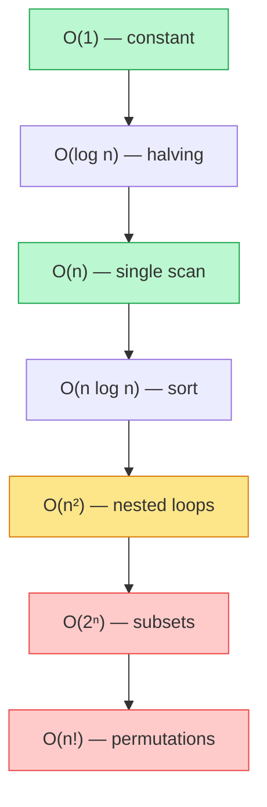

# Memorize: Foundations

## In a Hurry?

- **Core Operations**: derive a Big-O from code by counting primitive steps; solve a divide-and-conquer recurrence `T(n) = a · T(n/b) + f(n)` by Master theorem; defend an amortised bound by aggregate, accounting, or potential; write a loop invariant and prove initialisation, maintenance, and termination; predict cache behaviour from a loop's stride against the 64-byte line.
- **Complexities**: the analytic moves themselves cost `O(1)` per loop or recursive call. Memorise the asymptotic hierarchy `O(1) < O(log n) < O(n) < O(n log n) < O(n²) < O(n³) < O(2ⁿ) < O(n!)`, the Master-theorem threshold `n^(log_b a)`, the "geometric growth ⇒ `O(1)` amortised" rule, and the cache-line size `64 bytes`.
- **One Use-Case**: predicting at code-review time whether a feature will survive its first production-scale dataset — turning "this feels slow" into the checkable claim "this is `O(n²)`, the input will hit `10⁶`, and the inner loop is a column-major walk".

---

## One-Line Mnemonic

**Shape, then scale: count the steps, solve the recurrence, amortise the spikes, prove the invariant, then check the cache line.**

The first half names the moves that produce a Big-O label. The second half names the moves that decide whether that label is honest under load. Five lessons, five clauses, one chain.

---

## Real-World Analogy

Foundations is the *city-map zoom level* of code performance. **Asymptotic analysis** is the zoomed-out view: it discards every street name and keeps only the shape of the road network — highway, grid, spiderweb. **Recurrences** predict a city's shape from how it grows. Every divide-and-conquer city doubles its districts but halves their size. The Master theorem tells you whether the centre, the suburbs, or every ring carries the traffic. **Amortised analysis** is the bus schedule. Most trips are uneventful; every few hundred is a slow re-route while the road resurfaces. The daily timetable still holds. **Proof techniques** are the structural engineer's stamp — every bridge has a load-bearing argument signed under it, not merely three trucks that crossed without falling. **The memory model** is the asphalt. Same map, same routes, but a street paved one way runs ten times faster than the same street paved the other. No Big-O on the map can see that.

---

## Visual Summary

<strong>The complexity ladder — drop constants and lower-order terms, keep the dominant rung. Green scales comfortably; red is intractable past a tiny n.</strong>

---

## Key Operations

The "operations" of foundations are the analytic moves the chapter teaches. Each move applies to a piece of code, a recurrence, a sequence of operations, or a hardware-aware layout.

| Operation | Time | Space | Key Insight |
|---|---|---|---|
| Count primitive steps in a single loop | `O(1)` per step | `O(1)` | One pass per element times constant inner work equals `O(n)` — constants drop. |
| Compose costs of sequential blocks | `O(1)` per pair | `O(1)` | Sequential code **adds**; after the drop rule, the larger class wins. |
| Compose costs of nested loops | `O(1)` per nesting | `O(1)` | Nested code **multiplies**; outer steps times inner steps equals the product. |
| Drop constants and lower-order terms | `O(1)` | `O(1)` | `n² + 1000n + 10⁶` becomes `O(n²)` — only the dominant term survives. |
| Disambiguate the case (worst / average / amortised) | `O(1)` | `O(1)` | Same algorithm carries different Big-O labels per case — name the one you mean. |
| Pick the tightest sibling notation | `O(1)` | `O(1)` | `O` is a ceiling, `Θ` is exact, `Ω` is a floor — publish the strongest true claim. |
| Solve `T(n) = a · T(n/b) + f(n)` by Master theorem | `O(1)` derivation | `O(1)` | Compare `f(n)` to threshold `n^(log_b a)` — leaves win, every level matches, or root wins. |
| Solve a subtractive recurrence via recursion tree | `O(depth)` derivation | `O(1)` | `T(n) = T(n-1) + n` sums to `Θ(n²)` — Master theorem does not apply. |
| Prove amortised cost by aggregate method | `O(1)` derivation | `O(1)` | Sum the total cost of `n` operations, divide by `n` — geometric series collapse to `O(n)` total. |
| Prove amortised cost by potential method | `O(1)` derivation | `O(1)` | Define `Φ(D)`, set `Φ(D₀) = 0`, ensure `Φ(D_n) ≥ 0` — amortised cost is actual plus `ΔΦ`. |
| Write a loop invariant | `O(1)` per loop | `O(1)` | State a condition true at the top of every iteration — initialisation, maintenance, termination. |
| Prove correctness by mathematical induction | `O(1)` derivation | `O(1)` | Base case plus inductive step covers all `n ≥ n₀` — strong induction when the step needs many prior cases. |
| Prove an impossibility by contradiction | `O(1)` derivation | `O(1)` | Assume the negation, derive an absurdity — the shape that proves lower bounds and uniqueness. |
| Predict cache behaviour from a loop's stride | `O(1)` per loop | `O(1)` | Stride `≤ 64 bytes` keeps the line hot; stride `> 64 bytes` pays one fresh load per access. |
| Choose array vs linked layout for a workload | `O(1)` decision | `O(n)` storage | Contiguous arrays win `5–10×` in wall-clock at the same `O(n)` time — pointer chasing costs one DRAM miss per node. |

---

## Common Mistakes

- **Mistaking Big-O for wall-clock runtime**:
  - *What*: assuming two `O(n)` algorithms cost the same on the stopwatch.
  - *Why*: Big-O drops constants — `100n` and `n` share the same class but differ `100×` in wall-clock; constants dominate for small `n` and tight inner loops.
  - *Fix*: treat Big-O as a *shape* claim. When constants matter — tight loops, cache lines, JIT warm-up — benchmark *after* the asymptotic analysis, not instead of it.
- **Applying the Master theorem to a subtractive recurrence**:
  - *What*: writing "`T(n) = T(n-1) + 1`, so by Master theorem `Θ(1)`".
  - *Why*: the Master theorem covers `T(n) = a · T(n/b) + f(n)` only — divisive splits, not subtractive ones. `T(n) = T(n-1) + 1` has `n` levels of `O(1)` work and sums to `Θ(n)`.
  - *Fix*: check the form before invoking the theorem. Subtractive recurrences need the recursion tree or substitution; the theorem is mute.
- **Confusing amortised with average-case**:
  - *What*: treating "amortised `O(1)`" as a probabilistic claim about random inputs.
  - *Why*: average-case averages over a distribution of inputs; amortised analysis spreads the cost across a sequence of operations on the *same* structure — no probability involved.
  - *Fix*: read the term literally — average is "expected cost on a random input"; amortised is "worst-sequence average across many operations on the same structure".
- **Writing a loop invariant that holds but says nothing**:
  - *What*: stating an invariant like "`i` is an integer" or "`lo ≤ hi`" and calling the loop proved.
  - *Why*: an invariant must combine with the exit condition to imply the postcondition; trivial invariants leave the postcondition unproven.
  - *Fix*: pick the weakest invariant that still implies correctness at exit. For binary search: "if `target` is in `arr`, it is in `arr[lo..hi]`" — exits cleanly when `lo > hi`.
- **Forgetting to prove termination separately from correctness**:
  - *What*: writing an invariant, showing it is maintained, and declaring the algorithm correct.
  - *Why*: a loop that maintains its invariant forever is still wrong — it never returns. Correctness and termination are independent.
  - *Fix*: for every loop, name a non-negative quantity that strictly decreases each iteration (`hi - lo` in binary search, the remaining subarray length in merge sort). When it hits zero, the loop must exit.
- **Predicting wall-clock from Big-O alone, ignoring the cache line**:
  - *What*: claiming two `Θ(n²)` matrix traversals run in the same time, then watching one take `10×` longer.
  - *Why*: row-major access touches 8 doubles per 64-byte line; column-major access touches 1 double per line and discards 56 bytes per fetch. Same operation count, very different access pattern.
  - *Fix*: when an `Θ(n²)` benchmark surprises, profile the access pattern before the algorithm. Stride against cache-line size decides the constant.
- **Sloppy `O` when `Θ` is provable**:
  - *What*: writing "this is `O(n²)`" when the analysis actually shows `Θ(n)`.
  - *Why*: `O` is an upper bound only — `n` is in `O(n²)`, `O(n³)`, `O(2ⁿ)`, all true and all loose. Using `O` where `Θ` is provable understates what you proved.
  - *Fix*: use `Θ` when the bound is tight in both directions; reserve `O` for cases where the lower bound is open or unproven.

---

## Quick Recall

Click any question to reveal the answer.

<strong>Q:</strong> Definition of <code>f(n) = O(g(n))</code>?

**A:** There exist positive constants `c` and `n₀` such that for all `n ≥ n₀`, `f(n) ≤ c · g(n)`.

<strong>Q:</strong> Difference between <code>O</code>, <code>Θ</code>, <code>Ω</code>?

**A:** `O` is the asymptotic upper bound, `Θ` is a tight bound (both upper and lower), `Ω` is the asymptotic lower bound.

<strong>Q:</strong> Order from slowest to fastest growing: <code>O(n!)</code>, <code>O(2ⁿ)</code>, <code>O(n log n)</code>, <code>O(log n)</code>, <code>O(n²)</code>.

**A:** `O(log n) < O(n log n) < O(n²) < O(2ⁿ) < O(n!)`.

<strong>Q:</strong> Three rules for deriving complexity from straight-line code?

**A:** Sequential statements **add**. Nested loops **multiply**. Recursive calls **solve to a recurrence**.

<strong>Q:</strong> Rough operation counts at <code>n = 10⁶</code>?

**A:** `O(log n) ≈ 20`, `O(n) ≈ 10⁶`, `O(n log n) ≈ 2 × 10⁷` (about 20 ms), `O(n²) ≈ 10¹²` (about 12 days).

<strong>Q:</strong> What is the standard form of a divide-and-conquer recurrence?

**A:** `T(n) = a · T(n/b) + f(n)`, where `a ≥ 1` is the number of recursive calls, `b > 1` is the size-reduction factor per call, and `f(n)` is the non-recursive split-and-combine work.

<strong>Q:</strong> Master-theorem threshold and the three cases?

**A:** Threshold is `n^(log_b a)`. Case 1: `f(n)` asymptotically smaller — leaves win, `T(n) = Θ(n^(log_b a))`. Case 2: `f(n)` matches the threshold — every level equal, `T(n) = Θ(n^(log_b a) · log n)`. Case 3: `f(n)` asymptotically larger plus regularity — root wins, `T(n) = Θ(f(n))`.

<strong>Q:</strong> Closed form for <code>T(n) = 2T(n/2) + n</code>?

**A:** `Θ(n log n)` — Master theorem Case 2. This is merge sort and balanced quicksort.

<strong>Q:</strong> Closed form for <code>T(n) = T(n/2) + 1</code>?

**A:** `Θ(log n)` — Master theorem Case 2 with threshold `n^0 = 1`. This is binary search.

<strong>Q:</strong> Why does <code>T(n) = T(n-1) + n</code> give <code>Θ(n²)</code> while <code>T(n) = 2T(n/2) + n</code> gives <code>Θ(n log n)</code>?

**A:** The subtractive recurrence has `n` levels each doing linear work, summing to `n + (n-1) + … + 1 = Θ(n²)`. The halving recurrence has only `log n` levels each totalling `n`, summing to `Θ(n log n)`.

<strong>Q:</strong> Define amortised cost in one sentence.

**A:** The total cost of any sequence of `n` operations divided by `n`, taken in the worst case over all sequences of length `n`.

<strong>Q:</strong> Why is dynamic-array push <code>O(1)</code> amortised when one push in <code>log n</code> is <code>O(n)</code>?

**A:** The resize costs form a geometric series — `1 + 2 + 4 + … + n = O(n)` total work spread across `n` pushes — so the per-push average stays constant.

<strong>Q:</strong> Where is the line between <code>O(1)</code> and <code>O(n)</code> amortised growth?

**A:** Geometric growth (any constant factor `> 1`) gives `O(1)` amortised; arithmetic growth (`+k` per resize) gives `O(n)` amortised. Doubling and `1.5×` both preserve the constant bound.

<strong>Q:</strong> Three methods for proving an amortised bound?

**A:** Aggregate (sum the total cost, divide by `n`), accounting (charge each operation extra and bank credits for expensive operations), and potential (amortised cost equals actual cost plus `ΔΦ`).

<strong>Q:</strong> Three properties a loop invariant must satisfy?

**A:** Initialisation (holds before the first iteration), maintenance (held at one iteration implies held at the next), and termination (combined with the exit condition, implies the postcondition).

<strong>Q:</strong> Loop invariant for the standard binary search?

**A:** If `target` is in `arr`, then `target` is in the inclusive subarray `arr[lo..hi]`.

<strong>Q:</strong> When do you reach for strong induction instead of weak?

**A:** When the inductive step depends on more than the immediate predecessor. For example, `fib(k+1)` needs both `fib(k)` and `fib(k-1)`, and divide-and-conquer correctness needs every prior size.

<strong>Q:</strong> Standard cache-line size on x86 and ARM, and why it matters?

**A:** `64 bytes`. Every memory access charges for a full line. Dense code that reuses the line runs near peak; sparse code that touches one element per line runs at a small fraction of peak.

<strong>Q:</strong> Approximate latencies of L1, L3, DRAM, and SSD?

**A:** `L1 ≈ 4 cycles`, `L3 ≈ 40 cycles`, `DRAM ≈ 200 cycles`, `SSD ≈ 50,000 cycles`. Each step down is roughly `5–10×` slower than the one above.

<strong>Q:</strong> Spatial vs temporal locality?

**A:** Spatial locality — recently accessed addresses make nearby addresses likely soon (drives cache-line loading). Temporal locality — recently accessed addresses are likely accessed again soon (drives cache retention).

<strong>Q:</strong> Why does <code>array&lt;int&gt;</code> beat <code>linked_list&lt;int&gt;</code> at the same <code>O(n)</code> traversal?

**A:** Array elements are contiguous, so one 64-byte fetch loads 16 ints and the prefetcher streams ahead. Linked-list nodes are scattered, so each pointer chase risks a fresh `~200-cycle` DRAM load — roughly `50×` worse than the L1 hit.

