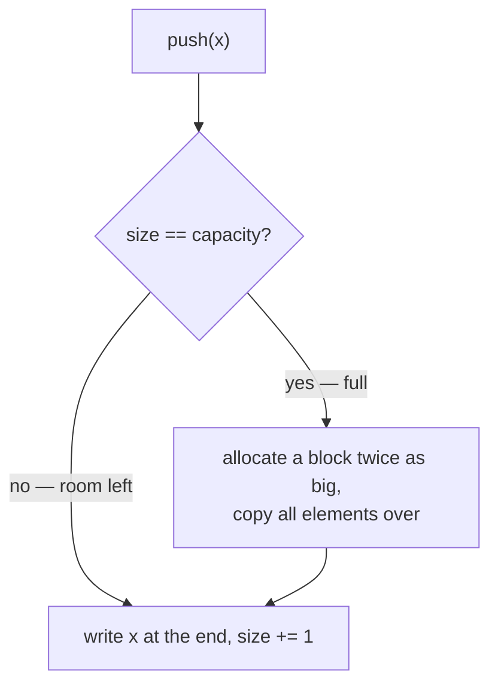

# Dynamic Arrays

## Why It Exists

You just learned that an array is a *fixed-size* block — you decide its length when you create it, and it can't grow. Yet every day you write `list.append(x)` in Python or `ArrayList.add(x)` in Java and push a thousand, a million values without once thinking about the size. The container always has room.

So how does a structure built on fixed-size blocks pretend to be infinitely growable? And here's the part that should bother you: when the block fills up, the only way to get a bigger one is to allocate a fresh block and **copy everything across** — an `O(n)` move. If that happened on every push, a million appends would cost a *trillion* copies. It doesn't. Appending is `O(1)` on average. How?

That's the **dynamic array**, and the trick that makes it work is one of the most reused ideas in systems programming.

## See It Work

Here's a `DynamicArray` built from a fixed block plus two counters. Pick a test case below and **Run** it — then click **Visualise** and watch the backing block *jump* to a bigger size each time it fills. Try your own `values` too: edit the field or add a case.

> ▶ Run it against a case, then click **Visualise** — watch the backing array jump to a bigger block each time it fills; the trailing `0`s are reserved-but-unused slots.

```python run viz=array viz-root=arr
import ast

class DynamicArray:
    def __init__(self):
        self.arr = []          # the fixed backing block
        self.size = 0          # how many slots the caller has filled
        self.capacity = 0      # how many slots are allocated

    def push_back(self, val):
        if self.size == self.capacity:                       # block is full → grow
            self.capacity = 1 if self.capacity == 0 else self.capacity * 2
            bigger = [0] * self.capacity
            for i in range(self.size):                       # copy everything across
                bigger[i] = self.arr[i]
            self.arr = bigger
        self.arr[self.size] = val
        self.size += 1

values = ast.literal_eval(input())   # the test case's values
da = DynamicArray()
for v in values:
    da.push_back(v)
print(da.arr, "size =", da.size)
```

```testcases
{
  "args": [
    { "id": "values", "label": "values", "type": "int[]", "placeholder": "[1, 2, 3, 4, 5]" }
  ],
  "cases": [
    { "args": { "values": "[1, 2, 3, 4, 5]" }, "expected": "[1, 2, 3, 4, 5, 0, 0, 0] size = 5" },
    { "args": { "values": "[1, 2, 3]" }, "expected": "[1, 2, 3, 0] size = 3" },
    { "args": { "values": "[7]" }, "expected": "[7] size = 1" },
    { "args": { "values": "[]" }, "expected": "[] size = 0" }
  ]
}
```

## How It Works

A dynamic array is a fixed array plus one idea: **track two numbers, and grow the block by doubling when it fills.**

- **size** — how many elements the caller has actually stored.
- **capacity** — how many slots are currently allocated. The gap between them is *headroom* that absorbs the next push for free.
- **grow by doubling** — when `size` hits `capacity`, allocate a new block of `capacity × 2`, copy the elements over, and keep going.



<p align="center"><strong>most pushes just write and bump the size; only a <em>full</em> block takes the slow path: double the capacity and copy everything across.</strong></p>

The doubling is the whole secret, and it's worth seeing *why* it works instead of the obvious alternative. Suppose instead you grew by **one slot** each time it filled. Every push past the first would copy every existing element: `1 + 2 + 3 + … + n` copies in total, which is `O(n²)` — pushing a million items would do half a trillion copies.

Doubling turns that sum into a *geometric* one — each term double the one before. To reach `n` elements the block doubles at capacities `1, 2, 4, 8, …, n`, so the total copy work across **all** resizes is:

```
1 + 2 + 4 + 8 + … + n  <  2n
```

That's `O(n)` total work for `n` pushes — which is `O(1)` per push **on average**. This is what "amortized" means, and it's a stronger promise than it first looks. It is not "fast on average if you're lucky": amortized `O(1)` is a *worst-case* guarantee over **any** sequence of pushes. Each rare, expensive resize is paid for in advance by all the cheap pushes around it.

Why does *multiplying* the capacity work when *adding* to it didn't? Because multiplying makes the capacities grow geometrically, so the copy costs at successive resizes form a geometric series too — and a geometric series always sums to a constant times `n`, never more. Doubling sums to `< 2n`; a gentler factor like `1.5×` copies more in total, but still only a (larger) constant times `n`, so it stays `O(n)`. That's why **any** growth factor above `1` gives amortized `O(1)` — the factor just trades how often you resize against how much memory you waste. Real libraries pick different points: Java's `ArrayList` grows `1.5×`, Python's `list` by roughly an eighth (`≈1.125×`), and a `std::vector` typically `1.5×` or `2×`.

### Key Takeaway

Doubling makes resizes geometrically rarer as they grow more expensive, so the total copy work stays linear in `n`: append is `O(1)` amortized and random access stays `O(1)` — paid for with up to `2×` slack memory.

## Trace It

Push `1, 2, 3, …` into an empty dynamic array and watch when a resize fires. The **cost** of a push is the copies it does plus the one write:

| push | full? | capacity before → after | copies | push cost |
|---|---|---|---|---|
| 1 | yes | 0 → 1 | 0 | 1 |
| 2 | yes | 1 → 2 | 1 | 2 |
| 3 | yes | 2 → 4 | 2 | 3 |
| 4 | no | 4 → 4 | 0 | 1 |
| 5 | yes | 4 → 8 | 4 | 5 |

Push 4 fit without resizing. Before you read on: of pushes 5, 6, 7, and 8, how many trigger a resize?

Only push 5. The jump to capacity `8` at push 5 buys room for pushes 6, 7, and 8 to land for free. Across all 8 pushes the total cost is `1+2+3+1+5+1+1+1 = 15` — under `2 × 8` — so the average is `≈1.87`, a constant. The resizes fire at pushes `1, 2, 3, 5, 9, 17, …`: every power of two, exponentially rarer as the array grows.

## Your Turn

You just watched `push_back` grow the block. Now build its mirror: a `pop_back` that *shrinks* it. The naive version halves the block as soon as it's half-empty — but that oscillates at the boundary (one push doubles, one pop halves, forever). The fix: **shrink only when the array drops to a quarter full**, halving the capacity to leave a buffer zone.

Implement `pop_back`: drop the last element, and when `size` falls to `capacity // 4` (and the block is bigger than one slot), halve the backing block.

```python run viz=array viz-root=arr
import ast

class DynamicArray:
    def __init__(self):
        self.arr = []
        self.size = 0
        self.capacity = 0

    def push_back(self, val):
        if self.size == self.capacity:
            self.capacity = 1 if self.capacity == 0 else self.capacity * 2
            bigger = [0] * self.capacity
            for i in range(self.size):
                bigger[i] = self.arr[i]
            self.arr = bigger
        self.arr[self.size] = val
        self.size += 1

    def pop_back(self):
        # Your code goes here — drop the last element (size -= 1), and when
        # size <= capacity // 4 (and capacity > 1), halve the block: allocate
        # capacity // 2 slots and copy the live elements across.
        pass

values = ast.literal_eval(input())   # the test case's values
pops = int(input())                  # how many pop_back calls
da = DynamicArray()
for v in values:
    da.push_back(v)
for _ in range(pops):
    da.pop_back()
print(da.arr[:da.size], "capacity =", da.capacity)
```

```java run viz=array viz-root=arr
import java.util.*;

public class Main {
  static class DynamicArray {
    int[] arr = new int[0];
    int size = 0;
    int capacity = 0;

    void pushBack(int val) {
      if (size == capacity) {
        capacity = capacity == 0 ? 1 : capacity * 2;
        arr = Arrays.copyOf(arr, capacity);
      }
      arr[size++] = val;
    }

    void popBack() {
      // Your code goes here — drop the last element (size -= 1), and when
      // size <= capacity / 4 (and capacity > 1), halve the block:
      // copy the live elements into a capacity / 2 array.
    }
  }

  public static void main(String[] args) {
    Scanner sc = new Scanner(System.in);
    int[] values = parseIntArray(sc.nextLine());
    int pops = Integer.parseInt(sc.nextLine().trim());
    DynamicArray da = new DynamicArray();
    for (int v : values) da.pushBack(v);
    for (int i = 0; i < pops; i++) da.popBack();
    System.out.println(Arrays.toString(Arrays.copyOf(da.arr, da.size)) + " capacity = " + da.capacity);
  }

  // "[1, 2, 3]" → {1, 2, 3} — reads the test case's values
  static int[] parseIntArray(String line) {
    String inner = line.replaceAll("[\\[\\]\\s]", "");
    if (inner.isEmpty()) return new int[0];
    String[] parts = inner.split(",");
    int[] out = new int[parts.length];
    for (int i = 0; i < parts.length; i++) out[i] = Integer.parseInt(parts[i]);
    return out;
  }
}
```

```testcases
{
  "args": [
    { "id": "values", "label": "values", "type": "int[]", "placeholder": "[1, 2, 3, 4, 5]" },
    { "id": "pops", "label": "pops", "type": "int", "placeholder": "3" }
  ],
  "cases": [
    { "args": { "values": "[1, 2, 3, 4, 5]", "pops": "3" }, "expected": "[1, 2] capacity = 4" },
    { "args": { "values": "[1, 2, 3, 4, 5]", "pops": "0" }, "expected": "[1, 2, 3, 4, 5] capacity = 8" },
    { "args": { "values": "[1, 2, 3, 4]", "pops": "3" }, "expected": "[1] capacity = 2" },
    { "args": { "values": "[7]", "pops": "2" }, "expected": "[] capacity = 1" }
  ]
}
```

<details>
<summary>Editorial</summary>

Shrink at a **quarter** full, not half. If you halve the moment `size` drops below `capacity / 2`, an array sitting exactly at the boundary thrashes: one push doubles it, one pop halves it, each move copying everything. Waiting until `size <= capacity / 4` leaves a half-empty buffer after every shrink, so the next resize — in *either* direction — is at least `size` operations away. That keeps `pop_back` amortized `O(1)` by the same geometric-series argument as `push_back`.

The empty-pop guard matters too: `pop_back` on an empty array is a no-op here (a real library would raise), and a 1-slot block never shrinks.

```python solution time=O(1)-amortized space=O(1)
import ast

class DynamicArray:
    def __init__(self):
        self.arr = []
        self.size = 0
        self.capacity = 0

    def push_back(self, val):
        if self.size == self.capacity:
            self.capacity = 1 if self.capacity == 0 else self.capacity * 2
            bigger = [0] * self.capacity
            for i in range(self.size):
                bigger[i] = self.arr[i]
            self.arr = bigger
        self.arr[self.size] = val
        self.size += 1

    def pop_back(self):
        if self.size == 0:                                   # popping empty → no-op
            return
        self.size -= 1
        if self.capacity > 1 and self.size <= self.capacity // 4:
            self.capacity = self.capacity // 2               # quarter-full → halve
            smaller = [0] * self.capacity
            for i in range(self.size):                       # copy the live elements
                smaller[i] = self.arr[i]
            self.arr = smaller

values = ast.literal_eval(input())
pops = int(input())
da = DynamicArray()
for v in values:
    da.push_back(v)
for _ in range(pops):
    da.pop_back()
print(da.arr[:da.size], "capacity =", da.capacity)
```

```java solution
import java.util.*;

public class Main {
  static class DynamicArray {
    int[] arr = new int[0];
    int size = 0;
    int capacity = 0;

    void pushBack(int val) {
      if (size == capacity) {
        capacity = capacity == 0 ? 1 : capacity * 2;
        arr = Arrays.copyOf(arr, capacity);
      }
      arr[size++] = val;
    }

    void popBack() {
      if (size == 0) return;                                 // popping empty → no-op
      size--;
      if (capacity > 1 && size <= capacity / 4) {
        capacity = capacity / 2;                             // quarter-full → halve
        arr = Arrays.copyOf(arr, capacity);                  // copies the live elements
      }
    }
  }

  public static void main(String[] args) {
    Scanner sc = new Scanner(System.in);
    int[] values = parseIntArray(sc.nextLine());
    int pops = Integer.parseInt(sc.nextLine().trim());
    DynamicArray da = new DynamicArray();
    for (int v : values) da.pushBack(v);
    for (int i = 0; i < pops; i++) da.popBack();
    System.out.println(Arrays.toString(Arrays.copyOf(da.arr, da.size)) + " capacity = " + da.capacity);
  }

  static int[] parseIntArray(String line) {
    String inner = line.replaceAll("[\\[\\]\\s]", "");
    if (inner.isEmpty()) return new int[0];
    String[] parts = inner.split(",");
    int[] out = new int[parts.length];
    for (int i = 0; i < parts.length; i++) out[i] = Integer.parseInt(parts[i]);
    return out;
  }
}
```

</details>

## Reflect & Connect

Want to build the whole thing — `get`, `size`, and the full resize policy with the design tradeoffs spelled out? That's the [Design a Dynamic Array](/cortex/data-structures-and-algorithms/linear-structures/arrays/design-a-dynamic-array/design-a-dynamic-array) challenge.

The dynamic array is the structure you reach for without naming it. Python's `list`, Java's `ArrayList`, C++'s `std::vector`, Go's slices, Rust's `Vec` — every one runs this exact resize-and-copy state machine on every append.

The tradeoff to remember: you buy `O(1)` amortized append *and* `O(1)` random access by paying up to `2×` slack memory — right after a resize, half the block is empty. Two consequences worth carrying forward:

- **Pre-size when you know the count.** `[0] * n` or `new ArrayList<>(n)` reserves once and skips every resize — the fix for the "append in a hot loop occasionally stalls" surprise from the [arrays pitfalls](/cortex/data-structures-and-algorithms/linear-structures/arrays/what-is-an-array).
- **Shrinking is trickier than growing.** A `popBack` that halves the block as soon as it's half-empty will *oscillate* — one push past the boundary doubles, one pop halves, forever. The fix is to shrink only at a *quarter* full, leaving a buffer zone.

**Prerequisites:** [Arrays](/cortex/data-structures-and-algorithms/linear-structures/arrays/what-is-an-array) and [Measuring Cost](/cortex/data-structures-and-algorithms/foundations/measuring-cost).
**What's next:** the first *pattern* built on the array's layout — [Two Pointers](/cortex/data-structures-and-algorithms/linear-structures/arrays/pattern-two-pointers/pattern).

## Recall

> **Mnemonic:** *Full? Double and copy. Rare big cost, paid for by the cheap pushes around it.*

| Operation | Cost | Why |
|---|---|---|
| `append` / `push_back` | `O(1)` amortized | doubling spreads the rare `O(n)` resize across `n` cheap pushes |
| `append` on a resize | `O(n)` (one-off) | the full block is copied into one twice the size |
| read / write `arr[i]` | `O(1)` | still a contiguous block — address arithmetic, unchanged |
| extra memory | up to `2×` size | half the block can be empty right after a resize |

<details>
<summary><strong>Q:</strong> Why grow by doubling instead of by a fixed number of slots?</summary>

**A:** Doubling gives `O(n)` total copy work (`O(1)` amortized); fixed growth gives `O(n²)`.

</details>
<details>
<summary><strong>Q:</strong> What does "amortized `O(1)`" guarantee?</summary>

**A:** Any sequence of `n` pushes costs `O(n)` total — a worst-case bound over the sequence, not a lucky average.

</details>
<details>
<summary><strong>Q:</strong> What's the price of amortized `O(1)` append?</summary>

**A:** Up to `2×` memory — half the block sits empty right after a resize.

</details>
<details>
<summary><strong>Q:</strong> How do you skip the resizes entirely?</summary>

**A:** Pre-size the block when you know the final count.

</details>

## Sources & Verify

- **CLRS** (Cormen, Leiserson, Rivest, Stein), *Introduction to Algorithms*, 4th ed., **Ch. 17 — Amortized Analysis**: dynamic tables, table doubling, and the aggregate / accounting / potential methods. The canonical proof that doubling gives `O(1)` amortized.
- **Sedgewick & Wayne**, *Algorithms*, 4th ed., §1.3–1.4 — resizing arrays and the amortized cost of `push`/`pop` (`algs4.cs.princeton.edu`).
- **CPython** [`Objects/listobject.c`](https://github.com/python/cpython/blob/main/Objects/listobject.c) (`list_resize`) and **OpenJDK** [`ArrayList.java`](https://github.com/openjdk/jdk/blob/master/src/java.base/share/classes/java/util/ArrayList.java) (`grow`) — the real growth factors (`≈1.125×` and `1.5×`); verify the numbers quoted above against the source.
- The `1 + 2 + 4 + … + n < 2n` bound is the standard geometric-series argument; both code blocks are verified by running.
