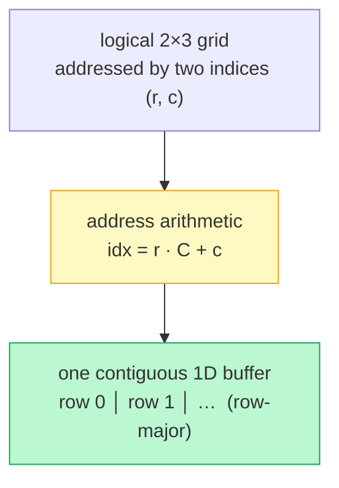

## Why It Exists

You're storing grades for a school: 30 classes, each with marks in several subjects. A single [1D array](/cortex/data-structures-and-algorithms/linear-structures/arrays/what-is-an-array) can hold all the numbers, but you'd be computing `grades[classIndex * numSubjects + subjectIndex]` by hand on every access — and one wrong multiply silently reads the wrong student's mark. What you *want* is to say `grades[class][subject]` and have the right cell come back. That's a **multidimensional array**: a grid addressed by two (or more) indices.

Here's the thing the `[r][c]` syntax hides: a 2D array is **not** stored as a grid in memory — memory is linear. It's stored as *one contiguous 1D buffer*, and the `[r][c]` is sugar for the exact index arithmetic you were dreading: `r * numCols + c`. The language computes it for you, in constant time, but it's the same flat buffer underneath. That single fact carries two consequences. First, access stays `O(1)` — a multiply and an add, no matter how many dimensions. Second, *the order you flatten in matters*: store row-by-row (**row-major**) and a whole row is contiguous; store column-by-column (**column-major**) and a column is contiguous. Iterate in the contiguous direction and you ride the [cache](/cortex/data-structures-and-algorithms/foundations/memory-model-and-cache); iterate against it and you pay a miss per element. The grid is an illusion; the buffer and the stride are real.

## See It Work

A 2D matrix, built by hand on top of a flat buffer — so you can see the `[r][c]` sugar dissolve into `r * cols + c`. Pick a case (a grid shape `rows × cols`, plus a cell `(r, c)` to look up) and **Run** it; the program fills each cell with the recognizable value `r·10 + c`, then prints that cell's flat index and the whole buffer.

> ▶ Run it against a case, then click **Visualise** — watch the logical grid collapse into one contiguous strip, row after row.

```python run viz=array
import ast

class Matrix:
    def __init__(self, rows, cols):
        self.rows, self.cols = rows, cols
        self.buf = [0] * (rows * cols)          # ONE contiguous 1D buffer
    def _idx(self, r, c):                         # row-major address arithmetic
        return r * self.cols + c
    def set(self, r, c, v): self.buf[self._idx(r, c)] = v
    def get(self, r, c):    return self.buf[self._idx(r, c)]

rows = int(input())                               # the test case's grid shape
cols = int(input())
r = int(input())                                  # the cell to look up
c = int(input())
m = Matrix(rows, cols)
for i in range(rows):
    for j in range(cols):
        m.set(i, j, i * 10 + j)                   # a recognizable value per cell
print(f"element ({r},{c}):", m.get(r, c), "at flat index", m._idx(r, c))
print("flat buffer:", m.buf)                      # row-major: row 0, then row 1, …
```

```java run viz=array
import java.util.*;
public class Main {
    static class Matrix {
        int rows, cols; int[] buf;
        Matrix(int rows, int cols) { this.rows = rows; this.cols = cols; buf = new int[rows * cols]; }  // ONE 1D buffer
        int idx(int r, int c) { return r * cols + c; }      // row-major address arithmetic
        void set(int r, int c, int v) { buf[idx(r, c)] = v; }
        int get(int r, int c) { return buf[idx(r, c)]; }
    }
    public static void main(String[] x) {
        Scanner sc = new Scanner(System.in);
        int rows = Integer.parseInt(sc.nextLine().trim());  // the test case's grid shape
        int cols = Integer.parseInt(sc.nextLine().trim());
        int r = Integer.parseInt(sc.nextLine().trim());     // the cell to look up
        int c = Integer.parseInt(sc.nextLine().trim());
        Matrix m = new Matrix(rows, cols);
        for (int i = 0; i < rows; i++) for (int j = 0; j < cols; j++) m.set(i, j, i * 10 + j);
        System.out.println("element (" + r + "," + c + "): " + m.get(r, c) + " at flat index " + m.idx(r, c));
        System.out.println("flat buffer: " + Arrays.toString(m.buf));
    }
}
```

```testcases
{
  "args": [
    { "id": "rows", "label": "rows", "type": "int", "placeholder": "2" },
    { "id": "cols", "label": "cols", "type": "int", "placeholder": "3" },
    { "id": "r", "label": "r", "type": "int", "placeholder": "1" },
    { "id": "c", "label": "c", "type": "int", "placeholder": "2" }
  ],
  "cases": [
    { "args": { "rows": "2", "cols": "3", "r": "1", "c": "2" }, "expected": "element (1,2): 12 at flat index 5\nflat buffer: [0, 1, 2, 10, 11, 12]" },
    { "args": { "rows": "3", "cols": "2", "r": "2", "c": "1" }, "expected": "element (2,1): 21 at flat index 5\nflat buffer: [0, 1, 10, 11, 20, 21]" },
    { "args": { "rows": "2", "cols": "2", "r": "0", "c": "1" }, "expected": "element (0,1): 1 at flat index 1\nflat buffer: [0, 1, 10, 11]" },
    { "args": { "rows": "1", "cols": "1", "r": "0", "c": "0" }, "expected": "element (0,0): 0 at flat index 0\nflat buffer: [0]" }
  ]
}
```

Run the first case (a 2×3 grid) and both print `element (1,2): 12 at flat index 5` and `flat buffer: [0, 1, 2, 10, 11, 12]`. The logical cell `(1, 2)` lives at flat slot `1 * 3 + 2 = 5`, and the buffer is just the two rows laid end to end: `[0, 1, 2]` then `[10, 11, 12]`. There's no grid in memory — only this strip, and an index function that maps `(r, c)` onto it. `get`/`set` are `O(1)`: one multiply, one add, one access.

## How It Works

The grid-to-buffer mapping, and the layout choice that follows from it:



<p align="center"><strong>A 2D array is one flat buffer plus an index function. Row-major lays the grid out row by row, so <code>idx = r·C + c</code>; a whole row occupies consecutive slots.</strong></p>

- **The address formula generalizes with strides.** In 2D row-major, `idx = r·C + c`: moving one row forward jumps `C` slots (the row *stride*), moving one column forward jumps `1`. In N dimensions it's a dot product of indices with strides: for shape `(D₀, D₁, …)` the stride of axis `k` is the product of all *later* dimensions, and `idx = Σ index_k · stride_k`. Every access is that fixed arithmetic — `O(1)` regardless of dimension count. (This is exactly how NumPy works: an `ndarray` is a flat buffer plus a `strides` tuple, and `arr.T` just *swaps the strides* without moving a byte.)
- **Row-major vs column-major is which axis is contiguous.** Row-major (C, Python, NumPy default) stores rows consecutively, so `idx = r·C + c` and a *row* is contiguous. Column-major (Fortran, MATLAB, most BLAS) stores columns consecutively, so `idx = c·R + r` and a *column* is contiguous. Same logical grid, same `O(1)` access — but the same element lands in a *different* physical slot ([Trace It](#trace-it)).
- **The layout decides which loop order is cache-friendly.** Because memory moves in [cache lines](/cortex/data-structures-and-algorithms/foundations/memory-model-and-cache), iterating in the contiguous direction touches consecutive addresses (one miss per line, the rest free); iterating against it strides past the line size and misses on nearly every element. On a row-major array, `for r: for c:` (row-by-row) is fast and `for c: for r:` (column-by-column) is the ~10× slower version — *same* `Θ(R·C)` operations, very different wall-clock. Match your loop order to your storage order.

> **Key takeaway.** A multidimensional array is **one contiguous 1D buffer plus index arithmetic** — element `(r, c)` of an `R×C` grid is at flat slot `r·C + c` (row-major), generalizing to a strides dot-product in N dimensions, all `O(1)`. The `[r][c]` notation is sugar over that formula; memory is linear, the grid is an illusion. The layout choice — **row-major** (rows contiguous) vs **column-major** (columns contiguous) — puts the same element in different slots and, via cache lines, decides which loop order is fast: **iterate in the contiguous direction.**

## Trace It

"Same logical element, different physical slot" sounds abstract until you compute both addresses for the same cell.

**Predict before you run:** in a 2×3 grid, where does element `(1, 0)` live — at the same flat index under row-major and column-major, or different ones? And which layout stores a full *row* in consecutive slots?

```python run viz=array
R, C = 2, 3
def row_major(r, c): return r * C + c             # rows stored consecutively
def col_major(r, c): return c * R + r             # columns stored consecutively

print(f"{'(r,c)':>7} {'row-major':>10} {'col-major':>10}")
for (r, c) in [(0, 0), (0, 2), (1, 0), (1, 2)]:
    print(f"{str((r, c)):>7} {row_major(r, c):>10} {col_major(r, c):>10}")
row0_rm = [row_major(0, c) for c in range(C)]
row0_cm = [col_major(0, c) for c in range(C)]
print("row 0 stored at flat indices -- row-major:", row0_rm, "| col-major:", row0_cm)
```

<details>
<summary><strong>Reveal</strong></summary>

Element `(1, 0)` lives at flat index **3** under row-major (`1·3 + 0`) but **1** under column-major (`0·2 + 1`) — *different physical slots for the same logical cell*. Only the corners `(0,0)→0` and `(1,2)→5` happen to coincide; everything in between diverges. And row 0's three cells sit at `[0, 1, 2]` under row-major (consecutive — a row is contiguous) but `[0, 2, 4]` under column-major (stride 2 — the row is scattered, every element on a different cache line). That's the whole story of why loop order matters: walking a row (`for c`) is contiguous on a row-major array and cache-hostile on a column-major one, and vice versa for walking a column. The famous NumPy performance trap is exactly this — `arr.T` flips the strides so a previously row-contiguous array becomes column-contiguous, and code that *looks* identical suddenly runs an order of magnitude slower because its loop order no longer matches the layout. The index formula is `O(1)` either way; the cache doesn't care about Big-O, only about which slots you touch in what order.

</details>

## Your Turn

2D arrays are the substrate for grids — images, game boards, dynamic-programming tables, maze-solving. The recurring chore there is *neighbour access*, and the trap is the boundary: the grid's edges are implicit (not stored), so every generated neighbour must be bounds-checked.

**Predict:** in a 3×3 grid, using 4-directional moves (up/down/left/right), how many valid neighbours does a **corner** cell have? An **edge** cell? An **interior** cell?

Implement `count_neighbours(R, C, r, c)`: return how many of cell `(r, c)`'s four orthogonal moves — up, down, left, right — land *inside* an `R × C` grid. The edges are implicit, so a move to `(-1, 0)` or `(R, 0)` is off the board and doesn't count.

```python run viz=array
def count_neighbours(R, C, r, c):                 # 4-directional, bounds-checked
    # Your code goes here — try each of the four (dr, dc) moves and count the
    # ones whose (r+dr, c+dc) lands inside the R x C grid.
    return 0

R = int(input())                                  # grid rows
C = int(input())                                  # grid cols
r = int(input())                                  # cell row
c = int(input())                                  # cell col
print(count_neighbours(R, C, r, c))
```

```java run viz=array
import java.util.*;
public class Main {
    static int countNeighbours(int R, int C, int r, int c) {   // 4-directional, bounds-checked
        // Your code goes here — try each of the four (dr, dc) moves and count
        // the ones whose (r+dr, c+dc) lands inside the R x C grid.
        return 0;
    }
    public static void main(String[] x) {
        Scanner sc = new Scanner(System.in);
        int R = Integer.parseInt(sc.nextLine().trim());
        int C = Integer.parseInt(sc.nextLine().trim());
        int r = Integer.parseInt(sc.nextLine().trim());
        int c = Integer.parseInt(sc.nextLine().trim());
        System.out.println(countNeighbours(R, C, r, c));
    }
}
```

```testcases
{
  "args": [
    { "id": "R", "label": "R", "type": "int", "placeholder": "3" },
    { "id": "C", "label": "C", "type": "int", "placeholder": "3" },
    { "id": "r", "label": "r", "type": "int", "placeholder": "1" },
    { "id": "c", "label": "c", "type": "int", "placeholder": "1" }
  ],
  "cases": [
    { "args": { "R": "3", "C": "3", "r": "0", "c": "0" }, "expected": "2" },
    { "args": { "R": "3", "C": "3", "r": "0", "c": "1" }, "expected": "3" },
    { "args": { "R": "3", "C": "3", "r": "1", "c": "1" }, "expected": "4" },
    { "args": { "R": "1", "C": "1", "r": "0", "c": "0" }, "expected": "0" },
    { "args": { "R": "5", "C": "5", "r": "2", "c": "2" }, "expected": "4" }
  ]
}
```

<details>
<summary>Editorial</summary>

A cell has four candidate neighbours — `(r-1, c)`, `(r+1, c)`, `(r, c-1)`, `(r, c+1)`. Generate each from a list of `(dr, dc)` deltas, then keep only the ones whose row and column both fall in range: `0 <= nr < R and 0 <= nc < C`. That single bounds check is the whole exercise — a 2D array has no sentinel border, so a corner cell loses two of its four moves off the grid, an edge cell one, an interior cell none. A move to `(-1, 0)` would otherwise crash (Java: `ArrayIndexOutOfBounds`) or silently wrap to the wrong row (Python negative indices). This "deltas + bounds filter" is the exact pattern behind every grid BFS/DFS, flood fill, and dynamic-programming-on-a-grid — the [grid traversal](/cortex/data-structures-and-algorithms/graphs/traversing-a-grid) lessons build directly on it.

```python solution time=O(1) space=O(1)
def count_neighbours(R, C, r, c):
    count = 0
    for dr, dc in [(-1, 0), (1, 0), (0, -1), (0, 1)]:
        nr, nc = r + dr, c + dc
        if 0 <= nr < R and 0 <= nc < C:           # inside the grid?
            count += 1
    return count

R = int(input())
C = int(input())
r = int(input())
c = int(input())
print(count_neighbours(R, C, r, c))
```

```java solution
import java.util.*;
public class Main {
    static int countNeighbours(int R, int C, int r, int c) {
        int[][] dirs = {{-1, 0}, {1, 0}, {0, -1}, {0, 1}};
        int count = 0;
        for (int[] d : dirs) {
            int nr = r + d[0], nc = c + d[1];
            if (nr >= 0 && nr < R && nc >= 0 && nc < C) count++;   // inside the grid?
        }
        return count;
    }
    public static void main(String[] x) {
        Scanner sc = new Scanner(System.in);
        int R = Integer.parseInt(sc.nextLine().trim());
        int C = Integer.parseInt(sc.nextLine().trim());
        int r = Integer.parseInt(sc.nextLine().trim());
        int c = Integer.parseInt(sc.nextLine().trim());
        System.out.println(countNeighbours(R, C, r, c));
    }
}
```

</details>

## Reflect & Connect

- **The grid is an illusion; the buffer is real.** A 2D/N-D array is one contiguous 1D buffer plus an index function (`r·C + c`, or a strides dot-product in N dimensions). The `[r][c]` syntax computes that arithmetic for you in `O(1)` — it doesn't change that memory is linear.
- **Layout = which axis is contiguous.** Row-major (C, Python, NumPy) makes rows consecutive; column-major (Fortran, MATLAB, BLAS) makes columns consecutive. The same element lands in a different slot, and the index formula swaps `C` for `R`.
- **Match loop order to storage order.** Iterating the contiguous axis rides the cache; iterating against it misses per element — the same `Θ(R·C)` work running ~10× apart. This is the [memory-hierarchy](/cortex/data-structures-and-algorithms/foundations/memory-model-and-cache) lesson in its most common concrete form, and the NumPy `arr.T` performance trap.
- **Mind the boundary.** A 2D array has no border sentinel, so grid algorithms must bounds-check every generated neighbour — corners get 2 neighbours, edges 3, interiors 4. Forgetting the check crashes (Java) or silently wraps (Python's negative indices).
- **It's the substrate for grids.** Images, game boards, DP tables, adjacency matrices, and maze solvers are all 2D arrays; the [grid-traversal](/cortex/data-structures-and-algorithms/graphs/traversing-a-grid) and [2D DP](/cortex/data-structures-and-algorithms/algorithms-by-strategy-dynamic-programming-pattern-2d-grid) patterns assume exactly this representation. Jagged arrays (rows of differing length, e.g. Java `int[][]`) trade the single-buffer contiguity for flexibility — and lose the cache guarantee.

## Recall

<details>
<summary><strong>Q:</strong> How is a 2D array actually stored, and what is the address of element (r, c)?</summary>

**A:** As one contiguous 1D buffer. In row-major order, element `(r, c)` of an `R×C` array is at flat index `r·C + c` — a multiply and an add, computed in `O(1)`. The `[r][c]` syntax is sugar over this arithmetic; memory itself is linear.

</details>
<details>
<summary><strong>Q:</strong> What's the difference between row-major and column-major order?</summary>

**A:** Row-major stores rows consecutively (`idx = r·C + c`), so a row is contiguous — used by C, Python, NumPy. Column-major stores columns consecutively (`idx = c·R + r`), so a column is contiguous — used by Fortran, MATLAB, most BLAS. Same logical grid and same `O(1)` access; the same element occupies a different physical slot.

</details>
<details>
<summary><strong>Q:</strong> Why does loop order affect the speed of a 2D-array traversal even though the operation count is identical?</summary>

**A:** Memory moves in cache lines. Iterating the contiguous axis (rows on a row-major array) touches consecutive addresses — one miss per line, the rest free. Iterating the other axis strides past the line size, missing on nearly every element — the same `Θ(R·C)` work, often ~10× slower in wall-clock.

</details>
<details>
<summary><strong>Q:</strong> How does the address formula generalize to N dimensions?</summary>

**A:** Each axis has a stride (the product of all later dimensions, in row-major); the flat index is the dot product of the indices with the strides: `idx = Σ index_k · stride_k`. Access stays `O(1)` regardless of dimension count. NumPy stores exactly this — a flat buffer plus a `strides` tuple, which is why transpose can just swap strides.

</details>
<details>
<summary><strong>Q:</strong> Why must grid algorithms bounds-check every neighbour, and what do corner/edge/interior cells yield?</summary>

**A:** A 2D array has no sentinel border, so a move off the grid crashes (Java) or silently wraps (Python negative indices). With 4-directional moves, a corner cell has 2 valid neighbours, an edge cell 3, an interior cell 4 — the bounds check `0 ≤ nr < R and 0 ≤ nc < C` filters the rest.

</details>

## Sources & Verify

- **CLRS**, *Introduction to Algorithms* — multidimensional arrays and row/column-major addressing; **Sedgewick & Wayne**, *Algorithms* §1.4 — 2D arrays in practice.
- **NumPy documentation** on `ndarray` internals (the flat buffer + `strides` model, and why `arr.T` is free), and the [memory-model lesson](/cortex/data-structures-and-algorithms/foundations/memory-model-and-cache) for why the layout choice governs cache behavior.
- The flat-index demo (`(1,2)` → slot 5, buffer `[0,1,2,10,11,12]`), the row-vs-column divergence (`(1,0)` → 3 vs 1; row 0 at `[0,1,2]` vs `[0,2,4]`), and the neighbour counts (corner 2 / edge 3 / interior 4) all come from the runnable blocks above (deterministic) — re-run to verify.
