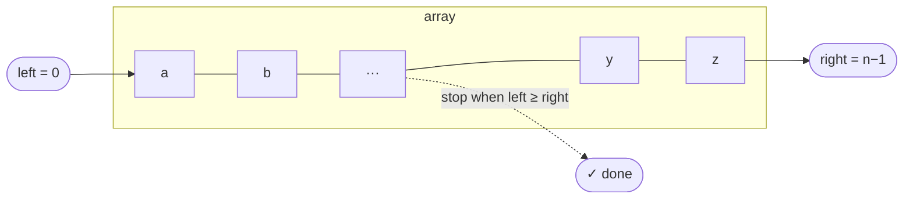

# Pattern: Two Pointers

## Why It Exists

Reverse an array — `[1, 2, 3, 4, 5]` → `[5, 4, 3, 2, 1]`. The obvious way copies it backwards into a *second* array, then copies that back. It works, but it burns `O(n)` extra memory for a job that shouldn't need any.

Can you reverse it in place, with no second array? Yes — and the trick is the most reusable idea in this whole section. Put one marker at each end and walk them toward each other, swapping as they go. When they meet, you're done.

That's the **two-pointer** pattern. Once you see it, you'll spot it everywhere: pairs in a sorted array, palindromes, partitioning, merging. It's the first real *technique* — a named way of deleting waste from a brute force.

## See It Work

Two markers, `left` and `right`, swap and step inward until they meet. Run it, then **Visualise** and watch them converge.

> ▶ Run it, then click **Visualise** — watch `left` and `right` swap and step inward until they meet.

```python run viz=array viz-root=arr
arr = [1, 2, 3, 4, 5]
left, right = 0, len(arr) - 1
while left < right:
    arr[left], arr[right] = arr[right], arr[left]   # swap the two ends
    left += 1                                        # step inward
    right -= 1
print(arr)   # [5, 4, 3, 2, 1]
```

## How It Works

The pattern is two index variables that move through the array doing **`O(1)` work per step** — most often *converging*: `left` from the front, `right` from the back, marching toward each other.



<p align="center"><strong><code>left</code> starts at the front, <code>right</code> at the back; both march inward, and the loop stops the moment they meet.</strong></p>

What keeps it correct is an **invariant** — a fact that's true after every step:

- everything *outside* the `[left, right]` window is already finished;
- everything *inside* still needs work.

To make this concrete: in the reverse, once `left` and `right` have swapped and stepped, the two ends are permanently in place — the unsolved part is always the shrinking middle. The loop stops when `left` meets `right`, because then nothing is left inside.

Why it's fast: each element is touched once, so it's **`O(n)` time**, and it reuses the array itself, so **`O(1)` space**. That's the payoff over the copy-into-a-second-array brute force.

You reach for two pointers when you see these signals:

- the array is **sorted**, and you want a *pair* (or triple) meeting some condition;
- you must work **in place** (no extra array allowed);
- the job naturally runs **from both ends** — reverse, palindrome, partition.

### Key Takeaway

Two indices moving `O(1)` per step collapse a two-pass or extra-space problem into one in-place `O(n)` sweep.

## Trace It

Reverse `[1, 2, 3, 4, 5]`:

| Step | `left` | `right` | array after the swap |
|---|---|---|---|
| 1 | 0 | 4 | `[5, 2, 3, 4, 1]` |
| 2 | 1 | 3 | `[5, 4, 3, 2, 1]` |
| 3 | 2 | 2 | `left == right` → stop |

Before the next section: the array had 5 elements but only **2** swaps happened. Why not 5? Because each swap finishes *two* elements at once, and the middle element (`3`) is already where it belongs — it never needs to move.

That lone middle element is also why the loop test is `left < right`, not `left <= right`: when the two are equal they point at the same cell, and swapping it with itself is wasted work. For an even-length array the pointers cross (`left > right`) instead of meeting — either way, every pair is handled before the loop stops.

## Your Turn

Here's a second member of the family — checking a palindrome is the same converging walk, comparing instead of swapping:

```python run viz=array
def is_palindrome(s):
    left, right = 0, len(s) - 1
    while left < right:
        if s[left] != s[right]:
            return False
        left += 1
        right -= 1
    return True

print(is_palindrome("racecar"))  # True
print(is_palindrome("hello"))    # False
```

```java run viz=array
public class Main {
  static boolean isPalindrome(String s) {
    int left = 0, right = s.length() - 1;
    while (left < right) {
      if (s.charAt(left) != s.charAt(right)) return false;
      left++;
      right--;
    }
    return true;
  }
  public static void main(String[] args) {
    System.out.println(isPalindrome("racecar"));  // true
    System.out.println(isPalindrome("hello"));    // false
  }
}
```

Now make it your own with the problems in this section — start with [Flip Characters](/cortex/data-structures-and-algorithms/linear-structures/arrays/pattern-two-pointers/problems/flip-characters) and [Palindrome Checker](/cortex/data-structures-and-algorithms/linear-structures/arrays/pattern-two-pointers/problems/palindrome-checker), then work down the **Practice** list.

## Reflect & Connect

Two pointers is your first pattern, and the rest of this chapter is variations on it. They come in three flavors, easiest first:

- **Direct application** — the skeleton drops in as-is, the way it did for reverse and palindrome: the whole loop body is one `O(1)` step on `arr[left]` and `arr[right]`.
- **Reduction** — you reshape the problem first (usually by *sorting*) so the two markers can take over; chasing a target sum in a sorted array becomes [Two Pointers Reduction](/cortex/data-structures-and-algorithms/linear-structures/arrays/pattern-two-pointers-reduction/pattern).
- **Subproblem** — two pointers is one tactical step inside a larger algorithm (the merge step of merge sort, for instance).

And when the two markers march in the *same* direction instead of converging, you get the sliding window — the family right after this one.

**Prerequisites:** [Arrays](/cortex/data-structures-and-algorithms/linear-structures/arrays/what-is-an-array) and [Measuring Cost](/cortex/data-structures-and-algorithms/foundations/measuring-cost).
**What's next:** the **Practice** problems below, then [Two Pointers Reduction](/cortex/data-structures-and-algorithms/linear-structures/arrays/pattern-two-pointers-reduction/pattern).

## Recall

> **Mnemonic:** *Two markers, `O(1)` per step — usually walking inward until they meet.*

| | |
|---|---|
| Shape | two indices, move toward each other (or same direction) |
| Cost | `O(n)` time, `O(1)` space |
| Invariant | outside `[left, right]` is done; inside is unsolved |
| Signals | sorted + "find a pair" · in place · from both ends |

<details>
<summary><strong>Q:</strong> What does the converging two-pointer pattern cost in time and space?</summary>

**A:** `O(n)` time, `O(1)` space.

</details>
<details>
<summary><strong>Q:</strong> Reversing `n` items takes how many swaps?</summary>

**A:** About `n/2` — each swap places two items.

</details>
<details>
<summary><strong>Q:</strong> What invariant holds during an in-place reverse?</summary>

**A:** Everything outside `[left, right]` is already in final position.

</details>
<details>
<summary><strong>Q:</strong> Three signals that two pointers fits?</summary>

**A:** A sorted array + "find a pair"; an in-place requirement; work from both ends.

</details>

## Sources & Verify

- **Sedgewick & Wayne**, *Algorithms* 4th ed. §1.4 / §2.1 — in-place array manipulation and partitioning (the two-pointer move inside Quicksort's `partition`).
- **cp-algorithms.com**, "Two Pointers Method" — the canonical write-up of the technique and its `O(n)` argument.
- **Skiena**, *The Algorithm Design Manual* §3 — array operations and in-place work.
- Both code blocks are verified by running; the swap-count and `O(n)`/`O(1)` claims follow directly from the trace.
