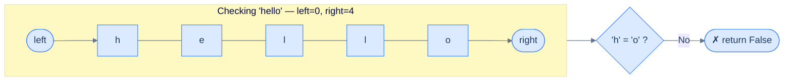

# Palindrome Checker

## The Problem

Given a string `s`, return `true` if it is a **palindrome** — a string that reads the same forwards and backwards **after converting all uppercase letters to lowercase and removing all non-alphanumeric characters**. Return `false` otherwise.

Alphanumeric characters are letters and digits: `[a–z]`, `[A–Z]`, `[0–9]`. Everything else (spaces, punctuation) is skipped.

```
Input:  s = "a man nam a"   →   Output: True   (after filtering: "amannama")
Input:  s = "race car rac ecar" → Output: True (after filtering: "racecarracecar")
Input:  s = "This is codeintuition" → Output: False
```

---

## Examples

**Example 1**
```
Input:  s = "a man nam a"
Output: True
Explanation: Removing spaces and lower-casing gives "amannama", which is a palindrome.
```

**Example 2**
```
Input:  s = "race car rac ecar"
Output: True
Explanation: After filtering, "racecarracecar" is a palindrome.
```

**Example 3**
```
Input:  s = "This is codeintuition"
Output: False
Explanation: After filtering, "thisiscodeintuition" reads differently forwards vs backwards.
```

**Example 4 — single character**
```
Input:  s = "a"
Output: True   (every single alphanumeric character is trivially a palindrome)
```

```quiz
{
  "prompt": "Now your turn!",
  "input": "s = \"Was it a car or a cat I saw?\"",
  "options": ["true", "false"],
  "answer": "true"
}
```

## Constraints

- `0 ≤ s.length ≤ 1000`
- `s` consists of printable ASCII characters

```python run viz=array viz-root=s
class Solution:
    def palindrome_checker(self, s: str) -> bool:
        # Your code goes here — two pointers from both ends; skip
        # non-alphanumerics, compare lowercased; return False on a
        # mismatch, True when they meet.
        return False

s = input()                          # the test case's s
print("true" if Solution().palindrome_checker(s) else "false")
```

```java run viz=array viz-root=s
import java.util.*;

public class Main {
    static class Solution {
        public boolean palindromeChecker(String s) {
            // Your code goes here — two pointers from both ends; skip
            // non-alphanumerics, compare lowercased; return false on a
            // mismatch, true when they meet.
            return false;
        }
    }

    public static void main(String[] args) {
        Scanner sc = new Scanner(System.in);
        String s = sc.hasNextLine() ? sc.nextLine() : "";
        System.out.println(new Solution().palindromeChecker(s));
    }
}
```

```testcases
{
  "args": [
    { "id": "s", "label": "s", "type": "string", "placeholder": "a man nam a" }
  ],
  "cases": [
    { "args": { "s": "a man nam a" }, "expected": "true" },
    { "args": { "s": "race car rac ecar" }, "expected": "true" },
    { "args": { "s": "This is codeintuition" }, "expected": "false" },
    { "args": { "s": "A man, a plan, a canal: Panama" }, "expected": "true" },
    { "args": { "s": "Was it a car or a cat I saw?" }, "expected": "true" },
    { "args": { "s": "" }, "expected": "true" },
    { "args": { "s": "ab" }, "expected": "false" }
  ]
}
```

<details>
<summary><h2>Intuition</h2></summary>


A palindrome's defining property is symmetry across the middle: the first alphanumeric character (lowercased) must equal the last, the second must equal the second-to-last, and so on to the centre. This is the same mirror-pair structure that powered Flip Characters — the only change is the loop body. Instead of swapping each pair, compare it.

Place `left` at index `0` and `right` at index `n − 1`. At each step, the algorithm faces one of four cases. If `s[left]` is non-alphanumeric, advance `left` past it. If `s[right]` is non-alphanumeric, retreat `right` past it. If both are alphanumeric and match (case-insensitive), move both inward. If both are alphanumeric and differ, return `False` immediately — one mismatched pair is enough to rule out a palindrome. When `left >= right` with no mismatch found, every pair has matched and the algorithm returns `True`.

The naive alternative wastes both time and memory. You could filter the string, lowercase it, then build a reversed copy and compare the two strings character by character — `O(n)` time but also `O(n)` extra space for the filtered and reversed copies. Two pointers do the work in one pass with `O(1)` extra space and gain an early-exit bonus: a mismatch at index `0` stops the algorithm before it touches the rest of the string.

```d3 widget=array-1d
{
  "steps": [
    {
      "nodes": [
        {
          "id": "r0",
          "label": "r",
          "kind": "cell",
          "meta": [],
          "slot": 0,
          "cardId": "",
          "layoutKind": ""
        },
        {
          "id": "a0",
          "label": "a",
          "kind": "cell",
          "meta": [],
          "slot": 1,
          "cardId": "",
          "layoutKind": ""
        },
        {
          "id": "c0",
          "label": "c",
          "kind": "cell",
          "meta": [],
          "slot": 2,
          "cardId": "",
          "layoutKind": ""
        },
        {
          "id": "e",
          "label": "e",
          "kind": "cell",
          "meta": [],
          "slot": 3,
          "cardId": "",
          "layoutKind": ""
        },
        {
          "id": "c1",
          "label": "c",
          "kind": "cell",
          "meta": [],
          "slot": 4,
          "cardId": "",
          "layoutKind": ""
        },
        {
          "id": "a1",
          "label": "a",
          "kind": "cell",
          "meta": [],
          "slot": 5,
          "cardId": "",
          "layoutKind": ""
        },
        {
          "id": "r1",
          "label": "r",
          "kind": "cell",
          "meta": [],
          "slot": 6,
          "cardId": "",
          "layoutKind": ""
        }
      ],
      "edges": [],
      "cursor": [
        {
          "name": "left",
          "target": "r0",
          "color": "#3b82f6"
        },
        {
          "name": "right",
          "target": "r1",
          "color": "#f59e0b"
        }
      ],
      "highlight": [],
      "changed": [],
      "removed": [],
      "annotation": "Initial — compare s[0]='r' with s[6]='r' → match, move both inward.",
      "line": 0,
      "frames": [],
      "cardCursor": []
    },
    {
      "nodes": [
        {
          "id": "r0",
          "label": "r",
          "kind": "cell",
          "meta": [],
          "slot": 0,
          "cardId": "",
          "layoutKind": ""
        },
        {
          "id": "a0",
          "label": "a",
          "kind": "cell",
          "meta": [],
          "slot": 1,
          "cardId": "",
          "layoutKind": ""
        },
        {
          "id": "c0",
          "label": "c",
          "kind": "cell",
          "meta": [],
          "slot": 2,
          "cardId": "",
          "layoutKind": ""
        },
        {
          "id": "e",
          "label": "e",
          "kind": "cell",
          "meta": [],
          "slot": 3,
          "cardId": "",
          "layoutKind": ""
        },
        {
          "id": "c1",
          "label": "c",
          "kind": "cell",
          "meta": [],
          "slot": 4,
          "cardId": "",
          "layoutKind": ""
        },
        {
          "id": "a1",
          "label": "a",
          "kind": "cell",
          "meta": [],
          "slot": 5,
          "cardId": "",
          "layoutKind": ""
        },
        {
          "id": "r1",
          "label": "r",
          "kind": "cell",
          "meta": [],
          "slot": 6,
          "cardId": "",
          "layoutKind": ""
        }
      ],
      "edges": [],
      "cursor": [
        {
          "name": "left",
          "target": "a0",
          "color": "#3b82f6"
        },
        {
          "name": "right",
          "target": "a1",
          "color": "#f59e0b"
        }
      ],
      "highlight": [],
      "changed": [],
      "removed": [],
      "annotation": "Compare s[1]='a' with s[5]='a' → match, move both inward.",
      "line": 0,
      "frames": [],
      "cardCursor": []
    },
    {
      "nodes": [
        {
          "id": "r0",
          "label": "r",
          "kind": "cell",
          "meta": [],
          "slot": 0,
          "cardId": "",
          "layoutKind": ""
        },
        {
          "id": "a0",
          "label": "a",
          "kind": "cell",
          "meta": [],
          "slot": 1,
          "cardId": "",
          "layoutKind": ""
        },
        {
          "id": "c0",
          "label": "c",
          "kind": "cell",
          "meta": [],
          "slot": 2,
          "cardId": "",
          "layoutKind": ""
        },
        {
          "id": "e",
          "label": "e",
          "kind": "cell",
          "meta": [],
          "slot": 3,
          "cardId": "",
          "layoutKind": ""
        },
        {
          "id": "c1",
          "label": "c",
          "kind": "cell",
          "meta": [],
          "slot": 4,
          "cardId": "",
          "layoutKind": ""
        },
        {
          "id": "a1",
          "label": "a",
          "kind": "cell",
          "meta": [],
          "slot": 5,
          "cardId": "",
          "layoutKind": ""
        },
        {
          "id": "r1",
          "label": "r",
          "kind": "cell",
          "meta": [],
          "slot": 6,
          "cardId": "",
          "layoutKind": ""
        }
      ],
      "edges": [],
      "cursor": [
        {
          "name": "left",
          "target": "c0",
          "color": "#3b82f6"
        },
        {
          "name": "right",
          "target": "c1",
          "color": "#f59e0b"
        }
      ],
      "highlight": [],
      "changed": [],
      "removed": [],
      "annotation": "Compare s[2]='c' with s[4]='c' → match, move both inward.",
      "line": 0,
      "frames": [],
      "cardCursor": []
    },
    {
      "nodes": [
        {
          "id": "r0",
          "label": "r",
          "kind": "cell",
          "meta": [],
          "slot": 0,
          "cardId": "",
          "layoutKind": ""
        },
        {
          "id": "a0",
          "label": "a",
          "kind": "cell",
          "meta": [],
          "slot": 1,
          "cardId": "",
          "layoutKind": ""
        },
        {
          "id": "c0",
          "label": "c",
          "kind": "cell",
          "meta": [],
          "slot": 2,
          "cardId": "",
          "layoutKind": ""
        },
        {
          "id": "e",
          "label": "e",
          "kind": "cell",
          "meta": [],
          "slot": 3,
          "cardId": "",
          "layoutKind": ""
        },
        {
          "id": "c1",
          "label": "c",
          "kind": "cell",
          "meta": [],
          "slot": 4,
          "cardId": "",
          "layoutKind": ""
        },
        {
          "id": "a1",
          "label": "a",
          "kind": "cell",
          "meta": [],
          "slot": 5,
          "cardId": "",
          "layoutKind": ""
        },
        {
          "id": "r1",
          "label": "r",
          "kind": "cell",
          "meta": [],
          "slot": 6,
          "cardId": "",
          "layoutKind": ""
        }
      ],
      "edges": [],
      "cursor": [
        {
          "name": "left",
          "target": "e",
          "color": "#3b82f6"
        },
        {
          "name": "right",
          "target": "e",
          "color": "#f59e0b"
        }
      ],
      "highlight": [],
      "changed": [],
      "removed": [],
      "annotation": "Pointers meet at index 3 (the middle 'e'). All pairs matched — return True.",
      "line": 0,
      "frames": [],
      "cardCursor": []
    }
  ],
  "title": "Checking \"racecar\" for palindrome"
}
```

<p align="center"><strong>Checking <code>"racecar"</code> for palindrome — every mirror pair matches; when pointers meet at the centre, the check passes.</strong></p>

</details>
<details>
<summary><h2>Applying the Diagnostic Questions</h2></summary>


| Check | Answer for Palindrome Checker |
|---|---|
| ✅ Two positions simultaneously? | Yes — `s[left]` and `s[right]` are compared together at every step |
| ✅ One near start, one near end? | Yes — `left = 0`, `right = n-1` |
| ✅ Both move inward? | Yes — `left++`, `right--` after every matching pair |
| ✅ Simple work at each step? | Yes — one comparison per iteration, return immediately on mismatch |

The structure is identical to Flip Characters — the only difference is the loop body: **compare** instead of **swap**.

**Why check from both ends simultaneously?** A palindrome's definition is symmetric: the character at position `i` from the left must equal the character at position `i` from the right, for every `i` from `0` to `n/2`. Two pointers map this requirement directly — `left` and `right` track the pair at distance `i` from each end. Moving both inward covers every required pair in exactly `n/2` steps.

**What breaks if you use only one pointer?** A single pointer could reverse the string and compare — but that costs O(n) extra space for the reversed copy and a second O(n) pass. Two pointers do it in one pass with O(1) space, and gain the early-exit advantage: as soon as any pair mismatches, `False` is returned without inspecting the rest. For a string like `"abcde...xyz" + "XYZ"`, the mismatch at position 0 stops the algorithm immediately.

</details>
<details>
<summary><h2>What Failure Looks Like</h2></summary>




<p align="center"><strong>The check fails immediately on the first pair — <code>'h' ≠ 'o'</code> is enough to return <code>False</code> without looking at the rest.</strong></p>

This early-exit property makes two-pointer palindrome checking efficient in practice — you never process more pairs than necessary.

</details>
<details>
<summary><h2>Approach</h2></summary>


1. If the string is empty, return `True` immediately — an empty string is vacuously a palindrome.
2. Initialise `left = 0` and `right = len(s) - 1`.
3. While `left < right`, branch on the current pair:
   - If `s[left]` is not alphanumeric, advance `left` and continue.
   - Else if `s[right]` is not alphanumeric, retreat `right` and continue.
   - Else if `s[left].lower() != s[right].lower()`, return `False`.
   - Else advance `left` and retreat `right` — the pair matched.
4. If the loop exits without a mismatch, return `True`.

</details>
<details>
<summary><h2>Solution &amp; Analysis</h2></summary>

### Solution

```python solution time=O(n) space=O(1)
class Solution:
    def palindrome_checker(self, s: str) -> bool:
        if not s:

            # An empty string is considered a palindrome
            return True

        left = 0
        right = len(s) - 1

        while left < right:
            char_left = s[left]
            char_right = s[right]

            # Skip non-alphanumeric characters from the left
            if not char_left.isalnum():
                left += 1

            # Skip non-alphanumeric characters from the end
            elif not char_right.isalnum():
                right -= 1

            # Check if the characters are equal ignoring case
            elif char_left.lower() != char_right.lower():

                # Characters are not equal, so it's not a palindrome
                return False

            # Move both pointers towards the center
            else:
                left += 1
                right -= 1

        # All characters have been checked and are equal, so it's a
        # palindrome
        return True


s = input()                          # the test case's s
print("true" if Solution().palindrome_checker(s) else "false")
```

```java solution
import java.util.*;

public class Main {
    static class Solution {
        public boolean palindromeChecker(String s) {
            if (s.isEmpty()) {

                // An empty string is considered a palindrome
                return true;
            }

            // Initialize two pointers, one pointing to the beginning of the
            // string and the other pointing to the end of the string
            int left = 0;
            int right = s.length() - 1;

            while (left < right) {
                char charLeft = s.charAt(left);
                char charRight = s.charAt(right);

                // Skip non-alphanumeric characters from the left
                if (!Character.isLetterOrDigit(charLeft)) {
                    left++;
                }

                // Skip non-alphanumeric characters from the end
                else if (!Character.isLetterOrDigit(charRight)) {
                    right--;
                }

                // Check if the characters are equal ignoring case
                else if (
                    Character.toLowerCase(charLeft) !=
                    Character.toLowerCase(charRight)
                ) {

                    // Characters are not equal, so it's not a palindrome
                    return false;
                }

                // Move both pointers towards the center
                else {
                    left++;
                    right--;
                }
            }

            // All characters have been checked and are equal, so it's a
            // palindrome
            return true;
        }
    }

    public static void main(String[] args) {
        Scanner sc = new Scanner(System.in);
        String s = sc.hasNextLine() ? sc.nextLine() : "";
        System.out.println(new Solution().palindromeChecker(s));
    }
}
```

### Dry Run — "racecar"

`s = "racecar"`, `n = 7`

| Iteration | `left` | `right` | `s[left]` | `s[right]` | Match? |
|---|---|---|---|---|---|
| 1 | 0 | 6 | `'r'` | `'r'` | ✅ |
| 2 | 1 | 5 | `'a'` | `'a'` | ✅ |
| 3 | 2 | 4 | `'c'` | `'c'` | ✅ |
| — | 3 | 3 | — | — | `left ≥ right` → stop |

**Return `True`** ✓

### Dry Run — "hello"

| Iteration | `left` | `right` | `s[left]` | `s[right]` | Match? |
|---|---|---|---|---|---|
| 1 | 0 | 4 | `'h'` | `'o'` | ❌ → return `False` immediately |

**Return `False`** ✓

### Complexity Analysis

| | Complexity | Reasoning |
|---|---|---|
| **Time** | O(n) worst case | Every mirror pair checked once if all match; exits early on first mismatch |
| **Space** | O(1) | Only two pointer variables |

### Edge Cases

| Scenario | Input | Output | Note |
|---|---|---|---|
| Empty string | `""` | `True` | `left = 0 > right = -1` — loop never runs, vacuously true |
| Single character | `"a"` | `True` | `left = right` — loop never runs |
| Two identical chars | `"aa"` | `True` | One comparison, both match |
| Two different chars | `"ab"` | `False` | One comparison, immediate mismatch |
| All same characters | `"aaaa"` | `True` | Every pair matches |

</details>
<details>
<summary><h2>Key Takeaway</h2></summary>


Palindrome Checker is the comparison variant of the two-pointer reversal. Same skeleton as Flip Characters, same pointer movement — only the loop body changes from *swap* to *compare* with an early-exit on mismatch.

</details>
