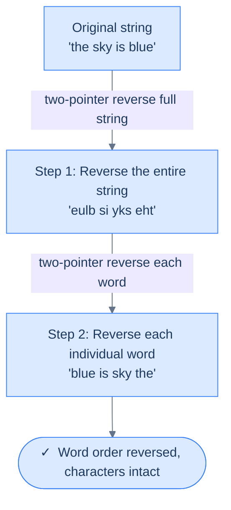
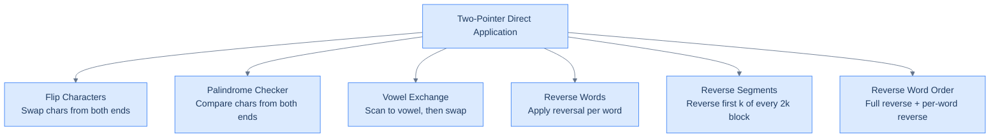

# Reverse Word Order

## The Problem

Given a string `s`, return a new string with the **words in reverse order**, separated by a single space, with no leading or trailing whitespace. Words in the input are separated by **one or more** spaces, and the input may contain leading, trailing, or multiple spaces between words — all of which must be normalised in the output.

```
Input:  s = "This is a    string"
Output:     "string a is This"
```

The words flip order; each word's characters stay intact; redundant whitespace disappears.

---

## Examples

**Example 1 — multiple spaces inside the string**
```
Input:  s = "This is a    string"
Output:     "string a is This"
Explanation: All four words are concatenated in reverse order and separated
             by a single space.
```

**Example 2 — leading and trailing spaces**
```
Input:  s = "   fizz buzz  "
Output:     "buzz fizz"
Explanation: Leading and trailing spaces are removed.
```

**Example 3 — single word**
```
Input:  s = "random"
Output:     "random"
Explanation: Only one word; the result is the input.
```

**Example 4**
```
Input:  s = "a good example"
Output:     "example good a"
```

```quiz
{
  "prompt": "Now your turn!",
  "input": "s = \"learn two pointers\"",
  "options": ["pointers two learn", "sredniop owt nrael", "learn two pointers", "two learn pointers"],
  "answer": "pointers two learn"
}
```

## Constraints

- `0 ≤ s.length ≤ 1000`
- `s` consists of printable ASCII characters; words are separated by one or more spaces

```python run viz=array viz-root=arr
class Solution:
    def reverse_word_order(self, s: str) -> str:
        # Your code goes here — reverse the whole string, then reverse each
        # word back in place; finally collapse runs of spaces to one and trim.
        return s

s = input()                          # the test case's s
print(Solution().reverse_word_order(s))
```

```java run viz=array viz-root=arr
import java.util.*;

public class Main {
    static class Solution {
        public String reverseWordOrder(String s) {
            // Your code goes here — reverse the whole string, then reverse each
            // word back in place; finally collapse runs of spaces to one and trim.
            return s;
        }
    }

    public static void main(String[] args) {
        Scanner sc = new Scanner(System.in);
        String s = sc.hasNextLine() ? sc.nextLine() : "";
        System.out.println(new Solution().reverseWordOrder(s));
    }
}
```

```testcases
{
  "args": [
    { "id": "s", "label": "s", "type": "string", "placeholder": "This is a    string" }
  ],
  "cases": [
    { "args": { "s": "This is a    string" }, "expected": "string a is This" },
    { "args": { "s": "   fizz buzz  " }, "expected": "buzz fizz" },
    { "args": { "s": "learn two pointers" }, "expected": "pointers two learn" },
    { "args": { "s": "one two three" }, "expected": "three two one" },
    { "args": { "s": "  a  b  " }, "expected": "b a" },
    { "args": { "s": "random" }, "expected": "random" }
  ]
}
```

<details>
<summary><h2>Intuition</h2></summary>


Reversing the *order* of words while keeping each word's characters intact is a structural mismatch with single-axis two-pointer reversal. A whole-string reverse flips word order, but as a side effect it also reverses each word's characters. A per-word reverse leaves word order untouched. Neither pass alone produces the right output — yet running both in sequence does.

Two sequential reversals cancel inside each word and compound across words. After the first pass (reverse the whole string), the words sit in reverse order but each word's letters are backwards. After the second pass (reverse each word in place using the Reverse Words algorithm), every word's letters return to their original order, because each word has now been reversed twice — but the words themselves have only been moved once. Place `left = 0` and `right = n − 1` for the first pass, then walk an outer scan that finds each word's `[word_start, word_end]` for the second pass. Both passes are direct applications of the two-pointer template.

A direct approach — split on whitespace, reverse the resulting list, join with single spaces — works but allocates `O(n)` extra space for the token list and its reversed copy. The two-pass trick does the same work in place on the mutable character array, with `O(n)` time (each character visited at most twice) and `O(1)` extra space beyond the array itself. The whitespace normalisation step at the end handles redundant spaces in the input — the two-pointer machinery never has to special-case them.



<p align="center"><strong>The two-step trick — reversing the whole string flips word order but scrambles each word; reversing each word individually unscrambles the characters while keeping the new word order.</strong></p>

</details>
<details>
<summary><h2>Why This Works — The Intuition</h2></summary>


Let's trace exactly what each step does to `"the sky"`:

```d3 widget=array-1d
{
  "steps": [
    {
      "nodes": [
        {
          "id": "0",
          "label": "t",
          "kind": "cell",
          "meta": [],
          "slot": 0,
          "cardId": "",
          "layoutKind": ""
        },
        {
          "id": "1",
          "label": "h",
          "kind": "cell",
          "meta": [],
          "slot": 1,
          "cardId": "",
          "layoutKind": ""
        },
        {
          "id": "2",
          "label": "e",
          "kind": "cell",
          "meta": [],
          "slot": 2,
          "cardId": "",
          "layoutKind": ""
        },
        {
          "id": "3",
          "label": " ",
          "kind": "cell",
          "meta": [],
          "slot": 3,
          "cardId": "",
          "layoutKind": ""
        },
        {
          "id": "4",
          "label": "s",
          "kind": "cell",
          "meta": [],
          "slot": 4,
          "cardId": "",
          "layoutKind": ""
        },
        {
          "id": "5",
          "label": "k",
          "kind": "cell",
          "meta": [],
          "slot": 5,
          "cardId": "",
          "layoutKind": ""
        },
        {
          "id": "6",
          "label": "y",
          "kind": "cell",
          "meta": [],
          "slot": 6,
          "cardId": "",
          "layoutKind": ""
        }
      ],
      "edges": [],
      "cursor": [
        {
          "name": "left",
          "target": "0",
          "color": "#3b82f6"
        },
        {
          "name": "right",
          "target": "6",
          "color": "#f59e0b"
        }
      ],
      "highlight": [
        "0",
        "1",
        "2",
        "3",
        "4",
        "5",
        "6"
      ],
      "changed": [],
      "removed": [],
      "annotation": "Step 1: reverse the entire string. Pointers start at the two ends.",
      "line": 0,
      "frames": [],
      "cardCursor": []
    },
    {
      "nodes": [
        {
          "id": "0",
          "label": "y",
          "kind": "cell",
          "meta": [],
          "slot": 0,
          "cardId": "",
          "layoutKind": ""
        },
        {
          "id": "1",
          "label": "k",
          "kind": "cell",
          "meta": [],
          "slot": 1,
          "cardId": "",
          "layoutKind": ""
        },
        {
          "id": "2",
          "label": "s",
          "kind": "cell",
          "meta": [],
          "slot": 2,
          "cardId": "",
          "layoutKind": ""
        },
        {
          "id": "3",
          "label": " ",
          "kind": "cell",
          "meta": [],
          "slot": 3,
          "cardId": "",
          "layoutKind": ""
        },
        {
          "id": "4",
          "label": "e",
          "kind": "cell",
          "meta": [],
          "slot": 4,
          "cardId": "",
          "layoutKind": ""
        },
        {
          "id": "5",
          "label": "h",
          "kind": "cell",
          "meta": [],
          "slot": 5,
          "cardId": "",
          "layoutKind": ""
        },
        {
          "id": "6",
          "label": "t",
          "kind": "cell",
          "meta": [],
          "slot": 6,
          "cardId": "",
          "layoutKind": ""
        }
      ],
      "edges": [],
      "cursor": [],
      "highlight": [
        "0",
        "1",
        "2",
        "3",
        "4",
        "5",
        "6"
      ],
      "changed": [],
      "removed": [],
      "annotation": "After Step 1: the string is reversed to 'yks eht'. Word order is flipped; each word's letters are also flipped.",
      "line": 0,
      "frames": [],
      "cardCursor": []
    },
    {
      "nodes": [
        {
          "id": "0",
          "label": "y",
          "kind": "cell",
          "meta": [],
          "slot": 0,
          "cardId": "",
          "layoutKind": ""
        },
        {
          "id": "1",
          "label": "k",
          "kind": "cell",
          "meta": [],
          "slot": 1,
          "cardId": "",
          "layoutKind": ""
        },
        {
          "id": "2",
          "label": "s",
          "kind": "cell",
          "meta": [],
          "slot": 2,
          "cardId": "",
          "layoutKind": ""
        },
        {
          "id": "3",
          "label": " ",
          "kind": "cell",
          "meta": [],
          "slot": 3,
          "cardId": "",
          "layoutKind": ""
        },
        {
          "id": "4",
          "label": "e",
          "kind": "cell",
          "meta": [],
          "slot": 4,
          "cardId": "",
          "layoutKind": ""
        },
        {
          "id": "5",
          "label": "h",
          "kind": "cell",
          "meta": [],
          "slot": 5,
          "cardId": "",
          "layoutKind": ""
        },
        {
          "id": "6",
          "label": "t",
          "kind": "cell",
          "meta": [],
          "slot": 6,
          "cardId": "",
          "layoutKind": ""
        }
      ],
      "edges": [],
      "cursor": [
        {
          "name": "left",
          "target": "0",
          "color": "#3b82f6"
        },
        {
          "name": "right",
          "target": "2",
          "color": "#f59e0b"
        }
      ],
      "highlight": [
        "0",
        "1",
        "2"
      ],
      "changed": [],
      "removed": [],
      "annotation": "Step 2a: scan finds the first word at indices [0..2]. Reverse it.",
      "line": 0,
      "frames": [],
      "cardCursor": []
    },
    {
      "nodes": [
        {
          "id": "0",
          "label": "s",
          "kind": "cell",
          "meta": [],
          "slot": 0,
          "cardId": "",
          "layoutKind": ""
        },
        {
          "id": "1",
          "label": "k",
          "kind": "cell",
          "meta": [],
          "slot": 1,
          "cardId": "",
          "layoutKind": ""
        },
        {
          "id": "2",
          "label": "y",
          "kind": "cell",
          "meta": [],
          "slot": 2,
          "cardId": "",
          "layoutKind": ""
        },
        {
          "id": "3",
          "label": " ",
          "kind": "cell",
          "meta": [],
          "slot": 3,
          "cardId": "",
          "layoutKind": ""
        },
        {
          "id": "4",
          "label": "e",
          "kind": "cell",
          "meta": [],
          "slot": 4,
          "cardId": "",
          "layoutKind": ""
        },
        {
          "id": "5",
          "label": "h",
          "kind": "cell",
          "meta": [],
          "slot": 5,
          "cardId": "",
          "layoutKind": ""
        },
        {
          "id": "6",
          "label": "t",
          "kind": "cell",
          "meta": [],
          "slot": 6,
          "cardId": "",
          "layoutKind": ""
        }
      ],
      "edges": [],
      "cursor": [
        {
          "name": "left",
          "target": "4",
          "color": "#3b82f6"
        },
        {
          "name": "right",
          "target": "6",
          "color": "#f59e0b"
        }
      ],
      "highlight": [
        "4",
        "5",
        "6"
      ],
      "changed": [],
      "removed": [],
      "annotation": "Step 2b: scan finds the second word at indices [4..6]. Reverse it.",
      "line": 0,
      "frames": [],
      "cardCursor": []
    },
    {
      "nodes": [
        {
          "id": "0",
          "label": "s",
          "kind": "cell",
          "meta": [],
          "slot": 0,
          "cardId": "",
          "layoutKind": ""
        },
        {
          "id": "1",
          "label": "k",
          "kind": "cell",
          "meta": [],
          "slot": 1,
          "cardId": "",
          "layoutKind": ""
        },
        {
          "id": "2",
          "label": "y",
          "kind": "cell",
          "meta": [],
          "slot": 2,
          "cardId": "",
          "layoutKind": ""
        },
        {
          "id": "3",
          "label": " ",
          "kind": "cell",
          "meta": [],
          "slot": 3,
          "cardId": "",
          "layoutKind": ""
        },
        {
          "id": "4",
          "label": "t",
          "kind": "cell",
          "meta": [],
          "slot": 4,
          "cardId": "",
          "layoutKind": ""
        },
        {
          "id": "5",
          "label": "h",
          "kind": "cell",
          "meta": [],
          "slot": 5,
          "cardId": "",
          "layoutKind": ""
        },
        {
          "id": "6",
          "label": "e",
          "kind": "cell",
          "meta": [],
          "slot": 6,
          "cardId": "",
          "layoutKind": ""
        }
      ],
      "edges": [],
      "cursor": [],
      "highlight": [],
      "changed": [],
      "removed": [],
      "annotation": "Final: 'sky the' — words are in reverse order, characters intact.",
      "line": 0,
      "frames": [],
      "cardCursor": []
    }
  ],
  "title": "Reversing word order in \"the sky\""
}
```

<p align="center"><strong>Step-by-step on <code>"the sky"</code> — Step 1 reverses the whole string (flipping word order but scrambling each word); Step 2 reverses each word, unscrambling letters while keeping the new word order.</strong></p>

Each word is reversed **twice** in total — once by the full-string reversal, once by the per-word reversal. Two reversals cancel out, returning each word's characters to their original order. But the words themselves have moved to their new positions.

</details>
<details>
<summary><h2>Applying the Diagnostic Questions</h2></summary>


| Check | Answer for Reverse Word Order |
|---|---|
| ✅ Two positions simultaneously? | Yes — in both Step 1 and Step 2, `chars[left]` and `chars[right]` are swapped together |
| ✅ One near start, one near end? | Yes — Step 1: `left=0`, `right=n-1`; Step 2: per word, `left=word_start`, `right=word_end` |
| ✅ Both move inward? | Yes — `left++`, `right--` in both reversal passes |
| ✅ Simple work at each step? | Yes — one swap per iteration in each pass |

This is a **composed** direct application: two separate two-pointer passes applied in sequence. Step 1 (full reverse) is Flip Characters on the whole string. Step 2 (per-word reverse) is Reverse Words from the previous lesson. Each pass passes all four checks independently.

**Why does composing two reversals give word-order reversal?** Because reversing is its own inverse: reverse a sequence twice and you get back the original. For each word, the full-string reversal scrambles its characters, and the per-word reversal unscrambles them — net effect on the word's characters: zero. But the word's **position** in the string only experiences the full-string reversal (the per-word reversal doesn't change inter-word positions, only intra-word order). So the characters come out intact, but the word slots have been rearranged. See the "Why This Works" section above for the full concrete trace.

**What breaks if you only do Step 1?** After `reverse(0, n-1)`, words are in reverse order — correct — but every word's characters are also reversed — wrong. `"the sky"` → `"yks eht"` instead of `"sky the"`. Step 2 is what restores each word's internal character order without disturbing the newly achieved word-order reversal.

</details>
<details>
<summary><h2>Approach</h2></summary>


1. Convert string to a mutable character list
2. **Step 1:** Reverse the entire character array with two pointers (`left=0`, `right=n-1`)
3. **Step 2:** Scan through the array; for each word found at range `[l, r]`, reverse `chars[l..r]` with two pointers
4. Return `"".join(chars)`

This reuses `reverse_segment(arr, left, right)` from the previous lesson twice.

</details>
<details>
<summary><h2>Solution &amp; Analysis</h2></summary>

### Solution

```python solution time=O(n) space=O(n)
class Solution:
    def remove_extra_spaces(self, s: str) -> str:
        return " ".join(s.split()).strip()

    def find_word_end(self, arr, start):

        # Assign the start index to the end index
        end = start

        # Iterate through the string until a space is encountered
        while end < len(arr) and arr[end] != " ":
            end += 1

        # Return the index of the last character of the word
        return end - 1

    def reverse_word(self, arr, left, right):

        # Use a while loop to traverse the string using the two pointers
        while left < right:

            # Swap the characters pointed by the left and right pointers
            arr[left], arr[right] = arr[right], arr[left]

            # Move the pointers towards the center of the string
            left += 1
            right -= 1

    def reverse_word_order(self, s: str) -> str:

        # Reverse the string
        s = s[::-1]

        # Convert string to list of characters
        arr = list(s)

        start = 0
        while start < len(arr):
            if arr[start] == " ":
                start += 1
                continue

            # Find the end of the current word
            end = self.find_word_end(arr, start)

            # Reverse the current word using two pointer method
            self.reverse_word(arr, start, end)

            # Move start to the start of the next word
            start = end + 1

        # Convert list to string and remove extra spaces
        return self.remove_extra_spaces("".join(arr))


s = input()                          # the test case's s
print(Solution().reverse_word_order(s))
```

```java solution
import java.util.*;

public class Main {
    static class Solution {
        private String removeExtraSpaces(String s) {

            // Use regex to replace multiple spaces with a single space and
            // trim leading/trailing spaces
            return s.replaceAll("\\s+", " ").trim();
        }

        private String reverse(String s) {

            // Use StringBuilder to reverse the string
            StringBuilder sb = new StringBuilder(s);

            // Reverse the string
            sb.reverse();

            // Return the reversed string
            return sb.toString();
        }

        private int findWordEnd(char[] arr, int start) {

            // Assign the start index to the end index
            int end = start;

            // Iterate through the string until a space is encountered
            while (end < arr.length && arr[end] != ' ') {
                end++;
            }

            // Return the index of the last character of the word
            return end - 1;
        }

        private void reverseWord(char[] arr, int left, int right) {

            // Use a while loop to traverse the string using the two pointers
            while (left < right) {

                // Swap the characters pointed by the left and right pointers
                char temp = arr[left];
                arr[left] = arr[right];
                arr[right] = temp;

                // Move the pointers towards the center of the string
                left++;
                right--;
            }
        }

        public String reverseWordOrder(String s) {

            // Reverse the string
            s = reverse(s);

            // Convert string to array of characters
            char[] arr = s.toCharArray();

            int start = 0;
            while (start < arr.length) {
                if (arr[start] == ' ') {
                    start++;
                    continue;
                }

                // Find the end of the current word
                int end = findWordEnd(arr, start);

                // Reverse the current word using two pointer method
                reverseWord(arr, start, end);

                // Move start to the start of the next word
                start = end + 1;
            }

            // Convert char array to string and remove extra spaces using
            // regex
            return removeExtraSpaces(new String(arr));
        }
    }

    public static void main(String[] args) {
        Scanner sc = new Scanner(System.in);
        String s = sc.hasNextLine() ? sc.nextLine() : "";
        System.out.println(new Solution().reverseWordOrder(s));
    }
}
```

### Dry Run — "the sky is blue"

**Step 1: Reverse entire string**

```
"the sky is blue"
       ↓
"eulb si yks eht"
```

(Characters are in exact reverse order — words are backwards, characters within each word are backwards)

**Step 2: Reverse each word**

| Word found | Range | Before | After |
|---|---|---|---|
| `"eulb"` | [0, 3] | `eulb` | `blue` |
| `"si"` | [5, 6] | `si` | `is` |
| `"yks"` | [8, 10] | `yks` | `sky` |
| `"eht"` | [12, 14] | `eht` | `the` |

**Final result: `"blue is sky the"`** ✓

### Complexity Analysis

| | Complexity | Reasoning |
|---|---|---|
| **Time** | O(n) | Step 1 visits every character once (O(n)); Step 2 visits every character once more (O(n)); total = O(2n) = O(n) |
| **Space** | O(n) | The `chars` list (O(1) if working with a mutable char array) |

### Edge Cases

| Scenario | Input | Output | Note |
|---|---|---|---|
| Single word | `"hello"` | `"hello"` | Full reverse gives `"olleh"`; reversing single word gives `"hello"` back |
| Two words | `"hi there"` | `"there hi"` | One full reverse + two word reverses |
| Leading space | `" hello"` | `"hello"` | Space normalised out by `removeExtraSpaces` |
| Trailing space | `"hello "` | `"hello"` | Trailing space stripped |
| Multiple spaces | `"hi   there"` | `"there hi"` | Multi-space runs collapsed to one |
| Empty string | `""` | `""` | No words; result is empty |

</details>
<details>
<summary><h2>The Full Picture: All Six Problems</h2></summary>


You've now seen every direct-application two-pointer problem in this section. They all share the same skeleton — what changes is the work done inside the loop:



<p align="center"><strong>All six direct-application problems — one template, six variations in the loop body.</strong></p>

</details>
<details>
<summary><h2>Key Takeaway</h2></summary>


Reverse Word Order composes two direct-application reversals — first the whole string, then each word — to achieve an effect neither pass produces alone. The reverse-all-then-reverse-each trick recurs across string-manipulation problems and is the canonical way to permute word order in place.

</details>
