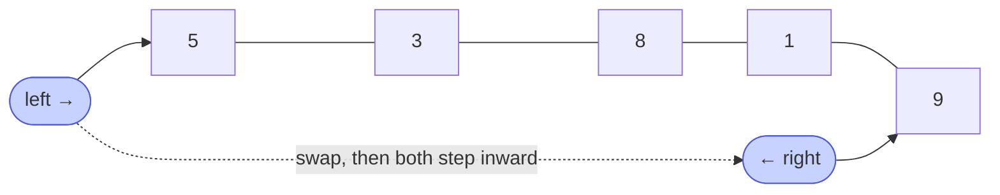

# Memorize: Two Pointers

## In a Hurry?

- **One-Line Idea**: Walk one pointer from the left end and another from the right end, doing constant-time work on each pair until they meet — `O(n)` time, `O(1)` extra space.
- **Complexities**: `O(n)` time, `O(1)` extra space (where `n` is the array length).
- **When to Use**: The problem operates on pairs of elements drawn from opposite ends of an array — reversal, palindrome check, mirror-pair swap, paired sum on a sorted array.

---

## One-Line Mnemonic

**"Squeeze from both ends until the pointers meet."**

The image is a vice closing on the middle of the array — `left` advances inward, `right` retreats inward, and every step processes one pair until they collide.

---

## Real-World Analogy

Imagine two readers standing at opposite ends of a long shelf of books, walking toward each other and pairing off the books they pass. Each reader carries one book at a time; when they meet, every pair has been compared, swapped, or counted. Neither reader ever turns around. The shelf has been processed in a single pass with no extra storage beyond the two readers themselves.

---

## Visual Summary



<p align="center"><strong>Two pointers start at opposite ends and move inward in one pass — reverse, palindrome test, walk-to-meet — O(n) time and O(1) space, with no second array.</strong></p>

---

## Pattern Recognition Triggers

The problem fits two pointers (direct application) when **all four** of the following hold. These are the same questions the pattern's Recognition Checklist asks.

- The problem operates on **two positions of the array simultaneously** — every iteration reads or modifies a pair.
- The natural starting state has **one pointer near the start and one near the end** of the array (or a sub-range with the same shape).
- Each iteration moves **both pointers inward** (or one inward, then the other) — neither pointer ever reverses direction.
- The work done per step is **constant-time** — a swap, a comparison, a single arithmetic check.

Common surface signals: "reverse in place," "check palindrome," "find a pair with target sum in a sorted array," "swap matching elements from both ends." If a problem says "find a pair," reach for two pointers first.

---

## Don't Confuse With

| | **Two Pointers (this pattern)** | **Sliding Window** |
|---|---|---|
| **Starting positions** | `left = 0`, `right = n − 1` (opposite ends) | `left = 0`, `right = 0` (same end) |
| **Direction of motion** | Pointers converge inward | Pointers expand outward (window grows or shifts) |
| **Loop invariant** | The unprocessed region is `[left .. right]` | The window `[left .. right]` satisfies a running condition |
| **Problem shape** | "find a pair" / "process pairs from both ends" | "find a subarray" / "longest or shortest contiguous run" |
| **When this goes wrong** | You're scanning a contiguous window's running sum/count → wrong pattern, use sliding window | You're swapping or comparing mirror-pair elements → wrong pattern, use two pointers |

The two patterns share the surface notation (`left`, `right`) but diverge on the loop invariant. Two pointers shrinks the candidate region; sliding window slides or grows it.

---

## Template Code

```python
# Two-pointer direct application — generic skeleton.
def two_pointer(arr):
    left = 0
    right = len(arr) - 1

    while left < right:
        # 1. Read arr[left] and arr[right].
        # 2. Do constant-time work (swap, compare, count).
        # 3. Advance one or both pointers inward.

        # Default: both pointers move every iteration.
        left += 1
        right -= 1
```

Three knobs change per problem:

- **The loop body** — swap, compare, count, or skip based on `arr[left]` and `arr[right]`.
- **The advance rule** — both pointers may advance together, or one alone (e.g. Vowel Exchange advances only the consonant side).
- **The termination check** — `left < right` for "stop at the middle" (odd length), `left <= right` for "include the middle" (rare; only when the single middle element still needs processing).

---

## Common Mistakes

- **Stopping at `left <= right` when only pairs matter**:
  - *What*: using `<=` on an odd-length array runs one extra iteration with `left == right`, performing a no-op swap or a self-comparison.
  - *Why*: by the time `left == right`, every mirror pair has already been processed; the middle element has no partner.
  - *Fix*: use `left < right` unless the problem genuinely requires processing a lone middle element.
- **Advancing both pointers when only one should move**:
  - *What*: in problems with a per-side filter (Vowel Exchange, Palindrome Checker with non-alphanumeric skipping), incrementing both `left` and `right` on a skip step throws away one valid candidate.
  - *Why*: the skip means *this side* hasn't found a usable element yet; the other side is still in a valid position.
  - *Fix*: use `if / elif / else` so each iteration advances exactly the side that needs to move.
- **Forgetting the empty-array guard**:
  - *What*: an empty input produces `right = -1`, which is fine for the `while left < right` check but breaks any code that reads `arr[right]` before the loop.
  - *Why*: indexing `-1` in Python wraps to the last element; in Java it throws.
  - *Fix*: either guard with `if not arr` at the top, or ensure all reads are inside the `while` so they never run when the array is empty.
- **Treating the technique as language-specific**:
  - *What*: assuming two pointers needs Python's tuple-swap or Java's temp variable.
  - *Why*: the pattern is about index arithmetic, not syntax.
  - *Fix*: the same algorithm runs in any language; only the swap syntax differs.

---

## Minimum Viable Example

Reverse `[1, 2, 3, 4]` in place:

```
[1, 2, 3, 4]   left=0, right=3 → swap arr[0] and arr[3]  → [4, 2, 3, 1]
[4, 2, 3, 1]   left=1, right=2 → swap arr[1] and arr[2]  → [4, 3, 2, 1]
[4, 3, 2, 1]   left=2, right=1 → left > right → loop exits
```

Four elements, three lines, the complete pattern.

---

## Quick Recall

**Q: What loop condition do two-pointer reversals use?**
A: `while left < right` — the loop exits when the pointers meet (odd length) or cross (even length).

**Q: What time and space complexity does direct-application two pointers achieve?**
A: `O(n)` time and `O(1)` extra space.

**Q: When does only one pointer advance in an iteration?**
A: When the problem filters elements (e.g. skip consonants, skip non-alphanumeric) — the pointer sitting on a non-candidate advances alone until both sides land on candidates.

**Q: What's the first thing to check before reaching for two pointers on a "find a pair" problem?**
A: Whether the array is sorted. Direct application of two pointers needs a sorted (or otherwise monotonic) array; otherwise sort first or use a hash map.

**Q: Why do mirror-pair problems prefer two pointers over reversing a copy?**
A: Two pointers run in one pass with `O(1)` extra space and gain early-exit (e.g. palindrome checks stop on the first mismatch); reversing a copy needs `O(n)` extra space and a second pass.
