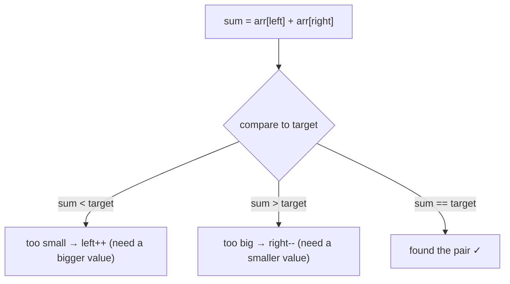

# Pattern: Two Pointers Reduction

## Why It Exists

You've met two pointers when the array was already set up for them — reverse, palindrome, walk inward. But the classic interview question is sneakier: *given an array, find two numbers that add up to a target.* The obvious answer checks every pair — `O(n²)`.

The plain two-pointer move doesn't obviously apply: the numbers are in random order, so "move inward from both ends" tells you nothing. But change one thing — **sort the array first** — and suddenly the ends mean something: the left end is the smallest value, the right end the largest. Now the *sum* of the two ends tells you exactly which pointer to move. That one-time reshape is the **reduction**: massage the problem until the base two-pointer pass solves it.

## See It Work

On a *sorted* array, walk one pointer from each end and let the running sum steer them. Pick a case below, **Run** it, then **Visualise** the converge.

> ▶ Run it against a case, then click **Visualise** — `left` rises and `right` falls based on whether the sum is under or over the target.

```python run viz=array viz-root=arr
import ast

arr = ast.literal_eval(input())      # sorted ascending
target = int(input())
left, right = 0, len(arr) - 1
found = False
while left < right:
    s = arr[left] + arr[right]
    if s == target:
        print(arr[left], arr[right])           # the matching pair
        found = True
        break
    elif s < target:
        left += 1                              # too small → raise the low end
    else:
        right -= 1                             # too big → lower the high end
if not found:
    print("none")
```

```java run viz=array viz-root=arr
import java.util.*;

public class Main {
  public static void main(String[] args) {
    Scanner sc = new Scanner(System.in);
    int[] arr = parseIntArray(sc.nextLine());   // sorted ascending
    int target = Integer.parseInt(sc.nextLine().trim());
    int left = 0, right = arr.length - 1;
    boolean found = false;
    while (left < right) {
      int s = arr[left] + arr[right];
      if (s == target) {
        System.out.println(arr[left] + " " + arr[right]);   // the matching pair
        found = true;
        break;
      } else if (s < target) {
        left++;                                  // too small → raise the low end
      } else {
        right--;                                 // too big → lower the high end
      }
    }
    if (!found) System.out.println("none");
  }

  // "[1, 2, 3]" → {1, 2, 3} — reads the test case's arr
  static int[] parseIntArray(String line) {
    String inner = line.replaceAll("[\\[\\]\\s]", "");
    if (inner.isEmpty()) return new int[0];
    String[] parts = inner.split(",");
    int[] out = new int[parts.length];
    for (int i = 0; i < parts.length; i++) out[i] = Integer.parseInt(parts[i]);
    return out;
  }
}
```

```testcases
{
  "args": [
    { "id": "arr", "label": "arr (sorted)", "type": "int[]", "placeholder": "[2, 4, 5, 8, 9]" },
    { "id": "target", "label": "target", "type": "int", "placeholder": "13" }
  ],
  "cases": [
    { "args": { "arr": "[2, 4, 5, 8, 9]", "target": "13" }, "expected": "4 9" },
    { "args": { "arr": "[1, 2, 3, 4]", "target": "7" }, "expected": "3 4" },
    { "args": { "arr": "[2, 4, 5, 8, 9]", "target": "100" }, "expected": "none" },
    { "args": { "arr": "[1, 2, 3, 4]", "target": "3" }, "expected": "1 2" }
  ]
}
```

## How It Works

The reduction is two moves: **reshape, then run the base pattern.** For pair-sum, the reshape is a sort; the run is two pointers converging, steered by a simple rule:

- `sum < target` → the pair is too small, and `arr[left]` is the smallest value left, so it can never reach the target with anything smaller — **discard it: `left += 1`**.
- `sum > target` → too big; `arr[right]` is the largest, hopeless with anything bigger — **discard it: `right -= 1`**.
- `sum == target` → found.



<p align="center"><strong>on a sorted array the sum tells you which wall to move: too small, raise the floor (<code>left++</code>); too big, lower the ceiling (<code>right--</code>).</strong></p>

What makes it correct is the **invariant**: every time you move a pointer, the value you discard could not have been in *any* remaining valid pair — so nothing is missed. Each element is visited at most once, so the scan is **`O(n)` time, `O(1)` space**; the sort makes the whole thing `O(n log n)`. You collapsed `O(n²)` to `O(n log n)` by paying once to sort.

When do you reach for it? Run the recognition checklist: **(1)** order doesn't matter (so sorting is allowed), **(2)** you need *two* items at once, and **(3)** traversing from both ends becomes meaningful once sorted. If sorting unlocks (3), it's almost certainly a reduction.

### Key Takeaway

Reshape a pair-finding problem (usually by sorting) so the two ends carry meaning, then converge: the sum says which pointer to move, turning `O(n²)` into one `O(n)` sweep.

## Trace It

Two Sum on `[2, 4, 5, 8, 9]`, target `13`:

| `left` | `right` | `arr[left] + arr[right]` | vs 13 | move |
|---|---|---|---|---|
| 0 (`2`) | 4 (`9`) | 11 | too small | `left++` |
| 1 (`4`) | 4 (`9`) | 13 | equal | **found `4, 9`** |

Before you read on: when the first step discarded `arr[left] = 2`, why was it safe to never look at `2` again?

Because `9` was already the *largest* value available, and `2 + 9` fell short of `13`. Pairing `2` with anything smaller than `9` only makes the sum smaller — so no pair containing `2` could ever reach `13`. Discarding it loses nothing. That's the invariant doing the pruning, one element per step.

## Your Turn

The reusable shape returns the *indices* of a pair that sums to the target, or nothing. Implement `two_sum_sorted(arr, target)` on a sorted array: two pointers from both ends, steered by the running sum — return the index pair the moment it matches, or `None` if they cross.

```python run viz=array viz-root=arr
import ast

def two_sum_sorted(arr, target):
    # Your code goes here — two pointers from both ends; if the sum is too
    # small advance left, too big retreat right, equal return (left, right).
    return None

arr = ast.literal_eval(input())      # sorted ascending
target = int(input())
result = two_sum_sorted(arr, target)
print("none" if result is None else f"{result[0]} {result[1]}")
```

```java run viz=array viz-root=arr
import java.util.*;

public class Main {
  static int[] twoSumSorted(int[] arr, int target) {
    // Your code goes here — two pointers from both ends; if the sum is too
    // small advance left, too big retreat right, equal return {left, right}.
    return null;
  }

  public static void main(String[] args) {
    Scanner sc = new Scanner(System.in);
    int[] arr = parseIntArray(sc.nextLine());
    int target = Integer.parseInt(sc.nextLine().trim());
    int[] result = twoSumSorted(arr, target);
    System.out.println(result == null ? "none" : result[0] + " " + result[1]);
  }

  static int[] parseIntArray(String line) {
    String inner = line.replaceAll("[\\[\\]\\s]", "");
    if (inner.isEmpty()) return new int[0];
    String[] parts = inner.split(",");
    int[] out = new int[parts.length];
    for (int i = 0; i < parts.length; i++) out[i] = Integer.parseInt(parts[i]);
    return out;
  }
}
```

```testcases
{
  "args": [
    { "id": "arr", "label": "arr (sorted)", "type": "int[]", "placeholder": "[2, 4, 5, 8, 9]" },
    { "id": "target", "label": "target", "type": "int", "placeholder": "13" }
  ],
  "cases": [
    { "args": { "arr": "[2, 4, 5, 8, 9]", "target": "13" }, "expected": "1 4" },
    { "args": { "arr": "[1, 3, 6, 10]", "target": "100" }, "expected": "none" },
    { "args": { "arr": "[1, 2, 3, 4]", "target": "7" }, "expected": "2 3" },
    { "args": { "arr": "[0, 1]", "target": "1" }, "expected": "0 1" }
  ]
}
```

<details>
<summary>Editorial</summary>

On a sorted array the two ends bracket the whole range of reachable sums. If `arr[left] + arr[right]` is too small, `arr[left]` is the smallest value available and can't reach the target paired with anything else — advance `left`. If it's too big, `arr[right]` is the largest and is equally hopeless — retreat `right`. When the sum equals the target, return the index pair. If the pointers cross with no match, no pair sums to the target, so return `None`. `O(n)` after the `O(n log n)` sort, `O(1)` space.

```python solution time=O(n) space=O(1)
import ast

def two_sum_sorted(arr, target):
    left, right = 0, len(arr) - 1
    while left < right:
        s = arr[left] + arr[right]
        if s == target:
            return (left, right)
        if s < target:
            left += 1
        else:
            right -= 1
    return None

arr = ast.literal_eval(input())
target = int(input())
result = two_sum_sorted(arr, target)
print("none" if result is None else f"{result[0]} {result[1]}")
```

```java solution
import java.util.*;

public class Main {
  static int[] twoSumSorted(int[] arr, int target) {
    int left = 0, right = arr.length - 1;
    while (left < right) {
      int s = arr[left] + arr[right];
      if (s == target) return new int[]{left, right};
      if (s < target) left++;
      else right--;
    }
    return null;
  }

  public static void main(String[] args) {
    Scanner sc = new Scanner(System.in);
    int[] arr = parseIntArray(sc.nextLine());
    int target = Integer.parseInt(sc.nextLine().trim());
    int[] result = twoSumSorted(arr, target);
    System.out.println(result == null ? "none" : result[0] + " " + result[1]);
  }

  static int[] parseIntArray(String line) {
    String inner = line.replaceAll("[\\[\\]\\s]", "");
    if (inner.isEmpty()) return new int[0];
    String[] parts = inner.split(",");
    int[] out = new int[parts.length];
    for (int i = 0; i < parts.length; i++) out[i] = Integer.parseInt(parts[i]);
    return out;
  }
}
```

</details>

## Reflect & Connect

Now drill the family in this section's **Practice** — start with [Two Sum](/cortex/data-structures-and-algorithms/linear-structures/arrays/pattern-two-pointers-reduction/problems/two-sum), then [Largest Container](/cortex/data-structures-and-algorithms/linear-structures/arrays/pattern-two-pointers-reduction/problems/largest-container).

Reduction is the bridge from "two pointers as a trick" to "two pointers as a tool you *engineer* a problem toward." The family:

- **Sort-then-converge** — the default: Two Sum, and its cousins where you sort to make the ends meaningful.
- **Greedy reduction without sorting** — sometimes the move rule comes from a different argument. In *Largest Container*, you can't sort (positions matter), but moving the *shorter* wall inward is provably safe — same converging skeleton, a greedy justification.
- **Fix-one-then-reduce** — 3Sum and 4Sum (next section) fix one element and run this reduction on the rest.

The tradeoff worth knowing: Two Sum also has a *hash-table* solution that's `O(n)` time without sorting — but `O(n)` space. The two-pointer reduction is `O(1)` space and keeps the array sorted for free, which is why it wins when the input is already sorted or sorting is cheap.

**Prerequisites:** [Two Pointers](/cortex/data-structures-and-algorithms/linear-structures/arrays/pattern-two-pointers/pattern) and [Measuring Cost](/cortex/data-structures-and-algorithms/foundations/measuring-cost).
**What's next:** two pointers as one step *inside* a bigger algorithm — [Two Pointers Subproblem](/cortex/data-structures-and-algorithms/linear-structures/arrays/pattern-two-pointers-subproblem/pattern).

## Recall

> **Mnemonic:** *Sort so the ends mean something, then converge — sum too small raises `left`, too big lowers `right`.*

| | |
|---|---|
| Reshape | sort (or find a greedy move rule) so both ends carry meaning |
| Move rule | `sum < target` → `left++`; `sum > target` → `right--`; equal → found |
| Cost | `O(n)` scan, `O(1)` space; `O(n log n)` including the sort |
| Invariant | a discarded end can't belong to any remaining valid pair |

<details>
<summary><strong>Q:</strong> What does the "reduction" reshape, and why?</summary>

**A:** It sorts (usually) so the left end is the min and the right the max — making the sum a reliable signal for which pointer to move.

</details>
<details>
<summary><strong>Q:</strong> Given `sum < target`, which pointer moves and why?</summary>

**A:** `left++` — `arr[left]` is the smallest value and can't reach the target even with the current largest, so discard it.

</details>
<details>
<summary><strong>Q:</strong> Total time and space?</summary>

**A:** `O(n log n)` time (the sort dominates the `O(n)` scan), `O(1)` extra space.

</details>
<details>
<summary><strong>Q:</strong> When does the hash-table Two Sum beat this?</summary>

**A:** When the array isn't sorted and `O(n)` extra space is acceptable — it's `O(n)` time without sorting.

</details>

## Sources & Verify

- **Sedgewick & Wayne**, *Algorithms*, 4th ed., §2.1 / §1.4 — sorting plus the two-pointer scan; the `O(n log n)` reduction of pair-finding.
- **cp-algorithms.com**, "Two Pointers Method" — the sorted-array sum technique and the discard-invariant argument.
- The four-question recognition checklist and the Largest-Container greedy variant are this section's framing; both runnable blocks are verified by running, and the invariant follows from the sorted order.
