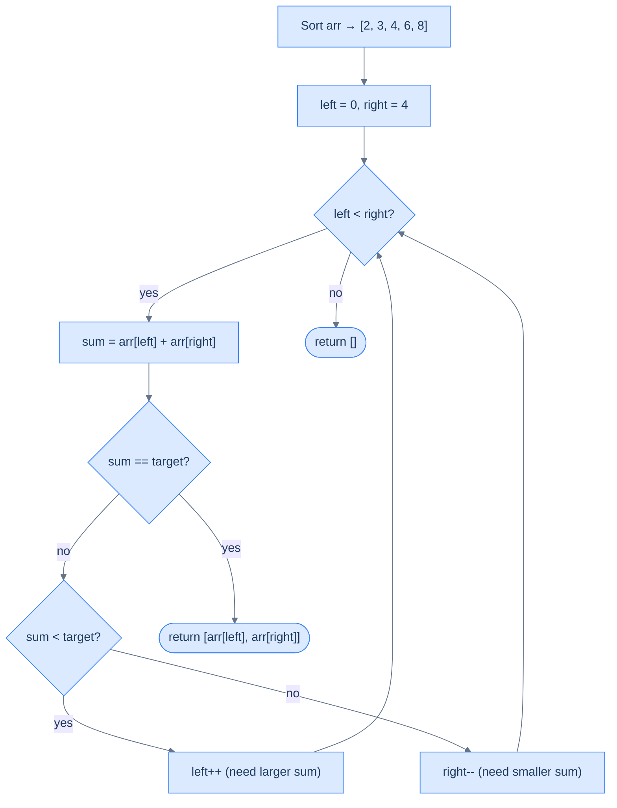

# Two Sum

## The Problem

Given an integer array `arr` and a target integer, find two distinct elements in the array whose sum equals the target. Return them as a pair. If no such pair exists, return an empty array.

It is guaranteed that **at most one answer exists**.

```
Input:  arr = [2, 8, 3, 6, 4],  target = 7
Output: [3, 4]

Input:  arr = [2, -1, 5, -4, 3],  target = 34
Output: []
```

---

## Examples

**Example 1**
```
Input:  arr = [2, 8, 3, 6, 4],  target = 7
Output: [3, 4]
Explanation: 3 + 4 = 7
```

**Example 2**
```
Input:  arr = [2, -1, 5, -4, 3],  target = 34
Output: []
Explanation: No pair sums to 34.
```

**Example 3**
```
Input:  arr = [2],  target = 2
Output: []
Explanation: Only one element — can't form a pair.
```

```quiz
{
  "prompt": "Now your turn!",
  "input": "arr = [1, 4, 6, 8, 11], target = 10",
  "options": ["[4, 6]", "[1, 8]", "[8, 11]", "[]"],
  "answer": "[4, 6]"
}
```

## Constraints

- `0 ≤ arr.length ≤ 10^4`
- `-10^9 ≤ arr[i] ≤ 10^9`, and the same bound on `target`

```python run viz=array viz-root=arr
import ast
from typing import List

class Solution:
    def two_sum(self, arr: List[int], target: int) -> List[int]:
        # Your code goes here — sort, then converge two pointers; return the
        # pair [arr[left], arr[right]] on a match, or [] if none.
        return []

arr = ast.literal_eval(input())      # the test case's arr
target = int(input())                # the test case's target
print(Solution().two_sum(arr, target))
```

```java run viz=array viz-root=arr
import java.util.*;

public class Main {
    static class Solution {
        public int[] twoSum(int[] arr, int target) {
            // Your code goes here — sort, then converge two pointers; return
            // the pair {arr[left], arr[right]} on a match, or an empty array.
            return new int[0];
        }
    }

    public static void main(String[] args) {
        Scanner sc = new Scanner(System.in);
        int[] arr = parseIntArray(sc.nextLine());
        int target = Integer.parseInt(sc.nextLine().trim());
        System.out.println(Arrays.toString(new Solution().twoSum(arr, target)));
    }

    // "[1, 2, 3]" → {1, 2, 3} — reads the test case's arr
    static int[] parseIntArray(String line) {
        String inner = line.replaceAll("[\\[\\]\\s]", "");
        if (inner.isEmpty()) return new int[0];
        String[] parts = inner.split(",");
        int[] out = new int[parts.length];
        for (int i = 0; i < parts.length; i++) out[i] = Integer.parseInt(parts[i]);
        return out;
    }
}
```

```testcases
{
  "args": [
    { "id": "arr", "label": "arr", "type": "int[]", "placeholder": "[2, 8, 3, 6, 4]" },
    { "id": "target", "label": "target", "type": "int", "placeholder": "7" }
  ],
  "cases": [
    { "args": { "arr": "[2, 8, 3, 6, 4]", "target": "7" }, "expected": "[3, 4]" },
    { "args": { "arr": "[1, 4, 6, 8, 11]", "target": "10" }, "expected": "[4, 6]" },
    { "args": { "arr": "[2, -1, 5, -4, 3]", "target": "34" }, "expected": "[]" },
    { "args": { "arr": "[1, 2]", "target": "3" }, "expected": "[1, 2]" },
    { "args": { "arr": "[0, 0]", "target": "0" }, "expected": "[0, 0]" },
    { "args": { "arr": "[-3, -1, 0, 2, 4]", "target": "1" }, "expected": "[-3, 4]" }
  ]
}
```

<details>
<summary><h2>Intuition</h2></summary>


The structural property that makes this a two-pointer reduction problem is **value-only equivalence**: the output is a pair of values, not a pair of indices. Two distinct elements summing to `target` are equally valid wherever they sat in the original array. That permission to reorder is what unlocks sorting as a reducing transformation — and a sorted array has the monotonic structure the direct two-pointer template needs.

After sorting, place `left` at index `0` and `right` at index `n − 1`. `arr[left]` is now the smallest remaining element and `arr[right]` is the largest. This placement gives every move a guaranteed effect: `sum < target` means `arr[right]` is already the maximum partner for `arr[left]`, so the only way to raise the sum is `left++`; `sum > target` means `arr[left]` is already the minimum partner for `arr[right]`, so the only way to lower the sum is `right--`; `sum == target` means the pair is found.

What breaks if you skip the sort and try two pointers on the unsorted array? The decisive direction disappears. With `arr = [2, 8, 3, 6, 4]` and target `7`, `arr[0] + arr[4] = 6 < 7` — but moving `left` to `arr[1] = 8` overshoots immediately while the valid pair `(3, 4)` sits at non-adjacent indices `2` and `4`. Without sorted order, no single pointer move has a guaranteed effect on the sum, so the search collapses back to O(n²) nested-loop enumeration.



<p align="center"><strong>Two-pointer Two Sum — sort once, then converge from both ends in O(n).</strong></p>

</details>
<details>
<summary><h2>Applying the Diagnostic Questions</h2></summary>


| Question | Answer |
|---|---|
| **Q1.** Does the order of items matter? | **No** — the problem asks for two values whose sum equals the target; original positions are irrelevant, sorting is permitted |
| **Q2.** Do we need two items simultaneously? | **Yes** — we're evaluating a pair `(a, b)` where `a + b = target` at every step |
| **Q3.** Does traversing from both ends give something special? | **Yes** — after sorting, `arr[left]` is always the minimum and `arr[right]` the maximum of the remaining window; every pointer move has a decisive, guaranteed effect on the sum |
| **Q4.** Can we reduce further? | **No** — we're at the Two Sum base case; the problem is solved directly in one pass |

### Q1 — Why "order doesn't matter, so sorting is permitted"?

**Mental model:** The output is a pair of values — `[3, 4]` — not a pair of indices. The problem says nothing about the positions those values came from. A pair `(3, 4)` summing to 7 is valid whether 3 appeared before or after 4 in the original array. When the answer depends only on values, sorting cannot invalidate a correct answer — and it gives us a structure we can exploit.

**Concrete impact:** `arr = [2, 8, 3, 6, 4]`, target = 7. Unsorted, the pair `(3, 4)` sits at non-adjacent indices 2 and 4 — invisible without checking every combination. After sorting to `[2, 3, 4, 6, 8]`, `3` and `4` are adjacent and the min/max structure guides the search directly.

**What breaks if position mattered?** If the problem asked "find a pair at consecutive positions" or "the second element must appear after the first in the original array," sorting would destroy the positional information needed. Here there is no such constraint — position-independence is the prerequisite for the sorting reduction.

### Q3 — Why "both ends give decisive direction after sorting"?

**Mental model:** After sorting, `arr[left]` is the minimum of the unexamined window and `arr[right]` is the maximum. This gives every pointer move a guaranteed effect: moving `left` right replaces the minimum with a larger value — the sum strictly increases. Moving `right` left replaces the maximum with a smaller value — the sum strictly decreases. That decisive direction is what eliminates one element per step with a provable reason.

**Concrete trace:** sorted `[2, 3, 4, 6, 8]`, target = 7:
- `left=0 (2), right=4 (8)`: sum 10 > 7 → `arr[right]=8` is too large for any remaining left partner (min is 2, so best sum with 8 is already 10) → discard `arr[right]`, `right--`
- `left=0 (2), right=3 (6)`: sum 8 > 7 → same reasoning → `right--`
- `left=0 (2), right=2 (4)`: sum 6 < 7 → `arr[left]=2` can never reach target with any remaining right partner (max is 4, best sum 6 < 7) → discard `arr[left]`, `left++`
- `left=1 (3), right=2 (4)`: sum 7 == target ✓

**What breaks on an unsorted array?** Without sorting, moving `left` right might land on a smaller value — the sum could decrease instead of increase. The decisive direction disappears, and you'd need to try every combination: O(n²).

</details>
<details>
<summary><h2>Approach</h2></summary>


1. Sort `arr` in non-decreasing order. This is the reducing transformation; it costs O(n log n) time and is safe because the answer depends only on values.
2. Initialise `left = 0` and `right = len(arr) − 1`.
3. While `left < right`, compute `sum = arr[left] + arr[right]`.
4. If `sum == target`, return `[arr[left], arr[right]]` — the pair is found.
5. If `sum < target`, increment `left` — `arr[right]` is the maximum possible partner for `arr[left]`, so no larger sum involving `arr[left]` exists; discard `arr[left]`.
6. If `sum > target`, decrement `right` — `arr[left]` is the minimum possible partner for `arr[right]`, so no smaller sum involving `arr[right]` exists; discard `arr[right]`.
7. If the loop exits with `left >= right`, no valid pair exists — return an empty array.

</details>
<details>
<summary><h2>Solution &amp; Analysis</h2></summary>

### Solution

```python solution time=O(n log n) space=O(1)
import ast
from typing import List

class Solution:
    def two_sum(self, arr: List[int], target: int) -> List[int]:
        arr.sort()

        left = 0
        right = len(arr) - 1

        # Use a while loop to traverse the array using the two pointers
        while left < right:
            sum = arr[left] + arr[right]

            # Found a pair that sums up to the target
            if sum == target:
                return [arr[left], arr[right]]

            # Move the left pointer to increase the sum
            elif sum < target:
                left += 1

            # Move the right pointer to decrease the sum
            else:
                right -= 1

        # No pair found, return an empty array
        return []


arr = ast.literal_eval(input())      # the test case's arr
target = int(input())                # the test case's target
print(Solution().two_sum(arr, target))
```

```java solution
import java.util.*;

public class Main {
    static class Solution {
        public int[] twoSum(int[] arr, int target) {

            // Sort the array in non-decreasing order
            Arrays.sort(arr);

            int left = 0;
            int right = arr.length - 1;

            // Use a while loop to traverse the array using the two pointers
            while (left < right) {
                int sum = arr[left] + arr[right];

                // Found a pair that sums up to the target
                if (sum == target) {
                    return new int[] { arr[left], arr[right] };
                }

                // Move the left pointer to increase the sum
                else if (sum < target) {
                    left++;
                }

                // Move the right pointer to decrease the sum
                else {
                    right--;
                }
            }

            // No pair found, return an empty array
            return new int[0];
        }
    }

    public static void main(String[] args) {
        Scanner sc = new Scanner(System.in);
        int[] arr = parseIntArray(sc.nextLine());
        int target = Integer.parseInt(sc.nextLine().trim());
        System.out.println(Arrays.toString(new Solution().twoSum(arr, target)));
    }

    static int[] parseIntArray(String line) {
        String inner = line.replaceAll("[\\[\\]\\s]", "");
        if (inner.isEmpty()) return new int[0];
        String[] parts = inner.split(",");
        int[] out = new int[parts.length];
        for (int i = 0; i < parts.length; i++) out[i] = Integer.parseInt(parts[i]);
        return out;
    }
}
```

### Dry Run — Example 1

`arr = [2, 8, 3, 6, 4]`, target = 7

After sort: `[2, 3, 4, 6, 8]`

```d3 widget=array-1d
{
  "steps": [
    {
      "nodes": [
        {
          "id": "0",
          "label": "2",
          "kind": "cell",
          "meta": [],
          "slot": 0,
          "cardId": "",
          "layoutKind": ""
        },
        {
          "id": "1",
          "label": "3",
          "kind": "cell",
          "meta": [],
          "slot": 1,
          "cardId": "",
          "layoutKind": ""
        },
        {
          "id": "2",
          "label": "4",
          "kind": "cell",
          "meta": [],
          "slot": 2,
          "cardId": "",
          "layoutKind": ""
        },
        {
          "id": "3",
          "label": "6",
          "kind": "cell",
          "meta": [],
          "slot": 3,
          "cardId": "",
          "layoutKind": ""
        },
        {
          "id": "4",
          "label": "8",
          "kind": "cell",
          "meta": [],
          "slot": 4,
          "cardId": "",
          "layoutKind": ""
        }
      ],
      "edges": [],
      "cursor": [
        {
          "name": "left",
          "target": "0",
          "color": "#3b82f6"
        },
        {
          "name": "right",
          "target": "4",
          "color": "#f59e0b"
        }
      ],
      "highlight": [],
      "changed": [],
      "removed": [],
      "annotation": "sum = 2 + 8 = 10 > 7 → discard arr[right]; right--.",
      "line": 0,
      "frames": [],
      "cardCursor": []
    },
    {
      "nodes": [
        {
          "id": "0",
          "label": "2",
          "kind": "cell",
          "meta": [],
          "slot": 0,
          "cardId": "",
          "layoutKind": ""
        },
        {
          "id": "1",
          "label": "3",
          "kind": "cell",
          "meta": [],
          "slot": 1,
          "cardId": "",
          "layoutKind": ""
        },
        {
          "id": "2",
          "label": "4",
          "kind": "cell",
          "meta": [],
          "slot": 2,
          "cardId": "",
          "layoutKind": ""
        },
        {
          "id": "3",
          "label": "6",
          "kind": "cell",
          "meta": [],
          "slot": 3,
          "cardId": "",
          "layoutKind": ""
        },
        {
          "id": "4",
          "label": "8",
          "kind": "cell",
          "meta": [],
          "slot": 4,
          "cardId": "",
          "layoutKind": ""
        }
      ],
      "edges": [],
      "cursor": [
        {
          "name": "left",
          "target": "0",
          "color": "#3b82f6"
        },
        {
          "name": "right",
          "target": "3",
          "color": "#f59e0b"
        }
      ],
      "highlight": [],
      "changed": [],
      "removed": [],
      "annotation": "sum = 2 + 6 = 8 > 7 → discard arr[right]; right--.",
      "line": 0,
      "frames": [],
      "cardCursor": []
    },
    {
      "nodes": [
        {
          "id": "0",
          "label": "2",
          "kind": "cell",
          "meta": [],
          "slot": 0,
          "cardId": "",
          "layoutKind": ""
        },
        {
          "id": "1",
          "label": "3",
          "kind": "cell",
          "meta": [],
          "slot": 1,
          "cardId": "",
          "layoutKind": ""
        },
        {
          "id": "2",
          "label": "4",
          "kind": "cell",
          "meta": [],
          "slot": 2,
          "cardId": "",
          "layoutKind": ""
        },
        {
          "id": "3",
          "label": "6",
          "kind": "cell",
          "meta": [],
          "slot": 3,
          "cardId": "",
          "layoutKind": ""
        },
        {
          "id": "4",
          "label": "8",
          "kind": "cell",
          "meta": [],
          "slot": 4,
          "cardId": "",
          "layoutKind": ""
        }
      ],
      "edges": [],
      "cursor": [
        {
          "name": "left",
          "target": "0",
          "color": "#3b82f6"
        },
        {
          "name": "right",
          "target": "2",
          "color": "#f59e0b"
        }
      ],
      "highlight": [],
      "changed": [],
      "removed": [],
      "annotation": "sum = 2 + 4 = 6 < 7 → discard arr[left]; left++.",
      "line": 0,
      "frames": [],
      "cardCursor": []
    },
    {
      "nodes": [
        {
          "id": "0",
          "label": "2",
          "kind": "cell",
          "meta": [],
          "slot": 0,
          "cardId": "",
          "layoutKind": ""
        },
        {
          "id": "1",
          "label": "3",
          "kind": "cell",
          "meta": [],
          "slot": 1,
          "cardId": "",
          "layoutKind": ""
        },
        {
          "id": "2",
          "label": "4",
          "kind": "cell",
          "meta": [],
          "slot": 2,
          "cardId": "",
          "layoutKind": ""
        },
        {
          "id": "3",
          "label": "6",
          "kind": "cell",
          "meta": [],
          "slot": 3,
          "cardId": "",
          "layoutKind": ""
        },
        {
          "id": "4",
          "label": "8",
          "kind": "cell",
          "meta": [],
          "slot": 4,
          "cardId": "",
          "layoutKind": ""
        }
      ],
      "edges": [],
      "cursor": [
        {
          "name": "left",
          "target": "1",
          "color": "#3b82f6"
        },
        {
          "name": "right",
          "target": "2",
          "color": "#f59e0b"
        }
      ],
      "highlight": [],
      "changed": [],
      "removed": [],
      "annotation": "sum = 3 + 4 = 7 = target → return [3, 4].",
      "line": 0,
      "frames": [],
      "cardCursor": []
    }
  ],
  "title": "Two Sum on sorted [2, 3, 4, 6, 8], target = 7"
}
```

| Step | `left` | `right` | `arr[left]` | `arr[right]` | sum | Action |
|---|---|---|---|---|---|---|
| 1 | 0 | 4 | 2 | 8 | 10 | 10 > 7 → `right--` |
| 2 | 0 | 3 | 2 | 6 | 8 | 8 > 7 → `right--` |
| 3 | 0 | 2 | 2 | 4 | 6 | 6 < 7 → `left++` |
| 4 | 1 | 2 | 3 | 4 | 7 | 7 == 7 → **return [3, 4]** ✓ |

### Complexity Analysis

| | Complexity | Reasoning |
|---|---|---|
| **Time** | O(n log n) | Dominated by the sort; the two-pointer pass is O(n) |
| **Space** | O(1) | Sorting in-place; only two pointer variables |

> If the array were already sorted, the solution would be O(n) time and O(1) space — the sort is the only overhead.

### Edge Cases

| Scenario | Input | Output | Note |
|---|---|---|---|
| Single element | `[5]`, target=5 | `[]` | Can't form a pair from one element |
| Two elements, match | `[3, 4]`, target=7 | `[3, 4]` | One comparison |
| Two elements, no match | `[1, 2]`, target=10 | `[]` | Loop exits immediately |
| All negatives | `[-5, -3, -1]`, target=-4 | `[-3, -1]` | Works identically after sort |
| Duplicates | `[2, 2, 3]`, target=4 | `[2, 2]` | Valid — two distinct *positions* |

</details>
<details>
<summary><h2>Key Takeaway</h2></summary>


Two Sum is the base case of the reduction family: a single sort converts an unsorted array into the monotonic shape the direct two-pointer template requires, dropping the cost from O(n²) to O(n log n) time and O(1) extra space.

</details>

