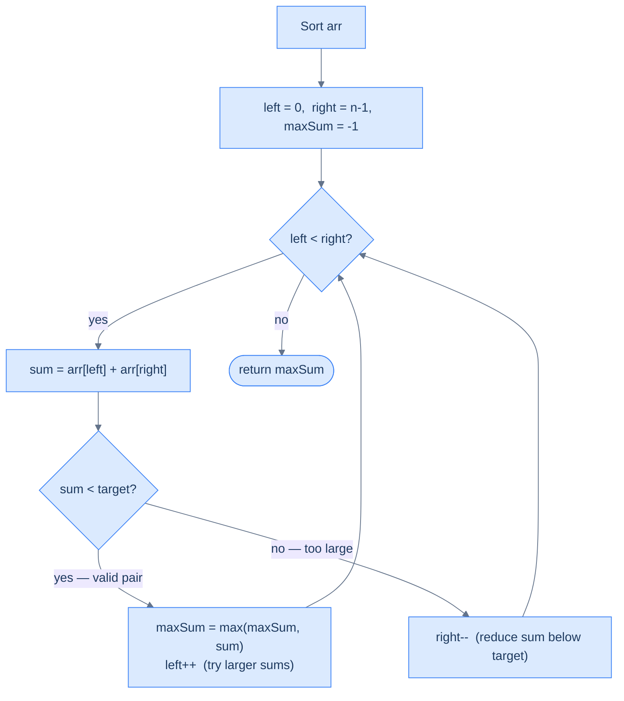

# Target Limited Two Sum

## The Problem

Given an array of non-negative integers and a target, find the **largest possible sum of two distinct elements** that is **strictly less than the target**. If no such pair exists, return `-1`.

```
Input:  arr = [34, 23, 1, 24, 75, 33, 54, 8],  target = 60
Output: 58
Explanation: 34 + 24 = 58 < 60  (best valid sum)

Input:  arr = [10, 20, 30],  target = 15
Output: -1
Explanation: smallest pair sum is 10+20=30 ≥ 15
```

---

## Examples

**Example 1**
```
Input:  arr = [34, 23, 1, 24, 75, 33, 54, 8],  target = 60
Output: 58
Explanation: 34 + 24 = 58 < 60. No pair sums to 59 or higher while staying under 60.
```

**Example 2**
```
Input:  arr = [34, 23, 1, 24, 75, 33, 54, 8],  target = 36
Output: 35
Explanation: 34 + 1 = 35 < 36.
```

**Example 3**
```
Input:  arr = [10, 20, 30],  target = 15
Output: -1
Explanation: All pairs sum to ≥ 30, which is ≥ 15.
```

<details>
<summary><h2>Intuition</h2></summary>


The structural property is the same as Two Sum: the answer is a value (the largest valid sum), not an index pair, so positions don't matter and sorting is permitted. The change is the predicate — `sum < target` instead of `sum == target` — which converts an equality search into a maximisation under an inequality constraint.

After sorting, place `left = 0` and `right = n − 1`; track `max_sum = −1` as the best valid sum seen so far. When `sum < target` (a valid pair), `arr[right]` is the largest possible partner for `arr[left]` in the remaining window, so no larger valid sum can involve `arr[left]` — record `sum` and advance `left` to hunt for a bigger anchor. When `sum >= target`, the pair is invalid; `arr[left]` is the smallest possible partner for `arr[right]`, so every larger left partner only makes things worse — discard `arr[right]` by `right--`.

What breaks without sorting? The greedy `left++` after a valid pair relies on `arr[right]` being the largest available partner. On an unsorted array that guarantee is gone — a larger value could be anywhere, so advancing `left` would discard a candidate that hadn't actually exhausted its best option. Restoring correctness would require scanning all remaining values for each `left`, collapsing back to O(n²) time.



<p align="center"><strong>Target Limited Two Sum — record the best valid sum on each match, then push <code>left</code> forward to search for something even larger.</strong></p>

</details>
<details>
<summary><h2>Applying the Diagnostic Questions</h2></summary>


| Question | Answer |
|---|---|
| **Q1.** Does the order of items matter? | **No** — the answer is a sum value, not an index-pair; original positions are irrelevant, sorting is permitted |
| **Q2.** Do we need two items simultaneously? | **Yes** — we evaluate a pair `(a, b)` against the `< target` constraint at every step |
| **Q3.** Does traversing from both ends give something special? | **Yes** — after sorting, when a valid pair is found, `arr[right]` is already the largest possible partner for `arr[left]`; there is no better match for `arr[left]`, so moving `left` forward is the correct greedy step |
| **Q4.** Can we reduce further? | **No** — the problem reduces cleanly to a single two-pointer pass on a sorted array |

### Q1 — Why "order doesn't matter, so sorting is permitted"?

**Mental model:** The problem asks for the largest sum under a threshold. That depends entirely on values — which two values combine to produce the best result within the constraint. A pair `(24, 34)` giving sum 58 is valid regardless of whether 24 appeared before or after 34 in the input. The answer is a sum, not a position pair.

**What breaks if you assumed position mattered?** If the problem said "the pair must come from two different halves of the array" or "the second element must appear after the first," sorting would destroy those positional constraints. Here there is no such constraint — which is why the reduction is safe.

### Q3 — Why "both ends give the greedy argument for the largest valid sum"?

**Mental model:** After sorting, `arr[left]` is the smallest element and `arr[right]` is the largest in the remaining window. When `arr[left] + arr[right] < target` (a valid sum), `arr[right]` is already the **best possible partner** for `arr[left]` — no larger right partner exists. This means `arr[left]` has already seen its maximum achievable valid sum. Pairing it with any smaller element can only produce a worse result. So record the current sum and move `left` forward to try a larger anchor.

**Concrete trace:** sorted `[1, 8, 23, 24, 33, 34, 54, 75]`, target = 60, at step `left=3 (24), right=5 (34)`: sum = 58 < 60. `arr[right]=34` is the largest value available for pairing with 24. Moving `left` to try `33` with `34` gives 67 ≥ 60 — invalid. But 58 was the ceiling for `arr[left]=24`. Advancing `left` to 33 asks: "can 33 find a partner that beats 58 while staying under 60?" `33+34=67` — no. Moving right to 33: `33+33` is not possible. The scan continues until pointers cross, having recorded 58 as the best.

**What breaks without sorting?** Without sorted order, when you find a valid pair you cannot know whether `arr[right]` is the largest available partner — a larger value might be elsewhere in the unsorted array. The greedy advance of `left` would be wrong because you'd be discarding `arr[left]` without knowing it had exhausted its best option. You'd need to scan all remaining values for each `left`, reverting to O(n²).

</details>
<details>
<summary><h2>Approach</h2></summary>


1. Sort `arr` in non-decreasing order — the reducing transformation that exposes the monotonic structure.
2. Initialise `left = 0`, `right = len(arr) − 1`, and `max_sum = −1` as the sentinel for "no valid pair seen yet".
3. While `left < right`, compute `sum = arr[left] + arr[right]`.
4. If `sum < target`, the pair is valid: update `max_sum = max(max_sum, sum)` and increment `left` — `arr[right]` is already the best partner for `arr[left]`, so advancing `left` is the only move that can improve the result.
5. If `sum >= target`, the pair is invalid: decrement `right` — `arr[left]` is the smallest possible partner for `arr[right]`, so every other partner only worsens the overshoot.
6. When the loop exits, return `max_sum` — either the largest valid sum found or the sentinel `−1` if no pair stayed under `target`.

</details>
<details>
<summary><h2>Solution &amp; Analysis</h2></summary>

### Solution

```python run viz=array viz-root=arr
from typing import List

class Solution:
    def target_limited_two_sum(self, arr: List[int], target: int) -> int:

        # Sort the array in non-decreasing order
        arr.sort()
        n = len(arr)

        left: int = 0
        right: int = n - 1
        maxSum: int = -1

        # Use a while loop to traverse the array using the two pointers
        while left < right:
            sum = arr[left] + arr[right]

            # Move the left pointer to increase the sum
            if sum < target:
                maxSum = max(maxSum, sum)
                left += 1

            # Move the right pointer to decrease the sum
            else:
                right -= 1

        return maxSum


# Examples from the problem statement
print(Solution().target_limited_two_sum([34, 23, 1, 24, 75, 33, 54, 8], 60)) # 58
print(Solution().target_limited_two_sum([34, 23, 1, 24, 75, 33, 54, 8], 36)) # 35
print(Solution().target_limited_two_sum([10, 20, 30], 15))                    # -1

# Edge cases
print(Solution().target_limited_two_sum([1, 2], 4))   # 3 — two elements, sum < target
print(Solution().target_limited_two_sum([1, 2], 3))   # -1 — sum equals target, not strictly less
print(Solution().target_limited_two_sum([0, 0], 1))   # 0 — zero sum
print(Solution().target_limited_two_sum([5, 5], 11))  # 10 — duplicate elements
print(Solution().target_limited_two_sum([1, 100], 5)) # -1 — smallest pair exceeds target
```

```java run viz=array viz-root=arr
import java.util.*;

public class Main {
    static class Solution {
        public int targetLimitedTwoSum(int[] arr, int target) {

            // Sort the array in non-decreasing order
            Arrays.sort(arr);
            int n = arr.length;
            int left = 0;
            int right = n - 1;
            int maxSum = -1;

            // Use a while loop to traverse the array using the two pointers
            while (left < right) {
                int sum = arr[left] + arr[right];

                // Move the left pointer to increase the sum
                if (sum < target) {
                    maxSum = Math.max(maxSum, sum);
                    left++;
                }

                // Move the right pointer to decrease the sum
                else {
                    right--;
                }
            }

            return maxSum;
        }
    }

    public static void main(String[] args) {
        // Examples from the problem statement
        System.out.println(new Solution().targetLimitedTwoSum(new int[]{34,23,1,24,75,33,54,8}, 60)); // 58
        System.out.println(new Solution().targetLimitedTwoSum(new int[]{34,23,1,24,75,33,54,8}, 36)); // 35
        System.out.println(new Solution().targetLimitedTwoSum(new int[]{10,20,30}, 15));               // -1

        // Edge cases
        System.out.println(new Solution().targetLimitedTwoSum(new int[]{1,2}, 4));   // 3 — two elements, sum < target
        System.out.println(new Solution().targetLimitedTwoSum(new int[]{1,2}, 3));   // -1 — sum equals target, not strictly less
        System.out.println(new Solution().targetLimitedTwoSum(new int[]{0,0}, 1));   // 0 — zero sum
        System.out.println(new Solution().targetLimitedTwoSum(new int[]{5,5}, 11));  // 10 — duplicate elements
        System.out.println(new Solution().targetLimitedTwoSum(new int[]{1,100}, 5)); // -1 — smallest pair exceeds target
    }
}
```

### Dry Run — Example 1

`arr = [34, 23, 1, 24, 75, 33, 54, 8]`, target = 60

After sort: `[1, 8, 23, 24, 33, 34, 54, 75]`

| Step | `left` | `right` | `arr[l]` | `arr[r]` | sum | < 60? | maxSum | Action |
|---|---|---|---|---|---|---|---|---|
| 1 | 0 | 7 | 1 | 75 | 76 | ❌ | -1 | `right--` |
| 2 | 0 | 6 | 1 | 54 | 55 | ✅ | 55 | `left++` |
| 3 | 1 | 6 | 8 | 54 | 62 | ❌ | 55 | `right--` |
| 4 | 1 | 5 | 8 | 34 | 42 | ✅ | 55 | `left++` |
| 5 | 2 | 5 | 23 | 34 | 57 | ✅ | 57 | `left++` |
| 6 | 3 | 5 | 24 | 34 | 58 | ✅ | **58** | `left++` |
| 7 | 4 | 5 | 33 | 34 | 67 | ❌ | 58 | `right--` |
| — | 4 | 4 | — | — | — | — | — | `left ≥ right` → stop |

**Return `58`** ✓

### Complexity Analysis

| | Complexity | Reasoning |
|---|---|---|
| **Time** | O(n log n) | Dominated by sort; two-pointer pass is O(n) |
| **Space** | O(1) | In-place sort, two pointer variables, one result variable |

### Edge Cases

| Scenario | Input | Output | Note |
|---|---|---|---|
| No valid pair | `[10, 20, 30]`, target=15 | `-1` | All sums ≥ smallest possible pair |
| All pairs valid | `[1, 2, 3]`, target=100 | `5` | Best is `2 + 3 = 5` |
| Two elements, valid | `[1, 5]`, target=10 | `6` | Only one pair to check |
| Two elements, invalid | `[5, 10]`, target=5 | `-1` | `5 + 10 = 15 ≥ 5` |
| Sum equals target | `[1, 2]`, target=3 | `-1` | Strictly-less constraint rules out the equality case |
| Single element | `[5]`, target=10 | `-1` | Loop never runs; returns the sentinel |
| Duplicates | `[5, 5]`, target=11 | `10` | Two distinct indices count even when values match |

</details>
<details>
<summary><h2>Key Takeaway</h2></summary>


What's new vs Two Sum: the predicate flips from equality to a strict inequality, and the "do something on a match" step shifts from `return` to `record max and advance the anchor`. The reducing sort is unchanged.

</details>

