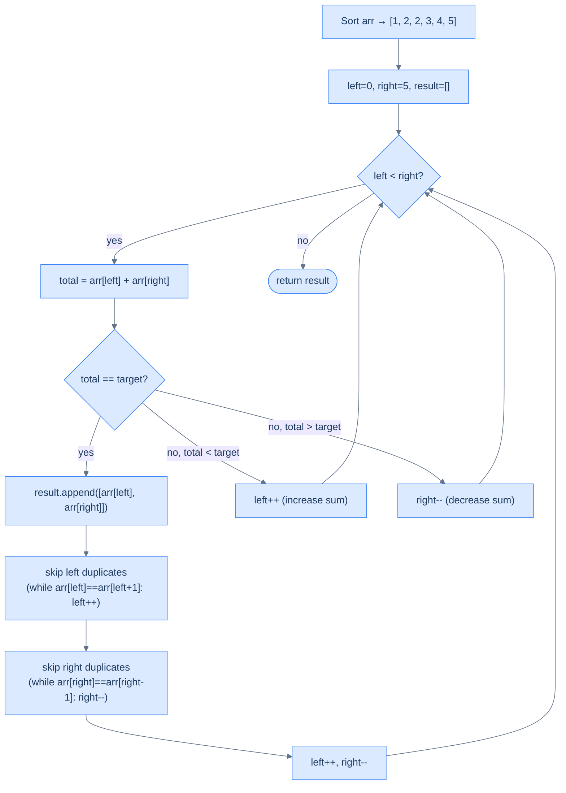

# Duplicate Aware Two Sum

## The Problem

Given an integer array `arr` and a target, find **all unique pairs** of elements whose sum equals the target. Return every pair exactly once — no duplicates in the result.

```
Input:  arr = [1, 2, 2, 3, 4, 5],  target = 6
Output: [[1, 5], [2, 4]]
```

This differs from basic Two Sum in two ways:
1. **Multiple pairs** may exist (not just one)
2. **Duplicate values** in the input must not produce duplicate pairs in the output

---

## Examples

**Example 1**
```
Input:  arr = [1, 2, 2, 3, 4, 5],  target = 6
Output: [[1, 5], [2, 4]]
Explanation: 1+5=6, 2+4=6. Note: even though there are two 2s, the pair [2,4] appears only once.
```

**Example 2**
```
Input:  arr = [1, 2, 2, 2, 2],  target = 3
Output: [[1, 2]]
Explanation: Only 1+2=3 is valid. Multiple 2s don't produce multiple [1,2] pairs.
```

**Example 3**
```
Input:  arr = [2],  target = 2
Output: []
Explanation: Can't form a pair from one element.
```

<details>
<summary><h2>Intuition</h2></summary>


The structural property is identical to Two Sum — the output is a list of value-pairs, not index-pairs — so sorting is permitted, and the sorted order gives the same min-at-left / max-at-right invariant. What's new is that the input may contain repeated values, and the result must list each unique value-pair exactly once even when a value appears multiple times.

Place `left = 0` and `right = n − 1` after sorting; the move rule on mismatched sums is unchanged from Two Sum (`sum < target` → `left++`, `sum > target` → `right--`). The extra mechanic kicks in on a match. After recording `[arr[left], arr[right]]`, advancing the pointers naively to `left + 1` and `right − 1` would land on the next index, which — because sort packs equal values together — may carry the same value as before. So before continuing, advance `left` past every consecutive copy of `arr[left]` and pull `right` back past every consecutive copy of `arr[right]`. Each unique value-pair surfaces exactly once.

What breaks if you skip the duplicate-skip step? On `arr = [2, 2, 2, 2]` with `target = 4`, every pair `(left, right)` evaluates to `2 + 2 = 4` — without the skip, the same `[2, 2]` is recorded `O(n)` times before the pointers cross. With the skip, the first match jumps both pointers past their duplicate runs and the loop terminates with a single `[2, 2]`. The skip preserves correctness without changing the asymptotic cost — each index is still visited at most once across the entire run.



<p align="center"><strong>Duplicate Aware Two Sum — after each match, exhaust all consecutive duplicates on both sides before advancing the pointers.</strong></p>

</details>
<details>
<summary><h2>Applying the Diagnostic Questions</h2></summary>


| Question | Answer |
|---|---|
| **Q1.** Does the order of items matter? | **No** — the output is a list of value-pairs, not index-pairs; original positions are irrelevant, sorting is permitted |
| **Q2.** Do we need two items simultaneously? | **Yes** — we evaluate a pair `(a, b)` against the target at every step and collect all matching value-pairs |
| **Q3.** Does traversing from both ends give something special? | **Yes** — after sorting, the decisive-direction property holds exactly as in Two Sum; the added complication is that consecutive equal values at either pointer produce duplicate results |
| **Q4.** Can we reduce further? | **No** — this is Two Sum extended with a post-match duplicate-skip; same pass, same pointer movement, one extra clean-up step |

### Q1 — Why "order doesn't matter, and sorting additionally enables deduplication"?

**Mental model:** The output pairs are value-pairs — `[[1, 5], [2, 4]]` — not index-pairs. A pair `[2, 4]` is valid regardless of where the `2`s and `4`s sat in the original array. Since the answer depends only on values, sorting cannot invalidate any correct pair.

**What sorting additionally enables:** duplicate detection. After sorting, all copies of the same value are adjacent. When you want to skip duplicate instances of a matched value (to avoid recording the same pair twice), a sorted array makes this trivial: scan forward or backward until the value changes. On an unsorted array, duplicates could be scattered anywhere — deduplication would require a hash set O(n) extra space per match instead of a simple in-place scan.

**Concrete impact:** `arr = [1, 2, 2, 3, 4, 5]`. After sorting, the two `2`s at indices 1 and 2 are adjacent. When `left=1` matches at target 6, skipping forward while `arr[left] == arr[left+1]` exhausts both `2`s in one scan. Without sorting, the second `2` might be at index 5 — you'd need a hash set to know you'd already seen a `2` as a left anchor.

### Q3 — Why "both ends give decisive direction, with duplicate-skip added after each match"?

**Mental model:** The decisive-direction argument from Two Sum applies unchanged: after sorting, `arr[left]` is the current minimum, `arr[right]` the current maximum. `sum < target` → only `left++` can increase the sum. `sum > target` → only `right--` can decrease it. When `sum == target`, both the current left value and right value form a valid pair — record it, then eliminate all copies of both values before continuing.

**Why must you skip duplicates before continuing?** After recording `[arr[left], arr[right]]`, the very next step moves to `arr[left+1]` and `arr[right-1]`. If `arr[left+1] == arr[left]`, you've found the same pair value again — the result would contain a duplicate. The skip burns through all consecutive copies so the next unique value pair is what gets evaluated next.

**Concrete trace:** `arr = [1, 2, 2, 3, 4, 5]`, target = 6. At `left=1 (2), right=4 (4)`: match, record `[2, 4]`. Skip left: `arr[1]==arr[2]` (both 2) → `left++` → left=2; `arr[2]!=arr[3]` → stop; return `left+1 = 3`. Skip right: `arr[4]!=arr[3]` → no skip; return `right-1 = 3`. Now `left=3, right=3`: `left >= right` → done. Exactly one `[2, 4]` recorded.

**What breaks if you skip the duplicate-skip step?** For `arr = [2, 2, 2, 2]`, target = 4: without skipping, every `(left, right)` pair where both values are 2 produces `[2, 2]` — that's 4 × 4 = 16 recordings for a single unique pair. The skip step enforces "each unique value combination appears exactly once in the output."

</details>
<details>
<summary><h2>Approach</h2></summary>


1. Sort `arr` in non-decreasing order so that equal values sit adjacent and the two-pointer invariant applies.
2. Initialise `left = 0`, `right = len(arr) − 1`, and an empty `result` list.
3. While `left < right`, compute `total = arr[left] + arr[right]`.
4. If `total < target`, increment `left` to raise the sum.
5. If `total > target`, decrement `right` to lower the sum.
6. If `total == target`, append `[arr[left], arr[right]]` to `result`, then advance `left` past every consecutive copy of `arr[left]` and pull `right` back past every consecutive copy of `arr[right]` before the next iteration.
7. When the loop exits with `left >= right`, return `result` — each unique value-pair appears exactly once.

</details>
<details>
<summary><h2>Solution &amp; Analysis</h2></summary>

### Solution

```python run viz=array viz-root=arr
from typing import List

class Solution:
    def skip_duplicates_left(
        self, arr: List[int], left: int, right: int
    ) -> int:

        # Skip duplicates from the left pointer
        while left < right and arr[left] == arr[left + 1]:
            left += 1

        # Return the index of the next unique element
        return left + 1

    def skip_duplicates_right(
        self, arr: List[int], left: int, right: int
    ) -> int:

        # Skip duplicates from the right pointer
        while left < right and arr[right] == arr[right - 1]:
            right -= 1

        # Return the index of the next unique element
        return right - 1

    def duplicate_aware_two_sum(
        self, arr: List[int], target: int
    ) -> List[List[int]]:

        # Sort the array in non-decreasing order
        arr.sort()
        result = []

        left = 0
        right = len(arr) - 1

        # Use a while loop to traverse the array using the two pointers
        while left < right:
            total = arr[left] + arr[right]

            # If the sum matches the target, add the pair to the
            # result list
            if total == target:
                result.append([arr[left], arr[right]])

                # Move the left pointer to the next unique element to
                # avoid duplicates
                left = self.skip_duplicates_left(arr, left, right)

                # Move the right pointer to the previous unique element
                # to avoid duplicates
                right = self.skip_duplicates_right(arr, left, right)

            # Move the left pointer to increase the sum
            elif total < target:
                left += 1

            # Move the right pointer to decrease the sum
            else:
                right -= 1

        return result


# Examples from the problem statement
print(Solution().duplicate_aware_two_sum([1, 2, 2, 3, 4, 5], 6))  # [[1, 5], [2, 4]]
print(Solution().duplicate_aware_two_sum([1, 2, 2, 2, 2], 3))     # [[1, 2]]
print(Solution().duplicate_aware_two_sum([2], 2))                   # []

# Edge cases
print(Solution().duplicate_aware_two_sum([], 5))                    # []
print(Solution().duplicate_aware_two_sum([1, 2], 3))               # [[1, 2]]
print(Solution().duplicate_aware_two_sum([1, 2], 5))               # []
print(Solution().duplicate_aware_two_sum([2, 2, 2, 2], 4))         # [[2, 2]] — all duplicates
print(Solution().duplicate_aware_two_sum([-1, 0, 1, 2], 1))        # [[-1, 2], [0, 1]]
```

```java run viz=array viz-root=arr
import java.util.*;

public class Main {
    static class Solution {
        private int skipDuplicatesLeft(int[] arr, int left, int right) {

            // Skip duplicates from the left pointer
            while (left < right && arr[left] == arr[left + 1]) {
                left++;
            }

            // Return the index of the next unique element
            return left + 1;
        }

        private int skipDuplicatesRight(int[] arr, int left, int right) {

            // Skip duplicates from the right pointer
            while (left < right && arr[right] == arr[right - 1]) {
                right--;
            }

            // Return the index of the next unique element
            return right - 1;
        }

        public List<List<Integer>> duplicateAwareTwoSum(
            int[] arr,
            int target
        ) {

            // Sort the array in non-decreasing order
            Arrays.sort(arr);
            List<List<Integer>> result = new ArrayList<>();

            int left = 0;
            int right = arr.length - 1;

            // Use a while loop to traverse the array using the two pointers
            while (left < right) {
                int sum = arr[left] + arr[right];

                // If the sum matches the target, add the pair to the
                // result list
                if (sum == target) {
                    result.add(List.of(arr[left], arr[right]));

                    // Move the left pointer to the next unique element to
                    // avoid duplicates
                    left = skipDuplicatesLeft(arr, left, right);

                    // Move the right pointer to the previous unique element
                    // to avoid duplicates
                    right = skipDuplicatesRight(arr, left, right);
                }

                // Move the left pointer to increase the sum
                else if (sum < target) {
                    left++;
                }

                // Move the right pointer to decrease the sum
                else {
                    right--;
                }
            }

            return result;
        }
    }

    public static void main(String[] args) {
        // Examples from the problem statement
        System.out.println(new Solution().duplicateAwareTwoSum(new int[]{1,2,2,3,4,5}, 6));  // [[1, 5], [2, 4]]
        System.out.println(new Solution().duplicateAwareTwoSum(new int[]{1,2,2,2,2}, 3));     // [[1, 2]]
        System.out.println(new Solution().duplicateAwareTwoSum(new int[]{2}, 2));              // []

        // Edge cases
        System.out.println(new Solution().duplicateAwareTwoSum(new int[]{}, 5));               // []
        System.out.println(new Solution().duplicateAwareTwoSum(new int[]{1,2}, 3));            // [[1, 2]]
        System.out.println(new Solution().duplicateAwareTwoSum(new int[]{1,2}, 5));            // []
        System.out.println(new Solution().duplicateAwareTwoSum(new int[]{2,2,2,2}, 4));        // [[2, 2]] — all duplicates
        System.out.println(new Solution().duplicateAwareTwoSum(new int[]{-1,0,1,2}, 1));       // [[-1, 2], [0, 1]]
    }
}
```

### Dry Run — Example 1

`arr = [1, 2, 2, 3, 4, 5]`, target = 6

After sort: `[1, 2, 2, 3, 4, 5]`

| Step | `left` | `right` | `arr[l]` | `arr[r]` | total | Action |
|---|---|---|---|---|---|---|
| 1 | 0 | 5 | 1 | 5 | 6 | ✅ record [1,5]; skip_left → l=1; skip_right → r=4 |
| 2 | 1 | 4 | 2 | 4 | 6 | ✅ record [2,4]; skip_left (arr[1]==arr[2]=2) → l=3; skip_right → r=3 |
| — | 3 | 3 | — | — | — | `left ≥ right` → stop |

**Return `[[1, 5], [2, 4]]`** ✓

**What skip_duplicates_left does at step 2 (left=1, right=4):**
- `arr[1] == arr[2]` (both 2) → `left++` → left=2
- `arr[2] != arr[3]` → stop, return `left + 1 = 3`

So left jumps to 3, skipping both the 2s. The pair [2,4] appears exactly once.

### Complexity Analysis

| | Complexity | Reasoning |
|---|---|---|
| **Time** | O(n log n) | Sort dominates; the pointer pass is still O(n) total across all iterations (each element visited once) |
| **Space** | O(k) | `k` = number of unique valid pairs returned; O(1) extra working space |

### Edge Cases

| Scenario | Input | Output | Note |
|---|---|---|---|
| No valid pair | `[1, 3, 5]`, target=10 | `[]` | Pointers converge with no match |
| All duplicates | `[3, 3, 3]`, target=6 | `[[3, 3]]` | One unique pair, not three |
| Single pair | `[1, 5]`, target=6 | `[[1, 5]]` | Identical to basic Two Sum |
| Many duplicates of same pair | `[2, 2, 2, 2]`, target=4 | `[[2, 2]]` | Skip logic collapses all to one result |
| Empty input | `[]`, target=5 | `[]` | Loop never enters; `right = -1 < left = 0` |
| Multiple unique pairs | `[-1, 0, 1, 2]`, target=1 | `[[-1, 2], [0, 1]]` | Both pairs surface in one pass |

</details>
<details>
<summary><h2>Key Takeaway</h2></summary>


What's new vs Two Sum: the loop collects every match instead of returning the first, and each match is followed by a duplicate-skip on both sides so the result never repeats a value-pair. The total cost stays at O(n log n) time because the skip is amortised across the linear pass.

</details>

