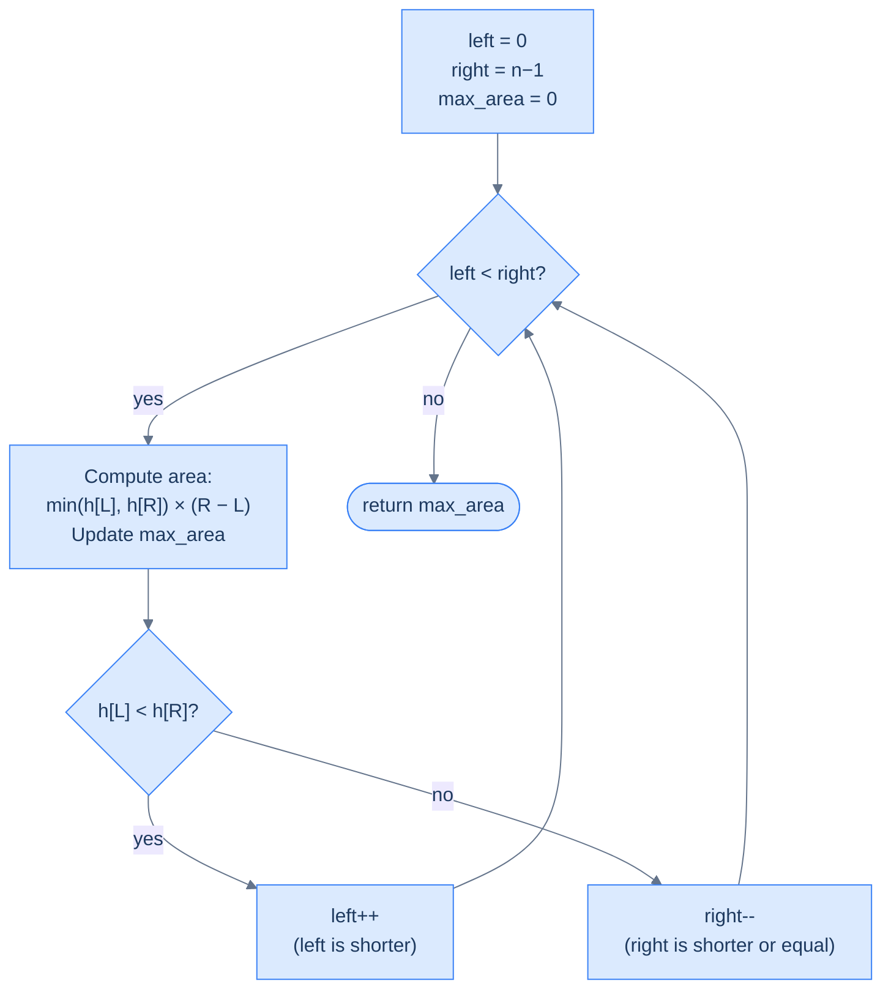
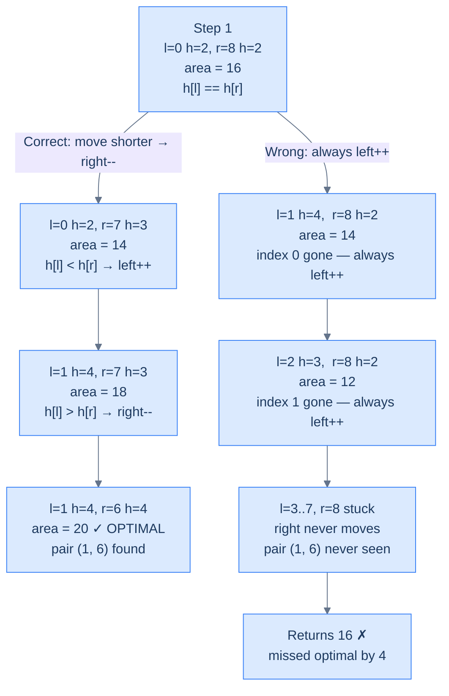

# Largest Container

## The Problem

You are given an array `heights` where `heights[i]` represents the height of a wall at position `i`. Find two walls that, together with the x-axis, form a container holding the **maximum amount of water**, and return that area.

```
Area = min(heights[i], heights[j]) × (j − i)
```

The container's height is limited by the **shorter** of the two walls. Its width is the distance between them.

```
Input:  heights = [2, 4, 3, 3, 5, 2, 4, 3, 2]
Output: 20
```

---

## Examples

**Example 1**
```
Input:  heights = [2, 4, 3, 3, 5, 2, 4, 3, 2]
Output: 20
Explanation: walls at index 1 (height 4) and index 6 (height 4)
             area = min(4,4) × (6-1) = 4 × 5 = 20
```

**Example 2**
```
Input:  heights = [1, 8, 6, 2, 5, 4, 8, 3, 7]
Output: 49
Explanation: walls at index 1 (height 8) and index 8 (height 7)
             area = min(8,7) × (8-1) = 7 × 7 = 49
```

**Example 3**
```
Input:  heights = [1, 1]
Output: 1
Explanation: Only two walls — area = min(1,1) × 1 = 1
```

```quiz
{
  "prompt": "Now your turn!",
  "input": "heights = [1, 3, 2, 5, 4]",
  "options": ["9", "12", "6", "4"],
  "answer": "9"
}
```

## Constraints

- `2 ≤ heights.length ≤ 10^5`
- `0 ≤ heights[i] ≤ 10^4`

```python run viz=array viz-root=heights
import ast
from typing import List

class Solution:
    def largest_container(self, heights: List[int]) -> int:
        # Your code goes here — two pointers from both ends; track the best
        # area, and always move the pointer at the shorter wall inward.
        return 0

heights = ast.literal_eval(input())  # the test case's heights
print(Solution().largest_container(heights))
```

```java run viz=array viz-root=heights
import java.util.*;

public class Main {
    static class Solution {
        public int largestContainer(int[] heights) {
            // Your code goes here — two pointers from both ends; track the best
            // area, and always move the pointer at the shorter wall inward.
            return 0;
        }
    }

    public static void main(String[] args) {
        Scanner sc = new Scanner(System.in);
        int[] heights = parseIntArray(sc.nextLine());
        System.out.println(new Solution().largestContainer(heights));
    }

    // "[1, 2, 3]" → {1, 2, 3} — reads the test case's heights
    static int[] parseIntArray(String line) {
        String inner = line.replaceAll("[\\[\\]\\s]", "");
        if (inner.isEmpty()) return new int[0];
        String[] parts = inner.split(",");
        int[] out = new int[parts.length];
        for (int i = 0; i < parts.length; i++) out[i] = Integer.parseInt(parts[i]);
        return out;
    }
}
```

```testcases
{
  "args": [
    { "id": "heights", "label": "heights", "type": "int[]", "placeholder": "[2, 4, 3, 3, 5, 2, 4, 3, 2]" }
  ],
  "cases": [
    { "args": { "heights": "[2, 4, 3, 3, 5, 2, 4, 3, 2]" }, "expected": "20" },
    { "args": { "heights": "[1, 8, 6, 2, 5, 4, 8, 3, 7]" }, "expected": "49" },
    { "args": { "heights": "[1, 3, 2, 5, 4]" }, "expected": "9" },
    { "args": { "heights": "[1, 1]" }, "expected": "1" },
    { "args": { "heights": "[5, 4, 3, 2, 1]" }, "expected": "6" },
    { "args": { "heights": "[1, 2, 3, 4, 5]" }, "expected": "6" }
  ]
}
```

<details>
<summary><h2>Visualising the Container</h2></summary>


```d2
walls: "heights = [2, 4, 3, 3, 5, 2, 4, 3, 2]" {
  grid-columns: 9
  grid-gap: 0
  w0: |md
    h=2

    pos `0`
  |
  w1: |md
    h=4

    pos `1`
  | {style.fill: "#fde68a"; style.stroke: "#d97706"}
  w2: |md
    h=3

    pos `2`
  |
  w3: |md
    h=3

    pos `3`
  |
  w4: |md
    h=5

    pos `4`
  |
  w5: |md
    h=2

    pos `5`
  |
  w6: |md
    h=4

    pos `6`
  | {style.fill: "#fde68a"; style.stroke: "#d97706"}
  w7: |md
    h=3

    pos `7`
  |
  w8: |md
    h=2

    pos `8`
  |
}

best: |md
  **Best container**

  walls at pos 1 (h=4) and pos 6 (h=4)

  width  = 6 − 1 = 5

  height = min(4, 4) = 4

  area   = 4 × 5 = 20
| {style.fill: "#fde68a"; style.stroke: "#d97706"}

walls.w1 -> best: "optimal pair" {style.stroke-dash: 3}
walls.w6 -> best: "optimal pair" {style.stroke-dash: 3}
```

<p align="center"><strong>The largest container uses walls at positions 1 and 6 — both height 4, width 5, area 20. All taller walls (h=5 at pos 4) have a narrower span.</strong></p>

</details>
<details>
<summary><h2>Applying the Diagnostic Questions</h2></summary>


Run the same four questions from the identifying lesson against this problem.

| Question | Answer |
|---|---|
| **Q1.** Does the order of items matter? | **Yes** — positions determine width; sorting destroys the formula |
| **Q2.** Do we need two items simultaneously? | **Yes** — area always requires two walls at once |
| **Q3.** Does traversing from both ends give something special? | **Yes** — `left=0, right=n-1` starts at the maximum possible width |
| **Q4.** Can we create a decisive direction without sorting? | **Yes** — the area formula itself tells us which pointer to move with certainty |

---

### Q1 — Why "order matters here" — and why that blocks sorting

**WHAT:** The width in the formula is `j − i`, the literal distance between indices. Positions are baked into the formula itself.

**WHY it matters:** Sorting rearranges elements to new positions, which changes every `j − i` value. Walls that were far apart become adjacent. Walls that were adjacent get pulled apart. The formula gives completely different — and meaningless — results on a sorted array.

**Concrete check:** `heights = [2, 4, 3, 3, 5, 2, 4, 3, 2]`. The optimal pair is index 1 (h=4) and index 6 (h=4) — width = 5, area = 20. After sorting to `[2, 2, 2, 3, 3, 3, 4, 4, 5]`, those same two walls (h=4, h=4) end up at indices 6 and 7 — width = 1, area = 4. The formula produces a completely wrong answer.

**What this means for the pattern:** Unlike Two Sum, sorting is forbidden here. But this problem still belongs in the two-pointer reduction category — it just reaches the decisive direction through a different mechanism.

> **Key contrast with Two Sum:**
> - Two Sum: Q1 = No → sorting is free → sorting creates the decisive direction.
> - Largest Container: Q1 = Yes → sorting is forbidden → the area formula creates the decisive direction.

---

### Q2 — Why "we always need two items simultaneously"

**Same reasoning as Two Sum**. The area formula `min(h[i], h[j]) × (j − i)` requires two wall positions at once — there is no way to evaluate it with a single pointer. Q2 is always the easy yes for pair-based problems.

---

### Q3 — Why traversing from both ends is already "special" here

**WHAT:** Starting with `left = 0` and `right = n-1` gives the **maximum possible width** for any container. Every other starting pair has a strictly smaller span.

**WHY it matters:** Width only ever shrinks as pointers move inward. Starting at maximum width means you begin at the point where the width advantage is at its peak — the only question is whether the heights are tall enough to make it count.

**Concrete check:** `heights = [2, 4, 3, 3, 5, 2, 4, 3, 2]`, n=9. Starting width = 8. Every other pair has width ≤ 8. If the answer were a very wide, short container, starting from both ends finds it immediately at step 1.

**What breaks without this?** If you started two pointers somewhere in the middle, you'd skip all wide containers without ever checking them. The "start at max width" invariant is what allows you to shrink the search space one pointer move at a time without missing the answer.

---

### Q4 — How the area formula creates decisive direction without sorting

This is the core insight that makes Largest Container a two-pointer reduction problem despite sorting being forbidden.

In **Two Sum Problem**, sorting created a guarantee: `arr[left]` is always the minimum of remaining elements, `arr[right]` is always the maximum. That guarantee made every pointer move decisive — moving `left` right always increases the sum, moving `right` left always decreases it.

Here, sorting is forbidden — but the area formula creates an **equivalent guarantee** through a different mechanism.

**The decisive guarantee — worked out concretely:**

Suppose at some step `h[left] < h[right]`. The current area is:

```
area = h[left] × (right - left)
```

The height is **capped at `h[left]`** because the shorter wall is the bottleneck. Now ask: what happens if we move `right` inward?

```
new area = min(h[left], h[right-1]) × (right - left - 1)
         ≤ h[left]                  × (right - left - 1)    ← height still capped by h[left], or even lower
         < h[left]                  × (right - left)         ← width strictly decreased by 1
         = current area
```

Moving `right` inward is **provably useless**: width shrinks by 1, and the height is still capped by `h[left]` (the bottleneck hasn't changed). Area can only get smaller.

Moving `left` inward *might* find a taller wall — raising the height cap enough to compensate for the lost width. It's not guaranteed to improve things, but it's **the only move that can possibly improve** the area.

**What breaks if you move the taller pointer anyway?** You'd miss optimal pairs. On `heights = [2, 4, 3, 3, 5, 2, 4, 3, 2]`, at step 3 you have `left=1 (h=4)` and `right=7 (h=3)`. Moving `right` to index 6 is the only hope of improvement — if you moved `left` instead (the taller wall), you'd skip the optimal pair `(1, 6)` where area = 20.

**The parallel with Two Sum:**

| | Two Sum (after sorting) | Largest Container |
|---|---|---|
| **Source of decisive direction** | Sorted order: left = min, right = max | Area formula: shorter wall = height cap |
| **When to discard left** | `sum < target` and right is the MAX — no partner for left can reach target | `h[left] < h[right]` — moving right provably shrinks area; left is the only hope |
| **When to discard right** | `sum > target` and left is the MIN — right overshoots with every partner | `h[left] >= h[right]` — moving left provably shrinks area; right is the only hope |
| **Proof of safety** | "The max partner can't push left to target — nothing smaller can either" | "Width is already at its maximum for this left wall. Height is capped by h[left]. No future container with this left wall can be larger — discard it." |

Both use the **same proof structure**: at every step, one element has already seen its best possible result. Discarding it cannot miss the optimal answer. The only difference is what creates the guarantee — sorted order for Two Sum, the structure of the formula for Largest Container.

</details>
<details>
<summary><h2>How to identify this type of problem</h2></summary>


Two-pointer reduction via greedy formula has a specific fingerprint:

1. **O(n²) brute force exists** — you're searching over all pairs of positions
2. **Order matters** — you cannot sort (positions are part of the formula)
3. **Starting from both ends maximises something** — maximum width here, maximum span in other problems
4. **One element is provably useless at each step** — not "might not help", but "mathematically cannot help"

The last point is the decisive test. Ask yourself: *"If I hold `left` fixed and move `right` inward, can the result ever improve? If I hold `right` fixed and move `left` inward, can the result ever improve?"*

If one of those answers is provably No at every step, you have a greedy decisive direction — and two pointers apply without sorting.

</details>
<details>
<summary><h2>Approach</h2></summary>


1. Initialise `left = 0`, `right = len(heights) − 1`, and `max_area = 0`. Starting at both ends gives the maximum possible width for the first container.
2. While `left < right`, compute `area = (right − left) × min(heights[left], heights[right])` and update `max_area = max(max_area, area)`.
3. If `heights[left] < heights[right]`, increment `left` — the left wall is the bottleneck and has already seen its best container, so discard it.
4. Otherwise (`heights[left] >= heights[right]`), decrement `right` — the right wall is the bottleneck (or tied) and has already seen its best container, so discard it.
5. When the loop exits with `left >= right`, return `max_area`. The single pass costs O(n) time and O(1) extra space — no sort is needed because the area formula itself provides the decisive direction.

</details>
<details>
<summary><h2>Intuition</h2></summary>


The structural property that makes this a two-pointer reduction problem is the **area formula's monotonic dependence on the shorter wall**. The bottleneck `min(h[left], h[right])` decides height; the span `right − left` decides width. The taller wall contributes nothing to height while it sits opposite a shorter one — that asymmetry is what creates a decisive direction without needing the array to be sorted.

Place `left = 0` and `right = n − 1` so that the starting container has the maximum possible width. The greedy rule is to advance the pointer on the **shorter** wall: when `h[left] < h[right]`, increment `left`; otherwise decrement `right`. This works because the current container is already the best result the shorter wall can produce — every future partner sits closer (width strictly smaller) and is capped by the same short wall (height no taller), so the shorter wall has nothing left to offer. The taller wall, by contrast, might still pair with an even taller partner inside the window and clear the height bar enough to outweigh the lost width.

What breaks if you move the taller wall instead? You discard the wall that still has an upside while keeping the wall that has none. On `heights = [2, 4, 3, 3, 5, 2, 4, 3, 2]`, step 1 has `h[left] = h[right] = 2`; the correct rule moves `right` (the equal/shorter wall), eventually reaching the optimal pair `(1, 6)` with area `20`. Always-`left++` instead locks `right` at index 8 forever and returns `16`, missing the answer because the optimal right wall (index 6) is never visited.



<p align="center"><strong>Largest Container algorithm — compute area at each step, then move the shorter wall's pointer inward.</strong></p>

</details>
<details>
<summary><h2>Solution &amp; Analysis</h2></summary>

### Solution

```python solution time=O(n) space=O(1)
import ast
from typing import List

class Solution:
    def largest_container(self, heights: List[int]) -> int:
        left: int = 0
        right: int = len(heights) - 1
        max_area: int = 0

        # Use a while loop to traverse the array using the two pointers
        while left < right:

            # Calculate the area between the two vertical lines using
            # left and right pointers
            area = (right - left) * min(heights[left], heights[right])
            max_area = max(max_area, area)

            # If the left line is smaller, move the left pointer to the
            # right
            if heights[left] < heights[right]:
                left += 1

            # If the right line is smaller, move the right pointer to
            # the left
            else:
                right -= 1

        return max_area


heights = ast.literal_eval(input())  # the test case's heights
print(Solution().largest_container(heights))
```

```java solution
import java.util.*;

public class Main {
    static class Solution {
        public int largestContainer(int[] heights) {
            int left = 0;
            int right = heights.length - 1;
            int maxArea = 0;

            // Use a while loop to traverse the array using the two pointers
            while (left < right) {

                // Calculate the area between the two vertical lines using
                // left and right pointers
                int area =
                    (right - left) * Math.min(heights[left], heights[right]);
                maxArea = Math.max(maxArea, area);

                // If the left line is smaller, move the left pointer to the
                // right
                if (heights[left] < heights[right]) {
                    left++;
                }

                // If the right line is smaller, move the right pointer to
                // the left
                else {
                    right--;
                }
            }

            return maxArea;
        }
    }

    public static void main(String[] args) {
        Scanner sc = new Scanner(System.in);
        int[] heights = parseIntArray(sc.nextLine());
        System.out.println(new Solution().largestContainer(heights));
    }

    static int[] parseIntArray(String line) {
        String inner = line.replaceAll("[\\[\\]\\s]", "");
        if (inner.isEmpty()) return new int[0];
        String[] parts = inner.split(",");
        int[] out = new int[parts.length];
        for (int i = 0; i < parts.length; i++) out[i] = Integer.parseInt(parts[i]);
        return out;
    }
}
```

### Dry Run — Example 1

`heights = [2, 4, 3, 3, 5, 2, 4, 3, 2]`, n=9

| Step | l | r | h[l] | h[r] | width | area | max | Action |
|---|---|---|---|---|---|---|---|---|
| 1 | 0 | 8 | 2 | 2 | 8 | 16 | 16 | h[l]==h[r] → `right--` |
| 2 | 0 | 7 | 2 | 3 | 7 | 14 | 16 | h[l] < h[r] → `left++` |
| 3 | 1 | 7 | 4 | 3 | 6 | 18 | 18 | h[l] > h[r] → `right--` |
| 4 | 1 | 6 | 4 | 4 | 5 | **20** | **20** | h[l]==h[r] → `right--` |
| 5 | 1 | 5 | 4 | 2 | 4 | 8 | 20 | h[l] > h[r] → `right--` |
| 6 | 1 | 4 | 4 | 5 | 3 | 12 | 20 | h[l] < h[r] → `left++` |
| 7 | 2 | 4 | 3 | 5 | 2 | 6 | 20 | h[l] < h[r] → `left++` |
| 8 | 3 | 4 | 3 | 5 | 1 | 3 | 20 | l<r → `left++` |
| — | 4 | 4 | — | — | — | — | — | `left ≥ right` → stop |

**Return `20`** ✓

</details>
<details>
<summary><h2>Why Not Just Move Either Pointer?</h2></summary>


**The claim:** when `h[left] ≤ h[right]`, we can permanently discard `left` and move `left++` without missing the optimal answer.

**Why this is true — one wall at a time:**

When we're at `(left, right)` and `h[left] ≤ h[right]`, ask: is there any other container using `left` as one wall that could beat the current area?

The only possible partners for `left` are positions `j` where `left < j < right` — everything outside the current window has already been discarded. For any such `j`:

```
area(left, j) = min(h[left], h[j]) × (j − left)
              ≤ h[left]             × (j − left)    ← height capped by h[left] regardless of h[j]
              < h[left]             × (right − left) ← width is strictly smaller (j < right)
              = area(left, right)                    ← the current area
```

Every possible partner for `left` — every `j` between the two pointers — produces an area that is **strictly smaller** than what we just computed. Width shrinks because `j` is closer than `right`. Height cannot grow above `h[left]` because `left` is the shorter wall and it caps every container it forms.

So `area(left, right)` is already the **best container that `left` can ever be part of**. There is no reason to keep `left` in consideration — discard it.

**What breaks if you always move `left` instead:**

Let's run both strategies on `heights = [2, 4, 3, 3, 5, 2, 4, 3, 2]` and watch them diverge.

**Correct — move the shorter wall:**

| Step | l | r | h[l] | h[r] | area | max | Action |
|---|---|---|---|---|---|---|---|
| 1 | 0 | 8 | 2 | 2 | 16 | 16 | h[l] == h[r] → `right--` |
| 2 | 0 | 7 | 2 | 3 | 14 | 16 | h[l] < h[r] → `left++` |
| 3 | 1 | 7 | 4 | 3 | 18 | 18 | h[l] > h[r] → `right--` |
| 4 | 1 | 6 | 4 | 4 | **20** | **20** | h[l] == h[r] → `right--` |
| ... | | | | | | | converges, returns **20** ✓ |

**Wrong — always `left++`:**

| Step | l | r | h[l] | h[r] | area | max | Action |
|---|---|---|---|---|---|---|---|
| 1 | 0 | 8 | 2 | 2 | 16 | 16 | `left++` (right never moves) |
| 2 | 1 | 8 | 4 | 2 | 14 | 16 | `left++` |
| 3 | 2 | 8 | 3 | 2 | 12 | 16 | `left++` |
| 4 | 3 | 8 | 3 | 2 | 10 | 16 | `left++` |
| 5 | 4 | 8 | 5 | 2 | 8 | 16 | `left++` |
| 6 | 5 | 8 | 2 | 2 | 6 | 16 | `left++` |
| 7 | 6 | 8 | 4 | 2 | 4 | 16 | `left++` |
| 8 | 7 | 8 | 3 | 2 | 2 | 16 | `left++` |
| — | 8 | 8 | — | — | — | — | stop → returns **16** ✗ |

The pair `(1, 6)` — h=4, h=4, area=**20** — is never checked. `right` is stuck at index 8 the entire time. Index 6 is never the right pointer, so that container simply does not exist in the wrong run.

**Divergence tree:**



<p align="center"><strong>Correct rule reaches pair (1, 6) in 4 steps. Wrong rule locks <code>right</code> at index 8 permanently — the optimal pair is never reachable.</strong></p>

The root of the failure: at step 1, `h[left] = h[right] = 2`. Both walls are equally short. The correct rule says "move the shorter (or equal) wall" — that's `right`. The wrong rule blindly moves `left`, which advances past index 0 and locks `right` at index 8 for the rest of the run. Once `left` is at index 1 with `right` stuck at 8, index 1 gets discarded at step 2 — and the pair `(1, 6)` becomes unreachable forever.

</details>
<details>
<summary><h2>Example 2 — Walkthrough</h2></summary>

### Dry Run — Example 2

`heights = [1, 8, 6, 2, 5, 4, 8, 3, 7]`, n=9

| Step | l | r | h[l] | h[r] | width | area | max | Action |
|---|---|---|---|---|---|---|---|---|
| 1 | 0 | 8 | 1 | 7 | 8 | 8 | 8 | h[l] < h[r] → `left++` |
| 2 | 1 | 8 | 8 | 7 | 7 | **49** | **49** | h[l] > h[r] → `right--` |
| 3 | 1 | 7 | 8 | 3 | 6 | 18 | 49 | h[l] > h[r] → `right--` |
| 4 | 1 | 6 | 8 | 8 | 5 | 40 | 49 | h[l] == h[r] → `right--` |
| 5 | 1 | 5 | 8 | 4 | 4 | 16 | 49 | h[l] > h[r] → `right--` |
| 6 | 1 | 4 | 8 | 5 | 3 | 15 | 49 | h[l] > h[r] → `right--` |
| 7 | 1 | 3 | 8 | 2 | 2 | 4 | 49 | h[l] > h[r] → `right--` |
| 8 | 1 | 2 | 8 | 6 | 1 | 6 | 49 | h[l] > h[r] → `right--` |
| — | 1 | 1 | — | — | — | — | — | `left ≥ right` → stop |

**Return `49`** ✓

### Using Example 2 to understand "move the shorter wall"

Step 2 is the critical moment. `left=1 (h=8)`, `right=8 (h=7)`. `h[right] < h[left]` — so the right wall is shorter and the rule says `right--`.

**Why is it safe to discard `right=8` here?**

`right=8 (h=7)` is the bottleneck. Any future partner `j` for index 8 must lie between the two pointers, i.e. `1 < j < 8`. For any such `j`:

```
area(j, 8) = min(h[j], 7) × (8 − j)
           ≤ 7             × (8 − j)    ← height capped at 7 (h[right]) no matter how tall h[j] is
           < 7             × 7          ← width shrinks because j > 1, so (8 − j) < (8 − 1) = 7
           = 49                         ← the area we already recorded at step 2
```

The current container `(1, 8)` with area 49 is already the **best result that index 8 (h=7) can ever produce**. Width is at its maximum for this right wall right now — every future partner is closer, so width only shrinks. Height is capped at 7 regardless of what partner we pick. Nothing can beat 49. Discard `right`.

**What breaks if you move `left` at step 2 instead:**

Suppose at step 2 you incorrectly move `left++` (advancing the taller wall):

| Step | l | r | h[l] | h[r] | width | area | max | Action |
|---|---|---|---|---|---|---|---|---|
| 1 | 0 | 8 | 1 | 7 | 8 | 8 | 8 | h[l] < h[r] → `left++` |
| 2 (**wrong**) | 1 | 8 | 8 | 7 | 7 | 49 | 49 | moved `left++` instead of `right--` |
| 3 | 2 | 8 | 6 | 7 | 6 | 36 | 49 | h[l] < h[r] → `left++` |
| 4 | 3 | 8 | 2 | 7 | 5 | 10 | 49 | h[l] < h[r] → `left++` |
| ... | | | | | | | | keeps moving left, never revisits index 1 |

In this case the answer happens to be 49 anyway — but only by accident, because step 2 still computed area 49 before moving the wrong pointer. The real danger is what you miss in the steps that follow.

Consider a slight variation: `heights = [1, 8, 6, 2, 5, 4, 8, 10, 7]` (changed index 7 from 3 to 10).

The correct algorithm would find the pair `(7, 8)`: `min(10, 7) × 1 = 7` — not useful.
But `(1, 7)`: `min(8, 10) × 6 = 48` is a strong candidate.
And `(1, 8)`: `min(8, 7) × 7 = 49` is still the winner.

Now if at step 2 we moved `left` instead of `right`:
- `left` advances past index 1 forever
- The pair `(1, 7)` with area 48 is never checked
- We might still get 49, but only because of this specific input — the algorithm's correctness guarantee is broken

The rule is not "we might get lucky" — it is "we provably never skip a better answer." Moving the taller pointer breaks that proof.

### Complexity Analysis

| | Complexity | Reasoning |
|---|---|---|
| **Time** | O(n) | No sort needed; single two-pointer pass |
| **Space** | O(1) | Only pointer and result variables |

Largest Container is the only problem in this section that doesn't require sorting — the greedy pointer-movement rule replaces the need for sorted order.

### Edge Cases

| Scenario | Input | Output | Note |
|---|---|---|---|
| Two walls | `[1, 1]` | `1` | Only one container possible |
| All equal heights | `[3, 3, 3, 3]` | `9` | Widest container wins: `3 × 3 = 9` |
| Decreasing heights | `[5, 4, 3, 2, 1]` | `6` | Best is `(0, 3)`: `min(5, 2) × 3 = 6` |
| One tall wall | `[1, 100, 1]` | `2` | Tall middle wall doesn't help either edge |
| Equal endpoints | `[4, 3, 2, 1, 4]` | `16` | Endpoints tie at height 4, width 4 → area 16 |
| Two-element minimum | `[1, 2]` | `1` | Shorter wall caps height at 1; width is 1 |

</details>
<details>
<summary><h2>Key Takeaway</h2></summary>


What's new vs the previous problems: the decisive direction comes from the area formula's monotonicity rather than from sorting, so the run is O(n) time and O(1) extra space with no preprocessing — order matters here, and sorting would destroy the width term.

</details>

