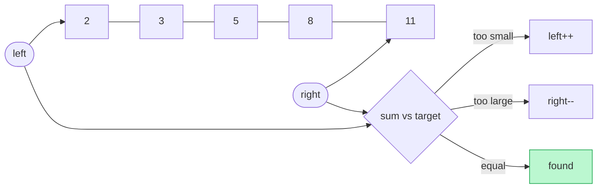

# Memorize: Two Pointers Reduction

## In a Hurry?

- **One-Line Idea**: Transform the problem (usually by sorting) until both ends carry a monotonic guarantee, then converge `left` and `right` with one decisive move per step.
- **Complexities**: O(n log n) time when the reduction is sorting, O(n) time when a greedy formula replaces the sort; O(1) extra space in both cases (`n` = array length).
- **When to Use**: pair-search problems on an array where the answer depends on values (not original indices) — equality, inequality, or "best-so-far" predicates against a target.

---

## One-Line Mnemonic

> **Sort first, then squeeze — or find a formula that squeezes for you.**

---

## Real-World Analogy

Two people stand at opposite ends of a sorted bookshelf, each holding the cheapest and most expensive book respectively, trying to find a pair whose prices sum to a fixed budget. If the total is too low, the person with the cheaper book swaps to a slightly pricier one. If the total is too high, the person with the pricier book swaps to a slightly cheaper one. Each swap rules out one book permanently — the cheaper person never goes back, the pricier person never goes forward — so the shelf collapses to the answer in a single sweep instead of every-pair brute force.

---

## Visual Summary



<p align="center"><strong>On a sorted array, compare the pair sum to the target: too small → advance left, too large → retreat right. Each step rules out a whole row of pairs, so the search is O(n), not O(n²).</strong></p>

---

## Pattern Recognition Triggers

Fires when all of these hold:

- The brute force is O(n²) over pairs of indices.
- The output depends on values (so sorting is legal) **or** the predicate has a greedy monotonic structure (so a formula picks the move direction without sorting).
- Two cursors moving inward — `left` from `0`, `right` from `n − 1` — can evaluate the predicate in O(1) per step.
- Each step provably discards at least one index from future consideration.

---

## Don't Confuse With

| | Two Pointers Reduction | Direct Two Pointers | Sliding Window |
|---|---|---|---|
| **Input shape** | Often unsorted; reduction makes the structure | Already sorted or palindromic | Contiguous subarray over a stream of values |
| **Pointer placement** | `left = 0`, `right = n − 1`; converge inward | `left = 0`, `right = n − 1`; converge inward | Both start at `0`; right expands, left contracts |
| **Setup cost** | O(n log n) sort or O(1) greedy invariant | O(1) | O(1) |
| **What goes wrong** | Forgetting to sort makes the pointer moves non-decisive; the answer becomes index-dependent | Applying it to an unsorted array silently returns wrong answers | Trying to find a single pair instead of an extremum over a window |
| **When this goes wrong** | You move a pointer and the sum changes in the wrong direction — the array isn't sorted | You called the pattern but never ran the reducing sort — the same symptom as above | You keep adjusting the window but the answer is a pair, not a subarray; pointer never crosses |

---

## Template Code

```text
1. (Optional) sort arr in non-decreasing order            — the reducing transformation
2. left  = 0
   right = len(arr) - 1
3. while left < right:
       evaluate predicate on (arr[left], arr[right])
       if matches goal:
           record / return
           (optionally skip duplicates on both sides)
       elif "sum too small" (or analogous):
           left += 1
       else:
           right -= 1
4. return the accumulated answer
```

The shape is the same across all four problems in this section. The variations are: whether to sort (Two Sum / Target Limited / Duplicate Aware: yes; Largest Container: no), what predicate decides the move, and what to accumulate (a single pair, a max value, a list of pairs).

---

## Common Mistakes

- **Forgetting the sort**:
  - *What*: Running two-pointer logic on the original unsorted array and getting wrong answers.
  - *Why*: The decisive-direction invariant requires `arr[left]` to be the running minimum and `arr[right]` the running maximum; without sorting, neither holds.
  - *Fix*: Call `arr.sort()` (or `Arrays.sort(arr)`) immediately after confirming order doesn't matter. If order does matter, switch to a greedy-formula reduction (Largest Container shape) instead.

- **Sorting when order matters**:
  - *What*: Sorting a problem whose answer depends on original positions (e.g. width = `j − i`, "second element must appear after first") and getting wrong answers.
  - *Why*: Sorting destroys the positional information the formula needs; `j − i` after sort is meaningless relative to the original array.
  - *Fix*: Re-read the output spec. If indices appear in the answer or the formula, look for a greedy invariant the formula itself provides — that is the no-sort branch of the pattern.

- **Skipping the duplicate-skip step**:
  - *What*: Returning a result list with the same value-pair appearing multiple times after a match.
  - *Why*: After recording `[arr[left], arr[right]]`, the next iteration's pointers land on the immediately adjacent indices — which, on a sorted array, often carry the same values.
  - *Fix*: After every recorded match, advance `left` past consecutive copies of `arr[left]` and pull `right` back past consecutive copies of `arr[right]` before the next iteration.

- **Moving the wrong pointer on a valid pair**:
  - *What*: In Target Limited Two Sum, decrementing `right` when a pair satisfies `sum < target` — and ending up with a stale `max_sum`.
  - *Why*: When the pair is valid, `arr[right]` is already the largest available partner for `arr[left]`; the only move that can find a larger valid sum is `left++`.
  - *Fix*: On a valid pair, record the candidate and **advance the anchor** (`left++`); only the invalid branch reduces the other pointer.

- **Moving the taller wall in Largest Container**:
  - *What*: Incrementing `left` when `heights[left] > heights[right]` and missing the optimal pair.
  - *Why*: The shorter wall is the bottleneck — the current container is already the best result it can produce. Moving the taller wall keeps the bottleneck in place while shrinking width.
  - *Fix*: Always move the pointer on the shorter wall: `heights[left] < heights[right]` → `left++`; otherwise → `right--`.

---

## Minimum Viable Example

```
arr     = [1, 4, 6, 8]      (already sorted)
target  = 10
left=0 (1), right=3 (8):  1 + 8 = 9  < 10  → left++
left=1 (4), right=3 (8):  4 + 8 = 12 > 10  → right--
left=1 (4), right=2 (6):  4 + 6 = 10 == 10 → return [4, 6]
```

Four elements, three pointer-evaluations, the answer surfaces without ever revisiting an index.

---

## Quick Recall

**Q: What property of the answer makes sorting legal?**
A: The answer depends on values, not on the original indices.

**Q: When can two pointers work without sorting?**
A: When the problem's formula itself provides a decisive direction — moving one specific pointer is provably useless at every step.

**Q: What invariant does sorting establish?**
A: `arr[left]` is the minimum and `arr[right]` is the maximum of the unexamined window.

**Q: Why do you advance `left` on a valid match in Target Limited Two Sum?**
A: `arr[right]` is already the largest possible partner for `arr[left]`, so no larger valid sum can involve `arr[left]`.

**Q: How does Duplicate Aware Two Sum avoid repeating a pair?**
A: After recording a match, skip past every consecutive copy of `arr[left]` and `arr[right]` before continuing.

**Q: Which problem in this section doesn't need a sort?**
A: Largest Container — order matters there, and the area formula's bottleneck structure replaces sorting as the source of decisive direction.

**Q: What is the worst-case time complexity of any reduction in this section?**
A: O(n log n) — dominated by the sort; the two-pointer pass itself is O(n).
