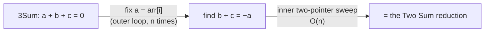

# Pattern: Two Pointers Subproblem

## Why It Exists

The reduction pattern turned pair-finding into one `O(n)` sweep. But what about *three* numbers summing to zero — 3Sum? A single converging pass tracks only two positions and one direction; it has no way to juggle a third. The brute force is three nested loops, `O(n³)`.

Here's the unlock: you don't need two pointers to do the *whole* job — only the inner part. **Fix the first number** with an outer loop, and what's left is "find two more that sum to a target" — exactly the Two Sum reduction you already know. Two pointers becomes a *subroutine* called once per fixed element. That's the subproblem pattern: decompose, solve the small piece with two pointers, repeat.

## See It Work

3Sum on a sorted array: the outer loop fixes `arr[i]`, the inner two pointers sweep the rest for the matching pair. Run it, then **Visualise**.

> ▶ Run it, then click **Visualise** — for each fixed `arr[i]`, `left` and `right` sweep the suffix looking for `-arr[i]`.

```python run viz=array viz-root=arr
arr = [-3, -1, 0, 2, 4]              # sorted; find triples summing to 0
n, triples = len(arr), []
for i in range(n - 2):               # OUTER: fix arr[i]...
    left, right = i + 1, n - 1       # ...INNER: two-pointer the rest (a Two Sum)
    while left < right:
        s = arr[i] + arr[left] + arr[right]
        if s == 0:
            triples.append((arr[i], arr[left], arr[right])); left += 1; right -= 1
        elif s < 0:
            left += 1
        else:
            right -= 1
print(triples)                       # [(-3, -1, 4)]
```

## How It Works

The shape is **two layers of motion**: an outer driver that fixes part of the problem, and an inner two-pointer pass that solves what remains. Two flavors cover almost everything:

- **Fix-and-reduce** — the outer loop locks one element, dropping the dimension by one. 3Sum: fix `a = arr[i]`, then find `b + c = −a` in the sorted remainder — that inner search *is* the Two Sum reduction. One outer loop × an `O(n)` sweep = **`O(n²)`**, beating the `O(n³)` brute force. Fix *two* (4Sum) for `O(n³)`; the construction generalizes to k-Sum at `O(n^(k−1))`.
- **Sequence-of-transformations** — the outer driver is a fixed list of two-pointer sub-ops, not a loop. Rotating an array left by `k` is *three reversals*: reverse the whole array, then reverse the first part, then the rest. Each reversal is the base two-pointer flip, so the whole rotation is `O(n)` time, `O(1)` space.



<p align="center"><strong>fixing one element turns 3Sum into a Two Sum that the inner two-pointer sweep solves; <code>n</code> fixes × <code>O(n)</code> each = <code>O(n²)</code>.</strong></p>

The cost rule is simple: **`O(n^(d+1))`** where `d` is the outer-loop depth (one fixed element → `O(n²)`, two → `O(n³)`), unless the outer driver is a fixed sequence rather than a loop — then it stays at the inner pass's cost, `O(n)`.

### Key Takeaway

When one two-pointer sweep isn't enough, make it the *inner* step: an outer loop fixes an element and the remainder reduces to a problem two pointers already solve — `O(n^(d+1))` for `d` fixed dimensions.

## Trace It

3Sum on `[-3, -1, 0, 2, 4]`. The outer loop fixes `arr[0] = -3`, so the inner pass needs two values summing to `3`:

| `i` (fixed) | inner `left`/`right` | `arr[left]+arr[right]` | vs 3 | result |
|---|---|---|---|---|
| 0 (`-3`) | 1 (`-1`), 4 (`4`) | 3 | equal | **found `(-3, -1, 4)`** |

Before you read on: after fixing `-3` finds its pair, the outer loop advances to fix `-1`. Why does it never need to *re-examine* `-3`?

Because every triple containing `-3` was fully explored while `-3` was fixed — the inner sweep covered all pairs in the suffix. Moving the outer pointer forward permanently retires the fixed element, exactly like the reduction's discard invariant, one dimension up. That's why the total is `n × O(n)`, not `O(n³)`.

## Your Turn

The reusable 3Sum — outer loop + inner reduction (real code also skips equal neighbours to dedupe; omitted here for clarity):

```python run viz=array
def three_sum(arr):
    arr = sorted(arr)
    n, out = len(arr), []
    for i in range(n - 2):                 # outer: fix arr[i]
        left, right = i + 1, n - 1         # inner: Two Sum on the suffix
        while left < right:
            s = arr[i] + arr[left] + arr[right]
            if s == 0:
                out.append((arr[i], arr[left], arr[right])); left += 1; right -= 1
            elif s < 0:
                left += 1
            else:
                right -= 1
    return out

print(three_sum([-1, 0, 1, 2, -1, -4]))    # [(-1,-1,2), (-1,0,1), (-1,0,1)] — note the repeat: the dedupe gotcha
```

```java run viz=array
import java.util.*;

public class Main {
  static List<int[]> threeSum(int[] a) {
    Arrays.sort(a);
    List<int[]> out = new ArrayList<>();
    for (int i = 0; i < a.length - 2; i++) {          // outer: fix a[i]
      int left = i + 1, right = a.length - 1;          // inner: Two Sum
      while (left < right) {
        int s = a[i] + a[left] + a[right];
        if (s == 0) { out.add(new int[]{a[i], a[left], a[right]}); left++; right--; }
        else if (s < 0) left++;
        else right--;
      }
    }
    return out;
  }
  public static void main(String[] x) {
    for (int[] t : threeSum(new int[]{-1, 0, 1, 2, -1, -4})) System.out.println(Arrays.toString(t));
  }
}
```

Drill the family in **Practice** — [Three Sum](/cortex/data-structures-and-algorithms/linear-structures/arrays/pattern-two-pointers-subproblem/problems/three-sum), then [Four Sum](/cortex/data-structures-and-algorithms/linear-structures/arrays/pattern-two-pointers-subproblem/problems/four-sum) and [K Rotations](/cortex/data-structures-and-algorithms/linear-structures/arrays/pattern-two-pointers-subproblem/problems/k-rotations).

## Reflect & Connect

This is the pattern that scales two pointers past pairs:

- **The k-Sum ladder** — 3Sum (`O(n²)`), 4Sum (`O(n³)`), and on up: each extra value is one more outer loop wrapping the same Two Sum core. Knowing this, you can derive 4Sum cold from 3Sum.
- **Rotation = three reversals** — the sequence flavor: composing fixed two-pointer sub-ops into a bigger transform, `O(n)` and in place.
- **Watch the duplicates.** k-Sum problems usually want *distinct* triples, so production code skips over equal adjacent values after a sort — the most common 3Sum bug is emitting the same triple twice.

The tradeoff echoes the reduction lesson: 3Sum has a hash-based variant too, but the sort-plus-nested-two-pointer version is `O(1)` extra space and far easier to dedupe. Beyond this section, "decompose into a subproblem a known technique solves" is the meta-move behind divide-and-conquer and dynamic programming later in the book.

**Prerequisites:** [Two Pointers Reduction](/cortex/data-structures-and-algorithms/linear-structures/arrays/pattern-two-pointers-reduction/pattern) (the inner sweep this calls).
**What's next:** two pointers walking two *different* sequences at once — [Simultaneous Traversal](/cortex/data-structures-and-algorithms/linear-structures/arrays/pattern-simultaneous-traversal/pattern).

## Recall

> **Mnemonic:** *Too big for one sweep? Fix an element (outer loop), two-pointer the rest (inner). `n` fixes × `O(n)` = `O(n²)`.*

| | |
|---|---|
| Shape | outer driver fixes state → inner two-pointer solves the remainder |
| Fix-and-reduce | fix `d` elements → `O(n^(d+1))` (3Sum `O(n²)`, 4Sum `O(n³)`) |
| Sequence form | fixed list of two-pointer sub-ops (rotation = 3 reversals) → `O(n)` |
| Gotcha | dedupe by skipping equal adjacent values after the sort |

<details>
<summary><strong>Q:</strong> How does fixing one element turn 3Sum into something solvable?</summary>

**A:** It drops the dimension to two — "find `b + c = −a`" — which is the Two Sum reduction, an `O(n)` sweep.

</details>
<details>
<summary><strong>Q:</strong> What's the cost rule?</summary>

**A:** `O(n^(d+1))` for `d` fixed elements (3Sum `O(n²)`, 4Sum `O(n³)`); a fixed *sequence* of sub-ops stays `O(n)`.

</details>
<details>
<summary><strong>Q:</strong> How is "rotate left by k" three reversals?</summary>

**A:** Reverse the whole array, then the first `k`, then the rest — each a two-pointer flip; total `O(n)`, `O(1)` space.

</details>
<details>
<summary><strong>Q:</strong> The classic 3Sum bug?</summary>

**A:** Emitting duplicate triples — fix it by skipping equal adjacent values after sorting.

</details>

## Sources & Verify

- **Sedgewick & Wayne**, *Algorithms*, 4th ed., §2.1 — sorting plus nested two-pointer scans; the basis for the k-Sum family's complexity.
- **cp-algorithms.com**, "Two Pointers Method" — the fix-one-then-sweep decomposition behind 3Sum/4Sum.
- The `O(n^(k−1))` k-Sum bound, the three-reversal rotation, and the dedupe note are standard; both runnable blocks are verified by running (the inner sweep is the verified Two Sum reduction).
