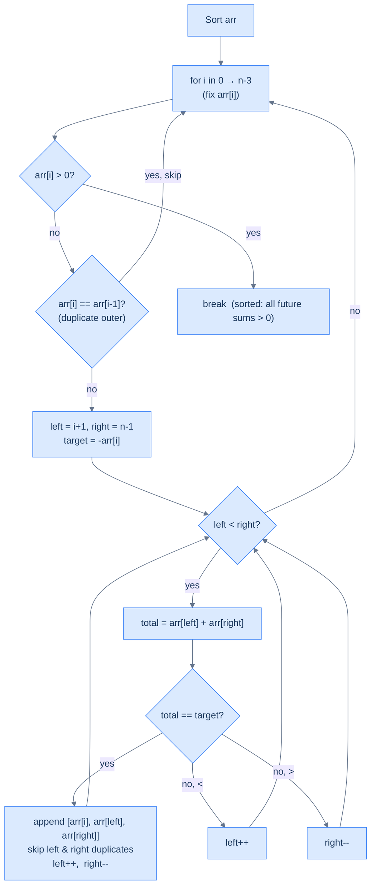

# Three Sum

## The Problem

Given an integer array `arr`, find **all unique triplets** `[a, b, c]` such that `a + b + c = 0`. The solution set must not contain duplicate triplets.

```
Input:  arr = [-1, 0, 1, 2, -1, -4]
Output: [[-1, -1, 2], [-1, 0, 1]]
```

---

## Examples

**Example 1**
```
Input:  arr = [-1, 0, 1, 2, -1, -4]
Output: [[-1, -1, 2], [-1, 0, 1]]
```

**Example 2**
```
Input:  arr = [0, 0, 0, 0]
Output: [[0, 0, 0]]
```

**Example 3**
```
Input:  arr = [1, 2, 3]
Output: []
Explanation: No triplet sums to 0.
```

**Example 4**
```
Input:  arr = [-2, 0, 0, 2, 2]
Output: [[-2, 0, 2]]
```

```quiz
{
  "prompt": "Now your turn!",
  "input": "arr = [-1, 0, 1, 2, -1, -4]",
  "options": ["[[-1, -1, 2], [-1, 0, 1]]", "[[-1, 0, 1]]", "[[-1, -1, 2]]", "[]"],
  "answer": "[[-1, -1, 2], [-1, 0, 1]]"
}
```

## Constraints

- `0 ≤ arr.length ≤ 3000`
- `-10^5 ≤ arr[i] ≤ 10^5`
- The solution set must not contain duplicate triplets

```python run viz=array viz-root=arr
import ast
from typing import List

class Solution:
    def three_sum(self, arr: List[int]) -> List[List[int]]:
        # Your code goes here — sort, then fix arr[i] and run a converging
        # two-pointer sweep on the suffix to collect all unique triplets.
        return []

arr = ast.literal_eval(input())      # the test case's arr
print(Solution().three_sum(arr))
```

```java run viz=array viz-root=arr
import java.util.*;

public class Main {
    static class Solution {
        public List<List<Integer>> threeSum(int[] arr) {
            // Your code goes here — sort, then fix arr[i] and run a converging
            // two-pointer sweep on the suffix to collect all unique triplets.
            return new ArrayList<>();
        }
    }

    public static void main(String[] args) {
        Scanner sc = new Scanner(System.in);
        int[] arr = parseIntArray(sc.nextLine());
        System.out.println(new Solution().threeSum(arr));
    }

    // "[1, 2, 3]" → {1, 2, 3} — reads the test case's arr
    static int[] parseIntArray(String line) {
        String inner = line.replaceAll("[\\[\\]\\s]", "");
        if (inner.isEmpty()) return new int[0];
        String[] parts = inner.split(",");
        int[] out = new int[parts.length];
        for (int i = 0; i < parts.length; i++) out[i] = Integer.parseInt(parts[i]);
        return out;
    }
}
```

```testcases
{
  "args": [
    { "id": "arr", "label": "arr", "type": "int[]", "placeholder": "[-1, 0, 1, 2, -1, -4]" }
  ],
  "cases": [
    { "args": { "arr": "[-1, 0, 1, 2, -1, -4]" }, "expected": "[[-1, -1, 2], [-1, 0, 1]]" },
    { "args": { "arr": "[0, 0, 0, 0]" }, "expected": "[[0, 0, 0]]" },
    { "args": { "arr": "[1, 2, 3]" }, "expected": "[]" },
    { "args": { "arr": "[-2, 0, 0, 2, 2]" }, "expected": "[[-2, 0, 2]]" },
    { "args": { "arr": "[]" }, "expected": "[]" },
    { "args": { "arr": "[-4, -2, -2, 0, 2, 2, 4]" }, "expected": "[[-4, 0, 4], [-4, 2, 2], [-2, -2, 4], [-2, 0, 2]]" }
  ]
}
```

<details>
<summary><h2>Intuition</h2></summary>

The **structural property** is that `a + b + c = 0` is linear in three unknowns. Locking one unknown collapses the equation to `b + c = −a`. That two-unknown form is the Two Sum reduction problem, solvable in `O(n)` with two pointers on a sorted array. Each one-element commitment cuts a whole dimension out of the search space. The "fix one, solve the rest" decomposition is the entire pattern.

The **pointer placement** is layered. The outer driver is a single loop over `i`, picking each candidate first element `arr[i]`. For each `i` it spawns an inner two-pointer sweep with `left = i + 1` and `right = n − 1` over the sorted suffix. Inside that suffix, `arr[left]` is the current minimum and `arr[right]` is the maximum. Moving `left` right strictly increases the pair sum; moving `right` left strictly decreases it. This decisive direction lets the inner sweep run in `O(n)` instead of `O(n²)`. Sorting up front establishes the property for every inner pass simultaneously.

What **breaks if you reach for the naive approach**? Three nested loops over `(i, j, k)` check every triplet in `O(n³)` time, and a set-based deduplication on the output adds memory overhead. A hash-map-only solution can hit `O(n²)` time but needs `O(n)` extra memory. Worse, duplicate suppression turns into explicit filtering of every triplet position. The sort + two-pointer subproblem approach hits `O(n²)` time with `O(1)` working space. The duplicate skip then falls out of sorted order: equal values sit adjacent, so a one-line `if arr[i] == arr[i - 1] continue` catches them.

</details>
<details>
<summary><h2>Pattern Sketch</h2></summary>

Three Sum extends Two Sum with one extra element fixed. If we pick one element `arr[i]` and fix it, the problem reduces to:

> Find all pairs in the **remaining** subarray that sum to `−arr[i]`.

That's exactly Duplicate Aware Two Sum, solvable in `O(n)` with two pointers on a sorted array.



<p align="center"><strong>Three Sum — outer loop fixes one element; inner two-pointer finds all valid pairs summing to the negative of that element.</strong></p>

</details>
<details>
<summary><h2>Applying the Diagnostic Questions</h2></summary>


Three Sum sits at the intersection of two patterns you've already seen — the **subproblem** pattern from this section and the **reduction** technique from the previous one. The diagnostic questions make this explicit.

| Check | Answer for Three Sum |
|---|---|
| **Q1.** Can the problem be decomposed into smaller subproblems? | **Yes** — fix `arr[i]`; the problem becomes "find all pairs in `arr[i+1..n-1]` summing to `−arr[i]`" — a plain Two Sum on the sorted suffix. |
| **Q2.** Can any subproblem be solved with two pointers (directly or via reduction)? | **Yes** — that pair-finding subproblem is Duplicate Aware Two Sum, which sorts once and runs a converging two-pointer sweep in `O(n)`. |
| **Q3.** Does the subproblem have a decisive direction? | **Yes** — after sorting, `arr[left]` is the suffix minimum and `arr[right]` is the maximum, so `left++` strictly increases the pair sum and `right--` strictly decreases it. |
| **Q4.** Is the per-step inner work `O(1)`? | **Yes** — each inner step adds `arr[left] + arr[right]`, compares against the target, and either records a triplet or advances one pointer. |

### Q1 — Why "fix one element and reduce to a pair-finding subproblem"?

**Mental model:** Think of the problem as searching through all triples `(a, b, c)` where `a + b + c = 0`. That's a three-dimensional search. If you lock one dimension — say `a = arr[i]` — you're left with a two-dimensional search: `b + c = −arr[i]`. Two unknowns on a sorted array is a problem you already know how to solve in O(n).

**Concrete numbers:** take `arr = [-4, -1, -1, 0, 1, 2]` (sorted). Fix `arr[1] = -1`. Now `target = −(−1) = 1`. The subproblem is: find all pairs in `[-1, 0, 1, 2]` summing to `1`. Two pointers find `(-1, 2)` and `(0, 1)` — giving triplets `[-1, -1, 2]` and `[-1, 0, 1]`.

**What breaks without this decomposition?** Without fixing one element, you'd need three nested loops to check every triple — O(n³). Fixing one element collapses the search from three dimensions to two, giving O(n²). The outer loop runs at most n times; the inner two-pointer pass runs in O(n) per iteration.

### Q2 — Why "the inner subproblem is Duplicate Aware Two Sum, solved with two pointers"?

**Mental model:** Once you fix `arr[i]` and have a sorted subarray with a target, the problem is identical to the Two Sum problems in the previous section. The subarray is already sorted (sorting once before the outer loop covers all inner passes). `arr[left]` is always the minimum remaining value and `arr[right]` is always the maximum. Every pointer move has a predictable, guaranteed effect: moving `left` right always increases the sum; moving `right` left always decreases it.

**Concrete numbers:** subarray `[-1, 0, 1, 2]`, target `1`:
- `left=0 (-1), right=3 (2)`: sum = 1 — match ✓, record and move both inward
- `left=1 (0), right=2 (1)`: sum = 1 — match ✓, record and move both inward
- `left=2, right=1`: left ≥ right — done

Two pointer moves, two results, O(n) total. A three-nested-loop brute force would take 6 comparisons for the same 4-element window.

**What breaks if you skip sorting?** Without sorting the subarray, moving `left` right no longer guarantees a larger value — you might skip the correct pair entirely. The decisive-direction property that makes two pointers work comes entirely from the sorted order.

> **Pattern note:** Three Sum is a two-pointer **subproblem** problem at the outer level (decompose by fixing one element), and a two-pointer **reduction** problem at the inner level (sort + two-pointer on the subarray). The nesting of patterns is what makes it an `O(n²)` solution — one layer of decomposition, one layer of linear two-pointer inside.

</details>
<details>
<summary><h2>Approach</h2></summary>

Four numbered steps. No code; the next section is the implementation.

1. **Sort `arr` in non-decreasing order.** Establishes the decisive-direction invariant for every inner two-pointer pass and lines up duplicates so the three skip rules are one-line index comparisons.
2. **Loop the outer index `i` from `0` to `n − 1`.** Each `i` fixes a candidate first element `arr[i]`. Skip `i` if `i > 0` and `arr[i] == arr[i - 1]` — the same first element produces the same triplets and would emit duplicates.
3. **For each surviving `i`, run a Duplicate Aware Two Sum on the suffix `arr[i+1..n-1]`** with target `−arr[i]`. Set `left = i + 1`, `right = n − 1`. While `left < right`, sum the three values: equal to zero records the triplet and advances both pointers past their respective duplicate runs; negative advances `left` to climb; positive advances `right` to descend.
4. **Return the accumulated `result` list.** Every triplet was recorded exactly once because the outer skip blocks duplicate first elements and the inner skip blocks duplicate pairs for any given first element.

</details>
<details>
<summary><h2>The Early-Exit Optimisation</h2></summary>


Since the array is sorted, if `arr[i] > 0`, then `arr[left] ≥ arr[i] > 0` and `arr[right] ≥ arr[i] > 0` — the sum of any three elements from position `i` onward is positive. No triplet can sum to 0. Break early.

</details>
<details>
<summary><h2>Solution &amp; Analysis</h2></summary>

### Solution

```python solution time=O(n^2) space=O(k)
import ast
from typing import List

class Solution:
    def skip_duplicates_left(
        self, arr: List[int], left: int, right: int
    ) -> int:

        # Skip duplicates from the left pointer
        while left < right and arr[left] == arr[left + 1]:
            left += 1

        # Return the index of the next unique element
        return left + 1

    def skip_duplicates_right(
        self, arr: List[int], left: int, right: int
    ) -> int:

        # Skip duplicates from the right pointer
        while left < right and arr[right] == arr[right - 1]:
            right -= 1

        # Return the index of the next unique element
        return right - 1

    def duplicate_aware_two_sum(
        self, arr: List[int], index: int, result: List[List[int]]
    ) -> None:
        left = index + 1
        right = len(arr) - 1

        # Use a while loop to traverse the array using the two pointers
        while left < right:
            total = arr[index] + arr[left] + arr[right]

            # If the sum is 0, add the triplet to the result.
            if total == 0:
                result.append([arr[index], arr[left], arr[right]])

                # Move the left pointer to the next unique element to
                # avoid duplicates
                left = self.skip_duplicates_left(arr, left, right)

                # Move the right pointer to the previous unique element
                # to avoid duplicates
                right = self.skip_duplicates_right(arr, left, right)

            # Move the left pointer to increase the sum
            elif total < 0:
                left += 1

            # Move the right pointer to decrease the sum
            else:
                right -= 1

    def three_sum(self, arr: List[int]) -> List[List[int]]:
        result = []

        # Sort the array in non-decreasing order.
        arr.sort()

        # Traverse the array using 1 pointer.
        for i in range(len(arr)):

            # Skip duplicates for the first element.
            if i > 0 and arr[i] == arr[i - 1]:
                continue

            # Use the two-pointer technique to find pairs with sum
            # -arr[i].
            self.duplicate_aware_two_sum(arr, i, result)

        return result


arr = ast.literal_eval(input())      # the test case's arr
print(Solution().three_sum(arr))
```

```java solution
import java.util.*;

public class Main {
    static class Solution {
        private int skipDuplicatesLeft(int[] arr, int left, int right) {

            // Skip duplicates from the left pointer
            while (left < right && arr[left] == arr[left + 1]) {
                left++;
            }

            // Return the index of the next unique element
            return left + 1;
        }

        private int skipDuplicatesRight(int[] arr, int left, int right) {

            // Skip duplicates from the right pointer
            while (left < right && arr[right] == arr[right - 1]) {
                right--;
            }

            // Return the index of the next unique element
            return right - 1;
        }

        private void duplicateAwareTwoSum(
            int[] arr,
            int index,
            List<List<Integer>> result
        ) {
            int left = index + 1;
            int right = arr.length - 1;

            // Use a while loop to traverse the array using the two pointers
            while (left < right) {
                int sum = arr[index] + arr[left] + arr[right];

                // If the sum is 0, add the triplet to the result.
                if (sum == 0) {
                    result.add(List.of(arr[index], arr[left], arr[right]));

                    // Move the left pointer to the next unique element to
                    // avoid duplicates
                    left = skipDuplicatesLeft(arr, left, right);

                    // Move the right pointer to the previous unique element
                    // to avoid duplicates
                    right = skipDuplicatesRight(arr, left, right);
                }

                // Move the left pointer to increase the sum
                else if (sum < 0) {
                    left++;
                }

                // Move the right pointer to decrease the sum
                else {
                    right--;
                }
            }
        }

        public List<List<Integer>> threeSum(int[] arr) {
            List<List<Integer>> result = new ArrayList<>();

            // Sort the array in non-decreasing order.
            Arrays.sort(arr);

            // Traverse the array using 1 pointer.
            for (int i = 0; i < arr.length; i++) {

                // Skip duplicates for the first element.
                if (i > 0 && arr[i] == arr[i - 1]) {
                    continue;
                }

                // Use the two-pointer technique to find pairs with sum
                // -arr[i].
                duplicateAwareTwoSum(arr, i, result);
            }

            return result;
        }
    }

    public static void main(String[] args) {
        Scanner sc = new Scanner(System.in);
        int[] arr = parseIntArray(sc.nextLine());
        System.out.println(new Solution().threeSum(arr));
    }

    static int[] parseIntArray(String line) {
        String inner = line.replaceAll("[\\[\\]\\s]", "");
        if (inner.isEmpty()) return new int[0];
        String[] parts = inner.split(",");
        int[] out = new int[parts.length];
        for (int i = 0; i < parts.length; i++) out[i] = Integer.parseInt(parts[i]);
        return out;
    }
}
```

### Dry Run — Example 1

`arr = [-1, 0, 1, 2, -1, -4]` → sorted: `[-4, -1, -1, 0, 1, 2]`

**i=0, arr[i]=-4, target=4, left=1, right=5:**

| left | right | arr[l]+arr[r] | Action |
|---|---|---|---|
| 1 (-1) | 5 (2) | 1 | < 4 → left++ |
| 2 (-1) | 5 (2) | 1 | < 4 → left++ |
| 3 (0) | 5 (2) | 2 | < 4 → left++ |
| 4 (1) | 5 (2) | 3 | < 4 → left++ |
| 5=right | — | — | left ≥ right → stop |

No triplets for i=0.

**i=1, arr[i]=-1, target=1, left=2, right=5:**

```d3 widget=array-1d
{
  "steps": [
    {
      "nodes": [
        {
          "id": "a",
          "label": "-4",
          "kind": "cell",
          "meta": [],
          "slot": 0,
          "cardId": "",
          "layoutKind": ""
        },
        {
          "id": "b",
          "label": "-1",
          "kind": "cell",
          "meta": [],
          "slot": 1,
          "cardId": "",
          "layoutKind": ""
        },
        {
          "id": "c",
          "label": "-1",
          "kind": "cell",
          "meta": [],
          "slot": 2,
          "cardId": "",
          "layoutKind": ""
        },
        {
          "id": "d",
          "label": "0",
          "kind": "cell",
          "meta": [],
          "slot": 3,
          "cardId": "",
          "layoutKind": ""
        },
        {
          "id": "e",
          "label": "1",
          "kind": "cell",
          "meta": [],
          "slot": 4,
          "cardId": "",
          "layoutKind": ""
        },
        {
          "id": "f",
          "label": "2",
          "kind": "cell",
          "meta": [],
          "slot": 5,
          "cardId": "",
          "layoutKind": ""
        }
      ],
      "edges": [],
      "cursor": [
        {
          "name": "i",
          "target": "b",
          "color": "#a855f7"
        },
        {
          "name": "left",
          "target": "c",
          "color": "#3b82f6"
        },
        {
          "name": "right",
          "target": "f",
          "color": "#f59e0b"
        }
      ],
      "highlight": [],
      "changed": [],
      "removed": [],
      "annotation": "arr[left] + arr[right] = -1 + 2 = 1 = target → record triplet [-1, -1, 2].",
      "line": 0,
      "frames": [],
      "cardCursor": []
    },
    {
      "nodes": [
        {
          "id": "a",
          "label": "-4",
          "kind": "cell",
          "meta": [],
          "slot": 0,
          "cardId": "",
          "layoutKind": ""
        },
        {
          "id": "b",
          "label": "-1",
          "kind": "cell",
          "meta": [],
          "slot": 1,
          "cardId": "",
          "layoutKind": ""
        },
        {
          "id": "c",
          "label": "-1",
          "kind": "cell",
          "meta": [],
          "slot": 2,
          "cardId": "",
          "layoutKind": ""
        },
        {
          "id": "d",
          "label": "0",
          "kind": "cell",
          "meta": [],
          "slot": 3,
          "cardId": "",
          "layoutKind": ""
        },
        {
          "id": "e",
          "label": "1",
          "kind": "cell",
          "meta": [],
          "slot": 4,
          "cardId": "",
          "layoutKind": ""
        },
        {
          "id": "f",
          "label": "2",
          "kind": "cell",
          "meta": [],
          "slot": 5,
          "cardId": "",
          "layoutKind": ""
        }
      ],
      "edges": [],
      "cursor": [
        {
          "name": "i",
          "target": "b",
          "color": "#a855f7"
        },
        {
          "name": "left",
          "target": "d",
          "color": "#3b82f6"
        },
        {
          "name": "right",
          "target": "e",
          "color": "#f59e0b"
        }
      ],
      "highlight": [],
      "changed": [],
      "removed": [],
      "annotation": "After advancing past duplicates: arr[left] + arr[right] = 0 + 1 = 1 = target → record triplet [-1, 0, 1].",
      "line": 0,
      "frames": [],
      "cardCursor": []
    },
    {
      "nodes": [
        {
          "id": "a",
          "label": "-4",
          "kind": "cell",
          "meta": [],
          "slot": 0,
          "cardId": "",
          "layoutKind": ""
        },
        {
          "id": "b",
          "label": "-1",
          "kind": "cell",
          "meta": [],
          "slot": 1,
          "cardId": "",
          "layoutKind": ""
        },
        {
          "id": "c",
          "label": "-1",
          "kind": "cell",
          "meta": [],
          "slot": 2,
          "cardId": "",
          "layoutKind": ""
        },
        {
          "id": "d",
          "label": "0",
          "kind": "cell",
          "meta": [],
          "slot": 3,
          "cardId": "",
          "layoutKind": ""
        },
        {
          "id": "e",
          "label": "1",
          "kind": "cell",
          "meta": [],
          "slot": 4,
          "cardId": "",
          "layoutKind": ""
        },
        {
          "id": "f",
          "label": "2",
          "kind": "cell",
          "meta": [],
          "slot": 5,
          "cardId": "",
          "layoutKind": ""
        }
      ],
      "edges": [],
      "cursor": [
        {
          "name": "i",
          "target": "b",
          "color": "#a855f7"
        }
      ],
      "highlight": [],
      "changed": [],
      "removed": [],
      "annotation": "left ≥ right → inner pass for i = 1 ends. Two triplets recorded.",
      "line": 0,
      "frames": [],
      "cardCursor": []
    }
  ],
  "title": "Three Sum inner trace — i = 1 (arr[i] = -1), target for inner = 1"
}
```

<p align="center"><strong>Three Sum inner trace for <code>i = 1</code> (<code>arr[i] = -1</code>, inner target = 1) — converging pointers find both triplets in two stops.</strong></p>

| left | right | arr[l]+arr[r] | Action |
|---|---|---|---|
| 2 (-1) | 5 (2) | 1 | == 1 ✅ → record **[-1,-1,2]**, skip dup, left=3, right=4 |
| 3 (0) | 4 (1) | 1 | == 1 ✅ → record **[-1,0,1]**, left=4, right=3 |
| — | — | — | left ≥ right → stop |

**i=2, arr[i]=-1:** duplicate of arr[1] → skip

**i=3, arr[i]=0:** `arr[i] > 0`? No. target=0, left=4, right=5:

| left | right | arr[l]+arr[r] | Action |
|---|---|---|---|
| 4 (1) | 5 (2) | 3 | > 0 → right-- |
| 4 (1) | 4 | — | left ≥ right → stop |

**i=4:** only 1 element left — loop ends.

**Result: `[[-1,-1,2], [-1,0,1]]`** ✓

### Complexity Analysis

| | Complexity | Reasoning |
|---|---|---|
| **Time** | O(n²) | Outer loop O(n) × inner two-pointer O(n) — sort is O(n log n), dominated by O(n²) |
| **Space** | O(k) | k = number of unique triplets returned; O(1) working space beyond the output list |

### Edge Cases

| Scenario | Input | Output | Note |
|---|---|---|---|
| All zeros | `[0,0,0,0]` | `[[0,0,0]]` | Duplicate skip keeps it unique |
| No valid triplets, all positive | `[1,2,3]` | `[]` | All positive — `arr[i] > 0` triggers early exit after `i = 0` |
| Single triplet | `[-1,0,1]` | `[[-1,0,1]]` | Exact minimum case |
| Array length `< 3` | `[1,2]` | `[]` | Inner pass starts with `left ≥ right` — never enters |
| Empty array | `[]` | `[]` | Outer loop never enters |
| Multiple duplicates with valid triplets | `[-2,0,0,2,2]` | `[[-2,0,2]]` | All three skip levels (outer + both inner) cooperate to keep the result unique |

</details>
<details>
<summary><h2>Key Takeaway</h2></summary>


Three Sum = outer loop fixing one element + inner Duplicate Aware Two Sum, all on the sorted array. What is **new vs. K Rotations** is the outer loop: rotation's outer driver was a fixed three-call sequence, so the work stayed `O(n)`; here the driver loops over `n` choices for the fixed element, paying an extra `O(n)` factor for `O(n²)` total. Sort once, skip duplicates at every level, and the inner two-pointer does the rest.

</details>
