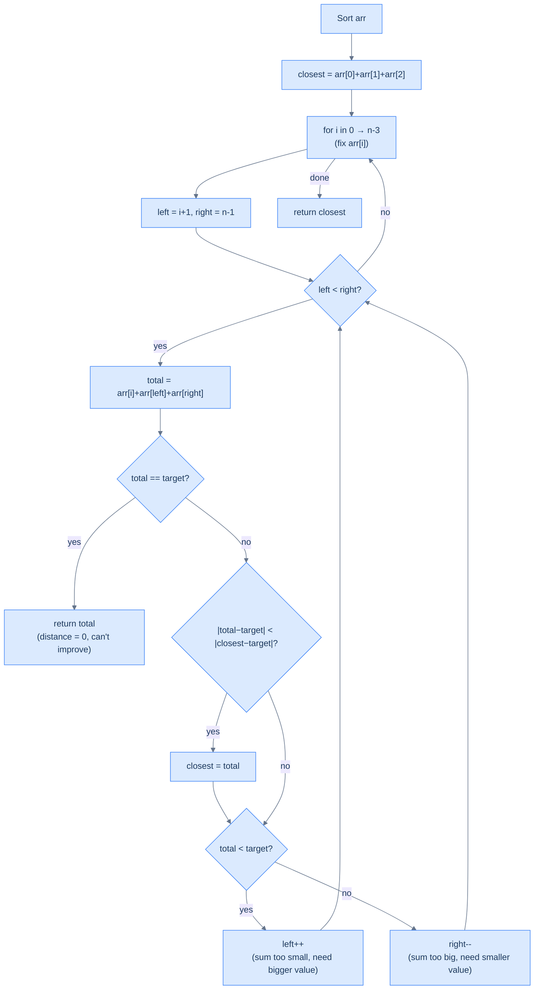

# Approximate Three Sum

## The Problem

Given an integer array `arr` and an integer `target`, find three integers in `arr` whose sum is **closest to `target`**. Return that sum. You may assume exactly one solution exists.

```
Input:  arr = [-1, 2, 1, -4],  target = 1
Output: 2
```

---

## Examples

**Example 1**
```
Input:  arr = [2, 7, 11, 15],  target = 3
Output: 20
Explanation: 2 + 7 + 11 = 20 is the closest sum to 3.
```

**Example 2**
```
Input:  arr = [-1, 2, 1, -4],  target = 1
Output: 2
Explanation: -1 + 2 + 1 = 2 is the closest sum to 1.
```

**Example 3**
```
Input:  arr = [0, 0, 0],  target = 1
Output: 0
Explanation: 0 + 0 + 0 = 0 is the closest sum to 1.
```

<details>
<summary><h2>Intuition</h2></summary>

The **structural property** is the same one that made Three Sum a two-pointer subproblem: `a + b + c ≈ target` is linear in three unknowns. Locking the first unknown leaves a two-unknown subproblem on the sorted suffix. The same decisive-direction property powers the inner sweep. The only change is the objective — instead of an exact match, the inner pass minimises `|sum − target|` and keeps the best sum found so far. The pattern fit is identical to exact Three Sum; the bookkeeping changes by one tracker variable.

The **pointer placement** is unchanged. The outer driver loops `i` over every candidate first element. For each `i` the inner two-pointer starts with `left = i + 1`, `right = n − 1` and walks the sorted suffix. The per-step decision rule reads the sign of `total − target`. `total < target` advances `left` to climb. `total > target` advances `right` to descend. `total == target` returns immediately — distance zero cannot be improved. Every move is purposeful: `arr[left]` is the suffix minimum, `arr[right]` the maximum, and each pointer step strictly nudges the pair sum in a known direction.

What **breaks if you reach for the naive approach**? Three nested loops over `(i, j, k)` with a running `|sum − target|` tracker is the textbook brute force — `O(n³)` time, `O(1)` space. A hash-map variant is awkward because the search is over an open interval (closest), not an exact membership question. Hashing tells you whether `(target − a − b)` exists, but it tells you nothing about which existing value is *closest*. Only the sort + two-pointer subproblem approach achieves `O(n²)` time with `O(1)` working space. That matches exact Three Sum's cost, paid by one extra integer to remember the closest sum so far.

</details>
<details>
<summary><h2>Pattern Sketch</h2></summary>

This problem is Three Sum's sibling — fix one element, two-pointer the rest — but with one twist: you no longer need an exact match. You need the **minimum distance** to the target across all triplets.

At each step of the two-pointer pass you compute `total = arr[i] + arr[left] + arr[right]`. Instead of checking `total == 0`, you compare `|total − target|` against the best distance seen so far and update your answer when you find something closer. If you ever hit `total == target` the distance is zero — return immediately.



<p align="center"><strong>Approximate Three Sum — fix one element, two-pointer the rest, track the minimum-distance sum seen so far.</strong></p>

</details>
<details>
<summary><h2>Applying the Diagnostic Questions</h2></summary>


| Check | Answer for Approximate Three Sum |
|---|---|
| **Q1.** Can the problem be decomposed into smaller subproblems? | **Yes** — fix `arr[i]`; the subproblem becomes "find the pair in `arr[i+1..n-1]` whose sum is closest to `target − arr[i]`" — a Closest Two Sum on the sorted suffix. |
| **Q2.** Can any subproblem be solved with two pointers (directly or via reduction)? | **Yes** — Closest Two Sum is solved by the same converging two-pointer sweep as exact Two Sum, replacing the equality check with a `|distance| < best` tracker update. |
| **Q3.** Does the subproblem have a decisive direction? | **Yes** — after sorting, `arr[left]` is the suffix minimum and `arr[right]` is the maximum; `left++` strictly increases the pair sum, `right--` strictly decreases it. The sign of `total − target` tells you which pointer to move. |
| **Q4.** Is the per-step inner work `O(1)`? | **Yes** — each step adds three integers, compares two distances, updates one tracker, and moves one pointer. No nested operation. |

### Q1 — Why "fix one element and reduce to a closest-pair subproblem"?

**Mental model:** Searching for the closest triplet is a three-dimensional problem. Lock one dimension by fixing `arr[i]`, and you're left with: "find the pair in the rest of the array whose sum is closest to `target − arr[i]`." That's a two-variable closest-sum problem on a sorted subarray — a problem you can solve in O(n) with two pointers.

**Concrete numbers:** take `arr = [-4, -1, 1, 2]` (sorted), `target = 1`. Fix `arr[0] = −4`. The pair subproblem is now: find the pair in `[-1, 1, 2]` closest to `1 − (−4) = 5`. Two pointers check `(−1, 2) = 1`, then `(1, 2) = 3` — both miss 5, but they still contribute to the global closest tracker. The pair `(−1, 2)` gives triplet sum `−4 + (−1) + 2 = −3`; pair `(1, 2)` gives `−4 + 1 + 2 = −1`. Both update the tracker if they beat the current best.

**What breaks without decomposition?** Three nested loops checking every triplet cost O(n³). Fixing one element collapses the search from three dimensions to two: the outer loop runs n times; the inner two-pointer pass runs in O(n). The total is O(n²) — the same cost as exact Three Sum.

### Q2 — Why "two pointers give a decisive direction in the subproblem"?

**Mental model:** After sorting, `arr[left]` is always the smallest remaining value in the window and `arr[right]` is always the largest. Because of this, every pointer move has a predictable, guaranteed effect on the total:
- `left++` replaces the minimum with the next-larger value → total strictly increases
- `right--` replaces the maximum with the next-smaller value → total strictly decreases

This is the same decisive direction that made Two Sum and Three Sum work, now applied to distance minimisation instead of exact matching.

**Concrete numbers:** subarray `[-1, 1, 2]` with pair target `5`:
- `left=0 (−1), right=2 (2)`: pair sum = 1. Not 5, and `1 < 5` → move `left++`
- `left=1 (1), right=2 (2)`: pair sum = 3. Not 5, and `3 < 5` → move `left++`
- `left=2 = right` → stop

At every step we moved purposefully toward a larger sum because the current total was below the pair target. No pair is skipped — we're guaranteed to visit the best candidate.

**What breaks without sorting?** Without sorting, `left++` might produce a smaller value, not a larger one. The decisive direction disappears. You'd have to check every pair in the window — O(n²) per fixed element, O(n³) total.

</details>
<details>
<summary><h2>Approach</h2></summary>

Five numbered steps. No code; the next section is the implementation.

1. **Sort `arr` in non-decreasing order.** Establishes the decisive-direction invariant on the suffix for every inner sweep.
2. **Initialise `closest` to a sum that is guaranteed to be replaced** — `float("inf")` in Python, `Integer.MAX_VALUE` in Java. The first valid triplet sum will beat it.
3. **Loop the outer index `i` from `0` to `n − 1`.** Each `i` fixes a candidate first element `arr[i]` and spawns a Closest Two Sum subproblem on the suffix. Duplicate skipping is unnecessary — exact-equal triplet sums are still valid answers, and the tracker compares distances, not identities.
4. **For each `i`, run the inner Closest Two Sum.** Set `left = i + 1`, `right = n − 1`. While `left < right`: compute `total = arr[i] + arr[left] + arr[right]`; if `|total − target| < |closest − target|`, update `closest = total`; if `total == target` return immediately (distance zero); if `total < target` advance `left`; otherwise advance `right`.
5. **Return `closest`** after all outer iterations finish. Every triplet in the array has either been considered directly or excluded by a decisive pointer move on a sorted suffix.

</details>
<details>
<summary><h2>Solution &amp; Analysis</h2></summary>

### Solution

```python run viz=array viz-root=arr
from typing import List

class Solution:
    def closest_two_sum(
        self, arr: List[int], index: int, target: int
    ) -> int:
        left = index + 1
        right = len(arr) - 1
        closest_sum = float("inf")

        # Use a while loop to traverse the array using the two pointers
        while left < right:

            # Compute the sum of the three numbers
            sum = arr[index] + arr[left] + arr[right]

            # Update closest_sum if necessary
            if abs(sum - target) < abs(closest_sum - target):
                closest_sum = sum

            # If the sum equals target, return the sum
            if sum == target:
                return sum

            # Move the left pointer to increase the sum
            elif sum < target:
                left += 1

            # Move the right pointer to decrease the sum
            else:
                right -= 1

        return closest_sum

    def approximate_three_sum(self, arr: List[int], target: int) -> int:

        # Sort the input array in non-decreasing order
        arr.sort()

        # Initialize closest_sum to a large value
        closest_sum = float("inf")
        for i in range(len(arr)):
            current_sum = self.closest_two_sum(arr, i, target)
            if abs(current_sum - target) < abs(closest_sum - target):
                closest_sum = current_sum

        # Return the closest sum of three integers to the target
        return closest_sum


# Examples from the problem statement
print(Solution().approximate_three_sum([2, 7, 11, 15], 3))   # 20
print(Solution().approximate_three_sum([-1, 2, 1, -4], 1))   # 2
print(Solution().approximate_three_sum([0, 0, 0], 1))         # 0

# Edge cases
print(Solution().approximate_three_sum([1, 1, 1], 10))        # 3 — only one triplet
print(Solution().approximate_three_sum([-1, 0, 1], 0))        # 0 — exact hit
print(Solution().approximate_three_sum([1, 2, 3, 4], 6))      # 6 — exact hit: 1+2+3
print(Solution().approximate_three_sum([-4, -1, 1, 2], -1))   # -1 — negative target
```

```java run viz=array viz-root=arr
import java.util.*;

public class Main {
    static class Solution {
        private int closestTwoSum(int[] arr, int index, int target) {
            int left = index + 1;
            int right = arr.length - 1;
            int closestSum = Integer.MAX_VALUE;

            // Use a while loop to traverse the array using the two pointers
            while (left < right) {

                // Compute the sum of the three numbers
                int sum = arr[index] + arr[left] + arr[right];

                // Update closestSum if necessary
                if (Math.abs(sum - target) < Math.abs(closestSum - target)) {
                    closestSum = sum;
                }

                // If the sum equals target, return the sum
                if (sum == target) {
                    return sum;
                }

                // Move the left pointer to increase the sum
                else if (sum < target) {
                    left++;
                }

                // Move the right pointer to decrease the sum
                else {
                    right--;
                }
            }

            return closestSum;
        }

        public int approximateThreeSum(int[] arr, int target) {

            // Sort the input array in non-decreasing order
            Arrays.sort(arr);

            // Initialize closestSum to a large value
            int closestSum = Integer.MAX_VALUE;
            for (int i = 0; i < arr.length; i++) {
                int currentSum = closestTwoSum(arr, i, target);
                if (
                    Math.abs(currentSum - target) <
                    Math.abs(closestSum - target)
                ) {
                    closestSum = currentSum;
                }
            }

            return closestSum;
        }
    }

    public static void main(String[] args) {
        // Examples from the problem statement
        System.out.println(new Solution().approximateThreeSum(new int[]{2,7,11,15}, 3));   // 20
        System.out.println(new Solution().approximateThreeSum(new int[]{-1,2,1,-4}, 1));   // 2
        System.out.println(new Solution().approximateThreeSum(new int[]{0,0,0}, 1));        // 0

        // Edge cases
        System.out.println(new Solution().approximateThreeSum(new int[]{1,1,1}, 10));       // 3 — only one triplet
        System.out.println(new Solution().approximateThreeSum(new int[]{-1,0,1}, 0));       // 0 — exact hit
        System.out.println(new Solution().approximateThreeSum(new int[]{1,2,3,4}, 6));      // 6 — exact hit: 1+2+3
        System.out.println(new Solution().approximateThreeSum(new int[]{-4,-1,1,2}, -1));   // -1 — negative target
    }
}
```

### Dry Run — Example 2 (`arr = [-1, 2, 1, -4]`, `target = 1`)

`arr = [-1, 2, 1, -4]`, `target = 1`
Sorted: `[-4, -1, 1, 2]`

Initial `closest = −4 + (−1) + 1 = −4` (first call's inner-loop initial value seeded by the outer-most candidate triplet during the first inner pass).

**i=0, arr[i]=−4, left=1, right=3:**

| left | right | arr[l]+arr[r] | total | Distance | Update closest? | Action |
|---|---|---|---|---|---|---|
| 1 (−1) | 3 (2) | 1 | −3 | \|−3−1\|=4 | −4→−3 ✓ | total < 1 → left++ |
| 2 (1) | 3 (2) | 3 | −1 | \|−1−1\|=2 | −3→−1 ✓ | total < 1 → left++ |
| 3=right | — | — | — | — | — | left ≥ right → stop |

Closest after i=0: **−1**

**i=1, arr[i]=−1, left=2, right=3:**

| left | right | arr[l]+arr[r] | total | Distance | Update closest? | Action |
|---|---|---|---|---|---|---|
| 2 (1) | 3 (2) | 3 | 2 | \|2−1\|=1 | −1→2 ✓ | total > 1 → right-- |
| 2 (1) | 2 | — | — | — | — | left ≥ right → stop |

Closest after i=1: **2**

**i=2, arr[i]=1, left=3, right=3:** `left ≥ right` immediately — inner loop never runs; closest unchanged.

**i=3, arr[i]=2, left=4, right=3:** `left > right` immediately — inner loop never runs; closest unchanged.

(The outer loop runs over every `i` in `range(len(arr))`. For `i = n-2` and `i = n-1` the inner two-pointer pass has fewer than two remaining elements so the `while left < right` guard skips it instantly.)

**Result: `2`** ✓ (`−1 + 2 + 1 = 2`, distance 1 — the minimum possible)

<details>
<summary><strong>Trace — arr = [2, 7, 11, 15], target = 3</strong></summary>

```
Sorted: [2, 7, 11, 15],  target = 3
closest = 2 + 7 + 11 = 20

i=0, arr[i]=2, left=1, right=3:
  Step 1 │ left=1(7),  right=3(15) │ total=24 │ |24-3|=21 > |20-3|=17 → no update │ 24 > 3 → right--
  Step 2 │ left=1(7),  right=2(11) │ total=20 │ |20-3|=17 == current best → no update │ 20 > 3 → right--
  Step 3 │ left=1, right=1 → stop

i=1, arr[i]=7, left=2, right=3:
  Step 1 │ left=2(11), right=3(15) │ total=33 │ |33-3|=30 > 17 → no update │ 33 > 3 → right--
  Step 2 │ left=2, right=2 → stop

Result: 20 ✓  (2 + 7 + 11 = 20, distance 17 — no triplet gets closer to 3)
```

</details>

### Complexity Analysis

| | Complexity | Reasoning |
|---|---|---|
| **Time** | O(n²) | Outer loop O(n) × inner two-pointer O(n); sort is O(n log n), dominated by O(n²) |
| **Space** | O(1) | Only a handful of scalar variables — no extra data structure |

</details>
<details>
<summary><h2>Differences from Exact Three Sum</h2></summary>


| Aspect | Three Sum (exact) | Approximate Three Sum |
|---|---|---|
| Goal | All triplets summing to 0 | One triplet sum closest to target |
| Match condition | `total == 0` → record | `|total − target|` minimised → update tracker |
| Early exit | `arr[i] > 0` → break | `total == target` → return immediately |
| Duplicate handling | Skip duplicates at both levels | Not needed — exactly one answer, duplicates cannot worsen it |
| Return value | List of triplets | Single integer (the closest sum) |

The algorithmic skeleton is identical; only the inner bookkeeping changes.

</details>
<details>
<summary><h2>Edge Cases</h2></summary>


| Scenario | Input | Output | Note |
|---|---|---|---|
| Exact match exists | `[-1, 2, 1, -4]`, target=2 | 2 | `−1+2+1=2` hits target exactly; early-exit triggers |
| All same elements | `[0, 0, 0]`, target=1 | 0 | Only one triplet possible; 0 is returned |
| All positive, target very small | `[2, 7, 11, 15]`, target=3 | 20 | Smallest triplet sum (2+7+11) is still the closest |
| Minimum array size | `[1, 2, 3]`, target=100 | 6 | Only one triplet; 1+2+3=6 returned regardless |
| Negative target | `[-4, -1, 1, 2]`, target=-1 | -1 | Works symmetrically — the tracker's `abs()` is sign-agnostic |
| Closest sum is below the target | `[1, 1, 1, 1]`, target=10 | 3 | Tracker keeps the closest sum even though it's far from the target |

</details>
<details>
<summary><h2>Key Takeaway</h2></summary>


Approximate Three Sum is **Three Sum's skeleton with a closest-tracker swap-in**: same `O(n²)` time, `O(1)` space, same decisive-direction inner sweep. What is **new vs. Three Sum** is the inner bookkeeping — one running `closest` variable replaces the result list, and the duplicate-skip blocks are dropped because exact-equal triplet sums cannot improve the answer. Sorting once, fixing one element, and tracking minimum distance is the entire algorithm.

</details>
