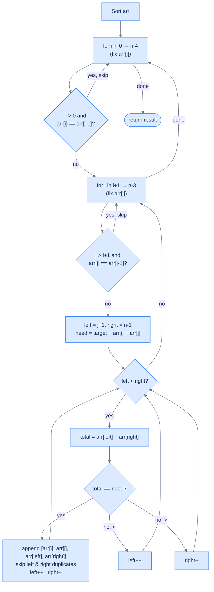

# Four Sum

## The Problem

Given an integer array `arr` and an integer `target`, find **all unique quadruplets** `[a, b, c, d]` such that `a + b + c + d = target`. The solution set must not contain duplicate quadruplets.

```
Input:  arr = [1, 0, -1, 0, -2, 2],  target = 0
Output: [[-2, -1, 1, 2], [-2, 0, 0, 2], [-1, 0, 0, 1]]
```

---

## Examples

**Example 1**
```
Input:  arr = [1, 0, -1, 0, -2, 2],  target = 0
Output: [[-2, -1, 1, 2], [-2, 0, 0, 2], [-1, 0, 0, 1]]
```

**Example 2**
```
Input:  arr = [2, 2, 2, 2, 2],  target = 8
Output: [[2, 2, 2, 2]]
Explanation: All elements are 2; only one unique quadruplet exists.
```

**Example 3**
```
Input:  arr = [1, 2, 3, 4],  target = 100
Output: []
Explanation: No quadruplet sums to 100.
```

**Example 4**
```
Input:  arr = [0, 0, 0, 0],  target = 0
Output: [[0, 0, 0, 0]]
```

```quiz
{
  "prompt": "Now your turn!",
  "input": "arr = [1, 0, -1, 0, -2, 2], target = 0",
  "options": ["[[-2, -1, 1, 2], [-2, 0, 0, 2], [-1, 0, 0, 1]]", "[[-2, 0, 0, 2], [-1, 0, 0, 1]]", "[[-2, -1, 1, 2]]", "[]"],
  "answer": "[[-2, -1, 1, 2], [-2, 0, 0, 2], [-1, 0, 0, 1]]"
}
```

## Constraints

- `0 ≤ arr.length ≤ 200`
- `-10^9 ≤ arr[i] ≤ 10^9`, and the same bound on `target`
- The solution set must not contain duplicate quadruplets

```python run viz=array viz-root=arr
import ast
from typing import List

class Solution:
    def four_sum(self, arr: List[int], target: int) -> List[List[int]]:
        # Your code goes here — sort, fix two elements with nested loops, then
        # run a converging two-pointer sweep on the suffix for each pair.
        return []

arr = ast.literal_eval(input())      # the test case's arr
target = int(input())                # the test case's target
print(Solution().four_sum(arr, target))
```

```java run viz=array viz-root=arr
import java.util.*;

public class Main {
    static class Solution {
        public List<List<Integer>> fourSum(int[] arr, int target) {
            // Your code goes here — sort, fix two elements with nested loops,
            // then run a converging two-pointer sweep on the suffix for each pair.
            return new ArrayList<>();
        }
    }

    public static void main(String[] args) {
        Scanner sc = new Scanner(System.in);
        int[] arr = parseIntArray(sc.nextLine());
        int target = Integer.parseInt(sc.nextLine().trim());
        System.out.println(new Solution().fourSum(arr, target));
    }

    // "[1, 2, 3]" → {1, 2, 3} — reads the test case's arr
    static int[] parseIntArray(String line) {
        String inner = line.replaceAll("[\\[\\]\\s]", "");
        if (inner.isEmpty()) return new int[0];
        String[] parts = inner.split(",");
        int[] out = new int[parts.length];
        for (int i = 0; i < parts.length; i++) out[i] = Integer.parseInt(parts[i]);
        return out;
    }
}
```

```testcases
{
  "args": [
    { "id": "arr", "label": "arr", "type": "int[]", "placeholder": "[1, 0, -1, 0, -2, 2]" },
    { "id": "target", "label": "target", "type": "int", "placeholder": "0" }
  ],
  "cases": [
    { "args": { "arr": "[1, 0, -1, 0, -2, 2]", "target": "0" }, "expected": "[[-2, -1, 1, 2], [-2, 0, 0, 2], [-1, 0, 0, 1]]" },
    { "args": { "arr": "[2, 2, 2, 2, 2]", "target": "8" }, "expected": "[[2, 2, 2, 2]]" },
    { "args": { "arr": "[1, 2, 3, 4]", "target": "100" }, "expected": "[]" },
    { "args": { "arr": "[0, 0, 0, 0]", "target": "0" }, "expected": "[[0, 0, 0, 0]]" },
    { "args": { "arr": "[]", "target": "0" }, "expected": "[]" },
    { "args": { "arr": "[-3, -2, -1, 0, 0, 1, 2, 3]", "target": "0" }, "expected": "[[-3, -2, 2, 3], [-3, -1, 1, 3], [-3, 0, 0, 3], [-3, 0, 1, 2], [-2, -1, 0, 3], [-2, -1, 1, 2], [-2, 0, 0, 2], [-1, 0, 0, 1]]" }
  ]
}
```

<details>
<summary><h2>Intuition</h2></summary>

The **structural property** is the recursive shape of the k-Sum family. `a + b + c + d = target` is linear in four unknowns; every unknown locked collapses one dimension. Locking two unknowns — `a = arr[i]`, `b = arr[j]` — leaves `c + d = target − arr[i] − arr[j]` on the sorted suffix. That is plain Two Sum, the `O(n)` two-pointer base case. Three Sum collapsed three dimensions to two with one lock; Four Sum collapses four to two with two locks. Same skeleton, one more outer loop, one more duplicate-skip layer.

The **pointer placement** has three layers. Two nested outer loops drive `i` over the array and `j` over the suffix after `i`. Each `(i, j)` pair carries a precomputed `need = target − arr[i] − arr[j]` into the inner sweep. The inner sweep places `left = j + 1`, `right = n − 1` and walks the sorted suffix after `j`. It exploits the same decisive direction as every previous problem: `arr[left]` is the suffix minimum, `arr[right]` the maximum, `left++` raises the pair sum, `right--` lowers it. The new bookkeeping is the second outer-loop duplicate skip. The guard `j > i + 1` matters: without it, `j == i + 1` would compare against the *previous* fixed element `arr[i]` and erroneously suppress valid quadruplets whose second element coincides with a different first element.

What **breaks if you reach for the naive approach**? Four nested loops over `(i, j, k, l)` give `O(n⁴)` time. A hash-map variant that precomputes all pair sums and looks up the complement runs in `O(n²)` time, but it pays `O(n²)` extra space. Worse, duplicate suppression turns into multi-set bookkeeping across four positions. The sort + two-fixed + two-pointer approach lands at `O(n³)` time with `O(1)` working space. The three duplicate-skip rules — outer `i`, outer `j` (with the `j > i + 1` guard), and the standard inner skip — fall out of sorted order with one line of code each.

</details>
<details>
<summary><h2>Pattern Sketch</h2></summary>

You already know the pattern. Three Sum fixed one element and ran a Two Sum two-pointer on the rest. Four Sum takes this one step further: fix **two** elements with a nested outer loop and run a Two Sum two-pointer on the remaining subarray.

> Fix `arr[i]` and `arr[j]`. Now find all pairs in `arr[j+1..n-1]` summing to `target − arr[i] − arr[j]`.

That inner two-pointer is exactly the same Two Sum we've been using — sorted array, converging pointers, duplicate skipping. The only addition is a second outer loop and a second level of duplicate skipping.



<p align="center"><strong>Four Sum — two nested fixed-element loops, each with duplicate skipping, plus an inner two-pointer Two Sum pass.</strong></p>

</details>
<details>
<summary><h2>Applying the Diagnostic Questions</h2></summary>


Four Sum is the clearest demonstration of the two-pointer subproblem pattern because the decomposition happens at **two levels** before the two-pointer even starts.

| Check | Answer for Four Sum |
|---|---|
| **Q1.** Can the problem be decomposed into smaller subproblems? | **Yes** — fix `arr[i]` and `arr[j]`; the subproblem becomes "find all pairs in `arr[j+1..n-1]` summing to `target − arr[i] − arr[j]`" — a plain Two Sum. |
| **Q2.** Can any subproblem be solved with two pointers (directly or via reduction)? | **Yes** — the inner pair-finding is the sorted two-pointer Two Sum from the reduction section: one linear sweep per `(i, j)`. |
| **Q3.** Does the subproblem have a decisive direction? | **Yes** — after sorting, `arr[left]` is the suffix minimum after `j` and `arr[right]` is the maximum; the sign of `total − need` determines which pointer moves. |
| **Q4.** Is the per-step inner work `O(1)`? | **Yes** — each inner step adds two integers, compares against `need`, and either records a quadruplet or advances one pointer. |

### Q1 — Why "fix two elements and reduce to Two Sum"?

**Mental model:** Think of the search space as four dimensions: `a + b + c + d = target`. Lock two dimensions — `a = arr[i]`, `b = arr[j]` — and you're left with two unknowns: `c + d = target − arr[i] − arr[j]`. Two unknowns on a sorted subarray is Two Sum — the problem you can already solve in O(n). Every additional element you fix collapses one more dimension; you always want to collapse down to exactly Two Sum, because that's the base case the two-pointer solves optimally.

**Concrete numbers:** `arr = [-2, -1, 0, 0, 1, 2]` (sorted), `target = 0`. Fix `arr[0] = -2` and `arr[1] = -1`. Remaining need: `0 − (−2) − (−1) = 3`. Subproblem: find pairs in `[0, 0, 1, 2]` summing to 3. Two-pointer:
- `left=0 (0), right=3 (2)`: sum `2 < 3` → `left++`
- `left=1 (0), right=3 (2)`: sum `2 < 3` → `left++`
- `left=2 (1), right=3 (2)`: sum `3 == 3` ✓ → record `[-2, -1, 1, 2]`

One fixed pair, one linear inner pass, one quadruplet found.

**What breaks if you only fix one element (like Three Sum)?** With one fixed element, the inner subproblem is Three Sum — O(n²) — and the outer loop is O(n), giving O(n³). With two fixed elements, the inner subproblem collapses to Two Sum — O(n) — and the two outer loops are O(n²), also giving O(n³). Same final complexity, but the two-level decomposition is cleaner: the innermost operation is always the same O(n) Two Sum core, regardless of how many outer loops wrap it.

**The pattern generalisation:** Three Sum fixed 1 element to reach Two Sum. Four Sum fixes 2 elements to reach Two Sum. k-Sum fixes k−2 elements to reach Two Sum. The number of fixed elements equals the number of outer loops; the innermost operation is always Two Sum.

### Q2 — Why "the inner Two Sum subproblem is solved with two pointers"?

**Mental model:** After fixing `arr[i]` and `arr[j]`, you have a sorted subarray `arr[j+1..n-1]` and a specific need. `arr[left]` is the minimum of that window; `arr[right]` is the maximum. Moving `left` right increases the pair sum; moving `right` left decreases it. This decisive direction — identical to the reduction section's Two Sum — is what makes the inner pass O(n) instead of O(n²).

**Concrete numbers:** subarray `[0, 0, 1, 2]`, need `3`:
- `left=0 (0), right=3 (2)`: sum `2 < 3` → moving `left` is the only way to increase the sum → `left++`
- `left=1 (0), right=3 (2)`: sum `2 < 3` → same reasoning → `left++`
- `left=2 (1), right=3 (2)`: sum `3 == 3` → match, record, move both inward
- `left=3, right=2`: `left > right` → done

Each decision eliminates one element permanently, so the inner loop runs at most `n − j − 1` steps — O(n) total per `(i, j)` pair.

**What if you skipped sorting?** Without sorting, `arr[left]` and `arr[right]` have no guaranteed min/max relationship. You'd need to try every pair in the subarray — O(n²) inner work instead of O(n) — making the total O(n⁴) instead of O(n³).

> **Pattern nesting in Four Sum:** the outer structure is a two-pointer **subproblem** pattern at two levels (fix `arr[i]`, then fix `arr[j]`), and the innermost operation is a two-pointer **reduction** (sort + Two Sum). The nesting depth of subproblem decompositions determines the exponent in the complexity: Two Sum → O(n), Three Sum → O(n²), Four Sum → O(n³).

</details>
<details>
<summary><h2>Approach</h2></summary>

Six numbered steps. No code; the next section is the implementation.

1. **Sort `arr` in non-decreasing order.** Establishes the decisive-direction invariant on the suffix for every inner sweep, and lines up duplicates so every skip rule is a one-line index comparison.
2. **Loop the outer index `i` from `0` to `n − 1`.** Each `i` fixes the first element `arr[i]`. Skip when `i > 0` and `arr[i] == arr[i - 1]` — the same first element yields the same quadruplets.
3. **For each surviving `i`, loop `j` from `i + 1` to `n − 1`.** Each `j` fixes the second element `arr[j]`. Skip when `j > i + 1` and `arr[j] == arr[j - 1]` — the guard `j > i + 1` is critical: without it, `j == i + 1` would compare against `arr[i]`, the *previous* fixed element, and incorrectly suppress valid quadruplets where the second element equals a different first element.
4. **Compute the inner target.** Set `need = target − arr[i] − arr[j]`. This is the sum the inner two-pointer must find.
5. **Run the inner Duplicate Aware Two Sum on `arr[j+1..n-1]`.** Set `left = j + 1`, `right = n − 1`. While `left < right`: if `arr[left] + arr[right] == need`, record the quadruplet `[arr[i], arr[j], arr[left], arr[right]]` and advance both pointers past their respective duplicate runs; if `total < need` advance `left`; otherwise advance `right`.
6. **Return the accumulated `result` list.** Each quadruplet was recorded exactly once because each of the three skip levels suppresses one source of duplication.

</details>
<details>
<summary><h2>Duplicate Skipping — Three Levels</h2></summary>


This is the part that trips people up. Duplicates must be skipped at every level independently:

| Level | What to skip | Why |
|---|---|---|
| **Outer loop `i`** | Skip if `arr[i] == arr[i-1]` | Same first element → same set of quadruplets |
| **Inner loop `j`** | Skip if `arr[j] == arr[j-1]` (and `j > i+1`) | Same second element with the same first → duplicate quadruplets |
| **Two-pointer** | After a match, skip while `arr[left] == arr[left+1]` and `arr[right] == arr[right-1]` | Same pair found again from the same `(i, j)` pair |

The `j > i+1` guard for the inner skip is important — without it, `j = i+1` would compare against `arr[i]` (a different fixed element), incorrectly skipping valid quadruplets.

</details>
<details>
<summary><h2>Solution &amp; Analysis</h2></summary>

### Solution

```python solution time=O(n^3) space=O(k)
import ast
from typing import List

class Solution:
    def skip_duplicates_left(
        self, arr: List[int], left: int, right: int
    ) -> int:

        # Skip duplicates from the left pointer
        while left < right and arr[left] == arr[left + 1]:
            left += 1

        # Return the index of the next unique element
        return left + 1

    def skip_duplicates_right(
        self, arr: List[int], left: int, right: int
    ) -> int:

        # Skip duplicates from the right pointer
        while left < right and arr[right] == arr[right - 1]:
            right -= 1

        # Return the index of the next unique element
        return right - 1

    def duplicate_aware_two_sum(
        self, arr: List[int], left: int, target: int
    ) -> List[List[int]]:
        right = len(arr) - 1
        result = []

        # Use a while loop to traverse the array using the two pointers
        while left < right:
            sum_ = arr[left] + arr[right]

            # If the sum is equal to target, add the numbers to the
            # result.
            if sum_ == target:
                result.append([arr[left], arr[right]])

                # Move the left pointer to the next unique element to
                # avoid duplicates
                left = self.skip_duplicates_left(arr, left, right)

                # Move the right pointer to the previous unique element
                # to avoid duplicates
                right = self.skip_duplicates_right(arr, left, right)

            # Move the left pointer to increase the sum
            elif sum_ < target:
                left += 1

            # Move the right pointer to decrease the sum
            else:
                right -= 1
        return result

    def four_sum(self, arr: List[int], target: int) -> List[List[int]]:
        result = []

        # Sort the array in non-decreasing order
        arr.sort()

        for i in range(len(arr)):

            # Skip duplicates for the first element
            if i > 0 and arr[i] == arr[i - 1]:
                continue

            for j in range(i + 1, len(arr)):

                # Skip duplicates for the second element
                if j > i + 1 and arr[j] == arr[j - 1]:
                    continue

                # Define the remaining target for the two-pointer
                # technique
                remaining_target = target - arr[i] - arr[j]

                # Find pairs with sum equal to the remaining target
                two_sum_results = self.duplicate_aware_two_sum(
                    arr, j + 1, remaining_target
                )

                # Add the quadruplets to the result
                for two_sum in two_sum_results:
                    result.append(
                        [arr[i], arr[j], two_sum[0], two_sum[1]]
                    )

        return result


arr = ast.literal_eval(input())      # the test case's arr
target = int(input())                # the test case's target
print(Solution().four_sum(arr, target))
```

```java solution
import java.util.*;

public class Main {
    static class Solution {
        private int skipDuplicatesLeft(int[] arr, int left, int right) {

            // Skip duplicates from the left pointer
            while (left < right && arr[left] == arr[left + 1]) {
                left++;
            }

            // Return the index of the next unique element
            return left + 1;
        }

        private int skipDuplicatesRight(int[] arr, int left, int right) {

            // Skip duplicates from the right pointer
            while (left < right && arr[right] == arr[right - 1]) {
                right--;
            }

            // Return the index of the next unique element
            return right - 1;
        }

        private List<int[]> duplicateAwareTwoSum(
            int[] arr,
            int left,
            int target
        ) {
            int right = arr.length - 1;
            List<int[]> result = new ArrayList<>();

            // Use a while loop to traverse the array using the two pointers
            while (left < right) {
                int sum = arr[left] + arr[right];

                // If the sum is equal to target, add the numbers to the
                // result.
                if (sum == target) {
                    result.add(new int[] { arr[left], arr[right] });

                    // Move the left pointer to the next unique element to
                    // avoid duplicates
                    left = skipDuplicatesLeft(arr, left, right);

                    // Move the right pointer to the previous unique element
                    // to avoid duplicates
                    right = skipDuplicatesRight(arr, left, right);
                }

                // Move the left pointer to increase the sum
                else if (sum < target) {
                    left++;
                }

                // Move the right pointer to decrease the sum
                else {
                    right--;
                }
            }
            return result;
        }

        public List<List<Integer>> fourSum(int[] arr, int target) {
            List<List<Integer>> result = new ArrayList<>();

            // Sort the array in non-decreasing order
            Arrays.sort(arr);

            // Loop through each element of the array
            for (int i = 0; i < arr.length; i++) {

                // Skip duplicates for the first element
                if (i > 0 && arr[i] == arr[i - 1]) {
                    continue;
                }

                for (int j = i + 1; j < arr.length; j++) {

                    // Skip duplicates for the second element
                    if (j > i + 1 && arr[j] == arr[j - 1]) {
                        continue;
                    }

                    // Define the remaining target for the two-pointer
                    // technique
                    int remainingTarget = target - arr[i] - arr[j];

                    // Find pairs with sum equal to the remaining target
                    List<int[]> twoSumResults = duplicateAwareTwoSum(
                        arr,
                        j + 1,
                        remainingTarget
                    );

                    // Add the quadruplets to the result
                    for (int[] twoSum : twoSumResults) {
                        result.add(
                            List.of(arr[i], arr[j], twoSum[0], twoSum[1])
                        );
                    }
                }
            }

            return result;
        }
    }

    public static void main(String[] args) {
        Scanner sc = new Scanner(System.in);
        int[] arr = parseIntArray(sc.nextLine());
        int target = Integer.parseInt(sc.nextLine().trim());
        System.out.println(new Solution().fourSum(arr, target));
    }

    static int[] parseIntArray(String line) {
        String inner = line.replaceAll("[\\[\\]\\s]", "");
        if (inner.isEmpty()) return new int[0];
        String[] parts = inner.split(",");
        int[] out = new int[parts.length];
        for (int i = 0; i < parts.length; i++) out[i] = Integer.parseInt(parts[i]);
        return out;
    }
}
```

### Dry Run — Example 1

`arr = [1, 0, -1, 0, -2, 2]` → sorted: `[-2, -1, 0, 0, 1, 2]`, target = 0

**i=0, arr[i]=-2:**

&nbsp;&nbsp;**j=1, arr[j]=-1, need=0−(−2)−(−1)=3, left=2, right=5:**

| left | right | total | Action |
|---|---|---|---|
| 2 (0) | 5 (2) | 2 | < 3 → left++ |
| 3 (0) | 5 (2) | 2 | < 3 → left++ |
| 4 (1) | 5 (2) | 3 | == 3 ✅ → record **[-2,-1,1,2]**, left=5, right=4 |
| — | — | — | left ≥ right → stop |

&nbsp;&nbsp;**j=2, arr[j]=0, need=0−(−2)−0=2, left=3, right=5:**

| left | right | total | Action |
|---|---|---|---|
| 3 (0) | 5 (2) | 2 | == 2 ✅ → record **[-2,0,0,2]**, left=4, right=4 |
| — | — | — | left ≥ right → stop |

&nbsp;&nbsp;**j=3, arr[j]=0:** duplicate of arr[2] (and j > i+1) → skip

&nbsp;&nbsp;**j=4, arr[j]=1, need=0−(−2)−1=1, left=5, right=5:** left ≥ right → stop immediately

**i=1, arr[i]=-1:**

&nbsp;&nbsp;**j=2, arr[j]=0, need=0−(−1)−0=1, left=3, right=5:**

| left | right | total | Action |
|---|---|---|---|
| 3 (0) | 5 (2) | 2 | > 1 → right-- |
| 3 (0) | 4 (1) | 1 | == 1 ✅ → record **[-1,0,0,1]**, left=4, right=3 |
| — | — | — | left ≥ right → stop |

&nbsp;&nbsp;**j=3, arr[j]=0:** duplicate of arr[2] → skip

&nbsp;&nbsp;**j=4, arr[j]=1, need=0−(−1)−1=0, left=5, right=5:** left ≥ right → stop

**i=2, arr[i]=0:**

&nbsp;&nbsp;**j=3, arr[j]=0, need=0−0−0=0, left=4, right=5:**

| left | right | total | Action |
|---|---|---|---|
| 4 (1) | 5 (2) | 3 | > 0 → right-- |
| 4 (1) | 4 | — | left ≥ right → stop |

**i=3, arr[i]=0:** duplicate of arr[2] → skip outer iteration.

**i=4, arr[i]=1:** j loops from 5 to 5. For each `j`, the inner two-pointer starts at `j+1 ≥ 6`, so `left ≥ right` immediately — no pairs.

**i=5, arr[i]=2:** j range is empty (`i+1 = 6 = len(arr)`) — inner loop does not run.

(The outer loop runs over every `i` in `range(len(arr))`; the duplicate skip handles `i=3`, and for `i ≥ 4` the inner two-pointer's `while left < right` guard exits without recording anything.)

**Result: `[[-2,-1,1,2], [-2,0,0,2], [-1,0,0,1]]`** ✓

### Complexity Analysis

| | Complexity | Reasoning |
|---|---|---|
| **Time** | O(n³) | Outer loop O(n) × inner loop O(n) × two-pointer O(n); sort is O(n log n), dominated by O(n³) |
| **Space** | O(k) | k = number of unique quadruplets returned; O(1) working space beyond output |

This is the natural cost of searching for 4 elements — each additional fixed element multiplies by O(n). Two Sum is O(n), Three Sum is O(n²), Four Sum is O(n³). You cannot do better than O(n³) for the general k-sum problem with k ≥ 3.

### Edge Cases

| Scenario | Input | Output | Note |
|---|---|---|---|
| All same elements | `[2,2,2,2,2]`, target=8 | `[[2,2,2,2]]` | Duplicate skipping at all three levels keeps it unique |
| No valid quadruplet | `[1,2,3,4]`, target=100 | `[]` | Two-pointer never finds a matching pair |
| Minimum length | `[1,2,3,4]`, target=10 | `[[1,2,3,4]]` | Only one quadruplet possible |
| Large duplicate set | `[0,0,0,0,0,0]`, target=0 | `[[0,0,0,0]]` | All three skip levels fire |
| Negative target | `[-3,-2,-1,0]`, target=-6 | `[[-3,-2,-1,0]]` | Works identically — no assumption about sign |
| Array length `< 4` | `[1,2,3]`, target=6 | `[]` | Inner loops never enter |

</details>
<details>
<summary><h2>The k-Sum Generalisation</h2></summary>


The pattern is recursive:

- **Two Sum**: sort + single two-pointer pass → O(n)
- **Three Sum**: fix 1 element + Two Sum → O(n²)
- **Four Sum**: fix 2 elements + Two Sum → O(n³)
- **k-Sum**: fix k−2 elements (k−2 nested loops) + Two Sum → O(nᵏ⁻¹)

Every level adds one outer loop with duplicate skipping. The innermost operation is always the same two-pointer Two Sum.

```d2
direction: right

ts: |md
  **Two Sum**

  `O(n)`
| {style.fill: "#dcfce7"; style.stroke: "#16a34a"}

th: |md
  **Three Sum**

  fix 1 + Two Sum

  `O(n²)`
| {style.fill: "#dbeafe"; style.stroke: "#3b82f6"}

fo: |md
  **Four Sum**

  fix 2 + Two Sum

  `O(n³)`
| {style.fill: "#fde68a"; style.stroke: "#d97706"}

ks: |md
  **k-Sum**

  fix k−2 + Two Sum

  `O(nᵏ⁻¹)`
| {style.fill: "#ede9fe"; style.stroke: "#7c3aed"}

ts -> th: "wrap in one loop"
th -> fo: "wrap in one loop"
fo -> ks: "wrap in k−4 loops"
```

<p align="center"><strong>The k-Sum family — each level wraps the previous in one more outer loop with duplicate skipping. Two Sum is always the innermost operation.</strong></p>

</details>
<details>
<summary><h2>Comparison: Three Sum vs Four Sum</h2></summary>


| | Three Sum | Four Sum |
|---|---|---|
| Outer loops | 1 (fix `i`) | 2 (fix `i` and `j`) |
| Duplicate skip levels | 2 (outer + two-pointer) | 3 (outer `i`, outer `j`, two-pointer) |
| `j` skip guard | N/A | `j > i + 1` (not `j > 0`) |
| Time complexity | O(n²) | O(n³) |
| Inner operation | Two-pointer on `arr[i+1..n-1]` | Two-pointer on `arr[j+1..n-1]` |

The only structural additions are: one more outer loop, one more duplicate-skip block with a careful guard condition, and the need-variable computed from two fixed elements instead of one.

</details>
<details>
<summary><h2>Key Takeaway</h2></summary>


Four Sum is **Three Sum wrapped in one more outer loop**, with one extra duplicate-skip layer carrying the `j > i + 1` guard. What is **new vs. Three Sum** is the second nesting level plus the carry-the-pair invariant: the inner two-pointer's target is now `target − arr[i] − arr[j]` instead of `−arr[i]`. Same `O(n)` Two Sum core, one more `O(n)` factor for `O(n³)` total — and the pattern generalises mechanically to `k-Sum` by adding more outer loops.

</details>
