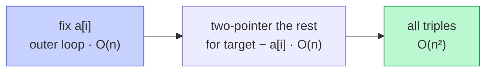

# Memorize: Two Pointers Subproblem

## In a Hurry?

- **One-Line Idea**: Decompose the problem into smaller pieces, fix the leading positions with an outer driver, and run a converging two-pointer sweep on the sorted remainder of each piece.
- **Complexities**: `O(n^(k − 1))` time, `O(1)` working space, where `k` is the number of elements participating in the answer (`k = 3` for Three Sum → `O(n²)`, `k = 4` for Four Sum → `O(n³)`). Sequence-style decompositions (K Rotations) collapse to `O(n)` time because the outer driver is a fixed sequence, not a loop over `n`.
- **When to Use**: The problem asks for all `k`-element answers satisfying a linear constraint over a sorted (or sortable) array, or it asks for a multi-step transformation that decomposes into segment-level subproblems each solvable with two pointers.

---

## One-Line Mnemonic

**"Fix the leaders, two-pointer the followers."**

The image is a recursive squeeze: the outer driver pins the first one or two elements, and the inner two-pointer handles the rest by walking from opposite ends of the remaining suffix.

---

## Real-World Analogy

Picture seating guests at a long banquet table to satisfy a budget rule — every group of three guests must spend exactly the table's target amount. You walk down the table and, for each guest you point to as the first member of a group, you send two waiters to the remaining seats: one starting from the cheapest seat at the head and one starting from the most expensive seat at the tail. They walk toward each other and, at every step, the sum of their two guests' bills plus your fixed guest tells them which waiter should step forward. Each fixed guest costs one outer pass; the two waiters cost one inner pass per fixed guest. Sorting the seats by price up front is what lets the waiters never backtrack.

---

## Visual Summary



<p align="center"><strong>k-sum reduces to (k−1)-sum: pin one element with an outer loop, then run the converging two-pointer scan on the remainder. 3Sum becomes O(n²) instead of O(n³).</strong></p>

---

## Pattern Recognition Triggers

The pattern fits when **all four** answers are "yes" — the same diagnostic that gates each problem in the section.

- The problem can be **decomposed** into smaller pieces — a sequence of sub-operations on segments (rotation), a fix-and-reduce form on a constraint (`k-Sum`), or a per-outer-element sweep over a suffix (closest-pair, closest-triplet).
- At least one subproblem is a **two-pointer problem** (direct application or reduction) you already know how to solve.
- The subproblem has a **decisive direction** — the data (or the relevant sub-segment) is sorted or otherwise monotonic, so each pointer move has a guaranteed effect on the running quantity.
- The per-step inner work is `O(1)` — a comparison, a swap, a target check — so each inner pass stays `O(n)`.

Common surface signals: "all triplets / quadruplets summing to X," "closest triplet to a target," "rotate by `k`," "find all k-tuples satisfying a linear constraint," "transform the array via a small sequence of segment reversals or swaps."

---

## Don't Confuse With

| | **Two Pointers Subproblem (this pattern)** | **Two Pointers Reduction** |
|---|---|---|
| **Problem shape** | "Find all `k`-tuples summing to X," "decompose into a sequence of sub-operations" | "Find a pair satisfying a relation on a sorted (or sortable) array" |
| **Outer structure** | One or two outer loops fixing leading elements, OR a fixed sequence of segment calls | No outer loop — a single sweep over the whole array |
| **Inner two-pointer** | Runs inside each outer iteration on the suffix after the fixed elements | Runs once over the whole sorted array |
| **Complexity** | `O(n^(k − 1))` for `k`-Sum-style; `O(n)` for sequence-style (e.g. rotation) | `O(n log n)` dominated by the sort; the sweep itself is `O(n)` |
| **When this goes wrong** | You're chasing all `k`-tuples and the inner pass keeps emitting duplicates, or the result list grows by `O(n^k)` items → you forgot a duplicate-skip layer or you tried to solve `k-Sum` with one outer loop instead of `k − 2`. | You're sorting and then sweeping the whole array exactly once and getting wrong answers — wrong pattern; the problem needs an outer driver that fixes one or more elements first (move to subproblem pattern). |

The reduction pattern is one level "below" the subproblem pattern — every subproblem-pattern solution invokes a reduction-pattern sweep as its inner pass.

---

## Template Code

```python
# Two-pointer subproblem — generic skeleton for fix-and-reduce k-Sum.
# For k-Sum: wrap the inner two-pointer in (k - 2) outer loops with
# per-level duplicate skipping. This template shows the k = 3 shape.
from typing import List

def two_pointer_subproblem(arr: List[int], target: int) -> List[List[int]]:
    arr.sort()                                       # 1. establish decisive direction
    n = len(arr)
    result: List[List[int]] = []

    for i in range(n):                               # 2. outer driver — fix arr[i]
        if i > 0 and arr[i] == arr[i - 1]:
            continue                                 # 3. outer duplicate skip

        left, right = i + 1, n - 1                   # 4. inner two-pointer
        need = target - arr[i]
        while left < right:
            total = arr[left] + arr[right]
            if total == need:
                result.append([arr[i], arr[left], arr[right]])
                while left < right and arr[left] == arr[left + 1]:
                    left += 1                        # 5. inner duplicate skip
                while left < right and arr[right] == arr[right - 1]:
                    right -= 1
                left += 1
                right -= 1
            elif total < need:
                left += 1
            else:
                right -= 1

    return result
```

The five knobs are: the **sort step**, the **outer driver shape** (single loop, nested loops, fixed sequence), the **outer duplicate-skip** (one per outer loop), the **inner two-pointer body** (record / update tracker / swap), and the **inner duplicate-skip** (only after a match).

---

## Common Mistakes

- **Forgetting the `j > i + 1` guard on the second outer loop's duplicate skip (Four Sum)**:
  - *What*: writing `if j > 0 and arr[j] == arr[j - 1]: continue` instead of `if j > i + 1 and arr[j] == arr[j - 1]: continue`. The output then misses valid quadruplets whose second element happens to equal a different first element.
  - *Why*: at `j == i + 1` the comparison `arr[j] == arr[j - 1]` looks at `arr[i]`, the *previous fixed element* — a different position in the problem, not a duplicate.
  - *Fix*: every nested outer loop's skip guard must reference the *start of that loop's range*, not the array start.
- **Sorting inside the outer loop instead of once before it**:
  - *What*: invoking `arr.sort()` (or `Arrays.sort(arr)`) at the top of each outer iteration. The result is correct but the time complexity becomes `O(n² log n)` for Three Sum and worse for Four Sum.
  - *Why*: the decisive-direction invariant is global — sorting once at the start covers every inner sweep across every fixed element.
  - *Fix*: sort exactly once, outside all outer loops.
- **Running the inner duplicate-skip on a mismatch instead of after a match**:
  - *What*: every iteration of the inner `while` greedily skips equal neighbours, regardless of whether a match was recorded. This silently drops valid pairs whose values happen to coincide with the previous pair.
  - *Why*: duplicate suppression is only needed *after* you've recorded a quadruplet — that's the only event that can be repeated. A mismatched pair has no duplicate to suppress.
  - *Fix*: place the duplicate-skip blocks inside the `if total == need` branch only, then advance both pointers.
- **Forgetting that `closest_sum` is a tracker, not a triplet** (Approximate Three Sum):
  - *What*: trying to skip duplicates the way Three Sum does. The skip rules either misfire (there are no triplets to suppress because every triplet's *sum* is what is being compared) or hide valid candidates that could update the tracker.
  - *Why*: closest-sum problems do not have duplicate answers in the same sense — they return one integer, not a list of `k`-tuples. Equal triplet sums cannot improve the tracker, but they cannot harm it either.
  - *Fix*: drop the duplicate-skip blocks entirely for closest-sum variants; keep them for exact-match variants.
- **Counting the inner two-pointer's complexity as `O(n²)`**:
  - *What*: claiming Four Sum is `O(n⁴)` because "four loops." There are only three loops — two outer and one converging two-pointer. The two-pointer is `O(n)` total, not `O(n²)`.
  - *Why*: each inner step strictly advances one of `left` or `right`, so the loop runs at most `n` times total — that is the whole point of the two-pointer technique.
  - *Fix*: count *one* `O(n)` factor per converging-pointer sweep; the outer-loop count gives the rest of the exponent.

---

## Minimum Viable Example

Three Sum on `arr = [-1, 0, 1, 2]`, target `0` (already sorted):

```
i = 0, arr[i] = -1, need = 1, left = 1 (0), right = 3 (2)
  → total = 0 + 2 = 2 > 1 → right-- → left = 1, right = 2
  → total = 0 + 1 = 1 == 1 → record [-1, 0, 1] → left = 2, right = 1 → stop

i = 1, arr[i] = 0, need = 0, left = 2 (1), right = 3 (2)
  → total = 1 + 2 = 3 > 0 → right-- → left = 2, right = 2 → stop

Result: [[-1, 0, 1]]
```

Four elements, two outer iterations, three inner steps, one triplet — the complete subproblem pattern in twelve lines.

---

## Quick Recall

**Q: What is the time complexity of `k`-Sum solved with this pattern?**
A: `O(n^(k − 1))` — every additional fixed element multiplies by one more `O(n)` outer loop, with the innermost operation always the same `O(n)` Two Sum sweep.

**Q: How many duplicate-skip rules does Four Sum need?**
A: Three — one for the outer `i` loop, one for the outer `j` loop (with the `j > i + 1` guard), and one for the inner two-pointer (only after a recorded match).

**Q: Why does K Rotations stay `O(n)` while Three Sum is `O(n²)`?**
A: The outer driver for K Rotations is a fixed sequence of three `reverse` calls — it does not loop over `n` values, so no outer `O(n)` factor multiplies the inner work.

**Q: What prerequisite must hold for the inner two-pointer to be `O(n)`?**
A: The data segment the inner pass walks must be sorted (or otherwise monotonic), so each pointer move has a guaranteed effect on the running quantity.

**Q: Why is the inner pass a "reduction" pattern call, not a "direct application"?**
A: The decisive direction comes from the sort, not from the natural problem structure — that is the definition of reduction. K Rotations is the exception: its inner reversal is direct application because the symmetry exists without sorting.

**Q: What should you reach for first if the problem says "rotate the array by `k` in place with `O(1)` space"?**
A: The three-reversal decomposition — reverse the entire array, then reverse the first segment, then reverse the second. Each reversal is a direct two-pointer call to a shared `reverse(arr, start, end)` helper.
