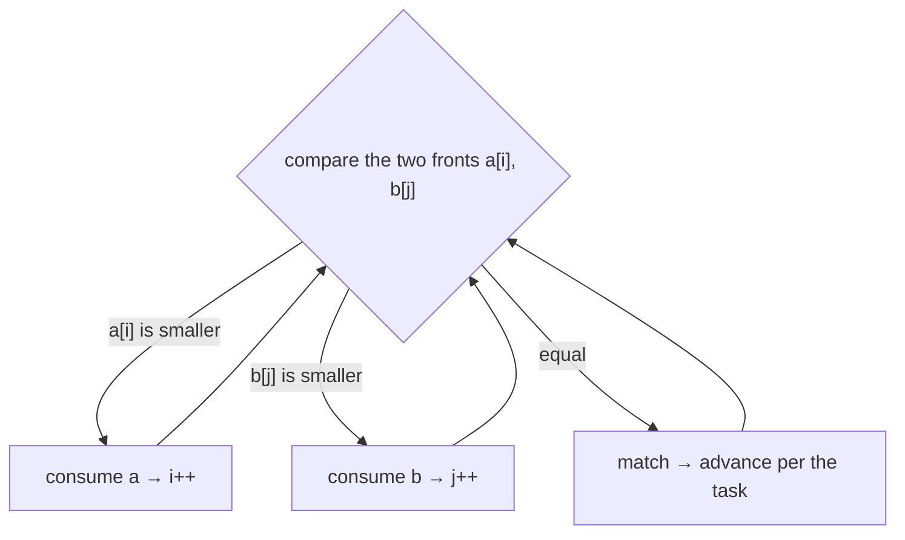

# Pattern: Simultaneous Traversal

## Why It Exists

Every two-pointer pattern so far walked *one* array. But a huge class of problems involves **two** sequences at once: merge two sorted lists, find the elements common to both, check whether one is a subsequence of the other.

The naive approach nests the loops: for each element of the first list, scan the whole second list — `O(n·m)`. And it's wasteful in a specific way: once you've merged in `arr2[0]`, you never need to look at it again, yet a nested loop re-scans `arr2` from the start every time. When *both* lists are sorted, that restart is pure waste — the order already tells you which side to advance.

So give each sequence **its own pointer**, and never restart: compare the two fronts, take (or skip) the appropriate one, and move only that pointer forward. Each pointer crosses its array exactly once — `O(n+m)`.

## See It Work

Merge two sorted arrays. One pointer on each; at every step the smaller front wins and its pointer advances. Run it, then **Visualise** the merged result fill.

> ▶ Run it, then click **Visualise** — `i` walks `a`, `j` walks `b`; the smaller front is appended and only its pointer moves.

```python run viz=array viz-root=merged
a = [1, 4, 7, 10]
b = [2, 5, 8]
i = j = 0
merged = []
while i < len(a) and j < len(b):
    if a[i] <= b[j]:
        merged.append(a[i]); i += 1     # a's front is smaller → take it
    else:
        merged.append(b[j]); j += 1     # b's front is smaller → take it
merged += a[i:] + b[j:]                  # one array emptied; append the other's tail
print(merged)                            # [1, 2, 4, 5, 7, 8, 10]
```

## How It Works

Two pointers, `i` over `a` and `j` over `b`, each starting at `0`. At every step you compare `a[i]` and `b[j]` and decide which pointer to advance — the rule depends on the task, but the skeleton never changes:

- **Merge** — append the smaller front, advance its pointer. (This *is* the merge step of merge sort.)
- **Intersection** — if equal, record it and advance *both*; otherwise advance the side with the smaller front (it can't appear in the other).
- **Subsequence check** (`a` inside `b`) — always advance `j`; advance `i` only when `a[i] == b[j]`; `a` is a subsequence if `i` reaches its end.



<p align="center"><strong>one pointer per sorted array; compare the two fronts and advance the one you consume. Each pointer crosses its array once → <code>O(n+m)</code>.</strong></p>

When one pointer runs off its array, a cleanup step drains whatever's left in the other (the `merged += a[i:] + b[j:]` line above). Because each pointer only ever moves forward and never restarts, the total work is `n + m` steps: **`O(n+m)` time, `O(1)` extra space** (beyond the output you build). That's the whole win over the `O(n·m)` nested scan — and it relies on the inputs being **sorted** (or otherwise comparably ordered), which is what makes "advance the smaller" a safe, never-look-back decision.

### Key Takeaway

Give each sorted sequence its own forward-only pointer; compare the fronts and advance the one you consume, never restarting — merge, intersect, or match two lists in `O(n+m)` instead of `O(n·m)`.

## Trace It

Merge `a = [1, 4, 7]`, `b = [2, 5]`:

| `i` | `j` | `a[i]` vs `b[j]` | take | output |
|---|---|---|---|---|
| 0 | 0 | 1 < 2 | `a` → `i++` | `[1]` |
| 1 | 0 | 4 > 2 | `b` → `j++` | `[1, 2]` |
| 1 | 1 | 4 < 5 | `a` → `i++` | `[1, 2, 4]` |
| 2 | 1 | 7 > 5 | `b` → `j++` | `[1, 2, 4, 5]` |

Before you read on: `j` has now run off the end of `b`. How much more work is left?

Just one step — append `a`'s leftover tail `[7]`. The pointers never revisit a consumed element, so once `b` is exhausted there's nothing to compare; you simply pour out the rest of `a`. Total moves: `3 + 2 = 5` — exactly `n + m`.

## Your Turn

The reusable merge — one pointer per array, then drain the tail:

```python run viz=array
def merge(a, b):
    out, i, j = [], 0, 0
    while i < len(a) and j < len(b):
        if a[i] <= b[j]:
            out.append(a[i]); i += 1
        else:
            out.append(b[j]); j += 1
    out += a[i:] + b[j:]
    return out

print(merge([1, 4, 7, 10], [2, 5, 8]))   # [1, 2, 4, 5, 7, 8, 10]
```

```java run viz=array
import java.util.*;

public class Main {
  static List<Integer> merge(int[] a, int[] b) {
    List<Integer> out = new ArrayList<>();
    int i = 0, j = 0;
    while (i < a.length && j < b.length) {
      if (a[i] <= b[j]) out.add(a[i++]);
      else out.add(b[j++]);
    }
    while (i < a.length) out.add(a[i++]);   // drain a's tail
    while (j < b.length) out.add(b[j++]);   // drain b's tail
    return out;
  }
  public static void main(String[] x) {
    System.out.println(merge(new int[]{1, 4, 7, 10}, new int[]{2, 5, 8}));  // [1, 2, 4, 5, 7, 8, 10]
  }
}
```

Drill the family in **Practice** — [Merge Sorted Arrays](/cortex/data-structures-and-algorithms/linear-structures/arrays/pattern-simultaneous-traversal/problems/merge-sorted-arrays) and [Subsequence Checker](/cortex/data-structures-and-algorithms/linear-structures/arrays/pattern-simultaneous-traversal/problems/subsequence-checker).

## Reflect & Connect

This pattern is everywhere two ordered things meet:

- **Merge sort's merge step** is exactly this — which is why simultaneous traversal underlies the whole divide-and-conquer sort you'll meet in Part 2, and the **k-way merge** (merge many sorted lists with a heap).
- **Set operations on sorted data** — intersection, union, difference — are all one comparison-driven pass; databases use it to join sorted indexes.
- **Subsequence and diff** — checking containment, or computing what changed between two ordered logs.

The one precondition to remember: the inputs must be **sorted** (or share a comparable order). That's what makes "advance the smaller front" safe — if they're unsorted, you're back to a nested scan or a hash set. When both *are* sorted, this `O(n+m)`, `O(1)`-space pass beats every alternative.

**Prerequisites:** [Two Pointers](/cortex/data-structures-and-algorithms/linear-structures/arrays/pattern-two-pointers/pattern).
**What's next:** both pointers moving the *same* direction over *one* array, a fixed span apart — the [Fixed Sliding Window](/cortex/data-structures-and-algorithms/linear-structures/arrays/pattern-fixed-sliding-window/pattern).

## Recall

> **Mnemonic:** *One pointer per sorted array, both forward-only. Compare the fronts, advance the one you consume — `O(n+m)`, never restart.*

| | |
|---|---|
| Shape | `i` over `a`, `j` over `b`; compare `a[i]`/`b[j]`, advance one |
| Merge | take the smaller front | Intersection | match → advance both; else advance smaller |
| Cost | `O(n+m)` time, `O(1)` extra (plus output) |
| Precondition | both inputs sorted (or comparably ordered) |

<details>
<summary><strong>Q:</strong> Why does simultaneous traversal beat the `O(n·m)` nested loop?</summary>

**A:** Each pointer moves forward only and never restarts, so total work is `n + m` steps.

</details>
<details>
<summary><strong>Q:</strong> What's the per-step decision for a merge vs an intersection?</summary>

**A:** Merge takes the smaller front; intersection advances both on a match, else advances the smaller.

</details>
<details>
<summary><strong>Q:</strong> What must be true of the inputs, and why?</summary>

**A:** They must be sorted — that's what makes "advance the smaller" a safe never-look-back choice.

</details>
<details>
<summary><strong>Q:</strong> Where does this pattern show up in a sort you'll learn later?</summary>

**A:** It's the merge step of merge sort (and the k-way merge with a heap).

</details>

## Sources & Verify

- **CLRS** (Cormen, Leiserson, Rivest, Stein), *Introduction to Algorithms*, 4th ed., §2.3.1 — the `MERGE` procedure, the canonical two-pointer merge of sorted subarrays.
- **Sedgewick & Wayne**, *Algorithms*, 4th ed., §2.2 — merging and the merge step of merge sort.
- **cp-algorithms.com**, "Two Pointers Method" — the merge/intersection two-pointer forms.
- Both runnable blocks are verified by running; the `O(n+m)` bound follows from each pointer advancing at most `n`/`m` times.
