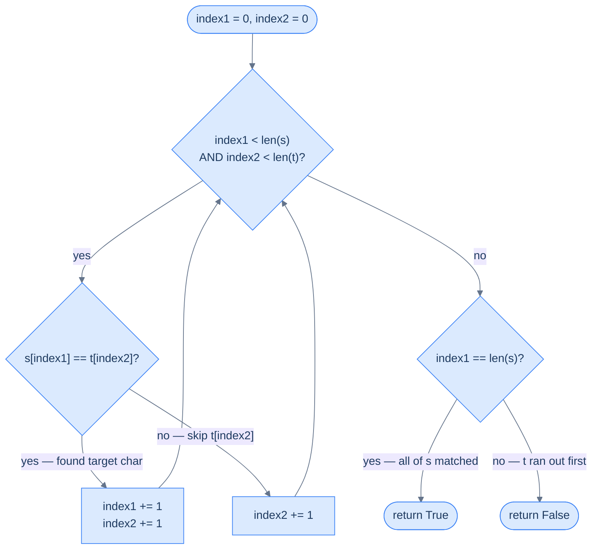

# Subsequence Checker

## Problem Statement

Given two strings `s` and `t`, return `True` if `s` is a **subsequence** of `t`.

A subsequence means every character of `s` appears in `t` in the **same relative order** — but not necessarily at consecutive positions. Characters in `t` that do not belong to `s` can be freely skipped.

```
s = "ace",  t = "abcde"  →  True   (a at t[0], c at t[2], e at t[4] — order preserved)
s = "aec",  t = "abcde"  →  False  (e appears at t[4], but c appears at t[2] — order violated)
s = "",     t = "abc"    →  True   (empty string is always a subsequence of anything)
s = "abc",  t = ""       →  False  (non-empty s cannot match inside an empty t)
```

---

## Examples

**Example 1** — `s = "abc"`, `t = "ahbgdc"` → `True`. The characters of `s` map to `t[0]`, `t[2]`, `t[5]` — all in left-to-right order.

**Example 2** — `s = "axc"`, `t = "ahbgdc"` → `False`. The first character `'a'` matches at `t[0]`, but `'x'` is never found in `t` — the second character of `s` fails.

**Example 3** — `s = ""`, `t = "anything"` → `True`. An empty `s` has zero characters to match, so the constraint is vacuously satisfied.

```quiz
{
  "prompt": "Now your turn!",
  "input": "s = \"ace\", t = \"abcde\"",
  "options": ["true", "false"],
  "answer": "true"
}
```

## Constraints

- `0 ≤ s.length ≤ t.length ≤ 10^4`
- `s` and `t` consist of lowercase English letters

```python run viz=array
class Solution:
    def subsequence_checker(self, s: str, t: str) -> bool:
        # Your code goes here — one pointer per string; t's pointer
        # always advances, s's pointer only on a match.
        return False


s = input()                          # the test case's s
t = input()                          # the test case's t
print("true" if Solution().subsequence_checker(s, t) else "false")
```

```java run viz=array
import java.util.*;

public class Main {
    static class Solution {
        public boolean subsequenceChecker(String s, String t) {
            // Your code goes here — one pointer per string; t's pointer
            // always advances, s's pointer only on a match.
            return false;
        }
    }

    public static void main(String[] args) {
        Scanner sc = new Scanner(System.in);
        String s = sc.hasNextLine() ? sc.nextLine() : "";   // the test case's s
        String t = sc.hasNextLine() ? sc.nextLine() : "";   // the test case's t
        System.out.println(new Solution().subsequenceChecker(s, t));
    }
}
```

```testcases
{
  "args": [
    { "id": "s", "label": "s", "type": "string", "placeholder": "abc" },
    { "id": "t", "label": "t", "type": "string", "placeholder": "ahbgdc" }
  ],
  "cases": [
    { "args": { "s": "abc", "t": "ahbgdc" }, "expected": "true" },
    { "args": { "s": "ace", "t": "abcde" }, "expected": "true" },
    { "args": { "s": "axc", "t": "ahbgdc" }, "expected": "false" },
    { "args": { "s": "aec", "t": "abcde" }, "expected": "false" },
    { "args": { "s": "", "t": "anything" }, "expected": "true" },
    { "args": { "s": "x", "t": "aaaax" }, "expected": "true" }
  ]
}
```

<details>
<summary><h2>Intuition &amp; Brute Force</h2></summary>

### Intuition

The structural property is *order-preserving inclusion* — `s` is a subsequence of `t` exactly when the characters of `s` appear in `t` in left-to-right order, with skips allowed in `t` but never in `s`. That asymmetry tells you the answer is a *two-cursor* question: one cursor for "which character of `s` am I currently trying to find," and one cursor for "where in `t` am I currently looking." Neither cursor by itself can answer the question.

`index2` (for `t`) belongs at the position you are currently scanning, and it always advances — every character of `t` either is the next match or is irrelevant. `index1` (for `s`) belongs at the position you are currently trying to match, and it only advances on a match. The match-driven advance is what enforces ordering: `index1` cannot move forward until the character it points at is actually found at the current `index2`, so a later character in `s` can never satisfy an earlier position.

The naive approach is a doubly nested scan — for every character of `s`, restart at `t[0]` and search forward — which costs `O(N × M)` time and gets the answer wrong on inputs like `s = "aec"` if the restart forgets where the last match landed. Even a careful brute force that remembers the last match position is fragile: one misplaced reset and `s = "aec"` is mis-accepted because every character of `s` *does* appear in `t` individually. The single-pass two-pointer version eliminates both the cost and the bug class by never restarting.

### Brute Force: Nested Scan, O(N × M)

For each character in `s`, scan forward in `t` from the last match position until a match is found, then move on to the next character of `s`. If `t` runs out before all of `s` is matched, return `False`. The structure is one outer `for` over `s` wrapping one inner `while` over `t` — two loops, hard to reason about because the inner pointer's state crosses outer iterations.

The fix is to collapse the two nested loops into a single while loop where `index2` always advances and `index1` advances only on a match — that single rewrite is the entire pattern.

</details>
<details>
<summary><h2>Solution &amp; Analysis</h2></summary>

### Applying the Diagnostic Questions

| Question | Answer for Subsequence Checker |
|---|---|
| **Q1.** Two sequences processed together? | **Yes** — every character of `s` must be located inside `t` in order; neither string can be finished alone |
| **Q2.** Advancing one depends on comparing both? | **Yes** — `index1` advances only when `s[index1] == t[index2]`; `index2` advances every iteration |
| **Q3.** Condition is simple and deterministic? | **Yes** — one equality check per iteration, `O(1)` work per step |
| **Q4.** Leftover elements matter when one array exhausts? | **Yes** — if `t` exhausts while `s` still has unmatched characters, the answer is `False`; the final check `index1 == len(s)` is the answer |

### Approach

1. Initialise `index1 = 0` (position in `s`) and `index2 = 0` (position in `t`).
2. While `index1 < len(s)` AND `index2 < len(t)`, compare `s[index1]` with `t[index2]`.
3. If the characters match, the current target in `s` has been located — advance `index1` to the next target.
4. Whether or not there was a match, advance `index2` to the next character in `t`. (`t`'s pointer is the engine; `s`'s pointer is the progress meter.)
5. When the loop exits, return `True` if `index1 == len(s)` — every character of `s` was matched in order. Otherwise return `False` — `t` exhausted before `s` did, so the order constraint was violated.



<p align="center"><strong>Simultaneous traversal — <code>index2</code> advances every step; <code>index1</code> only advances when a match is found. The loop exits when either string is exhausted.</strong></p>

### The Solution


```python solution time=O(n+m) space=O(1)
class Solution:
    def subsequence_checker(self, s: str, t: str) -> bool:

        # pointer for s
        index1: int = 0

        # pointer for t
        index2: int = 0

        while index1 < len(s) and index2 < len(t):
            if s[index1] == t[index2]:

                # If the current character matches, move the pointer for
                # s
                index1 += 1

            # Move the pointer for t in every iteration
            index2 += 1

        # If index1 reaches the end of s, it means all characters in s
        # are found in t in the same order
        return index1 == len(s)


s = input()                          # the test case's s
t = input()                          # the test case's t
print("true" if Solution().subsequence_checker(s, t) else "false")
```

```java solution
import java.util.*;

public class Main {
    static class Solution {
        public boolean subsequenceChecker(String s, String t) {

            // pointer for s
            int index1 = 0;

            // pointer for t
            int index2 = 0;

            while (index1 < s.length() && index2 < t.length()) {
                if (s.charAt(index1) == t.charAt(index2)) {

                    // If the current character matches, move the pointer for
                    // s
                    index1++;
                }

                // Move the pointer for t in every iteration
                index2++;
            }

            // If index1 reaches the end of s, it means all characters in s
            // are found in t in the same order
            return index1 == s.length();
        }
    }

    public static void main(String[] args) {
        Scanner sc = new Scanner(System.in);
        String s = sc.hasNextLine() ? sc.nextLine() : "";   // the test case's s
        String t = sc.hasNextLine() ? sc.nextLine() : "";   // the test case's t
        System.out.println(new Solution().subsequenceChecker(s, t));
    }
}
```

### Dry Run — Example 1

`s = "abc"`, `t = "ahbgdc"`

<details>
<summary><strong>Trace — s = "ace", t = "abcde"</strong></summary>

```
index1 = 0,  index2 = 0

Step 1 │ index1=0 ('a'), index2=0 ('a') │ 'a'=='a' match   │ index1=1, index2=1
Step 2 │ index1=1 ('c'), index2=1 ('b') │ 'c'≠'b' no match │ index1=1, index2=2
Step 3 │ index1=1 ('c'), index2=2 ('c') │ 'c'=='c' match   │ index1=2, index2=3
Step 4 │ index1=2 ('e'), index2=3 ('d') │ 'e'≠'d' no match │ index1=2, index2=4
Step 5 │ index1=2 ('e'), index2=4 ('e') │ 'e'=='e' match   │ index1=3, index2=5
Loop exits: index1=3 == len(s)=3

Return: True ✓

Note: index2 advanced on every step; index1 only advanced on steps 1, 3, and 5.
The three skipped characters ('b', 'd') in t were irrelevant to the match.
```

</details>
<details>
<summary><strong>Trace — s = "aec", t = "abcde"  (failure case)</strong></summary>

```
index1 = 0,  index2 = 0

Step 1 │ index1=0 ('a'), index2=0 ('a') │ match   │ index1=1, index2=1
Step 2 │ index1=1 ('e'), index2=1 ('b') │ no match│ index1=1, index2=2
Step 3 │ index1=1 ('e'), index2=2 ('c') │ no match│ index1=1, index2=3
Step 4 │ index1=1 ('e'), index2=3 ('d') │ no match│ index1=1, index2=4
Step 5 │ index1=1 ('e'), index2=4 ('e') │ match   │ index1=2, index2=5
Loop exits: index2=5 == len(t)=5

Return: index1 == len(s) → 2 == 3 → False ✓

Note: 'e' was found successfully, but now index2 has run off the end of t.
s[2]='c' was never matched — and it can't be, because 'c' in t was already
passed at index2=2, before 'e' was found. The ordering is violated.
```

</details>

### Complexity

| | Time | Space |
|---|---|---|
| **Subsequence checker** | `O(N + M)` | `O(1)` |

**Time** — `index2` advances exactly once per iteration and never moves backwards. In the worst case (`s` not a subsequence, or only matched at the very end), the loop runs at most `M` iterations and `index1` advances at most `N` times across those iterations. Total work: `O(N + M)`.

**Space** — Two integer pointers, no auxiliary data structures. The result is a single boolean, computed by a comparison on `index1`.

### Edge Cases

| Case | Example | Expected | Reasoning |
|---|---|---|---|
| Empty `s` | `s=""`, `t="abc"` | `True` | `index1` starts at `0 == len(s)`; main loop never enters; final check returns `True` |
| Empty `t` | `s="a"`, `t=""` | `False` | `index2` starts at `0 == len(t)`; main loop never enters; `index1=0 ≠ len(s)=1` |
| Both empty | `s=""`, `t=""` | `True` | Main loop skipped; `index1 == len(s) == 0` |
| `s` longer than `t` | `s="abcde"`, `t="abc"` | `False` | `t` exhausts before all of `s` is matched |
| `s` equals `t` | `s="abc"`, `t="abc"` | `True` | Every character matches at the same position |
| All same character | `s="aaa"`, `t="aaaa"` | `True` | Three matches found before `t` is exhausted |
| Missing character | `s="z"`, `t="abcde"` | `False` | `'z'` never appears in `t`; `t` exhausts with `index1 = 0` |
| Match only at end | `s="x"`, `t="aaaax"` | `True` | `index2` walks through all four `'a'` characters before the match fires on the last step |

</details>
<details>
<summary><h2>Key Takeaway</h2></summary>

Subsequence Checker is the **match-driven** shape of simultaneous traversal — one pointer always advances and the other only on a match, so the answer is whether the conditional pointer exhausts its sequence before the engine pointer runs out. Remember: `index2` (for `t`) is the engine that drives the loop; `index1` (for `s`) is the progress meter that decides the verdict.

</details>
