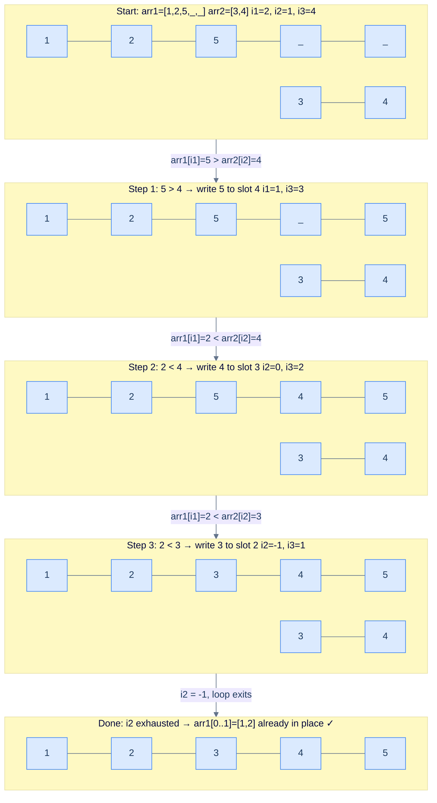

# Merge Sorted Arrays

## Problem Statement

Given two integer arrays `arr1` and `arr2`, both sorted in non-decreasing order, and two integers `m` and `n` representing the number of valid elements in each array, merge `arr2` into `arr1` **in-place** so that `arr1` holds all `m + n` elements in sorted order.

`arr1` is pre-allocated to length `m + n` — the last `n` slots are filled with zeros as placeholders.

```
Input:  arr1 = [1, 2, 3, 0, 0], m = 3, arr2 = [4, 5], n = 2
Output: [1, 2, 3, 4, 5]

Input:  arr1 = [1, 2, 5, 0, 0], m = 3, arr2 = [3, 4], n = 2
Output: [1, 2, 3, 4, 5]

Input:  arr1 = [1], m = 1, arr2 = [], n = 0
Output: [1]
```

---

## Examples

**Example 1** — `arr1 = [1, 2, 3, 0, 0]`, `m = 3`, `arr2 = [4, 5]`, `n = 2` → `[1, 2, 3, 4, 5]`. All `arr2` elements are larger than every valid `arr1` element, so they fill the trailing slots in order.

**Example 2** — `arr1 = [1, 2, 5, 0, 0]`, `m = 3`, `arr2 = [3, 4]`, `n = 2` → `[1, 2, 3, 4, 5]`. The two arrays interleave — the largest element `5` came from `arr1`, the next two `(4, 3)` came from `arr2`.

**Example 3** — `arr1 = [1]`, `m = 1`, `arr2 = []`, `n = 0` → `[1]`. `arr2` is empty, so `arr1` is already merged — the algorithm exits immediately.

```quiz
{
  "prompt": "Now your turn!",
  "input": "arr1 = [1, 2, 5, 0, 0], m = 3, arr2 = [3, 4], n = 2",
  "options": ["[1, 2, 3, 4, 5]", "[1, 2, 5, 3, 4]", "[1, 2, 3, 5, 4]", "[3, 4, 1, 2, 5]"],
  "answer": "[1, 2, 3, 4, 5]"
}
```

## Constraints

- `0 ≤ m, n ≤ 10^4` and `arr1.length == m + n`, `arr2.length == n`
- `arr1` (first `m`) and `arr2` are each sorted in non-decreasing order
- `-10^9 ≤ arr1[i], arr2[i] ≤ 10^9`

```python run viz=array viz-root=arr1
import ast
from typing import List

class Solution:
    def merge_sorted_arrays(
        self, arr_1: List[int], m: int, arr_2: List[int], n: int
    ) -> None:
        # Your code goes here — walk i1, i2, i3 from the back; write the
        # larger of arr_1[i1] / arr_2[i2] into arr_1[i3], then drain arr_2.
        pass


arr1 = ast.literal_eval(input())     # the test case's arr1 (with trailing zeros)
m = int(input())                     # the test case's m
arr2 = ast.literal_eval(input())     # the test case's arr2
n = int(input())                     # the test case's n
Solution().merge_sorted_arrays(arr1, m, arr2, n)
print(arr1)
```

```java run viz=array viz-root=arr1
import java.util.*;

public class Main {
    static class Solution {
        public void mergeSortedArrays(int[] arr1, int m, int[] arr2, int n) {
            // Your code goes here — walk i1, i2, i3 from the back; write the
            // larger of arr1[i1] / arr2[i2] into arr1[i3], then drain arr2.
        }
    }

    public static void main(String[] args) {
        Scanner sc = new Scanner(System.in);
        int[] arr1 = parseIntArray(sc.nextLine());   // the test case's arr1
        int m = Integer.parseInt(sc.nextLine().trim());
        int[] arr2 = parseIntArray(sc.nextLine());   // the test case's arr2
        int n = Integer.parseInt(sc.nextLine().trim());
        new Solution().mergeSortedArrays(arr1, m, arr2, n);
        System.out.println(Arrays.toString(arr1));
    }

    // "[1, 2, 3]" → {1, 2, 3} — reads the test case's array
    static int[] parseIntArray(String line) {
        String inner = line.replaceAll("[\\[\\]\\s]", "");
        if (inner.isEmpty()) return new int[0];
        String[] parts = inner.split(",");
        int[] out = new int[parts.length];
        for (int i = 0; i < parts.length; i++) out[i] = Integer.parseInt(parts[i]);
        return out;
    }
}
```

```testcases
{
  "args": [
    { "id": "arr1", "label": "arr1 (trailing zeros)", "type": "int[]", "placeholder": "[1, 2, 3, 0, 0]" },
    { "id": "m", "label": "m", "type": "int", "placeholder": "3" },
    { "id": "arr2", "label": "arr2", "type": "int[]", "placeholder": "[4, 5]" },
    { "id": "n", "label": "n", "type": "int", "placeholder": "2" }
  ],
  "cases": [
    { "args": { "arr1": "[1, 2, 3, 0, 0]", "m": "3", "arr2": "[4, 5]", "n": "2" }, "expected": "[1, 2, 3, 4, 5]" },
    { "args": { "arr1": "[1, 2, 5, 0, 0]", "m": "3", "arr2": "[3, 4]", "n": "2" }, "expected": "[1, 2, 3, 4, 5]" },
    { "args": { "arr1": "[1]", "m": "1", "arr2": "[]", "n": "0" }, "expected": "[1]" },
    { "args": { "arr1": "[0]", "m": "0", "arr2": "[5]", "n": "1" }, "expected": "[5]" },
    { "args": { "arr1": "[3, 4, 0, 0]", "m": "2", "arr2": "[1, 2]", "n": "2" }, "expected": "[1, 2, 3, 4]" },
    { "args": { "arr1": "[2, 3, 0]", "m": "2", "arr2": "[2]", "n": "1" }, "expected": "[2, 2, 3]" }
  ]
}
```

<details>
<summary><h2>Intuition &amp; Brute Force</h2></summary>

### Intuition

The structural property is that `arr1` is both the source AND the destination — and the destination has free space only at the *end*. That single asymmetry rules out a front-to-back merge: writing `arr1[0]` from `arr2[0]` would destroy the `arr1` element you have not yet read. Front-to-back merging without first shifting every element costs `O((m+n)²)` time, and the shifts make the algorithm fragile. The order constraint *forces* you to write into the free trailing zeros, which means writing the *largest* element first and walking the write pointer leftward.

`i1 = m - 1` belongs at the last valid element of `arr1` because that is the largest known `arr1` value. `i2 = n - 1` belongs at the last element of `arr2` for the same reason. `i3 = m + n - 1` belongs at the rightmost free slot — the destination for the next-largest value. At every step, the larger of `arr1[i1]` and `arr2[i2]` wins slot `i3` and its source pointer decrements; `i3` decrements regardless. The write pointer `i3` walks at the speed of *both* read pointers combined, so it always sits at or ahead of `i1` — no unread `arr1` element is ever overwritten.

To make this concrete: with `arr1 = [1, 2, 5, 0, 0]` and `arr2 = [3, 4]`, the largest overall value is `5` (from `arr1`), so slot `4` gets `5` first. Then the next-largest is `4` (from `arr2`), filling slot `3`. Then `3` (from `arr2`) fills slot `2`. At that point `arr2` is exhausted, and `arr1[0..1] = [1, 2]` are already sitting in the correct positions — no further work needed. The naive front-to-back merge would have needed an extra array of size `m + n` to avoid overwrites, costing `O(m + n)` extra space and missing the whole point of in-place merging.

```d2
direction: right

bad: "Front-to-back: destroys arr1[0] before reading it" {
  grid-columns: 5
  grid-gap: 0
  a0: "1" {style.fill: "#fecaca"; style.stroke: "#dc2626"}
  a1: "2"
  a2: "3"
  a3: "0"
  a4: "0"
}

bad_arrow: "write here ✗ overwrites!" {shape: oval; style.fill: "#fecaca"; style.stroke: "#dc2626"}
bad_arrow -> bad.a0

good: "Back-to-front: writes into free zeros, never destroys unread data" {
  grid-columns: 5
  grid-gap: 0
  b0: "1"
  b1: "2"
  b2: "3"
  b3: "0"
  b4: "0" {style.fill: "#dcfce7"; style.stroke: "#16a34a"}
}

good_arrow: "write here ✓ safe (free slot)" {shape: oval; style.fill: "#dcfce7"; style.stroke: "#16a34a"}
good_arrow -> good.b4
```

<p align="center"><strong>Writing from the front overwrites unread data. Writing from the back fills the pre-allocated zero slots — already free, never destructive.</strong></p>

### Brute Force: Front-to-Back with Buffer, O(m + n) Space

Allocate a temporary array of size `m + n`, run the standard forward simultaneous traversal merge into the buffer, then copy the buffer back into `arr1`. The merge logic is identical to the textbook two-pointer merge — pick the smaller of `arr1[i1]` and `arr2[i2]`, write it to the buffer, advance the winning source. The only loss is `O(m + n)` extra space, which the problem explicitly forbids by handing you the pre-allocated `arr1`.

The fix is to flip the direction entirely. The last `n` positions of `arr1` are zeros — free space nobody has touched. Walk all three pointers from the back, write the *largest* element to the rightmost free slot, and the write pointer never catches up to the read pointers until every element has been consumed.

</details>
<details>
<summary><h2>Solution &amp; Analysis</h2></summary>

### Applying the Diagnostic Questions

| Question | Answer for Merge Sorted Arrays |
|---|---|
| **Q1.** Two sequences processed together? | **Yes** — elements from `arr1` and `arr2` must compete at every step to determine placement order |
| **Q2.** Advancing one depends on comparing both? | **Yes** — whichever array supplies the larger element has its pointer decremented; the other stays |
| **Q3.** Condition is simple and deterministic? | **Yes** — one `>` comparison per step, `O(1)` work per iteration |
| **Q4.** Leftover elements matter when one array exhausts? | **Yes** — leftover `arr2` elements must be copied into `arr1`'s prefix; leftover `arr1` elements are already in place and need no action |

### Approach

1. Initialise three indices: `i1 = m - 1` (last valid `arr1` element), `i2 = n - 1` (last `arr2` element), `i3 = m + n - 1` (rightmost write slot).
2. While `i1 >= 0` AND `i2 >= 0`, compare `arr1[i1]` with `arr2[i2]` — the larger value wins slot `i3`.
3. If `arr1[i1] > arr2[i2]`, write `arr1[i1]` into `arr1[i3]` and decrement `i1` (the next `arr1` candidate is one position to the left).
4. Otherwise, write `arr2[i2]` into `arr1[i3]` and decrement `i2`. (Ties go to `arr2` here, which is harmless — equal values are interchangeable.)
5. Decrement `i3` after either branch — the next free slot moves one position to the left.
6. When the main loop exits, exactly one of the read pointers is `-1`. If `i2 >= 0`, drain the leftover `arr2` into the front of `arr1` with a single loop — these elements are all smaller than everything already placed. If `i1 >= 0`, the leftover `arr1` elements are already in their correct positions; no action needed.



<p align="center"><strong>Three-pointer backward fill — <code>i1</code> and <code>i2</code> compete for each slot; <code>i3</code> always fills the next free position from the back. No element is ever overwritten before being read.</strong></p>

### The Solution

```python solution time=O(m+n) space=O(1)
import ast
from typing import List

class Solution:
    def merge_sorted_arrays(
        self, arr_1: List[int], m: int, arr_2: List[int], n: int
    ) -> None:

        # last index of non-zero elements in arr_1
        index1: int = m - 1

        # last index of elements in arr_2
        index2: int = n - 1

        # last index of arr_1
        index3: int = m + n - 1

        # merging arr_1 and arr_2 from the rightmost end of the arrays
        while index1 >= 0 and index2 >= 0:

            # if the element in arr_1 is greater than the element in arr_2
            # then place the element from arr_1 to the last index of arr_1
            # and decrement the index of arr_1
            if arr_1[index1] > arr_2[index2]:
                arr_1[index3] = arr_1[index1]
                index1 -= 1

            # if the element in arr_2 is greater than the element in arr_1
            # then place the element from arr_2 to the last index of arr_1
            # and decrement the index of arr_2
            else:
                arr_1[index3] = arr_2[index2]
                index2 -= 1
            index3 -= 1

        # if there are still remaining elements in arr_2
        while index2 >= 0:
            arr_1[index3] = arr_2[index2]
            index2 -= 1
            index3 -= 1


arr1 = ast.literal_eval(input())     # the test case's arr1 (with trailing zeros)
m = int(input())                     # the test case's m
arr2 = ast.literal_eval(input())     # the test case's arr2
n = int(input())                     # the test case's n
Solution().merge_sorted_arrays(arr1, m, arr2, n)
print(arr1)
```

```java solution
import java.util.*;

public class Main {
    static class Solution {
        public void mergeSortedArrays(int[] arr1, int m, int[] arr2, int n) {

            // last index of non-zero elements in arr1
            int index1 = m - 1;

            // last index of elements in arr2
            int index2 = n - 1;

            // last index of arr1
            int index3 = m + n - 1;

            // merging arr1 and arr2 from the rightmost end of the arrays
            while (index1 >= 0 && index2 >= 0) {

                // if the element in arr1 is greater than the element in arr2
                // then place the element from arr1 to the last index of arr1
                // and decrement the index of arr1
                if (arr1[index1] > arr2[index2]) {
                    arr1[index3--] = arr1[index1--];
                }

                // if the element in arr2 is greater than the element in arr1
                // then place the element from arr2 to the last index of arr1
                // and decrement the index of arr2
                else {
                    arr1[index3--] = arr2[index2--];
                }
            }

            // if there are still remaining elements in arr2
            while (index2 >= 0) {
                arr1[index3--] = arr2[index2--];
            }
        }
    }

    public static void main(String[] args) {
        Scanner sc = new Scanner(System.in);
        int[] arr1 = parseIntArray(sc.nextLine());   // the test case's arr1
        int m = Integer.parseInt(sc.nextLine().trim());
        int[] arr2 = parseIntArray(sc.nextLine());   // the test case's arr2
        int n = Integer.parseInt(sc.nextLine().trim());
        new Solution().mergeSortedArrays(arr1, m, arr2, n);
        System.out.println(Arrays.toString(arr1));
    }

    // "[1, 2, 3]" → {1, 2, 3} — reads the test case's array
    static int[] parseIntArray(String line) {
        String inner = line.replaceAll("[\\[\\]\\s]", "");
        if (inner.isEmpty()) return new int[0];
        String[] parts = inner.split(",");
        int[] out = new int[parts.length];
        for (int i = 0; i < parts.length; i++) out[i] = Integer.parseInt(parts[i]);
        return out;
    }
}
```

### Dry Run — Example 1

`arr1 = [1, 2, 5, 0, 0]`, `m = 3`, `arr2 = [3, 4]`, `n = 2`

<details>
<summary><strong>Trace — arr1 = [1, 2, 5, 0, 0], m = 3, arr2 = [3, 4], n = 2</strong></summary>

```
i1 = 2,  i2 = 1,  i3 = 4

Step 1 │ i1=2 (arr1[2]=5), i2=1 (arr2[1]=4) │ 5 > 4 → arr1[4]=5, i1=1 │ arr1=[1,2,5,0,5]  i3=3
Step 2 │ i1=1 (arr1[1]=2), i2=1 (arr2[1]=4) │ 2 < 4 → arr1[3]=4, i2=0 │ arr1=[1,2,5,4,5]  i3=2
Step 3 │ i1=1 (arr1[1]=2), i2=0 (arr2[0]=3) │ 2 < 3 → arr1[2]=3, i2=-1│ arr1=[1,2,3,4,5]  i3=1

Loop exits: i2 = -1

No leftover arr2 elements. arr1[0..1] = [1, 2] already in correct positions.

Result: [1, 2, 3, 4, 5] ✓

Note: the write pointer i3 always wrote into a position at or ahead of where
it started — it never caught up to i1, so no element was overwritten before being read.
```

</details>
<details>
<summary><strong>Trace — arr1 = [3, 4, 0, 0], m = 2, arr2 = [1, 2], n = 2  (arr1 exhausts first, leftover-copy runs)</strong></summary>

```
i1 = 1,  i2 = 1,  i3 = 3

Step 1 │ i1=1 (arr1[1]=4), i2=1 (arr2[1]=2) │ 4 > 2 → arr1[3]=4, i1=0 │ arr1=[3,4,0,4]  i3=2
Step 2 │ i1=0 (arr1[0]=3), i2=1 (arr2[1]=2) │ 3 > 2 → arr1[2]=3, i1=-1│ arr1=[3,4,3,4]  i3=1

Loop exits: i1 = -1

Leftover arr2: i2=1
  copy arr2[1]=2 → arr1[1]=2, i2=0, i3=0
  copy arr2[0]=1 → arr1[0]=1, i2=-1

Result: [1, 2, 3, 4] ✓

Note: the leftover-copy pass handles arr2 elements that are all smaller
than anything already placed — no comparison needed, just copy in order.
```

</details>

### Complexity Analysis

| | Complexity | Reason |
|---|---|---|
| **Time** | `O(M + N)` | Each element is read once (by `i1` or `i2`) and written once (by `i3`) — `M + N` operations total |
| **Space** | `O(1)` | Only three integer pointers; the pre-allocated zeros in `arr1` serve as the output buffer |

### Edge Cases

| Case | Example | Expected | Reasoning |
|---|---|---|---|
| `arr2` is empty | `arr1=[1]`, `m=1`, `arr2=[]`, `n=0` | `[1]` | `i2 = -1` immediately; main loop never runs; `arr1` unchanged |
| `arr1` has no valid elements | `arr1=[0]`, `m=0`, `arr2=[1]`, `n=1` | `[1]` | `i1 = -1` immediately; main loop skipped; leftover-copy runs once |
| All `arr2` larger than `arr1` | `arr1=[1,2,0,0]`, `arr2=[3,4]` | `[1,2,3,4]` | `arr2` wins every comparison; `arr1` elements stay untouched at the front |
| All `arr2` smaller than `arr1` | `arr1=[3,4,0,0]`, `arr2=[1,2]` | `[1,2,3,4]` | `arr1` wins every comparison; leftover-copy places both `arr2` elements |
| Arrays perfectly interleave | `arr1=[1,3,0,0]`, `arr2=[2,4]` | `[1,2,3,4]` | Each comparison alternates winner between `i1` and `i2` |
| Tie (equal elements) | `arr1=[2,3,0]`, `arr2=[2]` | `[2,2,3]` | `else` branch fires on ties, placing `arr2[i2]` first — both orderings are valid for equal values |

</details>
<details>
<summary><h2>Key Takeaway</h2></summary>

Merge from the back when the destination has pre-allocated trailing space — the write pointer fills free slots without ever stomping on unread values, and the leftover-copy is needed only for `arr2`. This is simultaneous traversal in reverse: the same comparison-driven shape as the forward merge, with the *largest* candidate winning each slot instead of the smallest.

</details>
