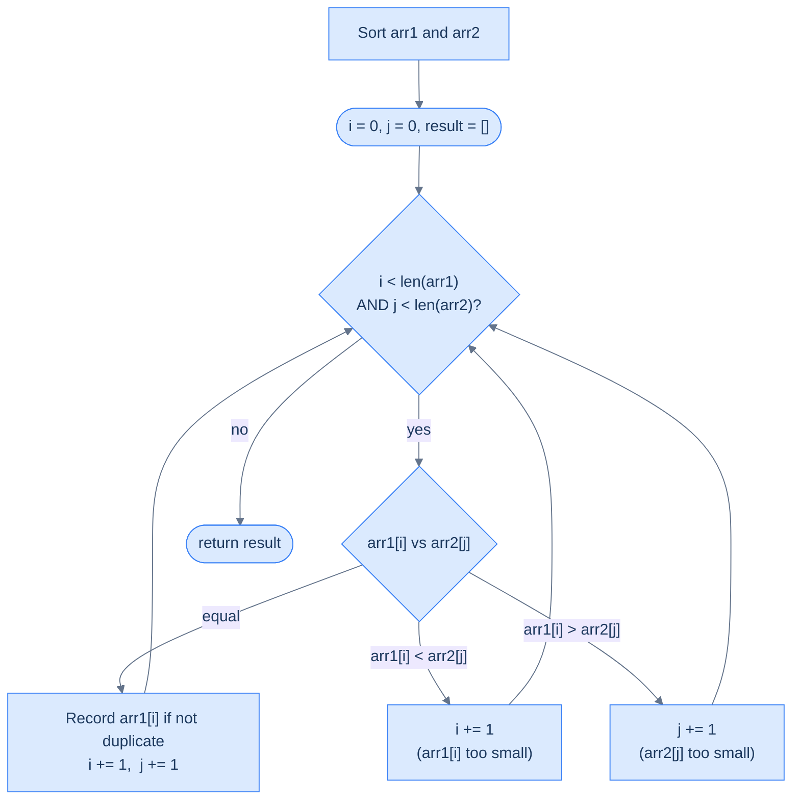

# Unique Intersections

## Problem Statement

Given two integer arrays `arr1` and `arr2`, return an array containing all elements that appear in **both** arrays. Each element in the result must appear **only once**, regardless of how many times it appears in the inputs.

```
arr1 = [1, 2, 2, 3, 4],  arr2 = [2, 2, 3, 5]  →  [2, 3]
arr1 = [1, 2, 3],         arr2 = [4, 5, 6]      →  []
arr1 = [1, 1, 1],         arr2 = [1, 1]          →  [1]
arr1 = [1, 2, 3, 4, 5],   arr2 = [1, 3, 5, 7]   →  [1, 3, 5]
```

---

## Examples

**Example 1**
```
Input:  arr1 = [1, 2, 2, 3, 4],  arr2 = [2, 2, 3, 5]
Output: [2, 3]
Explanation: 2 and 3 appear in both arrays. Even though 2 appears twice in both,
             it appears only once in the result.
```

**Example 2**
```
Input:  arr1 = [1, 3, 5],  arr2 = [2, 4, 6]
Output: []
Explanation: No value appears in both arrays.
```

**Example 3**
```
Input:  arr1 = [2, 2, 2],  arr2 = [2, 2]
Output: [2]
Explanation: 2 is common, but unique intersections means it appears once.
```

```quiz
{
  "prompt": "Now your turn!",
  "input": "arr1 = [1, 2, 2, 3, 4], arr2 = [2, 2, 3, 5]",
  "options": ["[2, 3]", "[2, 2, 3]", "[2, 3, 5]", "[2]"],
  "answer": "[2, 3]"
}
```

## Constraints

- `0 ≤ arr1.length, arr2.length ≤ 10^4`
- `-10^9 ≤ arr1[i], arr2[i] ≤ 10^9`
- Each value in the result appears once, in non-decreasing order

```python run viz=array viz-root=result
import ast
from typing import List

class Solution:
    def unique_intersections(
        self, arr_1: List[int], arr_2: List[int]
    ) -> List[int]:
        # Your code goes here — sort both, walk in lock-step; on a match
        # record the value only if it differs from the last recorded one.
        return []


arr1 = ast.literal_eval(input())     # the test case's arr1
arr2 = ast.literal_eval(input())     # the test case's arr2
print(Solution().unique_intersections(arr1, arr2))
```

```java run viz=array viz-root=result
import java.util.*;

public class Main {
    static class Solution {
        public List<Integer> uniqueIntersections(int[] arr1, int[] arr2) {
            // Your code goes here — sort both, walk in lock-step; on a match
            // record the value only if it differs from the last recorded one.
            return new ArrayList<>();
        }
    }

    public static void main(String[] args) {
        Scanner sc = new Scanner(System.in);
        int[] arr1 = parseIntArray(sc.nextLine());   // the test case's arr1
        int[] arr2 = parseIntArray(sc.nextLine());   // the test case's arr2
        System.out.println(new Solution().uniqueIntersections(arr1, arr2));
    }

    // "[1, 2, 3]" → {1, 2, 3} — reads the test case's array
    static int[] parseIntArray(String line) {
        String inner = line.replaceAll("[\\[\\]\\s]", "");
        if (inner.isEmpty()) return new int[0];
        String[] parts = inner.split(",");
        int[] out = new int[parts.length];
        for (int i = 0; i < parts.length; i++) out[i] = Integer.parseInt(parts[i]);
        return out;
    }
}
```

```testcases
{
  "args": [
    { "id": "arr1", "label": "arr1", "type": "int[]", "placeholder": "[1, 2, 2, 3, 4]" },
    { "id": "arr2", "label": "arr2", "type": "int[]", "placeholder": "[2, 2, 3, 5]" }
  ],
  "cases": [
    { "args": { "arr1": "[1, 2, 2, 3, 4]", "arr2": "[2, 2, 3, 5]" }, "expected": "[2, 3]" },
    { "args": { "arr1": "[4, 9, 5]", "arr2": "[9, 4, 9, 8, 4]" }, "expected": "[4, 9]" },
    { "args": { "arr1": "[1, 3, 5]", "arr2": "[2, 4, 6]" }, "expected": "[]" },
    { "args": { "arr1": "[]", "arr2": "[1, 2]" }, "expected": "[]" },
    { "args": { "arr1": "[2, 2, 2]", "arr2": "[2, 2]" }, "expected": "[2]" },
    { "args": { "arr1": "[1, 2, 3, 4, 5]", "arr2": "[1, 3, 5, 7]" }, "expected": "[1, 3, 5]" }
  ]
}
```

<details>
<summary><h2>Intuition &amp; Brute Force</h2></summary>

### Intuition

The structural property is *set intersection* — the answer is the set of values that exist in both arrays, with no regard to multiplicity. The two inputs come unsorted, so the first move is to sort both. Sorting gives every comparison a *decisive direction*: if `arr1[i] < arr2[j]`, no `arr2` element at positions `0..j-1` can match `arr1[i]` (those positions were already passed), and no `arr2` element at positions `j..end` is smaller than `arr2[j]` (sorted), so `arr1[i]` can never match — skip it.

`index1` belongs at the current candidate in `arr1` and `index2` belongs at the current candidate in `arr2`. On a match (`arr1[i] == arr2[j]`), both pointers advance and the value is *conditionally* appended — only if it differs from the last recorded value. On a mismatch, the smaller of the two pointers advances; the other stays put as the still-unmatched target. The uniqueness guard is one extra check, `if not result or result[-1] != arr1[i]`, that costs `O(1)` per match.

The naive approach is a nested loop with a `seen` set — for every element of `arr1`, scan `arr2` looking for a match, and consult the set to suppress duplicates. The brute force costs `O(N × M)` time and `O(k)` space for the set. The simultaneous walk replaces the nested scan with two pointers that each make at most one pass over their array — collapsing `O(N × M)` to `O(N + M)` for the walk itself (sorting still dominates at `O(N log N + M log M)`).



<p align="center"><strong>Unique Intersections — sort both, then walk with two pointers. On a match, record only if the value is new. On a mismatch, advance the smaller pointer.</strong></p>

### Brute Force: Nested Loops, O(N × M)

```python run viz=array viz-root=result
from typing import List

def unique_intersections_brute(arr1: List[int], arr2: List[int]) -> List[int]:
    seen = set()
    result = []
    for x in arr1:
        for y in arr2:
            if x == y and x not in seen:
                result.append(x)
                seen.add(x)
                break
    return result

print(unique_intersections_brute([1, 2, 2, 3, 4], [2, 2, 3, 5]))  # [2, 3]
```

```java run viz=array viz-root=result
import java.util.*;

public class Main {
    static List<Integer> uniqueIntersectionsBrute(int[] arr1, int[] arr2) {
        Set<Integer> seen = new HashSet<>();
        List<Integer> result = new ArrayList<>();
        for (int x : arr1) {
            for (int y : arr2) {
                if (x == y && !seen.contains(x)) {
                    result.add(x);
                    seen.add(x);
                    break;
                }
            }
        }
        return result;
    }

    public static void main(String[] args) {
        System.out.println(uniqueIntersectionsBrute(new int[]{1, 2, 2, 3, 4}, new int[]{2, 2, 3, 5}));
    }
}
```

The brute force rescans `arr2` for every element of `arr1` — `O(N × M)` time, easy to get wrong with the duplicate-tracking logic. The sorted-then-walk version replaces both nested loop and the explicit `seen` set.

</details>
<details>
<summary><h2>Solution &amp; Analysis</h2></summary>

### Applying the Diagnostic Questions

| Question | Answer for Unique Intersections |
|---|---|
| **Q1.** Two sequences processed together? | **Yes** — the result is the set of values present in both arrays, which cannot be answered by scanning either array alone |
| **Q2.** Advancing one depends on comparing both? | **Yes** — the smaller of `arr1[i]` and `arr2[j]` has its pointer advanced; on a match both advance |
| **Q3.** Condition is simple and deterministic? | **Yes** — one three-way comparison per iteration, `O(1)` per step after the initial sort |
| **Q4.** Leftover elements matter when one array exhausts? | **No** — once one array exhausts, any leftover values in the other cannot match anything and are discarded; the loop exit is the natural end |

### Approach

1. Sort both arrays — `O(N log N + M log M)` — so each pointer move has a decisive direction.
2. Initialise `index1 = 0`, `index2 = 0`, `result = []`.
3. While `index1 < len(arr1)` AND `index2 < len(arr2)`, compare `arr1[index1]` with `arr2[index2]`.
4. If the values are equal, this is a candidate intersection — append `arr1[index1]` to `result` **only if** the result is empty or its last entry differs from `arr1[index1]` (the uniqueness guard). Advance both pointers.
5. If `arr1[index1] < arr2[index2]`, the `arr1` value is too small to match any remaining `arr2` value — advance `index1` only.
6. Otherwise (`arr1[index1] > arr2[index2]`), the `arr2` value is too small — advance `index2` only.
7. When the loop exits, return `result` — no cleanup is needed because leftover values cannot match.

### The Solution

```python solution time=O(n log n + m log m) space=O(k)
import ast
from typing import List

class Solution:
    def unique_intersections(
        self, arr_1: List[int], arr_2: List[int]
    ) -> List[int]:
        result: List[int] = []

        # Sorting the two input arrays
        arr_1.sort()
        arr_2.sort()

        # Two pointers to traverse both arrays
        index1 = 0
        index2 = 0

        # Traverse both arrays until one pointer reaches the end
        while index1 < len(arr_1) and index2 < len(arr_2):

            # If there's an intersection
            if arr_1[index1] == arr_2[index2]:

                # Adding only unique elements
                if not result or result[-1] != arr_1[index1]:
                    result.append(arr_1[index1])
                index1 += 1
                index2 += 1

            # If the element in the first array is smaller
            elif arr_1[index1] < arr_2[index2]:
                index1 += 1

            # If the element in the second array is smaller
            else:
                index2 += 1
        return result


arr1 = ast.literal_eval(input())     # the test case's arr1
arr2 = ast.literal_eval(input())     # the test case's arr2
print(Solution().unique_intersections(arr1, arr2))
```

```java solution
import java.util.*;

public class Main {
    static class Solution {
        public List<Integer> uniqueIntersections(int[] arr1, int[] arr2) {
            List<Integer> result = new ArrayList<Integer>();

            // Sorting the two input arrays
            Arrays.sort(arr1);
            Arrays.sort(arr2);

            // Two pointers to traverse both arrays
            int index1 = 0;
            int index2 = 0;

            // Traverse both arrays until one pointer reaches the end
            while (index1 < arr1.length && index2 < arr2.length) {

                // If there's an intersection
                if (arr1[index1] == arr2[index2]) {

                    // Adding only unique elements
                    if (
                        result.isEmpty() ||
                        result.get(result.size() - 1) != arr1[index1]
                    ) {
                        result.add(arr1[index1]);
                    }
                    index1++;
                    index2++;
                }

                // If the element in the first array is smaller
                else if (arr1[index1] < arr2[index2]) {
                    index1++;
                }

                // If the element in the second array is smaller
                else {
                    index2++;
                }
            }
            return result;
        }
    }

    public static void main(String[] args) {
        Scanner sc = new Scanner(System.in);
        int[] arr1 = parseIntArray(sc.nextLine());   // the test case's arr1
        int[] arr2 = parseIntArray(sc.nextLine());   // the test case's arr2
        System.out.println(new Solution().uniqueIntersections(arr1, arr2));
    }

    // "[1, 2, 3]" → {1, 2, 3} — reads the test case's array
    static int[] parseIntArray(String line) {
        String inner = line.replaceAll("[\\[\\]\\s]", "");
        if (inner.isEmpty()) return new int[0];
        String[] parts = inner.split(",");
        int[] out = new int[parts.length];
        for (int i = 0; i < parts.length; i++) out[i] = Integer.parseInt(parts[i]);
        return out;
    }
}
```

### Dry Run — Example 1

`arr1 = [1, 2, 2, 3, 4]`, `arr2 = [2, 2, 3, 5]` (both already sorted)

<details>
<summary><strong>Trace — arr1 = [1, 2, 2, 3, 4],  arr2 = [2, 2, 3, 5]</strong></summary>

```
i=0, j=0, result=[]

Step 1 │ arr1[0]=1, arr2[0]=2 │ 1 < 2 → advance i          │ i=1, j=0
Step 2 │ arr1[1]=2, arr2[0]=2 │ 2 == 2 → result empty → record 2 → i=2, j=1  │ result=[2]
Step 3 │ arr1[2]=2, arr2[1]=2 │ 2 == 2 → result[-1]==2 → skip (duplicate)    │ i=3, j=2
Step 4 │ arr1[3]=3, arr2[2]=3 │ 3 == 3 → result[-1]=2 ≠ 3 → record 3 → i=4, j=3  │ result=[2,3]
Step 5 │ arr1[4]=4, arr2[3]=5 │ 4 < 5 → advance i          │ i=5, j=3

i=5 == len(arr1)=5 → loop exits

Result: [2, 3] ✓

Note: step 3 found a second (2,2) match but the duplicate check suppressed it.
The sorted order of both arrays means once a match is recorded, all subsequent
duplicates of that value appear consecutively and are caught immediately.
```

</details>

### Why Sort First?

Without sorting, the "advance the smaller pointer" rule has no meaning — there is no way to know which side to advance when there is no match. Sorting gives you the guarantee that `arr1[i] < arr2[j]` implies `arr1[i]` cannot match any remaining `arr2` element, because:

- positions `arr2[0..j-1]` were already passed (none equalled `arr1[i]`)
- positions `arr2[j..end]` are all `>= arr2[j] > arr1[i]` (sorted)

The symmetric argument applies for `arr1[i] > arr2[j]`. After sorting, every comparison is decisive. Without sorting, you would need an inner scan per mismatch — collapsing back to `O(N × M)`.

### Complexity Analysis

| | Complexity | Reasoning |
|---|---|---|
| **Time** | `O(N log N + M log M)` | Two sorts dominate; the traversal itself is `O(N + M)` |
| **Space** | `O(k)` | `k` = number of unique common elements in the result; `O(1)` extra working space beyond the result |

If both arrays arrive pre-sorted, the time drops to `O(N + M)`.

### Edge Cases

| Scenario | Input | Output | Note |
|---|---|---|---|
| No common elements | `[1,3,5]`, `[2,4,6]` | `[]` | Pointers never match; one runs out first |
| All elements match | `[1,2,3]`, `[1,2,3]` | `[1,2,3]` | Every step is a match; uniqueness guard fires zero times |
| One array empty | `[]`, `[1,2,3]` | `[]` | Loop never runs |
| All duplicates | `[2,2,2]`, `[2,2]` | `[2]` | First match records, second match's duplicate check fires, then `arr2` exhausts |
| Single common element | `[1,5,9]`, `[3,5,7]` | `[5]` | One match in the middle |
| Identical singletons | `[1]`, `[1]` | `[1]` | One match, no duplicates |

</details>
<details>
<summary><h2>Key Takeaway</h2></summary>

Unique Intersections adds one piece on top of the basic comparison-driven walk: the `result[-1] != arr1[i]` guard on the append, which converts the multiset intersection into a set intersection. That single line is the entire difference between this problem and Repeated Intersections — remove the guard and you get multiset semantics.

</details>
