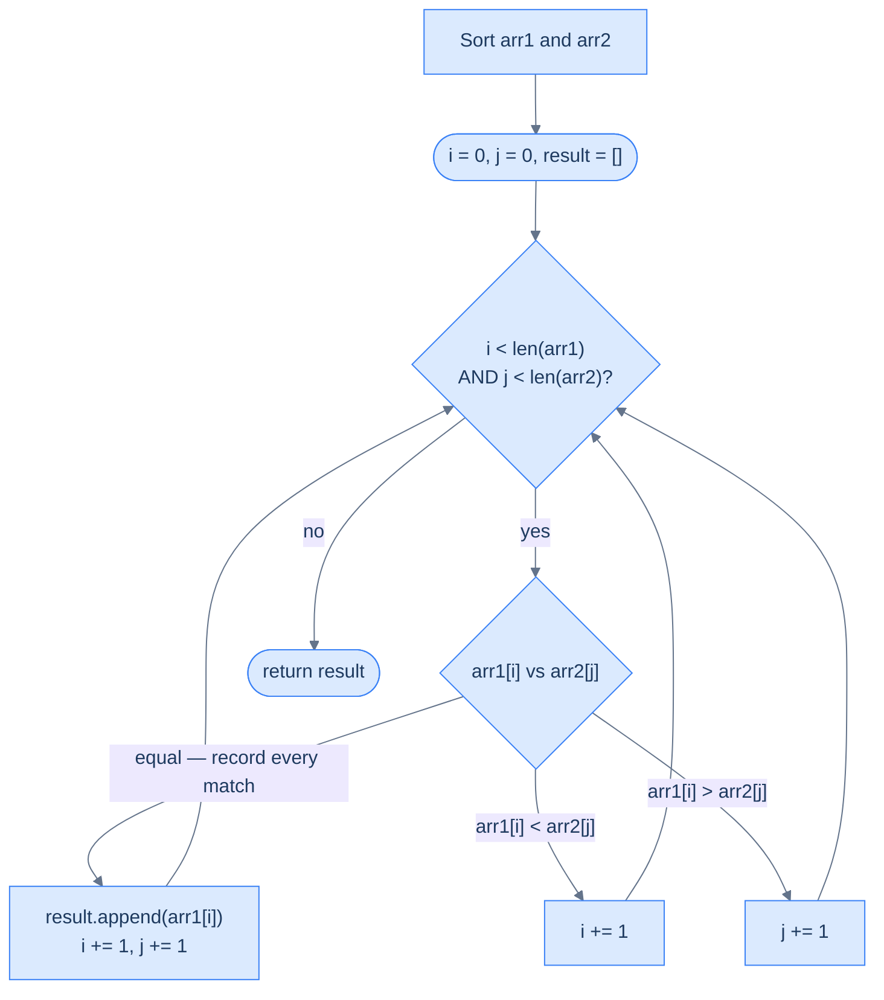

# Repeated Intersections

## Problem Statement

Given two integer arrays `arr1` and `arr2`, return an array containing all elements that appear in **both** arrays, **including duplicates**. An element that appears `p` times in `arr1` and `q` times in `arr2` should appear `min(p, q)` times in the result.

```
arr1 = [1, 2, 2, 3],  arr2 = [2, 2, 3, 3]  →  [2, 2, 3]
arr1 = [1, 2, 3],     arr2 = [4, 5, 6]      →  []
arr1 = [2, 2, 2],     arr2 = [2, 2]          →  [2, 2]
arr1 = [1, 2, 3],     arr2 = [1, 2, 3]       →  [1, 2, 3]
```

---

## Examples

**Example 1**
```
Input:  arr1 = [1, 2, 2, 3],  arr2 = [2, 2, 3, 3]
Output: [2, 2, 3]
Explanation: 2 appears twice in both → 2 appears twice in result.
             3 appears once in arr1, twice in arr2 → min(1,2)=1 → once in result.
```

**Example 2**
```
Input:  arr1 = [2, 2, 2],  arr2 = [2, 2]
Output: [2, 2]
Explanation: 2 appears 3 times in arr1, 2 times in arr2 → min(3,2)=2 appearances.
```

**Example 3**
```
Input:  arr1 = [1, 3, 5],  arr2 = [2, 4, 6]
Output: []
Explanation: No common values exist.
```

```quiz
{
  "prompt": "Now your turn!",
  "input": "arr1 = [1, 2, 2, 3], arr2 = [2, 2, 3, 3]",
  "options": ["[2, 2, 3]", "[2, 3]", "[2, 2, 3, 3]", "[2, 2]"],
  "answer": "[2, 2, 3]"
}
```

## Constraints

- `0 ≤ arr1.length, arr2.length ≤ 10^4`
- `-10^9 ≤ arr1[i], arr2[i] ≤ 10^9`
- A value shared `p` times in `arr1` and `q` times in `arr2` appears `min(p, q)` times, in non-decreasing order

```python run viz=array viz-root=result
import ast
from typing import List

class Solution:
    def repeated_intersections(
        self, arr_1: List[int], arr_2: List[int]
    ) -> List[int]:
        # Your code goes here — sort both, walk in lock-step; on a match
        # record the value unconditionally and advance both pointers.
        return []


arr1 = ast.literal_eval(input())     # the test case's arr1
arr2 = ast.literal_eval(input())     # the test case's arr2
print(Solution().repeated_intersections(arr1, arr2))
```

```java run viz=array viz-root=result
import java.util.*;

public class Main {
    static class Solution {
        public List<Integer> repeatedIntersections(int[] arr1, int[] arr2) {
            // Your code goes here — sort both, walk in lock-step; on a match
            // record the value unconditionally and advance both pointers.
            return new ArrayList<>();
        }
    }

    public static void main(String[] args) {
        Scanner sc = new Scanner(System.in);
        int[] arr1 = parseIntArray(sc.nextLine());   // the test case's arr1
        int[] arr2 = parseIntArray(sc.nextLine());   // the test case's arr2
        System.out.println(new Solution().repeatedIntersections(arr1, arr2));
    }

    // "[1, 2, 3]" → {1, 2, 3} — reads the test case's array
    static int[] parseIntArray(String line) {
        String inner = line.replaceAll("[\\[\\]\\s]", "");
        if (inner.isEmpty()) return new int[0];
        String[] parts = inner.split(",");
        int[] out = new int[parts.length];
        for (int i = 0; i < parts.length; i++) out[i] = Integer.parseInt(parts[i]);
        return out;
    }
}
```

```testcases
{
  "args": [
    { "id": "arr1", "label": "arr1", "type": "int[]", "placeholder": "[1, 2, 2, 3]" },
    { "id": "arr2", "label": "arr2", "type": "int[]", "placeholder": "[2, 2, 3, 3]" }
  ],
  "cases": [
    { "args": { "arr1": "[1, 2, 2, 3]", "arr2": "[2, 2, 3, 3]" }, "expected": "[2, 2, 3]" },
    { "args": { "arr1": "[2, 2, 2]", "arr2": "[2, 2]" }, "expected": "[2, 2]" },
    { "args": { "arr1": "[1, 3, 5]", "arr2": "[2, 4, 6]" }, "expected": "[]" },
    { "args": { "arr1": "[]", "arr2": "[1, 2]" }, "expected": "[]" },
    { "args": { "arr1": "[4, 9, 5]", "arr2": "[9, 4, 9, 8, 4]" }, "expected": "[4, 9]" },
    { "args": { "arr1": "[1, 2, 3]", "arr2": "[1, 2, 3]" }, "expected": "[1, 2, 3]" }
  ]
}
```

<details>
<summary><h2>Intuition &amp; Brute Force</h2></summary>

### Intuition

The structural property is *multiset intersection* — the answer counts every shared instance. The shape of the algorithm is identical to Unique Intersections, but with one rule changed: on a match, record *unconditionally* instead of skipping duplicates. Every other piece — sort both arrays, advance the smaller pointer on a mismatch, advance both on a match — stays exactly the same.

`index1` belongs at the current candidate in `arr1` and `index2` at the current candidate in `arr2`. On a match, both pointers advance one step — they each consume one copy of the shared value — and the value enters the result. On a mismatch, the smaller pointer advances. Because both pointers move together on a match, the side with fewer copies of a value runs out of them first; when it does, the values stop being equal and the match streak ends. The number of consecutive matches for any value is exactly `min(p, q)`.

The naive approach is a frequency-count map — count occurrences in `arr1`, count in `arr2`, then emit `min(count1[v], count2[v])` copies of every shared value `v`. It costs `O(N + M)` time but `O(N + M)` space for the maps and only works when values fit in a hashable type. The simultaneous walk uses `O(1)` working space (beyond the output) and is the textbook in-place version of multiset intersection — provided you can sort the inputs.



<p align="center"><strong>Repeated Intersections — identical to Unique Intersections but every match is recorded unconditionally. The min(p, q) rule emerges naturally from both pointers advancing on each match.</strong></p>

### Brute Force: Frequency Maps, O(N + M) Time, O(N + M) Space

Count occurrences of every value in `arr1` into a hash map, then count occurrences in `arr2` into another hash map. For each shared key `v`, append `min(count1[v], count2[v])` copies of `v` to the result. The time is `O(N + M)` but the space is `O(N + M)` for the two maps — and the implementation requires extra care around hash collisions and stable iteration order. The simultaneous-walk version drops the maps entirely and trades the sort cost for `O(1)` working space.

</details>
<details>
<summary><h2>Solution &amp; Analysis</h2></summary>

### Applying the Diagnostic Questions

| Question | Answer for Repeated Intersections |
|---|---|
| **Q1.** Two sequences processed together? | **Yes** — the result is the multiset of values present in both arrays, which cannot be answered by scanning either alone |
| **Q2.** Advancing one depends on comparing both? | **Yes** — the smaller of `arr1[i]` and `arr2[j]` has its pointer advanced; on a match, both advance and the value is recorded |
| **Q3.** Condition is simple and deterministic? | **Yes** — one three-way comparison per iteration, `O(1)` per step after the initial sort |
| **Q4.** Leftover elements matter when one array exhausts? | **No** — once one array exhausts, the other can no longer supply matching pairs; the loop exit is the natural end |

### Approach

1. Sort both arrays — `O(N log N + M log M)` — so each pointer move has a decisive direction.
2. Initialise `index1 = 0`, `index2 = 0`, `result = []`.
3. While `index1 < len(arr1)` AND `index2 < len(arr2)`, compare `arr1[index1]` with `arr2[index2]`.
4. If the values are equal, append `arr1[index1]` to `result` *unconditionally* — every match counts toward the multiset answer. Advance both pointers.
5. If `arr1[index1] < arr2[index2]`, the `arr1` value is too small to match any remaining `arr2` value — advance `index1` only.
6. Otherwise (`arr1[index1] > arr2[index2]`), the `arr2` value is too small — advance `index2` only.
7. When the loop exits, return `result` — no cleanup is needed because leftover values cannot match.

### The Solution

```python solution time=O(n log n + m log m) space=O(k)
import ast
from typing import List

class Solution:
    def repeated_intersections(
        self, arr_1: List[int], arr_2: List[int]
    ) -> List[int]:
        result = []
        arr_1.sort()
        arr_2.sort()
        index1 = 0
        index2 = 0
        while index1 < len(arr_1) and index2 < len(arr_2):

            # If there's an intersection
            if arr_1[index1] == arr_2[index2]:

                # if elements are equal, add to result and move both
                # pointers
                result.append(arr_1[index1])
                index1 += 1
                index2 += 1

            # If the element in the first array is smaller
            elif arr_1[index1] < arr_2[index2]:
                index1 += 1

            # If the element in the second array is smaller
            else:
                index2 += 1
        return result


arr1 = ast.literal_eval(input())     # the test case's arr1
arr2 = ast.literal_eval(input())     # the test case's arr2
print(Solution().repeated_intersections(arr1, arr2))
```

```java solution
import java.util.*;

public class Main {
    static class Solution {
        public List<Integer> repeatedIntersections(int[] arr1, int[] arr2) {
            List<Integer> result = new ArrayList<>();
            Arrays.sort(arr1);
            Arrays.sort(arr2);
            int index1 = 0;
            int index2 = 0;
            while (index1 < arr1.length && index2 < arr2.length) {

                // If there's an intersection
                if (arr1[index1] == arr2[index2]) {

                    // If elements are equal, add to result and move both
                    // pointers
                    result.add(arr1[index1]);
                    index1++;
                    index2++;
                }

                // If the element in the first array is smaller
                else if (arr1[index1] < arr2[index2]) {
                    index1++;
                }

                // If the element in the second array is smaller
                else {
                    index2++;
                }
            }
            return result;
        }
    }

    public static void main(String[] args) {
        Scanner sc = new Scanner(System.in);
        int[] arr1 = parseIntArray(sc.nextLine());   // the test case's arr1
        int[] arr2 = parseIntArray(sc.nextLine());   // the test case's arr2
        System.out.println(new Solution().repeatedIntersections(arr1, arr2));
    }

    // "[1, 2, 3]" → {1, 2, 3} — reads the test case's array
    static int[] parseIntArray(String line) {
        String inner = line.replaceAll("[\\[\\]\\s]", "");
        if (inner.isEmpty()) return new int[0];
        String[] parts = inner.split(",");
        int[] out = new int[parts.length];
        for (int i = 0; i < parts.length; i++) out[i] = Integer.parseInt(parts[i]);
        return out;
    }
}
```

### Dry Run — Example 1

`arr1 = [1, 2, 2, 3]`, `arr2 = [2, 2, 3, 3]` (both already sorted)

<details>
<summary><strong>Trace — arr1 = [1, 2, 2, 3],  arr2 = [2, 2, 3, 3]</strong></summary>

```
i=0, j=0, result=[]

Step 1 │ arr1[0]=1, arr2[0]=2 │ 1 < 2 → advance i                │ i=1, j=0
Step 2 │ arr1[1]=2, arr2[0]=2 │ 2 == 2 → record 2                │ i=2, j=1,  result=[2]
Step 3 │ arr1[2]=2, arr2[1]=2 │ 2 == 2 → record 2 again          │ i=3, j=2,  result=[2,2]
Step 4 │ arr1[3]=3, arr2[2]=3 │ 3 == 3 → record 3                │ i=4, j=3,  result=[2,2,3]

i=4 == len(arr1)=4 → loop exits

Result: [2, 2, 3] ✓

Compare with Unique Intersections: in step 3, Unique would have checked
result[-1]==2 and skipped. Repeated does not check — it records unconditionally.
That single difference is the entire distinction between the two problems.
```

</details>

### Why min(p, q) Falls Out Naturally

You do not need to count occurrences of each value explicitly. The simultaneous pointer movement handles it for free:

- Each match consumes one copy from `arr1` (`i` advances) and one copy from `arr2` (`j` advances).
- The side with fewer copies of a value runs out of them first. When it does, `arr1[i] ≠ arr2[j]` again, and the match streak ends.
- The number of consecutive matches is exactly `min(p, q)` — the count of the shorter side.

To make this concrete: for `arr1 = [2, 2, 2]` and `arr2 = [2, 2]`, the matches fire at `(i=0, j=0)` → record, `(i=1, j=1)` → record, then `j = 2 == len(arr2)` and the loop exits. Two matches recorded — exactly `min(3, 2) = 2`.

### Unique vs Repeated — The One-Line Difference

| | Unique Intersections | Repeated Intersections |
|---|---|---|
| On match | `if not result or result[-1] != arr1[i]: result.append(...)` | `result.append(arr1[i])` unconditionally |
| Duplicate handling | Skip duplicate matches | Record every match |
| Result for `[2,2]` vs `[2,2,2]` | `[2]` | `[2, 2]` |
| Use case | Set intersection (no duplicates) | Multiset intersection (with duplicates) |

The only structural difference is the guard condition on the append. Remove it, and Unique Intersections becomes Repeated Intersections.

### Complexity Analysis

| | Complexity | Reasoning |
|---|---|---|
| **Time** | `O(N log N + M log M)` | Two sorts dominate; the traversal itself is `O(N + M)` |
| **Space** | `O(k)` | `k` = total number of matches = sum of `min(count_in_arr1, count_in_arr2)` across all values; `O(1)` extra working space beyond the result |

If both arrays arrive pre-sorted, the time drops to `O(N + M)`.

### Edge Cases

| Scenario | Input | Output | Note |
|---|---|---|---|
| No overlap | `[1,3,5]`, `[2,4,6]` | `[]` | No matches ever |
| All elements match | `[1,2,3]`, `[1,2,3]` | `[1,2,3]` | Every step is a match |
| One array empty | `[]`, `[1,2,3]` | `[]` | Loop never runs |
| One array is a subset | `[2,3]`, `[1,2,3,4]` | `[2,3]` | Every element of the smaller array matches |
| All duplicates | `[3,3,3]`, `[3,3]` | `[3,3]` | `min(3,2) = 2` matches |
| Single-element match | `[1]`, `[1]` | `[1]` | One match, loop exits immediately after |

</details>
<details>
<summary><h2>Key Takeaway</h2></summary>

Repeated Intersections is Unique Intersections with the duplicate guard removed — one line of difference flips the semantics from set intersection to multiset intersection. The `min(p, q)` count is not computed; it falls out for free because each match advances both pointers, so the shorter side dictates how many matches the value can produce.

</details>
