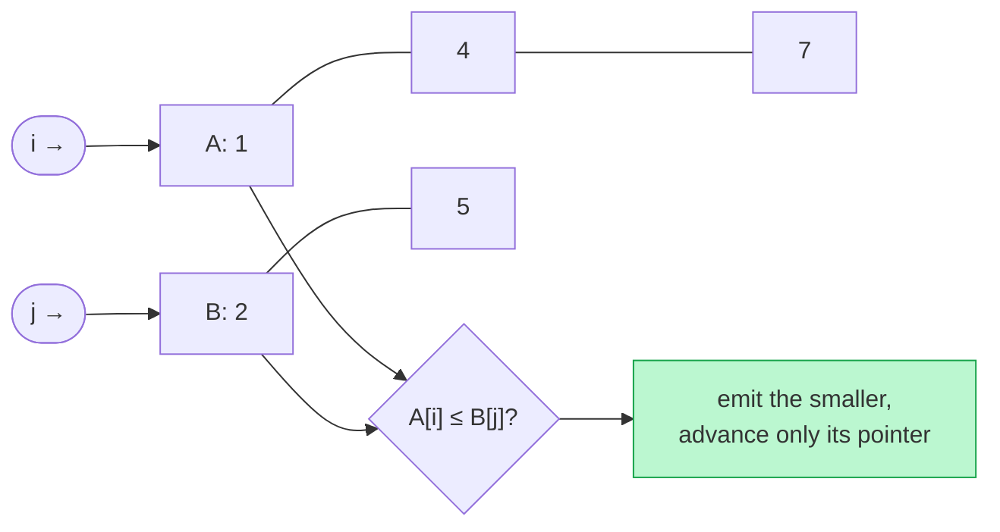

# Memorize: Simultaneous Traversal

## In a Hurry?

- **One-Line Idea**: One index per array, walk both forward in lock-step, let a single comparison decide which index advances each iteration — then drain whatever is left.
- **Complexities**: `O(N + M)` time, `O(1)` working space, where `N = len(arr1)` and `M = len(arr2)`. If a sort is required first (intersections), add `O(N log N + M log M)`.
- **When to Use**: The problem hands you *two* sequences and asks a question that needs *both at once* — merge, subsequence, intersection — and the advance decision at each step is a simple comparison between the two current elements.

---

## One-Line Mnemonic

**"Two cursors, one comparison, never rewind."**

The image is two fingers on two parallel rows of cards. Each step, you compare the cards under your fingers, take the right action (record, skip, or copy), then nudge one or both fingers forward. Neither finger ever moves backward. When one row ends, you sweep up whatever the other row has left.

---

## Real-World Analogy

Picture two cashier lines at a grocery store, each holding sorted receipts by customer ID. You have to produce a single combined ledger in ID order. You stand between the two lines with your pen, look at the top receipt on each pile, and write down whichever ID is smaller. Then you remove that receipt from its pile and look again. When one pile runs out, you copy the remaining pile straight into the ledger — no comparison needed, because everything left in that pile is larger than everything you have already written. Two hands, two piles, one ledger, and you never need to look back at any receipt twice.

---

## Visual Summary



<p align="center"><strong>Two sequences walked with their own pointers: compare the fronts, take the smaller, advance only that one. A single linear pass merges, intersects, or diffs — no nested loop.</strong></p>

---

## Pattern Recognition Triggers

The pattern fits when **all four** answers are "yes" — the same diagnostic each problem in the section uses to confirm the fit.

- The problem hands you **two sequences** (arrays, strings, sorted streams) and asks for a result that requires looking at both at the same time — neither can be answered alone.
- Advancing in one sequence depends on a **comparison between the two** current elements — never independently of the other side.
- Each pointer's advance condition is **`O(1)` and deterministic** — a single equality or `<` / `>` check, no inner scan, no lookahead.
- When one sequence runs out first, the **leftover in the other** is either explicitly part of the answer (merge, subsequence verdict) or explicitly discarded (intersection) — you have made a deliberate choice about it.

Common surface signals: "merge two sorted arrays/lists," "is `s` a subsequence of `t`?", "elements that appear in both arrays," "compare two sorted streams," "in-place merge given pre-allocated space."

---

## Don't Confuse With

| | **Simultaneous Traversal (this pattern)** | **Converging Two Pointers** |
|---|---|---|
| **Problem shape** | "Process two sequences in lock-step" — merge / intersection / subsequence | "Find a pair / partition" inside *one* sorted sequence |
| **Pointer count** | Two — one per *separate* array | Two — both on the *same* array |
| **Start positions** | Both at `0` (or both at `len - 1` for backward fill) | One at `0`, one at `len - 1` |
| **Movement** | Both advance in the same direction; sometimes one, sometimes both | Pointers move *toward each other*, converging |
| **Exit condition** | When one array exhausts (then cleanup) | When the two pointers meet |
| **Typical complexity** | `O(N + M)` time, `O(1)` space | `O(N)` time, `O(1)` space (after `O(N log N)` sort if needed) |
| **When this goes wrong** | You wrote one big `while index1 < len(arr1) and index2 < len(arr2)` and forgot the cleanup loops — the merge result is missing the tail, or the subsequence check returns `True` when `s` still has unmatched characters. | You forced two pointers onto two separate arrays and they "converged" by accident — you got the right answer on the symmetric example and the wrong answer on every other input. |

The two patterns share the "two index variables" vocabulary but solve different problem shapes — the giveaway is *whether the indices belong to the same sequence or different sequences*.

---

## Template Code

```python
# Simultaneous traversal — generic skeleton.
# Replace the three condition slots with the problem-specific advance rule.
from typing import List

def simultaneous_traversal(arr1: List[int], arr2: List[int]) -> List[int]:
    result: List[int] = []
    index1 = 0
    index2 = 0

    # 1. Main loop — runs while BOTH arrays have unprocessed elements.
    while index1 < len(arr1) and index2 < len(arr2):
        if arr1[index1] == arr2[index2]:
            # 2a. Equal case — typically advance both.
            result.append(arr1[index1])           # problem-specific record
            index1 += 1
            index2 += 1
        elif arr1[index1] < arr2[index2]:
            # 2b. arr1 side smaller — advance index1.
            index1 += 1
        else:
            # 2c. arr2 side smaller — advance index2.
            index2 += 1

    # 3. Cleanup — drain whichever array still has leftover elements.
    while index1 < len(arr1):
        index1 += 1                                # problem-specific drain
    while index2 < len(arr2):
        index2 += 1                                # problem-specific drain

    return result
```

The five knobs are: the **direction** (forward `0 → len - 1` or backward `len - 1 → 0` for in-place merge), the **comparison** (`==` for match-driven, `<` / `>` for comparison-driven), the **record action** on the equal branch (append always vs append-if-new vs nothing), the **advance shape** on equal (both, or only the always-advancing one), and the **cleanup behaviour** (drain into result for merge, ignore for intersection, post-check `index1 == len(s)` for subsequence).

---

## Common Mistakes

- **Forgetting the cleanup loops after the main loop exits**:
  - *What*: writing `while index1 < len(arr1) and index2 < len(arr2): …` and stopping there. The merge result loses the tail; the subsequence check returns `True` whenever `t` runs out before `s` is fully matched.
  - *Why*: the main loop's `AND` guard exits as soon as *either* array exhausts, leaving leftover elements in the other one. Those leftovers are part of the answer for merge / subsequence / in-place merge.
  - *Fix*: always follow the main loop with two single-pointer drain loops — `while index1 < len(arr1)` and `while index2 < len(arr2)` — even if only one will actually run.
- **Advancing both indices when only one should advance**:
  - *What*: writing `index1 += 1; index2 += 1` unconditionally inside the main loop instead of conditionally. The result is that elements get paired up by position, not by value.
  - *Why*: lock-step advance is the converging-two-pointer shape, not simultaneous traversal. Simultaneous traversal needs the comparison to *decide* which side advances.
  - *Fix*: put the advance lines inside the comparison branches — `if equal: advance both`, `elif smaller: advance left`, `else: advance right`. The advance is part of the branch body, not after it.
- **Reading from an exhausted index inside the cleanup loop**:
  - *What*: writing `while index1 < len(arr1): copy arr1[index1] and arr2[index2]…` in the cleanup pass. Index `arr2[index2]` is out of bounds because `index2` reached `len(arr2)` to exit the main loop.
  - *Why*: by the time a cleanup loop runs, the *other* array is exhausted — its index is past the end. The cleanup must touch only the remaining array.
  - *Fix*: each cleanup loop references only one array — `while index1 < len(arr1): result.append(arr1[index1]); index1 += 1`.
- **Using one comparison for a three-way decision (intersection problems)**:
  - *What*: writing `if arr1[i] == arr2[j]: …else: i += 1` — collapsing `<` and `>` into a single fallback branch. Half the mismatches advance the wrong pointer.
  - *Why*: intersection needs three branches — equal, `arr1 < arr2`, `arr1 > arr2`. Skipping the third one means the "wrong-side" pointer never moves on a mismatch, and the loop either spins forever or misses matches.
  - *Fix*: use the explicit `if equal / elif smaller / else` three-way chain on intersection-style problems.
- **Forgetting the duplicate-skip guard in Unique Intersections**:
  - *What*: writing `if arr1[i] == arr2[j]: result.append(arr1[i])` without `if not result or result[-1] != arr1[i]`. The result silently includes duplicates whenever both arrays have the same value multiple times.
  - *Why*: the simultaneous walk records every match by default — that is Repeated Intersections. Set-intersection semantics need the explicit guard.
  - *Fix*: gate the `append` with the `result[-1] != arr1[i]` check; the `i += 1; j += 1` advance still runs unconditionally inside the equal branch.

---

## Minimum Viable Example

Merge two sorted arrays `arr1 = [1, 4]`, `arr2 = [2, 3]` into a single sorted list:

```
index1 = 0, index2 = 0, result = []

Step 1 │ arr1[0]=1 vs arr2[0]=2 │ 1 < 2 → append 1, index1=1 │ result=[1]
Step 2 │ arr1[1]=4 vs arr2[0]=2 │ 4 > 2 → append 2, index2=1 │ result=[1, 2]
Step 3 │ arr1[1]=4 vs arr2[1]=3 │ 4 > 3 → append 3, index2=2 │ result=[1, 2, 3]
Step 4 │ index2 = 2 == len(arr2) → main loop exits

Cleanup: arr1 has index1=1 left → append arr1[1]=4
Result: [1, 2, 3, 4] ✓
```

Four elements, three main-loop steps, one cleanup step — the entire simultaneous-traversal shape in eight lines.

---

## Quick Recall

**Q: What does each pointer represent in simultaneous traversal?**
A: One pointer per array — `index1` tracks the current position in `arr1`, `index2` tracks the current position in `arr2`; the two indices belong to *different* sequences.

**Q: When does the main loop exit?**
A: As soon as either array is exhausted — the guard is `index1 < len(arr1) AND index2 < len(arr2)`, so the first array to reach its length kills the loop.

**Q: Why do the cleanup loops exist?**
A: Because the main loop exits while one array still has unprocessed elements. Those leftovers are typically part of the answer (merge tail, subsequence verdict) or must be explicitly discarded (intersection).

**Q: What is the time complexity, and why?**
A: `O(N + M)` — every index advances at most `len(arr_i)` times across the whole algorithm (main loop plus cleanup), and each step is `O(1)` work, so the total step count is bounded by `N + M`.

**Q: What is the working-space complexity?**
A: `O(1)` — only the two (or three) integer pointers; the output is either streamed, written in place, or a separate result list that is not counted as working space.

**Q: How is simultaneous traversal different from converging two pointers?**
A: Simultaneous traversal has *one pointer per sequence* — both start at `0` and march forward. Converging two pointers has *both pointers on the same sequence* — one at `0`, one at `len - 1`, moving toward each other.

**Q: What single change converts the forward merge into the in-place backward merge?**
A: Initialise both read pointers and the write pointer at the *end* of their arrays (`len - 1`), pick the *larger* element each step, and decrement instead of incrementing — the comparison-driven shape stays the same.

**Q: What single line converts Repeated Intersections into Unique Intersections?**
A: Wrap the `result.append(arr1[i])` inside the equal branch with `if not result or result[-1] != arr1[i]:` — the duplicate-skip guard.
