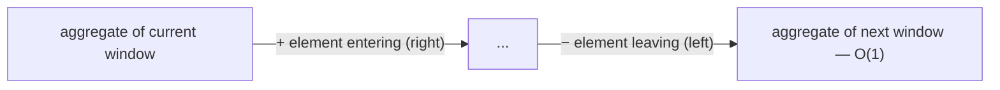

# Pattern: Fixed Sliding Window

## Why It Exists

"Find the largest sum of any `k` consecutive elements." The obvious answer tries every window of size `k` and sums each one — but each window of `k` numbers costs `k` additions, and there are about `n` windows, so that's `O(n·k)`.

Look at what's wasted. When the window slides one step right, the new window shares `k − 1` elements with the old one — you just re-added all of them from scratch. Only **two** things actually changed: one element entered on the right, one left on the left.

So don't recompute — **update**. Keep a running aggregate and, on each slide, add the entering element and subtract the leaving one. Two `O(1)` operations replace a full `O(k)` recompute, and the whole sweep drops to `O(n)`.

## See It Work

Largest sum of `k` consecutive values. The first window is summed once; every slide is a single add-and-subtract. Pick a case below, **Run** it, then **Visualise**. The first lines just read the case's `arr` and `k` — the pattern is the loop.

> ▶ Run it against a case, then click **Visualise** — after the first window, each step adds `arr[i]` (entering) and subtracts `arr[i-k]` (leaving).

```python run viz=array viz-root=arr
import ast

arr = ast.literal_eval(input())     # the test case's arr
k = int(input())                    # the test case's k
window = sum(arr[:k])               # first window's sum — computed once
best = window
for i in range(k, len(arr)):        # slide one step at a time
    window += arr[i] - arr[i - k]   # + entering element, − leaving element  (O(1))
    best = max(best, window)
print(best)
```

```java run viz=array viz-root=arr
import java.util.*;

public class Main {
  public static void main(String[] args) {
    Scanner sc = new Scanner(System.in);
    int[] arr = parseIntArray(sc.nextLine());   // the test case's arr
    int k = Integer.parseInt(sc.nextLine().trim());  // the test case's k
    int window = 0;
    for (int i = 0; i < k; i++) window += arr[i];     // first window's sum — once
    int best = window;
    for (int i = k; i < arr.length; i++) {            // slide one step at a time
      window += arr[i] - arr[i - k];                  // + entering, − leaving  (O(1))
      best = Math.max(best, window);
    }
    System.out.println(best);
  }

  // "[1, 2, 3]" → {1, 2, 3} — reads the test case's arr
  static int[] parseIntArray(String line) {
    String inner = line.replaceAll("[\\[\\]\\s]", "");
    if (inner.isEmpty()) return new int[0];
    String[] parts = inner.split(",");
    int[] out = new int[parts.length];
    for (int i = 0; i < parts.length; i++) out[i] = Integer.parseInt(parts[i]);
    return out;
  }
}
```

```testcases
{
  "args": [
    { "id": "arr", "label": "arr", "type": "int[]", "placeholder": "[2, 1, 5, 1, 3, 2]" },
    { "id": "k", "label": "k", "type": "int", "placeholder": "3" }
  ],
  "cases": [
    { "args": { "arr": "[2, 1, 5, 1, 3, 2]", "k": "3" }, "expected": "9" },
    { "args": { "arr": "[1, 2, 3, 4, 5]", "k": "2" }, "expected": "9" },
    { "args": { "arr": "[5]", "k": "1" }, "expected": "5" },
    { "args": { "arr": "[-1, -2, -3, -4]", "k": "2" }, "expected": "-3" }
  ]
}
```

## How It Works

Two markers, `start` and `end`, bound a window of fixed width `k`, and an **aggregate** variable holds its current value. The window only ever moves *forward*: each step advances both markers by one, and the aggregate is repaired in place — **add what entered, remove what left**.



<p align="center"><strong>slide the fixed window one step by adding the element entering on the right and subtracting the one leaving on the left; the running value updates in <code>O(1)</code>, no recompute.</strong></p>

That turns `O(n·k)` into `O(n)` time, `O(1)` space. But the trick only works for a **slidable** aggregate — one where a single element's contribution can be added *and* removed in `O(1)`, independently of the rest:

- **Slidable** ✓ — sum, count-of-condition, average (sum / k). A running max/min is slidable too, but needs a *monotonic deque* to do the removal in amortized `O(1)`.
- **Not slidable** ✗ — the **median**. It depends on the elements' *relative rank*, so when one leaves and one enters you can't patch it arithmetically; you'd re-sort or maintain a two-heap / balanced-BST structure at `O(log k)` per step. The moment your update costs `O(k)`, you're back to brute force.

### Key Takeaway

For a fixed window of size `k`, maintain a running aggregate and update it with one add + one subtract per slide — `O(n)` instead of `O(n·k)` — provided the aggregate is *slidable* (an element's contribution adds and removes in `O(1)`).

## Trace It

`k = 3` over `[2, 1, 5, 1, 3, 2]`:

| window | computation | sum |
|---|---|---|
| `[2,1,5]` | summed once | 8 |
| `[1,5,1]` | `8 + 1 − 2` | 7 |
| `[5,1,3]` | `7 + 3 − 1` | **9** |
| `[1,3,2]` | `9 + 2 − 5` | 6 |

Before you read on: computing the last window's sum from the third — how many additions did it take?

One add and one subtract — not three. After the very first window, *every* later sum costs the same two operations regardless of how big `k` is. That constant-per-step update, repeated `n − k` times, is the entire `O(n)` win.

## Your Turn

Implement the reusable shape yourself — `max_window_sum(arr, k)`: sum the first window once, then slide one step at a time, repairing the running sum with `+ entering − leaving`, and track the largest sum seen.

```python run viz=array viz-root=arr
import ast

def max_window_sum(arr, k):
    # Your code goes here — sum the first window, then slide:
    # window += arr[i] - arr[i - k], tracking the best sum.
    return 0

arr = ast.literal_eval(input())     # the test case's arr
k = int(input())                    # the test case's k
print(max_window_sum(arr, k))
```

```java run viz=array viz-root=arr
import java.util.*;

public class Main {
  static int maxWindowSum(int[] arr, int k) {
    // Your code goes here — sum the first window, then slide:
    // window += arr[i] - arr[i - k], tracking the best sum.
    return 0;
  }

  public static void main(String[] args) {
    Scanner sc = new Scanner(System.in);
    int[] arr = parseIntArray(sc.nextLine());
    int k = Integer.parseInt(sc.nextLine().trim());
    System.out.println(maxWindowSum(arr, k));
  }

  static int[] parseIntArray(String line) {
    String inner = line.replaceAll("[\\[\\]\\s]", "");
    if (inner.isEmpty()) return new int[0];
    String[] parts = inner.split(",");
    int[] out = new int[parts.length];
    for (int i = 0; i < parts.length; i++) out[i] = Integer.parseInt(parts[i]);
    return out;
  }
}
```

```testcases
{
  "args": [
    { "id": "arr", "label": "arr", "type": "int[]", "placeholder": "[2, 1, 5, 1, 3, 2]" },
    { "id": "k", "label": "k", "type": "int", "placeholder": "3" }
  ],
  "cases": [
    { "args": { "arr": "[2, 1, 5, 1, 3, 2]", "k": "3" }, "expected": "9" },
    { "args": { "arr": "[1, 2, 3, 4, 5]", "k": "2" }, "expected": "9" },
    { "args": { "arr": "[4, 4, 5, 6, 4]", "k": "3" }, "expected": "15" },
    { "args": { "arr": "[5]", "k": "1" }, "expected": "5" },
    { "args": { "arr": "[-1, -2, -3, -4]", "k": "2" }, "expected": "-3" }
  ]
}
```

<details>
<summary>Editorial</summary>

Sum the first `k` elements once to seed `window`, then for each later index slide one step: add the entering element `arr[i]` and subtract the leaving one `arr[i - k]`. Every slide is two `O(1)` operations regardless of `k`, so the whole pass is `O(n)` time, `O(1)` space — and `best` carries the largest window sum seen.

```python solution time=O(n) space=O(1)
import ast

def max_window_sum(arr, k):
    window = sum(arr[:k])               # first window
    best = window
    for i in range(k, len(arr)):
        window += arr[i] - arr[i - k]   # slide: + entering, − leaving
        best = max(best, window)
    return best

arr = ast.literal_eval(input())     # the test case's arr
k = int(input())                    # the test case's k
print(max_window_sum(arr, k))
```

```java solution
import java.util.*;

public class Main {
  static int maxWindowSum(int[] arr, int k) {
    int window = 0;
    for (int i = 0; i < k; i++) window += arr[i];       // first window
    int best = window;
    for (int i = k; i < arr.length; i++) {
      window += arr[i] - arr[i - k];                     // slide: + entering, − leaving
      best = Math.max(best, window);
    }
    return best;
  }

  public static void main(String[] args) {
    Scanner sc = new Scanner(System.in);
    int[] arr = parseIntArray(sc.nextLine());
    int k = Integer.parseInt(sc.nextLine().trim());
    System.out.println(maxWindowSum(arr, k));
  }

  static int[] parseIntArray(String line) {
    String inner = line.replaceAll("[\\[\\]\\s]", "");
    if (inner.isEmpty()) return new int[0];
    String[] parts = inner.split(",");
    int[] out = new int[parts.length];
    for (int i = 0; i < parts.length; i++) out[i] = Integer.parseInt(parts[i]);
    return out;
  }
}
```

</details>

## Reflect & Connect

Drill the family in **Practice** — [Subarray Size Equals K](/cortex/data-structures-and-algorithms/linear-structures/arrays/pattern-fixed-sliding-window/problems/subarray-size-equals-k) and [Maximum Ones](/cortex/data-structures-and-algorithms/linear-structures/arrays/pattern-fixed-sliding-window/problems/maximum-ones).

The fixed window is the simplest "stop recomputing, start maintaining" pattern, and it generalizes:

- **Any slidable aggregate** — sum, count, average, or max/min (with a monotonic deque) over every length-`k` span: signal smoothing (moving average), rate limiting, "best `k`-minute stretch."
- **The slidable test is the real lesson** — before reaching for it, ask "can one element's contribution be added and removed in `O(1)`?" If not (median, "number of distinct values" sometimes), you need a heavier structure and the easy `O(n)` is gone.
- **It's the rigid cousin of the variable window** — here the size is *fixed* by the problem; next, the window *grows and shrinks* based on a condition.

**Prerequisites:** [Two Pointers](/cortex/data-structures-and-algorithms/linear-structures/arrays/pattern-two-pointers/pattern).
**What's next:** let the window resize itself to satisfy a condition — the [Variable Sliding Window](/cortex/data-structures-and-algorithms/linear-structures/arrays/pattern-variable-sliding-window/pattern).

## Recall

> **Mnemonic:** *Fixed `k`: sum the first window once, then each slide is `+ entering − leaving`. `O(n)`, if the aggregate is slidable.*

| | |
|---|---|
| Update per slide | `aggregate += arr[i] − arr[i−k]` — one add, one subtract |
| Cost | `O(n)` time, `O(1)` space (vs `O(n·k)` recompute) |
| Works for | slidable aggregates: sum, count, average, max/min (deque) |
| Fails for | median / rank-based — needs `O(log k)` structure |

<details>
<summary><strong>Q:</strong> Why is the fixed window `O(n)` and not `O(n·k)`?</summary>

**A:** Each slide repairs the aggregate with one add + one subtract instead of re-summing all `k` elements.

</details>
<details>
<summary><strong>Q:</strong> What makes an aggregate "slidable"?</summary>

**A:** A single element's contribution can be added *and* removed in `O(1)`, independent of the others.

</details>
<details>
<summary><strong>Q:</strong> Why can't a sliding median use this trick?</summary>

**A:** Median depends on relative rank, so an entering/leaving element can't be patched arithmetically — you need an `O(log k)` ordered structure.

</details>
<details>
<summary><strong>Q:</strong> What two things change when the window slides one step?</summary>

**A:** Exactly one element enters on the right and one leaves on the left.

</details>

## Sources & Verify

- **cp-algorithms.com**, "Sliding Window" — the incremental-aggregate technique and its `O(n)` argument.
- **Sedgewick & Wayne**, *Algorithms*, 4th ed., §1.4 — amortized/running-total reasoning underlying the incremental update.
- The slidable-vs-not distinction (median needing a two-heap / balanced BST at `O(log k)`) is standard; both runnable blocks are verified by running.
