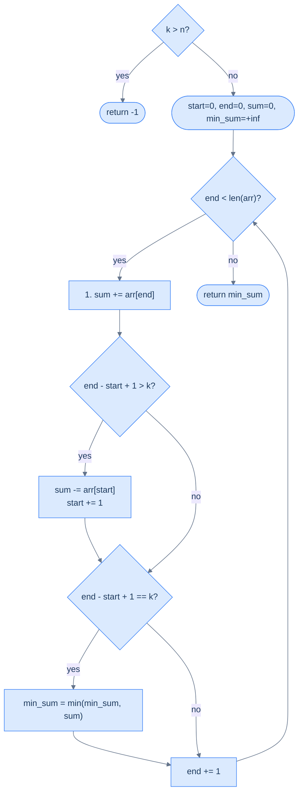

# Subarray Size Equals K

## The Problem

Given an integer array `arr` and a positive integer `k`, find the **minimum sum** among all contiguous subarrays of size exactly `k`. If no such subarray exists (i.e. `k > len(arr)`), return `-1` instead.

```
arr = [4, 4, 5, 6, 4], k = 3   →  13   (subarray [4, 4, 5])
arr = [1, 2, 3, 5],    k = 1   →   1   (subarray [1])
arr = [1, 2, 3, 5],    k = 4   →  11   (only one subarray: [1, 2, 3, 5])
arr = [1, 2],          k = 5   →  -1   (no size-5 subarray exists)
```

---

## Examples

**Example 1**
```
Input:  arr = [4, 4, 5, 6, 4], k = 3
Output: 13
Explanation: The subarray [4, 4, 5] has a minimum sum of 13 and a size of 3.
```

**Example 2**
```
Input:  arr = [1, 2, 3, 5], k = 1
Output: 1
Explanation: The subarray [1] has a minimum sum of 1 and a size of 1.
```

**Example 3**
```
Input:  arr = [1, 2, 3, 5], k = 4
Output: 11
Explanation: The subarray [1, 2, 3, 5] has a minimum sum of 11 and a size of 4.
```


<details>
<summary><h2>Applying the Diagnostic Questions</h2></summary>


| Question | Answer for Subarray Size Equals K |
|---|---|
| **Q1.** Fixed size subarray? | **Yes** — every window must have exactly `k` elements. The window never grows or shrinks to satisfy a condition. |
| **Q2.** O(1) add and remove? | **Yes** — `sum += arr[end]` to include the entering element, `sum -= arr[start]` to drop the leaving one. Both are O(1) arithmetic on a single integer. |
| **Q3.** Per-window report or single best? | **Single best** — only the minimum sum is returned, so `process` updates a running `min_sum` rather than appending to a list. |
| **Q4.** Edge cases defined? | **Yes** — `k > n` returns the sentinel `-1`; `k == n` produces one window (the whole array); `k == 1` reduces to `min(arr)`. |

</details>
<details>
<summary><h2>Intuition &amp; Brute Force</h2></summary>

### Intuition

The problem has a fixed structural property: every candidate subarray is a contiguous slice of length exactly `k`, so the search space is the `n − k + 1` valid window positions. That fixed-size constraint is what makes the fixed sliding window pattern applicable — there is no condition-driven resize to reason about, only a window that walks forward one step at a time.

The two pointers are `start` (the left edge of the current window) and `end` (the right edge). Both start at `0`; `end` advances every iteration, and `start` advances only when the window's length would exceed `k`. The running `sum` always equals the sum of `arr[start..end]`, so the per-window minimum can be compared in O(1) against a running `min_sum`.

What breaks if you use the naive nested-loop approach is the shared work: adjacent windows of size `k` overlap in `k − 1` elements, but the brute force re-adds those shared elements for every window. The cost balloons to O(N × k) — for `n = 10⁶, k = 1000`, that's a billion additions instead of a million.



<p align="center"><strong>Subarray Size Equals K — expand the window, contract if oversized, then update <code>min_sum</code> whenever the window reaches exactly size k.</strong></p>

### Brute Force: Nested Loops, O(N × k)

```python run viz=array
from typing import List

def subarray_size_equals_k_brute(arr: List[int], k: int) -> int:
    n = len(arr)
    if k > n:
        return -1
    min_sum = float("inf")
    for i in range(n - k + 1):
        window_sum = 0
        for j in range(k):
            window_sum += arr[i + j]    # Re-summed each window — that's the O(n*k) cost.
        if window_sum < min_sum:
            min_sum = window_sum
    return min_sum


print(subarray_size_equals_k_brute([4, 4, 5, 6, 4], 3))  # 13
print(subarray_size_equals_k_brute([1, 2, 3, 5], 1))     # 1
```

```java run viz=array
public class Main {
    static int subarraySizeEqualsKBrute(int[] arr, int k) {
        int n = arr.length;
        if (k > n) return -1;
        int minSum = Integer.MAX_VALUE;
        for (int i = 0; i <= n - k; i++) {
            int windowSum = 0;
            for (int j = 0; j < k; j++) windowSum += arr[i + j];
            if (windowSum < minSum) minSum = windowSum;
        }
        return minSum;
    }

    public static void main(String[] args) {
        System.out.println(subarraySizeEqualsKBrute(new int[]{4, 4, 5, 6, 4}, 3));  // 13
        System.out.println(subarraySizeEqualsKBrute(new int[]{1, 2, 3, 5}, 1));     // 1
    }
}
```


<details>
<summary><strong>Trace — arr = [4, 4, 5, 6, 4],  k = 3  (brute force)</strong></summary>

```
n=5, valid windows: i = 0, 1, 2  (n - k + 1 = 3)

i=0: 4+4+5 = 13            min_sum = 13   (initial)
i=1: 4+5+6 = 15            min_sum = 13   (4 and 5 re-summed from i=0)
i=2: 5+6+4 = 15            min_sum = 13   (5 and 6 re-summed from i=1)

Return: 13 ✓  —  total additions: 9 (3 windows × 3 elements each)
```

</details>

</details>
<details>
<summary><h2>Solution &amp; Analysis</h2></summary>

### Approach

1. **Guard the impossible case.** If `k > len(arr)`, no window of size `k` exists — return the sentinel `-1` before allocating any state.
2. **Initialise the window state.** Set `start = 0`, `end = 0`, `sum = 0` (the running aggregate), and `min_sum = +∞` (the running minimum to be replaced on the first full window).
3. **Loop while `end < len(arr)` and apply the four-step template.**
4. **Step 3.1 — Expand.** Add the entering element: `sum += arr[end]`.
5. **Step 3.2 — Contract if oversized.** If `end − start + 1 > k`, remove the leaving element with `sum -= arr[start]` and advance `start` by one.
6. **Step 3.3 — Process if full.** If `end − start + 1 == k`, update `min_sum = min(min_sum, sum)`.
7. **Step 3.4 — Advance.** Increment `end` by one and continue.
8. **Return the result.** After the loop, `min_sum` holds the smallest window sum seen — return it.

### Solution

```python run viz=array
from typing import List

class Solution:
    def subarray_size_equals_k(self, arr: List[int], k: int) -> int:

        # Edge case: If k is greater than the array size, return -1.
        if k > len(arr):
            return -1

        # To store the starting index of the subarray
        start: int = 0

        # To store the ending index of the subarray
        end: int = 0

        # To store the current subarray sum
        sum: int = 0

        # We want to find the minimum sum.
        min_sum = float("inf")

        # Sliding window to process all subarrays of size k
        while end < len(arr):

            # Add contribution of arr[end] to the current window sum
            sum += arr[end]

            # If the current subarray has more than k elements
            # then remove elements from the start of the subarray till
            # the subarray has exactly k elements
            if end - start + 1 > k:

                # Remove contribution of arr[start] as the window is now
                # too large
                sum -= arr[start]

                # Contract the window from the left
                start += 1

            # Check if the window size is exactly k
            if end - start + 1 == k:

                # Update the minimum sum
                min_sum = min(min_sum, sum)

            # Expand the window from the right
            end += 1

        return min_sum


# Examples from the problem statement
print(Solution().subarray_size_equals_k([4, 4, 5, 6, 4], 3))   # 13
print(Solution().subarray_size_equals_k([1, 2, 3, 5], 1))       # 1
print(Solution().subarray_size_equals_k([1, 2, 3, 5], 4))       # 11

# Edge cases
print(Solution().subarray_size_equals_k([5], 1))                 # 5  — single element
print(Solution().subarray_size_equals_k([3, 1], 2))              # 4  — two elements
print(Solution().subarray_size_equals_k([2, 2, 2], 3))           # 6  — all same
print(Solution().subarray_size_equals_k([10, 1, 2], 5))          # -1 — k > length
print(Solution().subarray_size_equals_k([-1, -2, -3, -4], 2))   # -7 — negatives
```

```java run viz=array
public class Main {
    static class Solution {
        public int subarraySizeEqualsK(int[] arr, int k) {

            // Edge case: If k is greater than the array size, return -1.
            if (k > arr.length) {
                return -1;
            }

            // To store the starting index of the subarray
            int start = 0;

            // To store the ending index of the subarray
            int end = 0;

            // To store the current subarray sum
            int sum = 0;

            // We want to find the minimum sum.
            int minSum = Integer.MAX_VALUE;

            // Sliding window to process all subarrays of size k
            while (end < arr.length) {

                // Add contribution of arr[end] to the current window sum
                sum += arr[end];

                // If the current subarray has more than k elements
                // then remove elements from the start of the subarray till
                // the subarray has exactly k elements
                if (end - start + 1 > k) {

                    // Remove contribution of arr[start] as the window is now
                    // too large
                    sum -= arr[start];

                    // Contract the window from the left
                    start++;
                }

                // Check if the window size is exactly k
                if (end - start + 1 == k) {

                    // Update the minimum sum
                    minSum = Math.min(minSum, sum);
                }

                // Expand the window from the right
                end++;
            }

            return minSum;
        }
    }

    public static void main(String[] args) {
        // Examples from the problem statement
        System.out.println(new Solution().subarraySizeEqualsK(new int[]{4, 4, 5, 6, 4}, 3));   // 13
        System.out.println(new Solution().subarraySizeEqualsK(new int[]{1, 2, 3, 5}, 1));       // 1
        System.out.println(new Solution().subarraySizeEqualsK(new int[]{1, 2, 3, 5}, 4));       // 11

        // Edge cases
        System.out.println(new Solution().subarraySizeEqualsK(new int[]{5}, 1));                 // 5  — single element
        System.out.println(new Solution().subarraySizeEqualsK(new int[]{3, 1}, 2));              // 4  — two elements
        System.out.println(new Solution().subarraySizeEqualsK(new int[]{2, 2, 2}, 3));           // 6  — all same
        System.out.println(new Solution().subarraySizeEqualsK(new int[]{10, 1, 2}, 5));          // -1 — k > length
        System.out.println(new Solution().subarraySizeEqualsK(new int[]{-1, -2, -3, -4}, 2));   // -7 — negatives
    }
}
```

### Dry Run — Example 1

`arr = [4, 4, 5, 6, 4]`, `k = 3`

```d3 widget=array-1d
{
  "steps": [
    {
      "nodes": [
        {
          "id": "a",
          "label": "4",
          "kind": "cell",
          "meta": [],
          "slot": 0,
          "cardId": "",
          "layoutKind": ""
        },
        {
          "id": "b",
          "label": "4",
          "kind": "cell",
          "meta": [],
          "slot": 1,
          "cardId": "",
          "layoutKind": ""
        },
        {
          "id": "c",
          "label": "5",
          "kind": "cell",
          "meta": [],
          "slot": 2,
          "cardId": "",
          "layoutKind": ""
        },
        {
          "id": "d",
          "label": "6",
          "kind": "cell",
          "meta": [],
          "slot": 3,
          "cardId": "",
          "layoutKind": ""
        },
        {
          "id": "e",
          "label": "4",
          "kind": "cell",
          "meta": [],
          "slot": 4,
          "cardId": "",
          "layoutKind": ""
        }
      ],
      "edges": [],
      "cursor": [
        {
          "name": "start",
          "target": "a",
          "color": "#3b82f6"
        },
        {
          "name": "end",
          "target": "a",
          "color": "#10b981"
        }
      ],
      "highlight": [
        "a"
      ],
      "changed": [],
      "removed": [],
      "annotation": "Expand: window = [0..0], size 1 < k. sum = 4.",
      "line": 0,
      "frames": [],
      "cardCursor": []
    },
    {
      "nodes": [
        {
          "id": "a",
          "label": "4",
          "kind": "cell",
          "meta": [],
          "slot": 0,
          "cardId": "",
          "layoutKind": ""
        },
        {
          "id": "b",
          "label": "4",
          "kind": "cell",
          "meta": [],
          "slot": 1,
          "cardId": "",
          "layoutKind": ""
        },
        {
          "id": "c",
          "label": "5",
          "kind": "cell",
          "meta": [],
          "slot": 2,
          "cardId": "",
          "layoutKind": ""
        },
        {
          "id": "d",
          "label": "6",
          "kind": "cell",
          "meta": [],
          "slot": 3,
          "cardId": "",
          "layoutKind": ""
        },
        {
          "id": "e",
          "label": "4",
          "kind": "cell",
          "meta": [],
          "slot": 4,
          "cardId": "",
          "layoutKind": ""
        }
      ],
      "edges": [],
      "cursor": [
        {
          "name": "start",
          "target": "a",
          "color": "#3b82f6"
        },
        {
          "name": "end",
          "target": "b",
          "color": "#10b981"
        }
      ],
      "highlight": [
        "a",
        "b"
      ],
      "changed": [],
      "removed": [],
      "annotation": "Expand: window = [0..1], size 2 < k. sum = 8.",
      "line": 0,
      "frames": [],
      "cardCursor": []
    },
    {
      "nodes": [
        {
          "id": "a",
          "label": "4",
          "kind": "cell",
          "meta": [],
          "slot": 0,
          "cardId": "",
          "layoutKind": ""
        },
        {
          "id": "b",
          "label": "4",
          "kind": "cell",
          "meta": [],
          "slot": 1,
          "cardId": "",
          "layoutKind": ""
        },
        {
          "id": "c",
          "label": "5",
          "kind": "cell",
          "meta": [],
          "slot": 2,
          "cardId": "",
          "layoutKind": ""
        },
        {
          "id": "d",
          "label": "6",
          "kind": "cell",
          "meta": [],
          "slot": 3,
          "cardId": "",
          "layoutKind": ""
        },
        {
          "id": "e",
          "label": "4",
          "kind": "cell",
          "meta": [],
          "slot": 4,
          "cardId": "",
          "layoutKind": ""
        }
      ],
      "edges": [],
      "cursor": [
        {
          "name": "start",
          "target": "a",
          "color": "#3b82f6"
        },
        {
          "name": "end",
          "target": "c",
          "color": "#10b981"
        }
      ],
      "highlight": [
        "a",
        "b",
        "c"
      ],
      "changed": [],
      "removed": [],
      "annotation": "Expand: window = [0..2], size 3 = k. sum = 13 → min_sum = 13.",
      "line": 0,
      "frames": [],
      "cardCursor": []
    },
    {
      "nodes": [
        {
          "id": "a",
          "label": "4",
          "kind": "cell",
          "meta": [],
          "slot": 0,
          "cardId": "",
          "layoutKind": ""
        },
        {
          "id": "b",
          "label": "4",
          "kind": "cell",
          "meta": [],
          "slot": 1,
          "cardId": "",
          "layoutKind": ""
        },
        {
          "id": "c",
          "label": "5",
          "kind": "cell",
          "meta": [],
          "slot": 2,
          "cardId": "",
          "layoutKind": ""
        },
        {
          "id": "d",
          "label": "6",
          "kind": "cell",
          "meta": [],
          "slot": 3,
          "cardId": "",
          "layoutKind": ""
        },
        {
          "id": "e",
          "label": "4",
          "kind": "cell",
          "meta": [],
          "slot": 4,
          "cardId": "",
          "layoutKind": ""
        }
      ],
      "edges": [],
      "cursor": [
        {
          "name": "start",
          "target": "b",
          "color": "#3b82f6"
        },
        {
          "name": "end",
          "target": "d",
          "color": "#10b981"
        }
      ],
      "highlight": [
        "b",
        "c",
        "d"
      ],
      "changed": [],
      "removed": [],
      "annotation": "Slide: drop arr[0]=4, add arr[3]=6. sum = 15. 15 > 13, min_sum stays 13.",
      "line": 0,
      "frames": [],
      "cardCursor": []
    },
    {
      "nodes": [
        {
          "id": "a",
          "label": "4",
          "kind": "cell",
          "meta": [],
          "slot": 0,
          "cardId": "",
          "layoutKind": ""
        },
        {
          "id": "b",
          "label": "4",
          "kind": "cell",
          "meta": [],
          "slot": 1,
          "cardId": "",
          "layoutKind": ""
        },
        {
          "id": "c",
          "label": "5",
          "kind": "cell",
          "meta": [],
          "slot": 2,
          "cardId": "",
          "layoutKind": ""
        },
        {
          "id": "d",
          "label": "6",
          "kind": "cell",
          "meta": [],
          "slot": 3,
          "cardId": "",
          "layoutKind": ""
        },
        {
          "id": "e",
          "label": "4",
          "kind": "cell",
          "meta": [],
          "slot": 4,
          "cardId": "",
          "layoutKind": ""
        }
      ],
      "edges": [],
      "cursor": [
        {
          "name": "start",
          "target": "c",
          "color": "#3b82f6"
        },
        {
          "name": "end",
          "target": "e",
          "color": "#10b981"
        }
      ],
      "highlight": [
        "c",
        "d",
        "e"
      ],
      "changed": [],
      "removed": [],
      "annotation": "Slide: drop arr[1]=4, add arr[4]=4. sum = 15. 15 > 13, min_sum stays 13.",
      "line": 0,
      "frames": [],
      "cardCursor": []
    },
    {
      "nodes": [
        {
          "id": "a",
          "label": "4",
          "kind": "cell",
          "meta": [],
          "slot": 0,
          "cardId": "",
          "layoutKind": ""
        },
        {
          "id": "b",
          "label": "4",
          "kind": "cell",
          "meta": [],
          "slot": 1,
          "cardId": "",
          "layoutKind": ""
        },
        {
          "id": "c",
          "label": "5",
          "kind": "cell",
          "meta": [],
          "slot": 2,
          "cardId": "",
          "layoutKind": ""
        },
        {
          "id": "d",
          "label": "6",
          "kind": "cell",
          "meta": [],
          "slot": 3,
          "cardId": "",
          "layoutKind": ""
        },
        {
          "id": "e",
          "label": "4",
          "kind": "cell",
          "meta": [],
          "slot": 4,
          "cardId": "",
          "layoutKind": ""
        }
      ],
      "edges": [],
      "cursor": [],
      "highlight": [],
      "changed": [],
      "removed": [],
      "annotation": "end past array bound — loop ends. Return min_sum = 13.",
      "line": 0,
      "frames": [],
      "cardCursor": []
    }
  ],
  "title": "Fixed sliding window k = 3 on [4, 4, 5, 6, 4] — finding min sum"
}
```

<p align="center"><strong>Fixed sliding window of size <code>k = 3</code> on <code>[4, 4, 5, 6, 4]</code> — three valid windows produce sums 13, 15, 15; <code>min_sum = 13</code> after the first full window.</strong></p>

<details>
<summary><strong>Trace — arr = [4, 4, 5, 6, 4],  k = 3</strong></summary>

```
start=0, end=0, sum=0, min_sum=∞

end=0: ① sum += arr[0]=4 → sum=4.  size=1 < k.
end=1: ① sum += arr[1]=4 → sum=8.  size=2 < k.
end=2: ① sum += arr[2]=5 → sum=13. size=3 = k → min_sum = 13.
end=3: ① sum += arr[3]=6 → sum=19. ② size=4 > k → sum -= arr[0]=4 → sum=15, start=1.
       ③ size=3 = k → min_sum = min(13, 15) = 13.
end=4: ① sum += arr[4]=4 → sum=19. ② size=4 > k → sum -= arr[1]=4 → sum=15, start=2.
       ③ size=3 = k → min_sum = min(13, 15) = 13.
end=5: end >= n=5 → loop exits.

Return: 13 ✓
```

</details>

### Complexity Analysis

| | Complexity | Reasoning |
|---|---|---|
| **Time** | O(N) | `end` visits each element once; `start` moves at most N times across all iterations |
| **Space** | O(1) | Two index variables, one running sum, one min_sum |

Versus brute force O(N × k) — the sliding window replaces the inner loop of k additions with one add + one subtract per slide.

### Edge Cases

| Scenario | Input | Output | Note |
|---|---|---|---|
| `k > n` | `[1, 2]`, k=5 | `-1` | No window of size k fits — return sentinel |
| `k == n` | `[1, 2, 3]`, k=3 | `6` | Only one window: the whole array |
| `k == 1` | `[3, 1, 4, 1, 5]`, k=1 | `1` | Each element is its own window — answer is `min(arr)` |
| All identical | `[5, 5, 5, 5]`, k=2 | `10` | Every window sums to the same value |
| Negative elements | `[-1, 2, -1, 2]`, k=2 | `1` | Works identically — smallest pair is `(-1, 2)` or `(2, -1)`, both sum to 1 |
| Single element | `[5]`, k=1 | `5` | One window, one element |

</details>
<details>
<summary><h2>Key Takeaway</h2></summary>


Subarray Size Equals K is the simplest variant of the pattern — a single scalar `sum` aggregate, a running `min_sum`, and an explicit `k > n` guard as the only special case. Every other edge falls out of the loop body for free.

</details>
