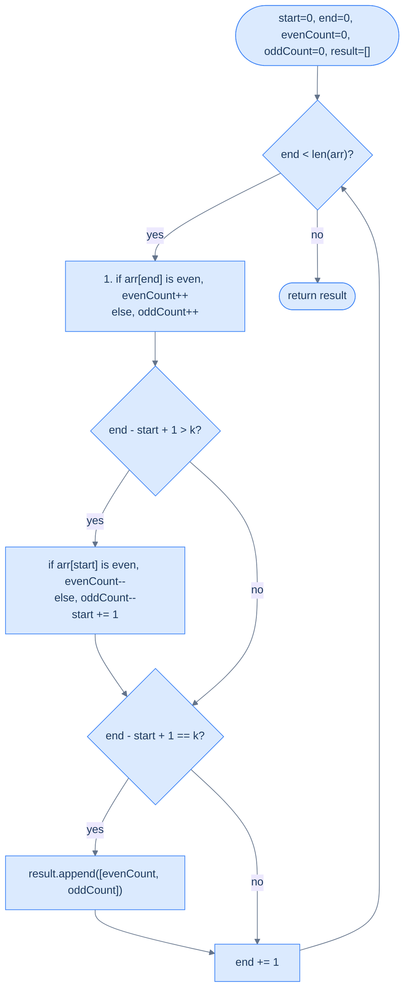

# Even Odd Count

## The Problem

Given an integer array `arr` and a positive integer `k`, return the **count of even and odd numbers, respectively**, in every subarray of size `k`. The result is a list of `[evenCount, oddCount]` pairs — one pair per window position, in order.

```
arr = [4, 4, 5, 1, 4], k = 3   →  [[2, 1], [1, 2], [1, 2]]
arr = [1, 2, 3, 5],    k = 1   →  [[0, 1], [1, 0], [0, 1], [0, 1]]
arr = [1, 2, 3, 5],    k = 4   →  [[1, 3]]
```

---

## Examples

**Example 1**
```
Input:  arr = [4, 4, 5, 1, 4], k = 3
Output: [[2, 1], [1, 2], [1, 2]]
Explanation: Above is the count of even and odd numbers in each subarray of
             size 3:
               Window [4, 4, 5]: 2 even (4, 4), 1 odd (5)
               Window [4, 5, 1]: 1 even (4),    2 odd (5, 1)
               Window [5, 1, 4]: 1 even (4),    2 odd (5, 1)
```

**Example 2**
```
Input:  arr = [1, 2, 3, 5], k = 1
Output: [[0, 1], [1, 0], [0, 1], [0, 1]]
Explanation: Each window is a single element — 1 odd, 2 even, 3 odd, 5 odd.
```

**Example 3**
```
Input:  arr = [1, 2, 3, 5], k = 4
Output: [[1, 3]]
Explanation: One window — the whole array — has 1 even (2) and 3 odd (1, 3, 5).
```


<details>
<summary><h2>Applying the Diagnostic Questions</h2></summary>


| Question | Answer for Even Odd Count |
|---|---|
| **Q1.** Fixed size subarray? | **Yes** — every window has exactly `k` elements; the parity counts are computed once per valid window. |
| **Q2.** O(1) add and remove? | **Yes** — a single `% 2` check classifies the entering element into one of two counters; the remove side mirrors it. Both updates are O(1). |
| **Q3.** Per-window report or single best? | **Per-window report** — the answer is a list of `[evenCount, oddCount]` pairs, one per window. The `process` step appends a tuple to `result`. |
| **Q4.** Edge cases defined? | **Yes** — for `n < k`, `result` is empty; `k == n` produces one pair; `k == 1` produces one pair per element, always `[1, 0]` or `[0, 1]`. |

</details>
<details>
<summary><h2>Intuition</h2></summary>


The structural property is the same per-window report shape as Negative Window: count something over contiguous slices of fixed size `k` and emit a result for every window position. What is new here is that the "something" is a **pair** of counts — evens and odds — that partition the window. Every element contributes to exactly one of the two counters, so the two counters together always sum to `k` once the window is full.

The two pointers are `start` and `end`, with the aggregate split across two integers: `even_count` and `odd_count`. When `end` advances, the entering element bumps whichever counter matches its parity (`arr[end] % 2 == 0` → evens, else odds). When `start` advances on a contraction, the leaving element decrements the matching counter. Each per-slide update is still O(1) — one parity check and one increment per side.

What breaks if you use the naive nested-loop approach is the familiar O(N × k) cost: every window re-classifies all `k` elements, even though `k − 1` of them are shared with the previous window. The sliding window keeps the running pair of counters and updates them in O(1) per step, giving an O(N) sweep with O(N − k + 1) result space.



<p align="center"><strong>Even Odd Count — two counters slide together; the full-size window appends <code>[evenCount, oddCount]</code> to the result.</strong></p>

</details>
<details>
<summary><h2>Solution &amp; Analysis</h2></summary>

### Approach

1. **Initialise the window state.** Set `start = 0`, `end = 0`, `even_count = 0`, `odd_count = 0`, and `result = []`.
2. **Loop while `end < len(arr)` and apply the four-step template.**
3. **Step 3.1 — Expand.** If `arr[end] % 2 == 0`, increment `even_count`; otherwise increment `odd_count`. Exactly one counter changes per entering element.
4. **Step 3.2 — Contract if oversized.** If `end − start + 1 > k`, check `arr[start]`'s parity and decrement the matching counter. Then advance `start` by one.
5. **Step 3.3 — Process if full.** If `end − start + 1 == k`, append the tuple `(even_count, odd_count)` to `result`.
6. **Step 3.4 — Advance.** Increment `end` by one and continue.
7. **Return the result.** After the loop, `result` holds exactly `n − k + 1` parity pairs — one per window position, in left-to-right order.

### Solution

```python run viz=array viz-root=result
from typing import List, Tuple

class Solution:
    def even_odd_count(
        self, arr: List[int], k: int
    ) -> List[Tuple[int, int]]:

        # To store the starting index of the subarray
        start = 0

        # To store the ending index of the subarray
        end = 0

        # To store the current count of even numbers in the window
        even_count = 0

        # To store the current count of odd numbers in the window
        odd_count = 0

        # To store the result as pairs {evenCount, oddCount}
        result: List[Tuple[int, int]] = []

        # Loop through the array
        while end < len(arr):

            # Add the current element to the respective count
            if arr[end] % 2 == 0:
                even_count += 1
            else:
                odd_count += 1

            # If the current subarray has more than k elements
            # then shrink it from the start
            if end - start + 1 > k:

                # Remove the contribution of arr[start]
                if arr[start] % 2 == 0:
                    even_count -= 1
                else:
                    odd_count -= 1

                # Move the start pointer forward
                start += 1

            # If the current subarray has exactly k elements
            # then add the counts to the result
            if end - start + 1 == k:
                result.append((even_count, odd_count))

            # Move the end pointer forward
            end += 1

        return result


# Examples from the problem statement
print(Solution().even_odd_count([4, 4, 5, 1, 4], 3))    # [(2, 1), (1, 2), (1, 2)]
print(Solution().even_odd_count([1, 2, 3, 5], 1))        # [(0, 1), (1, 0), (0, 1), (0, 1)]
print(Solution().even_odd_count([1, 2, 3, 5], 4))        # [(1, 3)]

# Edge cases
print(Solution().even_odd_count([2], 1))                  # [(1, 0)]  — single even
print(Solution().even_odd_count([1], 1))                  # [(0, 1)]  — single odd
print(Solution().even_odd_count([2, 4], 2))               # [(2, 0)]  — all even
print(Solution().even_odd_count([1, 3, 5], 2))            # [(0, 2), (0, 2)]  — all odd
print(Solution().even_odd_count([2, 2, 2, 2], 3))         # [(3, 0), (3, 0)]  — all same even
```

```java run viz=array viz-root=result
import java.util.*;

public class Main {
    static class Solution {
        public List<List<Integer>> evenOddCount(int[] arr, int k) {

            // To store the starting index of the subarray
            int start = 0;

            // To store the ending index of the subarray
            int end = 0;

            // To store the current count of even numbers in the window
            int evenCount = 0;

            // To store the current count of odd numbers in the window
            int oddCount = 0;

            // To store the result as lists {evenCount, oddCount}
            List<List<Integer>> result = new ArrayList<>();

            // Loop through the array
            while (end < arr.length) {

                // Add the current element to the respective count
                if (arr[end] % 2 == 0) {
                    evenCount++;
                } else {
                    oddCount++;
                }

                // If the current subarray has more than k elements
                // then shrink it from the start
                if (end - start + 1 > k) {

                    // Remove the contribution of arr[start]
                    if (arr[start] % 2 == 0) {
                        evenCount--;
                    } else {
                        oddCount--;
                    }

                    // Move the start pointer forward
                    start++;
                }

                // If the current subarray has exactly k elements
                // then add the counts to the result
                if (end - start + 1 == k) {
                    result.add(List.of(evenCount, oddCount));
                }

                // Move the end pointer forward
                end++;
            }

            return result;
        }
    }

    public static void main(String[] args) {
        // Examples from the problem statement
        System.out.println(new Solution().evenOddCount(new int[]{4, 4, 5, 1, 4}, 3));    // [[2, 1], [1, 2], [1, 2]]
        System.out.println(new Solution().evenOddCount(new int[]{1, 2, 3, 5}, 1));        // [[0, 1], [1, 0], [0, 1], [0, 1]]
        System.out.println(new Solution().evenOddCount(new int[]{1, 2, 3, 5}, 4));        // [[1, 3]]

        // Edge cases
        System.out.println(new Solution().evenOddCount(new int[]{2}, 1));                  // [[1, 0]]  — single even
        System.out.println(new Solution().evenOddCount(new int[]{1}, 1));                  // [[0, 1]]  — single odd
        System.out.println(new Solution().evenOddCount(new int[]{2, 4}, 2));               // [[2, 0]]  — all even
        System.out.println(new Solution().evenOddCount(new int[]{1, 3, 5}, 2));            // [[0, 2], [0, 2]]  — all odd
        System.out.println(new Solution().evenOddCount(new int[]{2, 2, 2, 2}, 3));         // [[3, 0], [3, 0]]  — all same even
    }
}
```

### Dry Run — Example 1

`arr = [4, 4, 5, 1, 4]`, `k = 3`

<details>
<summary><strong>Trace — arr = [4, 4, 5, 1, 4],  k = 3</strong></summary>

```
start=0, end=0, even_count=0, odd_count=0, result=[]

end=0: ① arr[0]=4 even → even=1, odd=0. size=1, not k.
end=1: ① arr[1]=4 even → even=2, odd=0. size=2, not k.
end=2: ① arr[2]=5 odd  → even=2, odd=1. ③ size=3==k → result=[(2, 1)].   Window [4, 4, 5]
end=3: ① arr[3]=1 odd  → even=2, odd=2.
       ② size=4>k → arr[0]=4 even → even=1, start=1.
       ③ size=3==k → result=[(2, 1), (1, 2)].   Window [4, 5, 1]
end=4: ① arr[4]=4 even → even=2, odd=2.
       ② size=4>k → arr[1]=4 even → even=1, start=2.
       ③ size=3==k → result=[(2, 1), (1, 2), (1, 2)].   Window [5, 1, 4]
end=5: end >= n=5 → loop exits.

Return: [(2, 1), (1, 2), (1, 2)] ✓
```

</details>

### Result Size

The result always has exactly `n − k + 1` pairs — one per valid window. For `n=5, k=3`: `5 − 3 + 1 = 3` windows, 3 pairs.

### Complexity Analysis

| | Complexity | Reasoning |
|---|---|---|
| **Time** | O(N) | `end` visits each element once; `start` moves at most N times total |
| **Space** | O(N − k + 1) | The result holds one pair per window; O(1) working space beyond that |

### Edge Cases

| Scenario | Input | Output | Note |
|---|---|---|---|
| All even | `[2, 4, 6, 8]`, k=2 | `[[2, 0], [2, 0], [2, 0]]` | Every window has 0 odd |
| All odd | `[1, 3, 5, 7]`, k=2 | `[[0, 2], [0, 2], [0, 2]]` | Every window has 0 even |
| k == n | `[1, 2, 3, 4]`, k=4 | `[[2, 2]]` | One window: the whole array |
| k == 1 | `[1, 2, 3, 5]`, k=1 | `[[0, 1], [1, 0], [0, 1], [0, 1]]` | Each element is its own window |
| Single even | `[2]`, k=1 | `[[1, 0]]` | One window, one even, zero odd |
| Single odd | `[3]`, k=1 | `[[0, 1]]` | One window, zero even, one odd |

</details>
<details>
<summary><h2>Comparison: All Four Fixed Sliding Window Problems</h2></summary>


| Problem | Aggregate | Add operation | Remove operation | Process step |
|---|---|---|---|---|
| **Subarray Size = k** | Sum | `+= arr[end]` | `-= arr[start]` | `min_sum = min(min_sum, sum)` |
| **Maximum Ones** | Count of 1s | `+= 1 if arr[end] == 1` | `-= 1 if arr[start] == 1` | `max_ones = max(max_ones, count_ones)` |
| **Negative Window** | Count of negatives | `+= 1 if arr[end] < 0` | `-= 1 if arr[start] < 0` | `result.append(negative_count)` |
| **Even Odd Count** | (evenCount, oddCount) | `++ even or ++ odd` per parity | `-- even or -- odd` per parity | `result.append([even, odd])` |

All four use the same template. Only the aggregate definition and the process step differ.

</details>
<details>
<summary><h2>Key Takeaway</h2></summary>


Even Odd Count is the **multi-aggregate** variant: the window tracks two independent counters at once and emits them as a tuple. The mechanics are unchanged from Negative Window — only the aggregate's type changes from `int` to a `(int, int)` pair partitioned by predicate.

</details>
