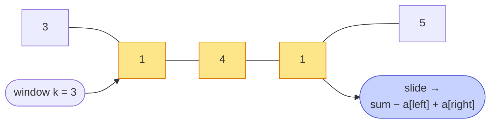

# Memorize: Fixed Sliding Window

## In a Hurry?

- **One-Line Idea**: Slide a window of fixed size `k` across the array; on each step add the entering element and subtract the leaving one to maintain the aggregate in `O(1)`.
- **Complexities**: `O(n)` time, `O(1)` extra space — where `n` is the array length and `k` is the window size (the result list is excluded; per-window-report variants add `O(n − k + 1)` for the result).
- **When to Use**: The problem asks for a value computed over every (or the best) contiguous subarray of a **fixed** size `k`, and the aggregate can be updated incrementally in `O(1)` when one element enters and one leaves.

---

## One-Line Mnemonic

**"Add the joiner, drop the leaver — never re-sum the middle."**

The image is a conveyor belt of identical-width buckets passing under a counter that only registers what crosses the entry sensor and what crosses the exit sensor. Nothing in the middle is ever recounted.

---

## Real-World Analogy

Picture a train car with exactly four seats moving along a track. As the train inches forward, exactly one new passenger boards at the front door and exactly one passenger steps off at the back door. The conductor's running headcount changes by those two people only — never by recounting every seat. That is the entire pattern: the window is the car, `k` is the seat count, and the aggregate is the headcount maintained through one addition and one subtraction per step.

---

## Visual Summary



<p align="center"><strong>A window of fixed size k slides one step at a time; each move drops the leftmost value and adds the new rightmost — O(1) per step — so the whole scan is O(n), not O(n·k).</strong></p>

---

## Pattern Recognition Triggers

The problem fits fixed sliding window when **all four** of the following hold. These are the same questions the pattern's Recognition Checklist asks.

- The value being computed runs over **contiguous subarrays of a fixed size `k`** — the size is a constraint, not a goal to satisfy.
- The aggregate can be **incrementally updated in `O(1)`** when one element enters from the right and one leaves from the left.
- The required output is either a **single best window** (min, max, count of qualifying windows) or a **per-window report** (one value per window position, length `n − k + 1`).
- The edge cases `k > n`, `k == n`, and `k == 1` either have defined behaviour in the problem spec or are handled trivially by the loop body.

Common surface signals: "find the maximum/minimum sum of any subarray of size k," "count something in every subarray of size k," "return the average / mode / parity counts for every window of size k." If the problem fixes the window size in the statement, reach for this pattern first.

---

## Don't Confuse With

| | **Fixed Sliding Window (this pattern)** | **Variable Sliding Window** |
|---|---|---|
| **Window size** | Always exactly `k` — given in the input | Grows or shrinks to satisfy a condition |
| **Loop shape** | Single `while end < n` with size guards | Inner `while` that contracts `start` while a condition holds |
| **Loop invariant** | The window is always `≤ k`; process only when `== k` | The window always satisfies (or is one element over) a running condition |
| **Problem shape** | "every / best subarray of size `k`" | "longest / shortest / count of subarrays satisfying condition C" |
| **When this goes wrong** | You start writing an inner `while` to shrink the window past size `k` → wrong pattern, the problem actually has a condition, not a fixed size — use variable sliding window | You start guarding `if end − start + 1 > k` for a known fixed `k` → wrong pattern, the problem actually fixes the size — use fixed sliding window |

Both patterns share the `start`/`end` notation and the "add the joiner, drop the leaver" mechanic, but diverge on what controls the leaver: a hard size constraint here, a running condition there.

---

## Template Code

```python
# Fixed sliding window — generic skeleton.
def fixed_sliding_window(arr, k):
    start = end = 0
    aggregate = 0          # initial value depends on the problem
    # result = ...          # only for per-window-report variants

    while end < len(arr):
        # Step 3.1 — Expand: include arr[end] in the aggregate.
        aggregate = f_add(aggregate, arr[end])

        # Step 3.2 — Contract if oversized: drop arr[start], advance start.
        if end - start + 1 > k:
            aggregate = f_remove(aggregate, arr[start])
            start += 1

        # Step 3.3 — Process if full: extremum-update OR result.append().
        if end - start + 1 == k:
            process(aggregate)

        # Step 3.4 — Advance the right edge.
        end += 1
```

Three knobs change per problem:

- **`f_add` / `f_remove`** — how an element contributes to (or is undone from) the aggregate. Examples: `+= x` / `-= x` for sum, `+= (x == 1)` / `-= (x == 1)` for a conditional counter, `evenCount += 1` *or* `oddCount += 1` for a parity-split pair.
- **The aggregate's type** — scalar (sum / count) for single-aggregate problems, tuple or small struct for multi-aggregate problems like Even Odd Count.
- **The `process` step** — update a running extremum (`max_ones = max(max_ones, count)`) for single-best problems, or append to `result` for per-window-report problems.

---

## Common Mistakes

- **Processing the window before contracting it**:
  - *What*: writing the size check as `if end − start + 1 == k: process(...)` *before* the `> k` shrink. The first iteration where `end == k` then runs `process` on a window of size `k + 1`.
  - *Why*: the contract step exists to bring the window back down to exactly `k`; running `process` before it means you sometimes evaluate an oversized window.
  - *Fix*: keep the canonical order — Expand (Step 3.1) → Contract if `> k` (Step 3.2) → Process if `== k` (Step 3.3) → Advance (Step 3.4). The order is not negotiable.
- **Forgetting the `k > n` guard for "single best" problems**:
  - *What*: a problem like Subarray Size Equals K that defines a sentinel return (`-1`) when no window of size `k` exists. Without the guard, `min_sum` stays at `+∞` and the function returns garbage.
  - *Why*: the loop body only updates `min_sum` when the window reaches size `k`; if `k > n`, that branch never fires.
  - *Fix*: check `if k > len(arr): return SENTINEL` at the top, or initialise the extremum to a value the problem treats as "no answer."
- **Re-summing the window from scratch inside the loop**:
  - *What*: writing `sum = sum(arr[start:end+1])` inside the `while`, often because the inner slice is "cleaner to read."
  - *Why*: that slice is `O(k)`, so the loop becomes `O(N × k)` — exactly the brute-force cost the pattern is supposed to eliminate.
  - *Fix*: maintain the aggregate incrementally with `f_add` and `f_remove`. Never recompute over the whole window inside the loop.
- **Confusing "per-window report" length with `n`**:
  - *What*: pre-allocating `result = [0] * n` for a per-window-report problem (Negative Window, Even Odd Count) and indexing into it with `end`.
  - *Why*: there are only `n − k + 1` valid windows, not `n` — the first `k − 1` positions are partial windows that produce no output.
  - *Fix*: either `result = []` and `result.append(...)` inside Step 3.3, or pre-allocate exactly `n − k + 1` slots.
- **Tracking the aggregate twice — once with `f_add`, once with a full recompute on report**:
  - *What*: maintaining a running `sum` correctly, but then writing `result.append(sum(arr[start:end+1]))` inside Step 3.3 "to be safe."
  - *Why*: that defeats the entire pattern — every report becomes `O(k)`, so the total cost is `O(N × k)`.
  - *Fix*: trust the running aggregate. Report it directly: `result.append(sum)` (or `result.append((even_count, odd_count))`).

---

## Minimum Viable Example

Sum of every window of size `3` on `[1, 2, 3, 4]`:

```
[1, 2, 3, 4]   end=2, start=0 → size 3 → sum = 1+2+3 = 6      → result = [6]
[1, 2, 3, 4]   end=3 → add 4 → size 4 > k → drop 1 → sum = 9  → result = [6, 9]
end past n − 1 → loop exits; result = [6, 9]  (n − k + 1 = 2 windows)
```

Four elements, three lines, the complete pattern.

---

## Quick Recall

**Q: What is the canonical four-step order inside the loop body?**
A: Step 3.1 Expand → Step 3.2 Contract-if-oversized → Step 3.3 Process-if-full → Step 3.4 Advance.

**Q: What time and space complexity does fixed sliding window achieve when the aggregate update is `O(1)`?**
A: `O(n)` time and `O(1)` extra space — `O(n − k + 1)` extra if the variant emits a per-window result.

**Q: What property must the aggregate function have for this pattern to apply?**
A: It must support an `O(1)` `f_add` (include the entering element) and an `O(1)` `f_remove` (undo the leaving element). Sum, count, product, and frequency-map updates qualify; median, mode, and max do not.

**Q: How many valid windows does an array of length `n` have for window size `k`?**
A: Exactly `n − k + 1`. The per-window-report variants emit a result of that length.

**Q: When does the `process` step append to a list vs update a running extremum?**
A: Append when the problem asks for the value at *every* window position (Negative Window, Even Odd Count); update a running extremum when the problem asks for a single best window (Subarray Size Equals K, Maximum Ones).

**Q: What's the symptom that you've reached for fixed sliding window when you should have used variable sliding window?**
A: You catch yourself writing an inner `while` to shrink the window past size `k`, or you find the problem's "size" is actually a condition (sum ≤ target, distinct ≤ K, etc.) — that's variable sliding window territory.
