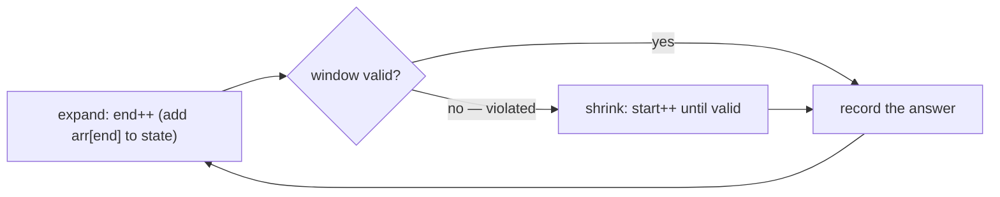

# Pattern: Variable Sliding Window

## Why It Exists

The fixed window had a size handed to you: `k`. But many problems set a *condition* instead of a size — "the **longest** run you can make all-ones by flipping at most one zero," "the **shortest** subarray whose sum reaches a target," "the longest substring with no repeats." Now the best length isn't known up front; it could be 1, or the whole array.

The brute force re-examines every start/end pair — `O(n²)`. But there's structure to exploit: as you extend the window to the right, it only gets "worse" with respect to the condition, and the fix is always to drop elements from the *left*. So let the window **breathe** — grow on the right, and when it breaks the rule, shrink from the left until it's valid again. Because neither end ever moves backward, the whole thing is `O(n)`.

## See It Work

Longest stretch you can make all-ones by flipping at most `k` zeros — i.e. the longest window holding at most `k` `0`s. Pick a case below, **Run** it, then **Visualise** the window grow and shrink. The first lines just read the case's `arr` and `k` from input — the pattern is the loop.

> ▶ Run it against a case, then click **Visualise** — `end` grows the window; when it holds too many zeros, `start` shrinks it from the left until it's valid again.

```python run viz=array viz-root=arr
import ast

arr = ast.literal_eval(input())    # the test case's arr
k = int(input())                   # may keep at most k zeros in the window
start = zeros = best = 0
for end in range(len(arr)):        # grow the window to the right
    if arr[end] == 0:
        zeros += 1
    while zeros > k:               # too many zeros → shrink from the left
        if arr[start] == 0:
            zeros -= 1
        start += 1
    best = max(best, end - start + 1)
print(best)                        # longest run with ≤ k zeros
```

```java run viz=array viz-root=arr
import java.util.*;

public class Main {
  public static void main(String[] args) {
    Scanner sc = new Scanner(System.in);
    int[] arr = parseIntArray(sc.nextLine());          // the test case's arr
    int k = Integer.parseInt(sc.nextLine().trim());    // at most k zeros in the window
    int start = 0, zeros = 0, best = 0;
    for (int end = 0; end < arr.length; end++) {       // grow the window to the right
      if (arr[end] == 0) zeros++;
      while (zeros > k) {                              // too many zeros → shrink from the left
        if (arr[start] == 0) zeros--;
        start++;
      }
      best = Math.max(best, end - start + 1);
    }
    System.out.println(best);                          // longest run with ≤ k zeros
  }

  // "[1, 2, 3]" → {1, 2, 3} — reads the test case's arr
  static int[] parseIntArray(String line) {
    String inner = line.replaceAll("[\\[\\]\\s]", "");
    if (inner.isEmpty()) return new int[0];
    String[] parts = inner.split(",");
    int[] out = new int[parts.length];
    for (int i = 0; i < parts.length; i++) out[i] = Integer.parseInt(parts[i]);
    return out;
  }
}
```

```testcases
{
  "args": [
    { "id": "arr", "label": "arr", "type": "int[]", "placeholder": "[1, 1, 0, 0, 1, 1, 1, 0]" },
    { "id": "k", "label": "k", "type": "int", "placeholder": "1" }
  ],
  "cases": [
    { "args": { "arr": "[1, 1, 0, 0, 1, 1, 1, 0]", "k": "1" }, "expected": "4" },
    { "args": { "arr": "[1, 1, 1, 0, 0, 0, 1, 1, 1, 1, 0]", "k": "1" }, "expected": "5" },
    { "args": { "arr": "[0, 0, 0, 0]", "k": "2" }, "expected": "2" },
    { "args": { "arr": "[1, 1, 1, 1]", "k": "0" }, "expected": "4" }
  ]
}
```

## How It Works

Two markers `start` and `end` bound a window, plus some **window state** (here, the zero count) that tells you whether the window is *valid*. The loop has one driver and one repair:

- **Grow** — `end` advances every iteration, folding `arr[end]` into the state.
- **Shrink** — a `while` loop advances `start`, removing `arr[start]` from the state, *until the window is valid again*.



<p align="center"><strong>grow on the right; whenever the window breaks the constraint, shrink from the left until it's valid again. <code>start</code> and <code>end</code> each move forward only → <code>O(n)</code>.</strong></p>

The subtlety worth pausing on: that inner `while` looks like it could make the whole thing `O(n²)`, but it doesn't. `start` only ever moves *forward*, across the array **once total** — it never resets. So across the entire run, `end` advances `n` times and `start` advances at most `n` times: **`O(n)` time, `O(1)` space** (the window state). That amortized argument is the heart of the pattern.

Two shapes cover most problems:

- **Longest valid window** — grow always; shrink only *while invalid*; measure *after* the shrink (the example above, and "no-repeats").
- **Shortest valid window** — grow; *while still valid*, shrink and measure inside the loop (e.g. smallest subarray with sum ≥ target).

### Key Takeaway

Let the window grow on the right and shrink from the left to stay valid; because neither pointer moves backward, an `O(n²)` scan-every-subarray collapses to one `O(n)` pass.

## Trace It

`k = 1` over `[1, 1, 0, 0, 1, 1, 1, 0]` — watch the one shrink that matters, at `end = 3`:

| `end` | element | zeros | window `[start..end]` | action |
|---|---|---|---|---|
| 2 | `0` | 1 | `[0..2]` | valid, len 3 |
| 3 | `0` | 2 | invalid | shrink: drop index 0,1, then the `0` at 2 → `start = 3`, zeros = 1 |
| 6 | `1` | 1 | `[3..6]` | valid, **len 4 (best)** |

Before you read on: at `end = 3` the shrink advanced `start` three positions. Does that make the algorithm quadratic?

No — and this is the crux. `start` advanced three steps *here*, but those are three of the at-most-`n` total forward steps it will ever take; it never goes back. Sum the work: `end` moves `n` times, `start` moves ≤ `n` times, so the inner loop is amortized `O(1)` per outer step. The window breathes, but each boundary crosses the array only once.

## Your Turn

Implement the reusable longest-valid shape yourself — grow on the right, shrink from the left *while invalid*, and measure after each shrink. Return the longest window holding at most `k` zeros.

```python run viz=array viz-root=arr
import ast

def longest_with_at_most_k_zeros(arr, k):
    # Your code goes here — grow end, shrink start while zeros > k,
    # and track the longest valid window length.
    return 0

arr = ast.literal_eval(input())      # the test case's arr
k = int(input())                     # the test case's k
print(longest_with_at_most_k_zeros(arr, k))
```

```java run viz=array viz-root=arr
import java.util.*;

public class Main {
  static int longestWithAtMostKZeros(int[] arr, int k) {
    // Your code goes here — grow end, shrink start while zeros > k,
    // and track the longest valid window length.
    return 0;
  }

  public static void main(String[] args) {
    Scanner sc = new Scanner(System.in);
    int[] arr = parseIntArray(sc.nextLine());
    int k = Integer.parseInt(sc.nextLine().trim());
    System.out.println(longestWithAtMostKZeros(arr, k));
  }

  // "[1, 2, 3]" → {1, 2, 3} — reads the test case's arr
  static int[] parseIntArray(String line) {
    String inner = line.replaceAll("[\\[\\]\\s]", "");
    if (inner.isEmpty()) return new int[0];
    String[] parts = inner.split(",");
    int[] out = new int[parts.length];
    for (int i = 0; i < parts.length; i++) out[i] = Integer.parseInt(parts[i]);
    return out;
  }
}
```

```testcases
{
  "args": [
    { "id": "arr", "label": "arr", "type": "int[]", "placeholder": "[1, 1, 0, 0, 1, 1, 1, 0]" },
    { "id": "k", "label": "k", "type": "int", "placeholder": "1" }
  ],
  "cases": [
    { "args": { "arr": "[1, 1, 0, 0, 1, 1, 1, 0]", "k": "1" }, "expected": "4" },
    { "args": { "arr": "[1, 1, 1, 0, 0, 0, 1, 1, 1, 1, 0]", "k": "1" }, "expected": "5" },
    { "args": { "arr": "[1, 1, 1, 0, 1, 0, 1, 1, 1, 0, 0]", "k": "2" }, "expected": "9" },
    { "args": { "arr": "[0, 0, 0, 0]", "k": "2" }, "expected": "2" },
    { "args": { "arr": "[1, 1, 1, 1]", "k": "0" }, "expected": "4" },
    { "args": { "arr": "[0, 0, 0]", "k": "0" }, "expected": "0" }
  ]
}
```

<details>
<summary>Editorial</summary>

The longest-valid shape: `end` grows the window every step and folds `arr[end]` into the zero count; whenever the count exceeds `k` the window is invalid, so the inner `while` advances `start` — decrementing the count each time it steps past a `0` — until the budget holds again. Measure `end - start + 1` *after* the shrink, when the window is guaranteed valid. Both pointers move forward only, so the inner loop is amortized away to `O(n)` time, `O(1)` space.

```python solution time=O(n) space=O(1)
import ast

def longest_with_at_most_k_zeros(arr, k):
    start = zeros = best = 0
    for end in range(len(arr)):
        if arr[end] == 0:
            zeros += 1
        while zeros > k:                # shrink from the left until valid
            if arr[start] == 0:
                zeros -= 1
            start += 1
        best = max(best, end - start + 1)
    return best

arr = ast.literal_eval(input())
k = int(input())
print(longest_with_at_most_k_zeros(arr, k))
```

```java solution
import java.util.*;

public class Main {
  static int longestWithAtMostKZeros(int[] arr, int k) {
    int start = 0, zeros = 0, best = 0;
    for (int end = 0; end < arr.length; end++) {
      if (arr[end] == 0) zeros++;
      while (zeros > k) {               // shrink from the left until valid
        if (arr[start] == 0) zeros--;
        start++;
      }
      best = Math.max(best, end - start + 1);
    }
    return best;
  }

  public static void main(String[] args) {
    Scanner sc = new Scanner(System.in);
    int[] arr = parseIntArray(sc.nextLine());
    int k = Integer.parseInt(sc.nextLine().trim());
    System.out.println(longestWithAtMostKZeros(arr, k));
  }

  static int[] parseIntArray(String line) {
    String inner = line.replaceAll("[\\[\\]\\s]", "");
    if (inner.isEmpty()) return new int[0];
    String[] parts = inner.split(",");
    int[] out = new int[parts.length];
    for (int i = 0; i < parts.length; i++) out[i] = Integer.parseInt(parts[i]);
    return out;
  }
}
```

</details>

## Reflect & Connect

Drill the family in **Practice** — [Consecutive Ones With K Flips](/cortex/data-structures-and-algorithms/linear-structures/arrays/pattern-variable-sliding-window/problems/consecutive-ones-with-k-flips) and [Maximum Subarray Sum](/cortex/data-structures-and-algorithms/linear-structures/arrays/pattern-variable-sliding-window/problems/maximum-subarray-sum).

This is one of the highest-leverage interview patterns — once you see "longest/shortest subarray satisfying a condition," it's almost always a variable window:

- **Longest** with at most `k` distinct values, at most `k` zeros, or no repeated character; **shortest** with sum ≥ target or covering a required set (minimum window substring).
- **The window state is the design choice** — a counter (zeros), a running sum, or a `char → count` map. Picking the smallest state that tells you "valid or not" is the whole craft.
- **The amortized `O(n)` is the transferable idea** — an inner loop isn't quadratic if the pointer it advances never resets. You'll reuse that reasoning in monotonic-stack and graph problems later.

This is also the skeleton that, if you mislabel it, gets confused with the converging two-pointer — but they're opposites: converging pointers start apart and meet; the variable window starts together and *both ends chase rightward*, one growing and one repairing.

**Prerequisites:** [Fixed Sliding Window](/cortex/data-structures-and-algorithms/linear-structures/arrays/pattern-fixed-sliding-window/pattern).
**What's next:** stop sliding over one array and start combining overlapping ranges — [Interval Merging](/cortex/data-structures-and-algorithms/linear-structures/arrays/pattern-interval-merging/pattern).

## Recall

> **Mnemonic:** *Grow right, shrink left to stay valid. Both pointers only move forward → `O(n)`, never `O(n²)`.*

| | |
|---|---|
| Grow | `end++` every step, add `arr[end]` to the window state |
| Shrink | `while invalid: remove arr[start]; start++` |
| Longest vs shortest | longest: shrink while *invalid*, measure after · shortest: shrink while *valid*, measure inside |
| Cost | `O(n)` time, `O(1)` state — `start` never resets |

<details>
<summary><strong>Q:</strong> How does a variable window differ from a fixed one?</summary>

**A:** Its size isn't given — it grows and shrinks based on whether the window satisfies a condition.

</details>
<details>
<summary><strong>Q:</strong> Why isn't the inner shrink loop `O(n²)`?</summary>

**A:** `start` only moves forward, crossing the array once total; amortized `O(1)` per step.

</details>
<details>
<summary><strong>Q:</strong> Longest-valid vs shortest-valid — what changes?</summary>

**A:** Longest: shrink only while invalid and measure after. Shortest: shrink while still valid and measure inside the loop.

</details>
<details>
<summary><strong>Q:</strong> What's the key design decision?</summary>

**A:** The window state — the smallest thing (counter, sum, or count-map) that tells you whether the window is valid.

</details>

## Sources & Verify

- **cp-algorithms.com**, "Sliding Window" / two-pointers — the grow-shrink technique and its amortized `O(n)` analysis.
- **Sedgewick & Wayne**, *Algorithms*, 4th ed., §1.4 — amortized analysis (the "pointer never resets" argument).
- The longest-valid / shortest-valid split is the standard interview taxonomy; both runnable blocks are verified by running (output `4`).
