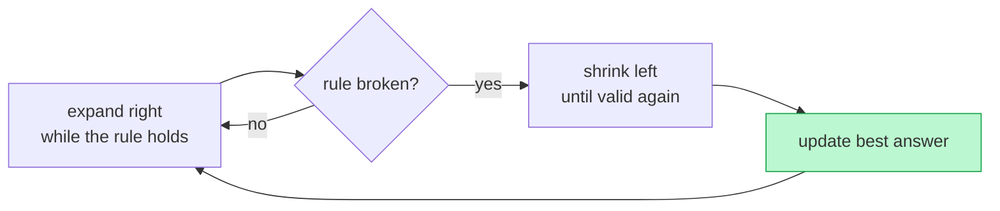

# Memorize: Variable Sliding Window

## In a Hurry?

- **One-Line Idea**: Grow a window with `end`; whenever the invariant breaks, shrink from `start` (one leap or several steps) until it holds again — in O(N) time over `n = len(arr)`.
- **Complexities**: O(N) time, O(1) space (excluding any data structure used as the aggregate itself, e.g. a frequency map).
- **When to Use**: Find the longest/shortest/count of contiguous subarrays satisfying a monotonic condition on a per-window aggregate that supports O(1) add and O(1) remove.

---

## One-Line Mnemonic

> **Stretch right, snap left — the rubber band only holds while the invariant does.**

---

## Real-World Analogy

Picture a thirsty hiker walking down a long road with a rubber-banded water flask in each hand, one anchored at `start`, the other carried at `end`. The hiker drinks (adds elements) as they walk. The flask has a capacity — the problem's invariant. The moment a sip would overflow it, the hiker pours out whatever sits at the trailing hand (`start`) and tugs that hand forward, repeating until the flask is back within capacity. The hiker never walks backwards; both hands only ever move forward, so the entire road is covered in a single pass.

---

## Visual Summary



<p align="center"><strong>When a condition replaces a fixed size: grow the window on the right; the moment it breaks the rule, shrink from the left until it holds again. Each index enters and leaves once — O(n).</strong></p>

---

## Pattern Recognition Triggers

- The problem asks for the **longest** or **shortest** contiguous subarray satisfying some condition.
- The problem asks for the **count of contiguous subarrays** satisfying a condition (use the `end - start + 1` counting trick).
- A per-element aggregate exists with O(1) add **and** O(1) remove (sum, product of positives, frequency map, distinct count, zero count).
- The condition is **monotonic** in the window: extending the window can only make the condition harder to satisfy in one direction, easier in the other.
- The problem mentions a **constraint or budget** (`at most k zeros`, `product < k`, `sum ≤ S`) that the window must respect.

---

## Don't Confuse With

| Aspect | Variable Sliding Window | Fixed Sliding Window | Two Pointers (squeeze) |
|---|---|---|---|
| Window size | Grows and shrinks based on a condition | Always exactly `k` | Distance between pointers shrinks toward zero |
| Pointer motion | Both pointers always move forward | Both move forward together | Pointers move *toward* each other from the ends |
| Required structure | Aggregate with O(1) add + O(1) remove | Aggregate with O(1) add + O(1) remove | Sorted input (typically) |
| Typical output | Longest/shortest subarray, count of valid windows | Aggregate over every window of size `k` | A pair or triplet satisfying a relation |
| **When this goes wrong** | You compute the same window from scratch every iteration — O(N²) instead of O(N) | The window keeps changing size — you should be in variable, not fixed | Pointers start at both ends and move outward — you're solving the wrong pattern |

---

## Template Code

The annotated Python skeleton below is the generic shape. Pick `if` or `while` on the contraction based on whether one expansion can ever force multiple shrinks.

```python
def variable_sliding_window(arr, k):
    start, end = 0, 0
    aggregate = INIT_VALUE       # 0 for sum, 1 for product, {} for freq map, etc.
    result = INIT_RESULT          # depends on what we are computing

    while end < len(arr):
        # Operation 1 — extend by arr[end]
        aggregate = add(aggregate, arr[end])

        # Operation 3 — contract while invariant fails
        while invariant_broken(aggregate, k):
            aggregate = remove(aggregate, arr[start])
            start += 1

        # Operation 2 — process the current window
        result = update(result, end, start, aggregate)

        # Operation 4 — advance end
        end += 1

    return result
```

Common counting trick: when the question is "how many subarrays satisfy the condition", every window ending at `end` whose start is in `[start, end]` is also valid, so `result += end - start + 1` after every restoration.

---

## Common Mistakes

- **Using `if` when you need `while` on contraction**:
  - *What*: Window stays larger than the invariant allows after one expansion that forces multiple shrinks.
  - *Why*: One new element can knock several old ones out of bounds; a single `if` only ejects one.
  - *Fix*: Default to `while invariant_broken(...)` and only downgrade to `if` when you can *prove* one shrink always suffices.

- **Forgetting the final check after the loop**:
  - *What*: A valid window that ends at the last index never triggers the in-loop comparison, and the answer is too small.
  - *Why*: Some templates only update the result inside the contraction branch, which never fires when the array ends mid-window.
  - *Fix*: Update the result **every iteration**, not only on contraction — or run one explicit comparison after the loop.

- **Seeding the aggregate with the wrong default**:
  - *What*: An all-negative array returns `0` instead of the largest single element; or an empty product is taken as `0` instead of `1`.
  - *Why*: The "neutral" element depends on the operation — `0` for sum, `1` for product, `-∞` for max, etc.
  - *Fix*: For max-style problems on signed input, seed with `arr[0]` (not `0`) and advance `end` past index 0; for product, seed with `1`.

- **Off-by-one in the count**:
  - *What*: Counting fewer subarrays than there really are — typically off by one at every step.
  - *Why*: Forgetting that `arr[start..end]` itself is one of the `end - start + 1` windows you should be counting.
  - *Fix*: Use the formula `end - start + 1` (inclusive endpoints) — confirm by hand on a 3-element example.

- **Assuming O(1) remove for an aggregate that doesn't support it**:
  - *What*: Algorithm written but `aggregate` is a sliding `max` or `min`, and remove now costs O(window size).
  - *Why*: Plain max/min cannot be undone — once the maximum leaves the window, you have no record of the next-best.
  - *Fix*: Reach for a monotonic deque (for sliding max/min) or a multiset/sorted structure — or admit the pattern doesn't apply.

---

## Minimum Viable Example

The smallest end-to-end run of the pattern — finding the longest subarray with sum `≤ 5` in `arr = [1, 2, 3, 1]`.

```
arr = [1, 2, 3, 1], threshold = 5

end=0: sum=1, ≤5, len=1, best=1
end=1: sum=3, ≤5, len=2, best=2
end=2: sum=6, >5 → shrink: sum=5, start=1, len=2, best=2
end=3: sum=6, >5 → shrink: sum=4, start=2, len=2, best=2

Return: 2
```

The shrink at `end=2` and `end=3` is the entire pattern. Without it, this is O(N²); with it, O(N).

---

## Quick Recall

**Q: What is the loop invariant for a variable sliding window?**
A: A condition on `arr[start..end]` that holds at the start of every iteration after contraction (e.g. "sum ≥ 0", "product < k", "zeros ≤ k").

**Q: When do you use `if` vs `while` on the contraction?**
A: `while` when one expansion can force multiple shrinks (Product Conundrum, K Flips); `if` (or a single leap) when one shrink — or one jump — always restores the invariant (Consecutive Ones, Maximum Subarray Sum).

**Q: How do you count subarrays that satisfy a condition?**
A: Add `end - start + 1` to the running total each iteration, after the invariant is restored.

**Q: What is the time complexity and why?**
A: O(N), because both `start` and `end` only move forward and each visits every index at most once — amortising the inner `while`.

**Q: What aggregates do **not** support O(1) remove?**
A: Plain `max` and `min` (once the extreme leaves the window, no constant-time way to recover the next-best — use a monotonic deque instead).

**Q: What is the single most important question to ask before writing the loop?**
A: "What is my invariant?" — without an invariant, there is nothing to expand, contract, or process around.
