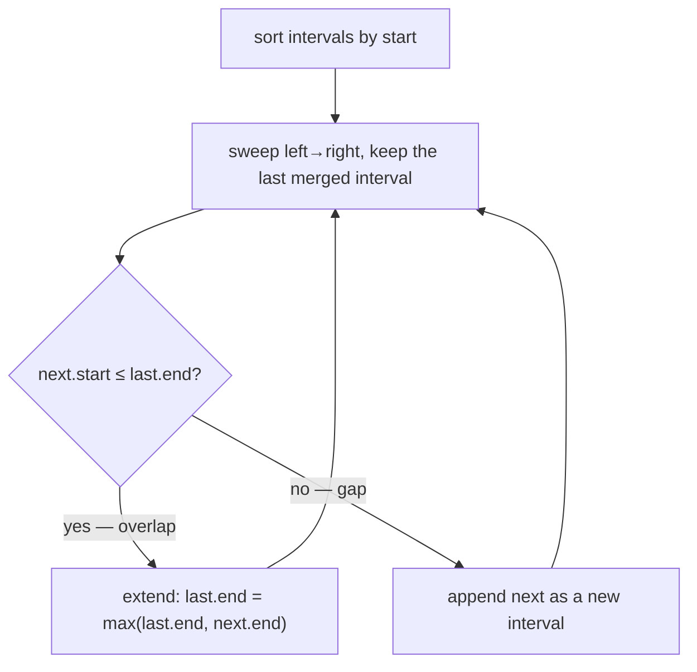

# Pattern: Interval Merging

## Why It Exists

A calendar of meetings, a set of booked time-ranges, flights occupying a runway — all are **intervals** `[start, end]`, and the recurring task is to fold the overlapping ones together. "Merge `[1,3]` and `[2,6]` into `[1,6]`."

The brute force compares every pair to see if they overlap — `O(n²)`. But overlap has structure you can exploit: if you walk the intervals **in order of start time**, then by the time you reach a new interval, everything earlier has already begun. So the only thing it can possibly overlap is the *most recent* merged interval — nothing before that can reach this far right. That single observation turns the problem into one left-to-right sweep after a sort.

## See It Work

Sort by start, then sweep: extend the last merged interval when the next one overlaps it, otherwise begin a new one. Pick a test case below, **Run** it, then **Visualise** and watch the intervals collapse. The first line just reads the case's `intervals` from input — the pattern is the sort and the sweep.

> ▶ Run it against a case, then click **Visualise** — watch the sweep extend the last merged interval on overlap and start a new one on a gap.

```python run viz=array
import ast

intervals = ast.literal_eval(input())    # the test case's intervals
intervals.sort()                         # sort by start
merged = [intervals[0]]
for start, end in intervals[1:]:
    if start <= merged[-1][1]:           # overlaps the last merged interval?
        merged[-1][1] = max(merged[-1][1], end)   # yes → extend its end
    else:
        merged.append([start, end])      # no — a gap → start a new interval
print(merged)
```

```java run viz=array
import java.util.*;

public class Main {
  public static void main(String[] args) {
    int[][] intervals = parseIntMatrix(new Scanner(System.in).nextLine());
    Arrays.sort(intervals, (a, b) -> Integer.compare(a[0], b[0]));   // sort by start
    List<List<Integer>> merged = new ArrayList<>();
    merged.add(new ArrayList<>(List.of(intervals[0][0], intervals[0][1])));
    for (int i = 1; i < intervals.length; i++) {
      List<Integer> last = merged.get(merged.size() - 1);
      if (intervals[i][0] <= last.get(1))            // overlaps the last merged interval?
        last.set(1, Math.max(last.get(1), intervals[i][1]));   // yes → extend its end
      else
        merged.add(new ArrayList<>(List.of(intervals[i][0], intervals[i][1])));   // gap → new interval
    }
    System.out.println(merged);
  }

  // "[[1, 3], [2, 6]]" → {{1, 3}, {2, 6}} — reads the test case's intervals
  static int[][] parseIntMatrix(String line) {
    String s = line.trim();
    if (s.startsWith("[")) s = s.substring(1);
    if (s.endsWith("]")) s = s.substring(0, s.length() - 1);
    s = s.trim();
    if (s.isEmpty()) return new int[0][];
    String[] rows = s.split("\\]\\s*,\\s*\\[");
    int[][] out = new int[rows.length][];
    for (int i = 0; i < rows.length; i++) {
      String inner = rows[i].replaceAll("[\\[\\]\\s]", "");
      if (inner.isEmpty()) { out[i] = new int[0]; continue; }
      String[] parts = inner.split(",");
      int[] pair = new int[parts.length];
      for (int j = 0; j < parts.length; j++) pair[j] = Integer.parseInt(parts[j]);
      out[i] = pair;
    }
    return out;
  }
}
```

```testcases
{
  "args": [
    { "id": "intervals", "label": "intervals", "type": "int[][]", "placeholder": "[[1, 3], [2, 6], [8, 10], [9, 12]]" }
  ],
  "cases": [
    { "args": { "intervals": "[[1, 3], [2, 6], [8, 10], [9, 12]]" }, "expected": "[[1, 6], [8, 12]]" },
    { "args": { "intervals": "[[1, 4], [4, 5]]" }, "expected": "[[1, 5]]" },
    { "args": { "intervals": "[[1, 2], [3, 4], [5, 6]]" }, "expected": "[[1, 2], [3, 4], [5, 6]]" }
  ]
}
```

## How It Works

Two steps: **sort by start** (`O(n log n)` — the price of admission), then a single linear **sweep** keeping only the *last* merged interval as state. For each next interval `[s, e]`:

- if `s ≤ last.end` → it **overlaps** the last merged interval → extend: `last.end = max(last.end, e)`;
- else → there's a **gap** → append `[s, e]` as a new interval.



<p align="center"><strong>sort by start, then sweep once keeping the last merged interval: if the next interval starts before it ends, they overlap (extend); otherwise there's a gap (start fresh).</strong></p>

Why is comparing against only the *last* merged interval enough? Because the sort guarantees every later interval starts at or after the current one. So if `[s, e]` doesn't reach back to `last.end`, no future interval (which starts even later) can reach an *earlier* merged interval either — they're permanently closed. The sweep is `O(n)`, so the whole thing is **`O(n log n)` time** (the sort dominates), **`O(n)`** for the output.

### Key Takeaway

Sort by start, then sweep once comparing each interval only to the last merged one: overlap → extend, gap → append. The sort is what lets a single left-to-right pass replace the `O(n²)` all-pairs check.

## Trace It

Sorted `[[1,3], [2,6], [8,10], [9,12]]`, sweeping:

| next | vs last merged | action | merged so far |
|---|---|---|---|
| `[1,3]` | — | seed | `[[1,3]]` |
| `[2,6]` | `2 ≤ 3` overlap | extend end → 6 | `[[1,6]]` |
| `[8,10]` | `8 ≤ 6`? no | gap → append | `[[1,6],[8,10]]` |
| `[9,12]` | `9 ≤ 10` overlap | extend end → 12 | `[[1,6],[8,12]]` |

Before you read on: when `[8,10]` didn't overlap `[1,6]`, why was it safe to close `[1,6]` forever — could a *later* interval still merge into it?

No. Everything still to come starts at `8` or later (the array is sorted by start), and `[1,6]` ends at `6` — nothing starting at `≥ 8` can reach back to `6`. Sorting is exactly what makes "the last merged interval is the only one that can still grow" true, so you never look back.

## Your Turn

Write the reusable `merge` yourself: sort the intervals by start, then sweep once, extending the last merged interval on overlap and appending a new one on a gap.

```python run viz=array
import ast

def merge(intervals):
    # Your code goes here — sort by start, then sweep keeping only the last
    # merged interval: extend it on overlap, append a new one on a gap.
    return []

intervals = ast.literal_eval(input())    # the test case's intervals
print(merge(intervals))
```

```java run viz=array
import java.util.*;

public class Main {
  static List<List<Integer>> merge(int[][] intervals) {
    // Your code goes here — sort by start, then sweep keeping only the last
    // merged interval: extend it on overlap, append a new one on a gap.
    return new ArrayList<>();
  }

  public static void main(String[] args) {
    int[][] intervals = parseIntMatrix(new Scanner(System.in).nextLine());
    System.out.println(merge(intervals));
  }

  // "[[1, 3], [2, 6]]" → {{1, 3}, {2, 6}} — reads the test case's intervals
  static int[][] parseIntMatrix(String line) {
    String s = line.trim();
    if (s.startsWith("[")) s = s.substring(1);
    if (s.endsWith("]")) s = s.substring(0, s.length() - 1);
    s = s.trim();
    if (s.isEmpty()) return new int[0][];
    String[] rows = s.split("\\]\\s*,\\s*\\[");
    int[][] out = new int[rows.length][];
    for (int i = 0; i < rows.length; i++) {
      String inner = rows[i].replaceAll("[\\[\\]\\s]", "");
      if (inner.isEmpty()) { out[i] = new int[0]; continue; }
      String[] parts = inner.split(",");
      int[] pair = new int[parts.length];
      for (int j = 0; j < parts.length; j++) pair[j] = Integer.parseInt(parts[j]);
      out[i] = pair;
    }
    return out;
  }
}
```

```testcases
{
  "args": [
    { "id": "intervals", "label": "intervals", "type": "int[][]", "placeholder": "[[1, 3], [2, 6], [8, 10], [9, 12]]" }
  ],
  "cases": [
    { "args": { "intervals": "[[1, 3], [2, 6], [8, 10], [9, 12]]" }, "expected": "[[1, 6], [8, 12]]" },
    { "args": { "intervals": "[[1, 4], [4, 5]]" }, "expected": "[[1, 5]]" },
    { "args": { "intervals": "[[1, 10], [2, 3], [4, 5]]" }, "expected": "[[1, 10]]" },
    { "args": { "intervals": "[[1, 2], [3, 4], [5, 6]]" }, "expected": "[[1, 2], [3, 4], [5, 6]]" }
  ]
}
```

<details>
<summary>Editorial</summary>

Sort by start so the only interval a new one can overlap is the most recent merged block, then sweep once. On each `[start, end]`: if `start ≤ last.end` the two overlap, so extend the last block's end to `max(last.end, end)` (the `max` matters for a fully-nested interval); otherwise there's a gap, so append `[start, end]` as a fresh block. The sort is `O(n log n)` and dominates; the sweep is `O(n)`.

```python solution time=O(n log n) space=O(n)
import ast

def merge(intervals):
    intervals.sort()                         # by start
    merged = [intervals[0]]
    for start, end in intervals[1:]:
        if start <= merged[-1][1]:
            merged[-1][1] = max(merged[-1][1], end)
        else:
            merged.append([start, end])
    return merged

intervals = ast.literal_eval(input())
print(merge(intervals))
```

```java solution
import java.util.*;

public class Main {
  static List<List<Integer>> merge(int[][] intervals) {
    Arrays.sort(intervals, (a, b) -> Integer.compare(a[0], b[0]));   // by start
    List<List<Integer>> merged = new ArrayList<>();
    merged.add(new ArrayList<>(List.of(intervals[0][0], intervals[0][1])));
    for (int i = 1; i < intervals.length; i++) {
      List<Integer> last = merged.get(merged.size() - 1);
      if (intervals[i][0] <= last.get(1))
        last.set(1, Math.max(last.get(1), intervals[i][1]));
      else
        merged.add(new ArrayList<>(List.of(intervals[i][0], intervals[i][1])));
    }
    return merged;
  }

  public static void main(String[] args) {
    int[][] intervals = parseIntMatrix(new Scanner(System.in).nextLine());
    System.out.println(merge(intervals));
  }

  // "[[1, 3], [2, 6]]" → {{1, 3}, {2, 6}} — reads the test case's intervals
  static int[][] parseIntMatrix(String line) {
    String s = line.trim();
    if (s.startsWith("[")) s = s.substring(1);
    if (s.endsWith("]")) s = s.substring(0, s.length() - 1);
    s = s.trim();
    if (s.isEmpty()) return new int[0][];
    String[] rows = s.split("\\]\\s*,\\s*\\[");
    int[][] out = new int[rows.length][];
    for (int i = 0; i < rows.length; i++) {
      String inner = rows[i].replaceAll("[\\[\\]\\s]", "");
      if (inner.isEmpty()) { out[i] = new int[0]; continue; }
      String[] parts = inner.split(",");
      int[] pair = new int[parts.length];
      for (int j = 0; j < parts.length; j++) pair[j] = Integer.parseInt(parts[j]);
      out[i] = pair;
    }
    return out;
  }
}
```

</details>

## Reflect & Connect

Drill the family in **Practice** — [Insert Interval](/cortex/data-structures-and-algorithms/linear-structures/arrays/pattern-interval-merging/problems/insert-interval) and [Employee Free Time](/cortex/data-structures-and-algorithms/linear-structures/arrays/pattern-interval-merging/problems/employee-free-time).

Sort-then-sweep is the master move for almost every interval problem:

- **Merge / insert / remove intervals**, and **"does any pair overlap?"** (sort, then check each against the previous — meeting-room feasibility).
- **The sort is the enabler.** Once sorted by start, "compare only with the last" is correct; the same idea extends to a full **sweep line**, where you process sorted *events* (starts and ends) to answer questions like "what's the maximum number of intervals overlapping at once?" — the next pattern.
- **Watch the boundary convention** — decide whether touching endpoints (`[1,3]` and `[3,5]`) count as overlapping; `≤` merges them, `<` keeps them separate. Get this wrong and off-by-one bugs creep in.

**Prerequisites:** [Arrays](/cortex/data-structures-and-algorithms/linear-structures/arrays/what-is-an-array).
**What's next:** the sweep-line at full power — counting how many intervals stack up at once, in [Maximum Overlap](/cortex/data-structures-and-algorithms/linear-structures/arrays/pattern-maximum-overlap/pattern).

## Recall

> **Mnemonic:** *Sort by start, sweep once. `next.start ≤ last.end` → extend; else append. Only the last merged interval can still grow.*

| | |
|---|---|
| Step 1 | sort intervals by start (`O(n log n)`) |
| Step 2 | sweep; compare each to the *last merged* interval only |
| Overlap | `next.start ≤ last.end` → `last.end = max(last.end, next.end)` |
| Cost | `O(n log n)` time (sort dominates), `O(n)` output |

<details>
<summary><strong>Q:</strong> What are the two steps of interval merging?</summary>

**A:** Sort by start, then a single left-to-right sweep merging or appending.

</details>
<details>
<summary><strong>Q:</strong> Why compare each interval only with the *last* merged one?</summary>

**A:** Sorting by start means everything later begins later, so nothing can reach back to an already-closed interval.

</details>
<details>
<summary><strong>Q:</strong> What's the total cost and what dominates it?</summary>

**A:** `O(n log n)` — the sort; the sweep itself is `O(n)`.

</details>
<details>
<summary><strong>Q:</strong> Where do off-by-one bugs hide?</summary>

**A:** The touching-endpoint convention — whether `[1,3]` and `[3,5]` merge (`≤`) or not (`<`).

</details>

## Sources & Verify

- **cp-algorithms.com**, "Sweep line" — sorting events and the linear sweep behind interval merging and overlap counting.
- **Sedgewick & Wayne**, *Algorithms*, 4th ed., §2 — sorting as the enabling preprocessing step; interval/sweep applications.
- The "compare only with the last merged interval" correctness argument follows from the sort; both runnable blocks are verified by running.
