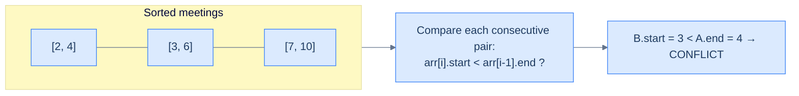

# Verify Schedule

<details>
<summary><h2>The Hook</h2></summary>


You're scheduling assistant for a busy executive. Given a day's worth of meeting requests as `[start, end]` intervals, your one job is to answer: **can they attend every meeting?** Miss a single overlap and your reputation is gone. Brute force compares every pair (O(N²)). The right answer comes from the same line-sweep idea you just learned — and runs in O(N log N).

</details>
## The Problem

> Given an array of meeting time intervals `arr` where `arr[i] = [start_i, end_i]`, return `true` if a single person can attend **all** meetings without conflict, and `false` otherwise. Treat touching intervals (like `[1, 3]` and `[3, 5]`) as **non-conflicting** — back-to-back meetings are fine.

```
Input:  arr = [[0, 30], [5, 10], [15, 20]]
Output: false        ([0,30] overlaps both [5,10] and [15,20])

Input:  arr = [[7, 10], [2, 4]]
Output: true         (no overlap; sorted view is [[2,4], [7,10]])

Input:  arr = [[1, 3], [3, 6]]
Output: true         (touching, not overlapping — back-to-back is allowed)

Input:  arr = []
Output: true         (no meetings → no conflicts)
```

---

## Examples

**Example 1**
```
Input:  arr = [[0, 30], [5, 10], [15, 20]]
Output: false
Explanation: [0, 30] overlaps both [5, 10] and [15, 20] — a person
             cannot attend all three.
```

**Example 2**
```
Input:  arr = [[7, 10], [2, 4]]
Output: true
Explanation: After sorting by start, [[2, 4], [7, 10]]. The gap
             between 4 and 7 means no conflict.
```

**Example 3**
```
Input:  arr = [[1, 3], [3, 6]]
Output: true
Explanation: The two meetings touch at minute 3 but do not overlap —
             back-to-back is allowed under the strict `<` test.
```

<details>
<summary><h2>Intuition</h2></summary>

The structural property the problem hands you is **one-dimensional ordering**: every meeting lives on the same time axis, and the only thing that matters between two meetings is which one starts first. Sorting by start coordinate turns the unstructured input into a left-to-right scan — and once the meetings are in start order, an overlap can only ever exist between two **consecutive** entries. Earlier meetings are completely behind the current one; later ones haven't been reached yet.

The sweep keeps a single piece of state — the previous meeting's end time — and walks forward through the sorted list. At each step, the question collapses to one comparison: does the current meeting's start fall strictly before the previous meeting's end? If yes, the two cannot both be attended and the answer is `false`. The state is so small there's no list to maintain — only the most recent `end` value, updated implicitly via `arr[i - 1][1]`.

The naive comparison-every-pair approach asks "do `arr[i]` and `arr[j]` overlap" for all `i < j` — O(N²) comparisons. It works, but it re-asks questions that were already answered. Once the sort is in place the answer is forced: any meeting that could conflict with `arr[i]` must end at-or-after `arr[i].start`, and the only such meeting is `arr[i - 1]`. The naive loop pays O(N²) to rediscover what one sort + one pass already proves.

</details>
<details>
<summary><h2>Applying the Diagnostic Questions</h2></summary>

| Check | Answer for Verify Schedule |
|---|---|
| **Is the input a set of `[start, end]` intervals on a 1-D axis?** | Yes — meeting times on a single day, each an `[start, end]` pair |
| **Does the answer depend on which intervals overlap?** | Yes — the entire question is "does any pair overlap?" |
| **Would the answer be unchanged if you replaced the input with its merged form?** | Yes (and stronger) — if the merged form has fewer entries than the input, the answer is `false`; otherwise `true` |
| **Can you derive the answer from one left-to-right pass after sorting by `start`?** | Yes — track the previous end and compare against the current start; return `false` the moment one comparison fires |

All four diagnostic checks fire `yes` — Verify Schedule is the smallest possible instance of the interval-merging pattern.

</details>
<details>
<summary><h2>Approach</h2></summary>

1. Sort `arr` by start coordinate ascending. Ties broken by end ascending make no semantic difference for this problem but keep the sort total-ordered.
2. Walk `i` from `1` to `len(arr) - 1`.
3. At each step, compare `arr[i].start` against `arr[i - 1].end`. If `arr[i].start < arr[i - 1].end`, two meetings overlap — return `false` immediately.
4. If the loop completes without firing, no two meetings overlap — return `true`.

The strict `<` is the domain knob. Touching meetings like `[1, 3]` and `[3, 5]` are treated as back-to-back rather than overlapping. Switching to `<=` would treat them as a conflict.

</details>
<details>
<summary><h2>What Does "Conflict" Mean?</h2></summary>


Two meetings conflict iff one starts **strictly before** the other ends. After sorting by start, the only conflict that can possibly exist between meeting `i` and any earlier meeting is between `arr[i]` and `arr[i-1]` — because `arr[i-1]` has the largest end of any earlier meeting *we care about* (the one that could still be running when `arr[i]` begins).



<p align="center"><strong>After sorting by start, a conflict can only happen between consecutive intervals. We never need to compare further back.</strong></p>

> *Pause and predict — does sorting by end work too? Try `[[7,10], [2,4]]` sorted by end → `[[2,4], [7,10]]`. Does the consecutive-pair check still detect every conflict?*

It happens to work for this example, but consider `[[1, 10], [2, 3]]`. Sorted by end: `[[2, 3], [1, 10]]`. Now `arr[1].start = 1 < arr[0].end = 3` — looks like a conflict (correct), but the **reason** is now muddled because `arr[1]` actually starts *before* `arr[0]`. The clean "compare consecutive" logic only holds when sorted by start.

</details>
<details>
<summary><h2>Solution &amp; Analysis</h2></summary>

### The Solution

After sorting, sweep left-to-right and check that **each meeting starts no earlier than the previous one ends**. The first time the check fails, return `false`. If the loop completes, no conflicts — return `true`.


```python run viz=grid viz-root=meetings
from typing import List

class Solution:
    def verify_schedule(self, meetings: List[List[int]]) -> bool:

        # sort the meetings on their start time
        meetings.sort(key=lambda x: x[0])

        # check if any two meetings overlap
        for i in range(1, len(meetings)):
            if meetings[i][0] < meetings[i - 1][1]:
                return False

        return True


# Examples from the problem statement
print(Solution().verify_schedule([[1, 20], [10, 30], [30, 40], [1, 5]]))   # False
print(Solution().verify_schedule([[1, 10], [1, 10], [1, 10]]))             # False
print(Solution().verify_schedule([[1, 15], [15, 17], [17, 18]]))           # True

# Edge cases
print(Solution().verify_schedule([[1, 2]]))                                 # True  — single meeting
print(Solution().verify_schedule([[1, 5], [6, 10]]))                        # True  — two non-overlapping
print(Solution().verify_schedule([[1, 5], [4, 6]]))                         # False — two overlapping
print(Solution().verify_schedule([[5, 10], [1, 4], [11, 15]]))             # True  — unsorted non-overlapping
print(Solution().verify_schedule([[1, 3], [3, 5], [5, 7]]))                # True  — touching endpoints only
```

```java run viz=grid viz-root=meetings
import java.util.*;

public class Main {
    static class Solution {
        public boolean verifySchedule(int[][] meetings) {

            // sort the meetings on their start time
            Arrays.sort(meetings, Comparator.comparingInt(a -> a[0]));

            // check if any two meetings overlap
            for (int i = 1; i < meetings.length; i++) {
                if (meetings[i][0] < meetings[i - 1][1]) {
                    return false;
                }
            }

            return true;
        }
    }

    public static void main(String[] args) {
        // Examples from the problem statement
        System.out.println(new Solution().verifySchedule(new int[][]{{1, 20}, {10, 30}, {30, 40}, {1, 5}}));   // false
        System.out.println(new Solution().verifySchedule(new int[][]{{1, 10}, {1, 10}, {1, 10}}));             // false
        System.out.println(new Solution().verifySchedule(new int[][]{{1, 15}, {15, 17}, {17, 18}}));           // true

        // Edge cases
        System.out.println(new Solution().verifySchedule(new int[][]{{1, 2}}));                                 // true  — single meeting
        System.out.println(new Solution().verifySchedule(new int[][]{{1, 5}, {6, 10}}));                        // true  — two non-overlapping
        System.out.println(new Solution().verifySchedule(new int[][]{{1, 5}, {4, 6}}));                         // false — two overlapping
        System.out.println(new Solution().verifySchedule(new int[][]{{5, 10}, {1, 4}, {11, 15}}));             // true  — unsorted non-overlapping
        System.out.println(new Solution().verifySchedule(new int[][]{{1, 3}, {3, 5}, {5, 7}}));                // true  — touching endpoints only
    }
}
```


<details>
<summary><strong>Trace — arr = [[0, 30], [5, 10], [15, 20]]</strong></summary>

```
After sort by start: [[0, 30], [5, 10], [15, 20]]

i=1: arr[1].start = 5  < arr[0].end = 30  → CONFLICT, return false

Result: false ✓   ([0,30] swallows the entire morning)
```

</details>
<details>
<summary><strong>Trace — arr = [[1, 3], [3, 6]]</strong></summary>

```
After sort by start: [[1, 3], [3, 6]]

i=1: arr[1].start = 3  < arr[0].end = 3  →  3 < 3 is FALSE → ok

Loop completes → return true ✓
The strict '<' is what allows touching meetings. With '<=' this would return false.
```

</details>

### Complexity Analysis

| | Complexity | Reasoning |
|---|---|---|
| **Time** | O(N log N) | Dominated by sorting; the sweep is O(N) |
| **Space** | O(1) extra (in-place sort) or O(log N) for sort recursion stack | No extra structure built |

### Edge Cases

| Case | Example | Expected | Reasoning |
|---|---|---|---|
| Empty input | `[]` | `true` | No meetings means no conflict by vacuous truth |
| Single meeting | `[[5, 10]]` | `true` | Loop body never runs |
| Touching at boundary | `[[1, 3], [3, 6]]` | `true` | `<` strict — back-to-back is allowed |
| Identical start times | `[[1, 5], [1, 4]]` | `false` | After sort, `arr[1].start = 1 < arr[0].end = 5` → conflict |
| Out-of-order input | `[[7, 10], [2, 4]]` | `true` | Sort fixes order before sweep |
| Fully contained | `[[1, 10], [3, 5]]` | `false` | After sort, `arr[1].start = 3 < arr[0].end = 10` |

</details>
<details>
<summary><h2>Key Takeaway</h2></summary>


Verify Schedule is the smallest possible interval-merging problem — the sweep never builds a `merged` list, it only **detects** the first overlap and returns. The `<` vs `<=` choice is the only domain knob: it decides whether back-to-back meetings count as a conflict.

> **Transfer Challenge:** Modify the function to return the *first conflicting pair* of meetings (their original indices), not just `true`/`false`.
>
> <details><summary><strong>Solution hint</strong></summary>
>
> Pair each meeting with its original index before sorting (e.g. tuples `(start, end, idx)`). When the check fires, return `(arr[i-1].idx, arr[i].idx)`. Sorting now needs to be on `start` only, but storage stays O(N).
>
> </details>

</details>
