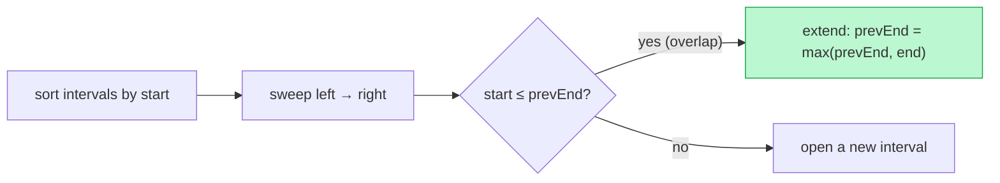

# Memorize: Interval Merging

## In a Hurry?

- **One-Line Idea**: Sort intervals by `start`, then sweep left to right and either extend `merged[-1].end` on overlap or append a fresh entry.
- **Complexities**: `O(N log N)` time (sort-dominated), `O(N)` space for the merged output. `N` is the number of input intervals.
- **When to Use**: the problem hands you a set of `[start, end]` intervals and the answer depends on which ones overlap, touch, or sit beside each other.

---

## One-Line Mnemonic

**Sort by start, sweep with one stripe — extend or lift the pen.**

The "stripe" is the last merged interval; "extend" stretches its end, "lift the pen" starts a new stripe.

---

## Real-World Analogy

Imagine running a yellow highlighter along a paper strip of events drawn left to right. You touch down on the first event and start dragging. Every time the next event overlaps the one your highlighter is currently on, you keep dragging through it. The moment the next event sits past the highlighter's right edge, you lift the pen and start a fresh stroke. At the end, the paper shows one stroke per merged block — and the count, lengths, or gaps between strokes answer most interval problems.

---

## Visual Summary



<p align="center"><strong>Sort intervals by start, then sweep once: if the next begins before the current ends, fuse them by stretching the end; otherwise open a new block. Sorting dominates at O(n log n).</strong></p>

---

## Pattern Recognition Triggers

The pattern fires when the problem statement contains any of these signals:

- "merge overlapping intervals", "compress ranges", "coalesce intervals"
- "can a single person attend all meetings", "schedule conflicts", "double-booking"
- "find the free time", "find the gaps", "find unused capacity"
- "insert a new interval into a sorted, non-overlapping list"
- "minimum number of non-overlapping intervals to remove"
- Any phrasing like "given `[start, end]` pairs on a time axis, answer X"

If the input is intervals and the answer cares about overlap, reach for sort + sweep first.

---

## Don't Confuse With

| | Interval Merging | Maximum Overlap (next pattern) |
|---|---|---|
| **What it computes** | The union of intervals as disjoint merged blocks | The maximum number of intervals active at any single point |
| **State during sweep** | The last merged interval (or just `lastEnd`) | A running counter of active intervals (often via two sorted event streams or a heap) |
| **Output shape** | A list of intervals (or a yes/no derived from them) | A scalar count (peak concurrency) |
| **Sort key** | `start` ascending | Often *events* — separate start/end events sorted by coordinate |
| **When this goes wrong** | Your merged output is missing a peak count that the problem actually asked for — e.g. you returned `3` merged blocks but the problem wanted "maximum overlapping meetings at one moment", which is `5` | Your counter peaks correctly but the problem wanted the actual merged blocks back, not a number |

The two patterns share the sort step but diverge on what state the sweep maintains. If the answer is "how many at once?", you want maximum overlap. If the answer is "what are the blocks?", you want interval merging.

---

## Template Code

```python
from typing import List

def merge_intervals(arr: List[List[int]]) -> List[List[int]]:
    # 1. Sort by start ascending (ties broken by end ascending).
    arr.sort(key=lambda iv: (iv[0], iv[1]))

    # 2. Seed merged with the first interval.
    merged: List[List[int]] = [arr[0]]

    # 3. Sweep: extend or append.
    for i in range(1, len(arr)):
        if arr[i][0] <= merged[-1][1]:           # overlap (use < for "touching is distinct")
            merged[-1][1] = max(merged[-1][1], arr[i][1])
        else:                                     # disjoint — lift the pen
            merged.append(arr[i])

    return merged
```

```java
import java.util.*;

class IntervalMerging {
    public int[][] merge(int[][] arr) {
        // 1. Sort by start ascending.
        Arrays.sort(arr, (a, b) -> Integer.compare(a[0], b[0]));

        // 2. Seed merged with the first interval.
        List<int[]> merged = new ArrayList<>();
        merged.add(arr[0]);

        // 3. Sweep: extend or append.
        for (int i = 1; i < arr.length; i++) {
            int[] last = merged.get(merged.size() - 1);
            if (arr[i][0] <= last[1]) {           // overlap (use < for "touching is distinct")
                last[1] = Math.max(last[1], arr[i][1]);
            } else {                              // disjoint — lift the pen
                merged.add(arr[i]);
            }
        }

        return merged.toArray(new int[0][]);
    }
}
```

---

## Common Mistakes

- **Forgetting the `max` when extending**:
    - *What*: writing `merged[-1][1] = arr[i][1]` instead of `max(merged[-1][1], arr[i][1])`.
    - *Why*: assumes `arr[i].end` is always larger than `merged[-1].end`, but a fully-nested interval like `[1, 10]` then `[3, 5]` violates that.
    - *Fix*: always wrap with `max` — the merged block's end can only grow, never shrink.

- **Sorting by `end` instead of `start`**:
    - *What*: writing `arr.sort(key=lambda x: x[1])` and then comparing consecutive intervals.
    - *Why*: the invariant "the only earlier interval that can still overlap is the most recent one" only holds when sorted by `start`. Sorting by `end` breaks the comparison logic.
    - *Fix*: sort by `start` ascending; if ties matter, break by `end` ascending.

- **Picking the wrong overlap comparator**:
    - *What*: using `<` when the problem treats touching as overlap, or `<=` when it treats touching as adjacent-but-distinct.
    - *Why*: the algorithm is otherwise identical — the comparator is the only domain knob, and the wrong choice silently produces a different answer.
    - *Fix*: read the problem statement carefully — "back-to-back is fine" means `<`; "touching counts as overlap" means `<=`.

- **Re-sorting an already-sorted input** (Insert Interval trap):
    - *What*: calling `sort` inside Insert Interval, which is given a sorted, disjoint list.
    - *Why*: throws away an O(N log N) → O(N) win that the precondition was handing you for free.
    - *Fix*: when the input is documented as sorted and disjoint, write a three-phase linear sweep instead — copy / absorb / copy.

- **Mutating the input list when the caller needs the original**:
    - *What*: `arr.sort(...)` in Python mutates `arr` in place; the caller's reference now sees a reshuffled list.
    - *Why*: callers may not expect their input to be reordered as a side effect of a "merge" function.
    - *Fix*: sort a copy (`sorted(arr, key=...)`) when preserving caller state matters; document mutation when not.

---

## Minimum Viable Example

The smallest input that exercises every branch — one extend, one append, one merge-into-extension:

```
Input:  [[1, 3], [2, 6], [8, 10]]
Sort:   [[1, 3], [2, 6], [8, 10]]  (already sorted)
Sweep:
  i=1: 2 ≤ 3 → extend → merged = [[1, 6]]
  i=2: 8 > 6 → append → merged = [[1, 6], [8, 10]]
Output: [[1, 6], [8, 10]]
```

Three intervals, two iterations, one of each branch — enough to verify the loop body.

---

## Quick Recall

**Q: What is the time complexity of interval merging and what dominates?**
A: `O(N log N)`, dominated by the sort; the sweep itself is `O(N)`.

**Q: Why sort by `start` rather than `end`?**
A: Sorting by `start` guarantees the only earlier interval that can still overlap the current one is the most recent merged block, which makes the comparison `O(1)`.

**Q: When do you use `<=` vs `<` in the overlap check?**
A: `<=` merges touching intervals (continuous busy time); `<` keeps them apart (discrete sessions, back-to-back).

**Q: Why do you take `max(merged[-1].end, arr[i].end)` when extending?**
A: `arr[i]` may be fully nested inside `merged[-1]` — without `max` you would accidentally shrink the merged block.

**Q: What does interval merging compute that maximum overlap does not?**
A: The actual disjoint merged blocks (a list of intervals); maximum overlap computes only a peak concurrency count.

**Q: Why does Insert Interval run in `O(N)` instead of `O(N log N)`?**
A: Its precondition — input is already sorted and disjoint — eliminates the sort step. A three-phase copy / absorb / copy sweep does the rest in linear time.
